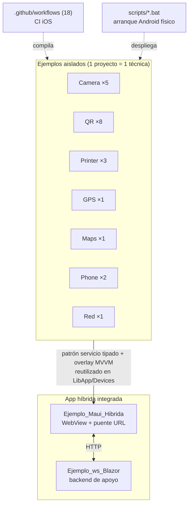

# Mapa del sistema — `Ejemplos_Maui_Devices`

> **Resumen ejecutivo.** Inventario completo de las piezas de la solución: 23 proyectos .NET MAUI/Blazor organizados en 8 dominios de dispositivo, más los activos documentales y la infraestructura de build. Cada pieza figura con su `type` (Marco §7), tecnología y enlace a su documentación. Fuente: ia-db ([índice maestro](../../../ia-db/indexes/00_MASTER-INDEX.md)) verificada contra el origen `@24d611d`.

## 1. Vista general

## 2. Piezas de software

> **Adaptación declarada:** la columna *Criticidad* se interpreta como **relevancia didáctica** (el repositorio no es de producción). La documentación de pieza se agrupa **por dominio** en `pieces/<dominio>/` porque los proyectos de un dominio son variantes deliberadamente comparables de la misma técnica; el manifiesto ([docs-manifest.yaml](../../docs-manifest.yaml)) mapea cada proyecto a su documento.

### 2.1 Dominio Camera — captura de foto · [pieces/camera/](../pieces/camera/README.md)

| Pieza (`.csproj`) | `type` | Técnica que ilustra | Criticidad |
|---|---|---|---|
| `Ejemplo_Photo_MediaPicker` | mobile-app | Diálogo nativo `MediaPicker` encapsulado en servicio | media |
| `Ejemplo_Photo_MiMediaPicker_Callback` | mobile-app | Picker propio + transferencia por callback | media |
| `Ejemplo_Photo_MiMediaPicker_Task` | mobile-app | Transferencia por `TaskCompletionSource` | media |
| `Ejemplo_Photo_MiMediaPicker_Callback_Normalizacion` | mobile-app | Rotación EXIF + resize + JPEG (SkiaSharp) | media |
| `Ejemplo_Photo_MiMediaSelfie_Callback_Normalizacion` | mobile-app | Cámara frontal + máscara ovalada | media |

### 2.2 Dominio QR — escaneo · [pieces/qr/](../pieces/qr/README.md)

| Pieza | `type` | Técnica que ilustra | Criticidad |
|---|---|---|---|
| `BSM.LectorQR` / `BSM.LectorQR_Dialog` | mobile-app | BarcodeScanning.Native.Maui (ML Kit) — página / diálogo | media |
| `BSN.LectorQR` / `BSN.LectorQR_Dialog` | mobile-app | Barcode Scanner (Apple Vision) — página / diálogo | **alta** (opción recomendada iOS) |
| `CS.LectorQR` / `CS.LectorQR_Dialog` | mobile-app | Camera.MAUI + decodificador — página / diálogo | media |
| `ZN.LectorQR` / `ZN.LectorQR_Dialog` | mobile-app | ZXing.Net.Maui — página / diálogo | media |

### 2.3 Dominio Printer — impresión térmica BT 58 mm · [pieces/printer/](../pieces/printer/README.md)

| Pieza | `type` | Técnica que ilustra | Criticidad |
|---|---|---|---|
| `Ejemplo_ThermalPrinter` | mobile-app | ESC/POS directo por Bluetooth SPP | media |
| `Ejemplo_MotorDSL` | mobile-app | Motor DSL puro (JSON → raster ESC/POS), `MotorDsl.*` | alta |
| `Ejemplo_MotorDSL_Dialog` | mobile-app | Motor DSL + overlay MVVM | media |

### 2.4 Dominios de un solo proyecto

| Pieza | Dominio | `type` | Técnica que ilustra | Doc | Criticidad |
|---|---|---|---|---|---|
| `Ejemplo_Maui_GPS` | GPS | mobile-app | Geolocalización + geocodificación inversa | [pieces/gps/](../pieces/gps/README.md) | media |
| `Ejemplo_Maui_Mapas` | Maps | mobile-app | Control `Map` con pines | [pieces/maps/](../pieces/maps/README.md) | media |
| `Ejemplo_Maui_Dialer` | Phone | mobile-app | Abrir el marcador del sistema | [pieces/phone/](../pieces/phone/README.md) | baja |
| `Ejemplo_Maui_DirectCall` | Phone | mobile-app | Llamada directa por intent (Android) | [pieces/phone/](../pieces/phone/README.md) | baja |
| `Ejemplo_Maui_Connectivity` | Red | mobile-app | Estado y cambios de conectividad | [pieces/red/](../pieces/red/README.md) | baja |

### 2.5 Dominio Integrada — app híbrida · [pieces/integrada/](../pieces/integrada/README.md)

| Pieza | `type` | Rol | Criticidad |
|---|---|---|---|
| `Ejemplo_Maui_Hibrida` | mobile-app | WebView + puente de comandos por URL; consolida todos los dispositivos bajo `LibApp/Devices/` | **alta** |
| `Ejemplo_ws_Blazor` | service | Backend Blazor de apoyo (comprobante, geo, pagos simulados) | alta |

## 3. Activos documentales del origen (no son piezas de software)

| Activo | Contenido | Consumido por |
|---|---|---|
| `Camera/Ejemplo_Docs_Photo` · `Printer/Ejemplo_Docs_Printer` · `GPS/Ejemplo_Docs_GPS` · `Maps/Ejemplo_Docs_Maps` · `Red/Ejemplo_Docs_Red` | Readme/notas por dominio | ia-db índices 01–07 |
| `Docs/` (Certificados-SSL, qr-nuget, web-hibrida, otros) | Notas transversales (SSL, librerías QR, arquitectura híbrida) | ia-db índices 02/08/10 |
| `README.md` (portada) · `CHANGELOG.md` (Keep a Changelog) | Navegación y versionado del repo | ia-db índice 00 |

## 4. Infraestructura de build y operación

| Elemento | Detalle | Doc |
|---|---|---|
| `.github/workflows/` | 18 pipelines CI iOS (`cd-ios-<cat>.<Ejemplo>.yml`), `macos-15`, firma ad-hoc | [07-operations](../07-operations/build-and-run.md) |
| `Ejemplos_Devices/scripts/` | `.bat` de arranque local sobre Android físico | [07-operations](../07-operations/build-and-run.md) |
| `vs.bat` | Abre el repo en VS Code | — |

## 5. Observaciones

- **Hecho:** existe `Printer/Ejemplo_Docs_Printer/Prompts_Generacion_Apk_ejemplo/ficheros_claude.ia/Thermalprintermaui.csproj`; es un artefacto dentro de un activo documental (prompts de generación), **no** una pieza compilable de la solución. Se excluye del inventario de piezas.
- **Hecho:** las versiones de paquetes no son homogéneas entre ejemplos (`MotorDsl.*` 1.0.12 en aislados vs. 1.0.13 en la híbrida; MAUI 10.0.30/31/40/80). Detalle por dominio en cada índice de la ia-db.
- **Interpretación:** no existe base de datos en la solución; el perfil `database` (Marco §14) y la derivación de casos QA (§15) no aplican — gap declarado en [GAP-REPORT](../../GAP-REPORT.md).

## Referencias

- ia-db: [índice maestro](../../../ia-db/indexes/00_MASTER-INDEX.md) · [README](../../../ia-db/README.md)
- Manifiesto máquina-legible: [docs-manifest.yaml](../../docs-manifest.yaml)
- Origen: `../../Ejemplos_Maui_Devices/` `@24d611d` (solo lectura)
