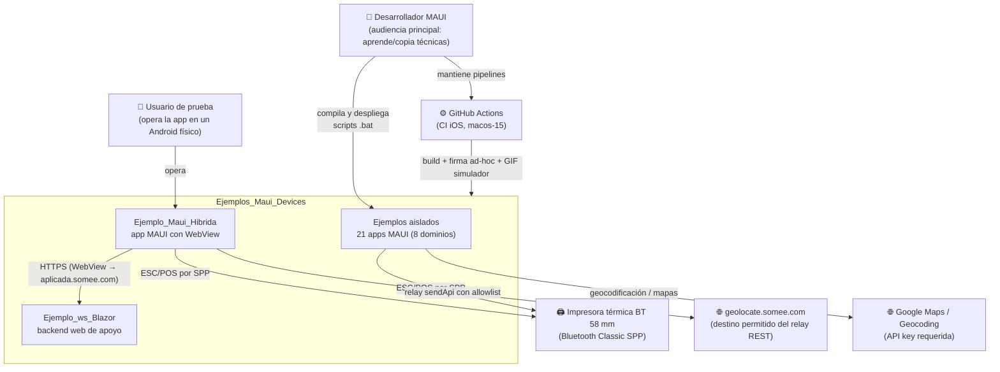

# Contexto del sistema (C4-L1)

> **Resumen ejecutivo.** La solución y su entorno: quién la usa, qué sistemas externos toca y por dónde. Dos «modos» conviven: los **ejemplos aislados** (una app = una técnica, sin dependencias entre sí) y la **app híbrida** que integra los dispositivos contra una web remota.

## Diagrama de contexto

## Actores y sistemas externos

| Elemento | Rol | Evidencia |
|---|---|---|
| Desarrollador MAUI | Compila los ejemplos, compara variantes, copia el patrón a su app | [Visión](../00-overview/vision.md) |
| Usuario de prueba | Opera las apps en Android físico (la ejecución local no usa emulador) | [Runbook](../07-operations/build-and-run.md) |
| `aplicada.somee.com` | Hosting del backend Blazor que el WebView de la híbrida carga (`MainPage.xaml.cs:17`) | ia-db [índice 08 §1](../../../ia-db/indexes/08_App-Hibrida-Integrada.md) |
| Google Maps / Geocoding | Mapa nativo (Maps) y geocodificación inversa (GPS); requieren API key ([ADR-0007](../04-decisions/0007-secretos-fuera-del-repo.md)) | piezas [maps](../pieces/maps/README.md) · [gps](../pieces/gps/README.md) |
| Impresora térmica 58 mm | Destino físico de la impresión (BT Classic SPP, solo Android) | pieza [printer](../pieces/printer/README.md) |
| `geolocate.somee.com` | Único host permitido por el `ApiRelayService` del comando `sendApi` | ia-db [índice 08 §4.2](../../../ia-db/indexes/08_App-Hibrida-Integrada.md) |
| GitHub Actions | Compila los targets iOS con firma ad-hoc ([ADR-0006](../04-decisions/0006-ci-ios-adhoc-android-local.md)) | [Runbook](../07-operations/build-and-run.md) |

## Límites del sistema

- **Dentro**: las 23 piezas del [mapa del sistema](../00-overview/system-map.md), sus scripts y pipelines.
- **Fuera**: el hosting somee (infraestructura de terceros), los servicios de Google, el firmware de la impresora. De ellos solo se documenta el punto de contacto.

## Preguntas guía

- ¿Vas a usar un ejemplo aislado o la arquitectura completa? Si lo primero, el contexto se reduce a la fila de esa pieza.
- ¿Tu app necesita hablar con hosts propios desde la web híbrida? El relay exige ampliar la allowlist — ver [contrato del puente](../pieces/integrada/bridge-contract.md).

## Referencias

- Siguiente nivel de zoom: [Contenedores (C4-L2)](02-containers.md)
- ia-db: [índice 08](../../../ia-db/indexes/08_App-Hibrida-Integrada.md) · [índice maestro](../../../ia-db/indexes/00_MASTER-INDEX.md)
