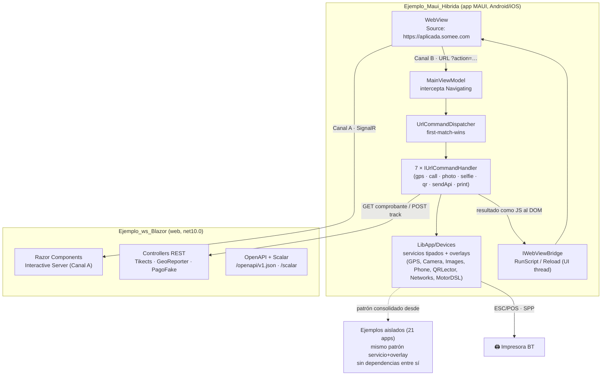

# Contenedores (C4-L2)

> **Resumen ejecutivo.** Zoom al interior de la solución: los contenedores desplegables y sus canales de comunicación. La pieza estructuralmente interesante es la híbrida: un `WebView` sobre el que conviven **dos canales independientes** — la interactividad Blazor (SignalR) y el puente de comandos por URL hacia lo nativo.

## Diagrama de contenedores

## Contenedores

| Contenedor | Tecnología | Responsabilidad | Doc |
|---|---|---|---|
| Ejemplos aislados (21) | .NET MAUI (versiones por dominio) | Una técnica por app; patrón servicio tipado + overlay ([ADR-0002](../04-decisions/0002-servicio-tipado-overlay-mvvm.md)) | [pieces/](../pieces/) |
| `Ejemplo_Maui_Hibrida` | MAUI 10.0.80, CommunityToolkit, BarcodeScanning.Native 3.0.4, MotorDsl.* 1.0.13 | Consolida los dispositivos en `LibApp/Devices/` y los expone a la web por el puente URL ([ADR-0003](../04-decisions/0003-puente-webview-comandos-url.md)) | [pieza integrada](../pieces/integrada/README.md) |
| `Ejemplo_ws_Blazor` | Blazor Interactive Server + controllers + OpenAPI/Scalar | Sirve la web del WebView, el comprobante imprimible y endpoints de prueba | [catálogo de APIs](../05-apis/catalog.md) |

## Los dos canales del WebView

| Canal | Transporte | Qué resuelve | Dónde está el detalle |
|---|---|---|---|
| **A — Interactividad** | Circuito SignalR de Blazor Server | Los `@onclick` y el render de la web | Fuera del alcance de la doc de dispositivo; **bug conocido en iOS/WKWebView** sobre hosting gratuito (la web se ve, la interactividad muere) — `Docs/web-hibrida/maui-hibrido.md §7` |
| **B — Dispositivos** | Navegación interceptada (`e.Cancel` síncrono antes del primer `await`) | Acciones nativas disparadas por URL convencional | [Contrato del puente](../pieces/integrada/bridge-contract.md) · [vistas de runtime](04-runtime-views.md) |

## Convenciones estructurales

- **Orden de registro = prioridad de despacho** de los handlers (`MauiProgram.cs:108-114`).
- El resultado vuelve a la web de tres formas: inyección de JS (cámara/selfie/QR/sendApi/print), **re-navegación** con query params (solo GPS) o solo efecto nativo (llamada).
- El VM y los handlers **nunca tocan el control** `WebView`: pasan por `IWebViewBridge` (evento → behavior → UI thread).
- Los overlays de dispositivo comparten la base `StatusOverlayViewModel` (`None/Busy/Error`).

## Preguntas guía

- ¿Vas a agregar una capacidad nativa a la híbrida? El camino es un handler nuevo + una línea de DI — paso a paso en la [pieza integrada](../pieces/integrada/README.md).
- ¿Tu web necesita interactividad en iOS? Revisá primero el bug del Canal A antes de decidir Blazor Server dentro de un WKWebView.

## Referencias

- ia-db: [índice 08 §1–§5](../../../ia-db/indexes/08_App-Hibrida-Integrada.md)
- Flujos de punta a punta: [04-runtime-views](04-runtime-views.md)
