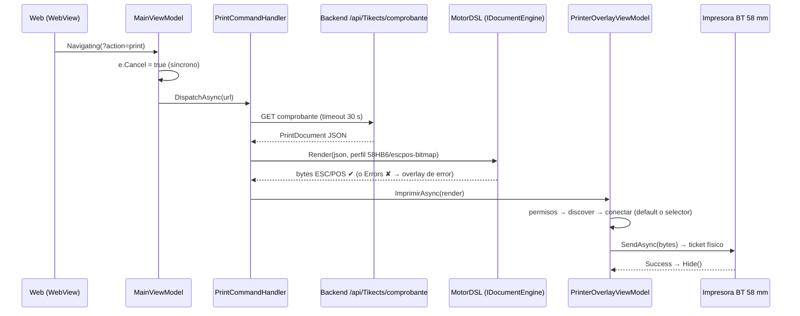
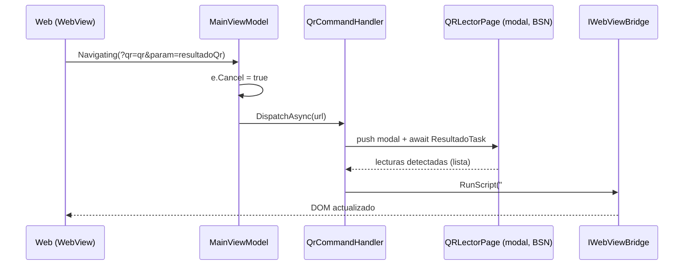
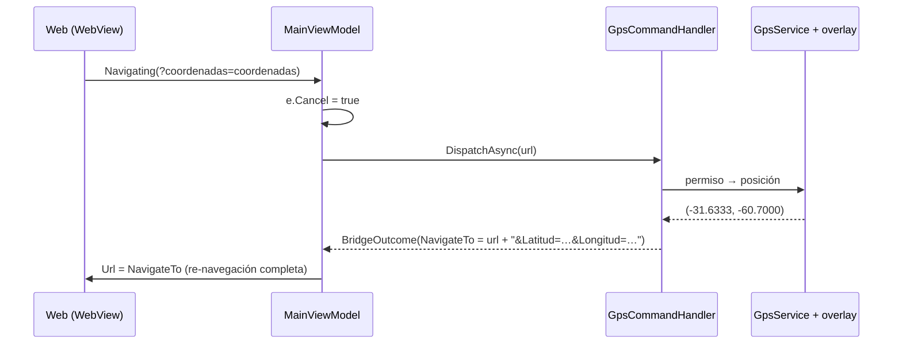

# Vistas de runtime — flujos clave

> **Resumen ejecutivo.** Tres flujos de la app híbrida narrados de punta a punta con datos concretos **sintéticos**, elegidos porque cada uno ejercita una forma distinta de devolver el resultado a la web: impresión (inyección de JS tras un pipeline complejo), lectura de QR (inyección de JS con espera modal) y GPS (re-navegación con query params). Los flujos internos de cada dispositivo aislado viven en su [pieza](../pieces/) — acá solo el recorrido entre contenedores.

## Flujo 1 — Imprimir el comprobante (`?action=print`) · caso testigo

**Narrativa.** Una inspectora municipal termina de cargar una multa en la web (dentro del WebView) y toca **«Imprimir comprobante»**. El botón navega a una URL marcada con `?action=print`. La app cancela esa navegación (el usuario no ve cambiar la página), trae del backend el comprobante como `PrintDocument` JSON —un árbol de nodos: logo bitmap, «MUNICIPALIDAD — COMPROBANTE DE INFRACCIÓN», datos del comercio en negrita, separadores y un QR al detalle del ticket—, lo **renderiza primero** a bytes ESC/POS (perfil `58HB6`, 32 columnas, `escpos-bitmap`) y recién entonces abre el overlay Bluetooth: pide permisos (`BLUETOOTH_SCAN/CONNECT`), descubre impresoras, reusa la predeterminada si está a la vista (`Preferences["default_printer_id"]`) o muestra el selector, conecta e imprime. Si el render falla, la impresora ni se toca: el overlay muestra «No se pudo generar el documento».

**Validaciones observables (QA):** la página no cambia al tocar el botón; sin permiso BT el overlay ofrece «Abrir configuración»; con Bluetooth apagado ofrece «Reintentar»; el ticket sale con logo, negritas y QR legibles. Estados completos del overlay: ia-db [índice 08 §6.3](../../../ia-db/indexes/08_App-Hibrida-Integrada.md).

## Flujo 2 — Leer un QR desde la web (`?qr=qr&param=resultadoQr`)

**Narrativa.** La web muestra un campo «Código escaneado» con `id="resultadoQr"` y un botón que navega a `?qr=qr&param=resultadoQr`. La app cancela la navegación, abre la página modal del lector (`QRLectorPage`, motor BSN — la variante recomendada por [ADR-0004](../04-decisions/0004-qr-bsn-recomendada-ios.md)) y queda esperando el resultado en un `TaskCompletionSource`. El usuario apunta a un código —p. ej. el QR de ejemplo del backend, que codifica `https://aplicada.somee.com/tickets/0001-00012345`— y al detectarlo la modal se cierra: el handler serializa la lectura con `System.Text.Json` (evita romper el JS/XSS) y la inyecta en `#resultadoQr.textContent` vía `IWebViewBridge`. Para la web fue como si el campo «se llenara solo».

**Validaciones observables (QA):** cancelar el lector devuelve a la web sin alterar el campo; una lectura con comillas o caracteres especiales no rompe la página (serialización JSON).

## Flujo 3 — Coordenadas por re-navegación (`?coordenadas=coordenadas`)

**Narrativa.** La web (o el botón nativo del pie de la app) dispara `?coordenadas=coordenadas`. A diferencia de los demás comandos, el GPS **no inyecta JS**: el overlay de GPS gestiona el permiso de ubicación y la obtención de la posición — p. ej. `-31.6333, -60.7000` (sintética, zona Santa Fe) — y el handler **reescribe la URL** agregando `Latitud=-31.6333&Longitud=-60.7000`; el dispatcher devuelve `NavigateTo` y el `MainViewModel` navega el WebView a esa URL: la web recibe las coordenadas como query params de una carga normal de página.

**Validaciones observables (QA):** con el permiso denegado, el overlay ofrece el flujo de configuración y la web no se re-navega; con permiso otorgado, la página se recarga con ambos parámetros presentes.

## Los tres estilos de retorno, comparados

| Estilo | Comandos | Costo/beneficio |
|---|---|---|
| Inyección de JS al DOM | photo, selfie, qr, sendApi, print | La web no se recarga; requiere `id` convenido del elemento destino |
| Re-navegación con query | coordenadas (GPS) | Simple para la web (lee query params), pero recarga la página completa |
| Solo efecto nativo | phone | Nada vuelve a la web; el overlay nativo informa el resultado |

## Referencias

- Contrato completo de comandos y parámetros: [bridge-contract](../pieces/integrada/bridge-contract.md)
- ia-db: [índice 08 §3–§6](../../../ia-db/indexes/08_App-Hibrida-Integrada.md)
- Piezas: [integrada](../pieces/integrada/README.md) · [printer](../pieces/printer/README.md) · [qr](../pieces/qr/README.md) · [gps](../pieces/gps/README.md)
