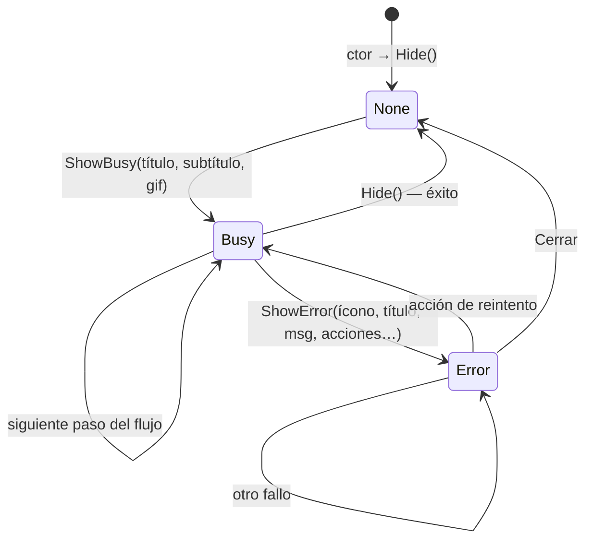
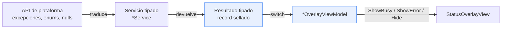

# Overlays de dispositivo — fundamento del patrón

> **Resumen ejecutivo.** Cuatro dominios de la app híbrida (GPS, Red, Telefonía, Impresión) comparten una misma mecánica de UI: una capa que se superpone a la pantalla anfitriona y comunica **en qué estado está una operación de hardware** — esperando, o fallada con salidas concretas. Este documento explica **por qué** el patrón es así, **cómo** se construye uno nuevo y **dónde** no aplica. El catálogo de pantallas concretas, con sus mensajes literales, está en [08-pantallas-por-dispositivo](08-pantallas-por-dispositivo.md).
>
> [ADR-0002](../04-decisions/0002-servicio-tipado-overlay-mvvm.md) registra la **decisión** de separar servicio tipado + overlay MVVM. Este documento es el **manual del patrón** que esa decisión produjo: no repite el porqué de la decisión, describe la mecánica resultante y las lecciones de operarla.
>
> **Alcance**: el patrón **consolidado** en `Ejemplo_Maui_Hibrida/LibApp/Devices/`. Los ejemplos aislados tienen precursores propios (ver [§1.2](#12-dos-generaciones-del-patrón)).

## Tabla de contenidos

1. [Qué problema resuelve](#1-qué-problema-resuelve)
2. [La máquina de tres estados](#2-la-máquina-de-tres-estados)
3. [El contrato: del hardware a la pantalla](#3-el-contrato-del-hardware-a-la-pantalla)
4. [Anatomía de la base](#4-anatomía-de-la-base)
5. [Integración en la página anfitriona](#5-integración-en-la-página-anfitriona)
6. [Receta: agregar un dispositivo](#6-receta-agregar-un-dispositivo)
7. [Los límites del patrón](#7-los-límites-del-patrón)
8. [Anti-patrones verificados](#8-anti-patrones-verificados)
9. [Observaciones](#9-observaciones)

---

## 1. Qué problema resuelve

### 1.1 Por qué una capa y no una página

Un dispositivo de plataforma impone una interrupción: hay que pedir un permiso, esperar un hardware lento, y a veces fallar de una forma que el usuario **puede resolver** (encender el Bluetooth, cargar papel, acercarse a la impresora). Resolver eso navegando a otra página tiene tres costos:

| Costo de navegar | Consecuencia |
|---|---|
| Se pierde el contexto visual | El usuario deja de ver dónde estaba; volver requiere recordar |
| Hay que devolver el control al origen | Cada llamador necesita saber a dónde volver y con qué |
| El estado se vuelve navegación | «Reintentar» pasa a ser un problema de stack de páginas |

En la app híbrida el costo es mayor todavía: la pantalla anfitriona es un `WebView` con una sesión web viva. Navegar fuera **la descarta**.

La capa superpuesta evita las tres cosas: el contexto sigue detrás, el control nunca se fue, y «Reintentar» es volver a llamar un método.

**El criterio de aplicabilidad** —y esto es lo que decide si un flujo nuevo entra en el patrón— es que la interacción se resuelva en dos frases: **«esperá»** o **«falló, elegí una salida»**. Un flujo que necesite mostrar contenido propio (un viewport de cámara, un formulario) no es un overlay: es una página. Ver [§7](#7-los-límites-del-patrón).

### 1.2 Dos generaciones del patrón

El patrón no nació consolidado, y leer los ejemplos aislados sin saberlo confunde.

| Generación | Dónde | Forma |
|---|---|---|
| **1ª — precursores por dominio** | `Ejemplos_Devices/GPS/`, `Ejemplos_Devices/Phone/Ejemplo_Maui_DirectCall/` | Un **coordinador singleton** por dominio (`GpsCoordinator`, `CallCoordinator`) dueño del overlay y del `CancellationTokenSource`, con un `ContentView` propio y distinto por dominio (`GpsStatusOverlayView`, `CallPermissionOverlayView`) |
| **2ª — consolidada** | `Ejemplo_Maui_Hibrida/LibApp/Devices/` | Una **base común** (`StatusOverlayViewModel` + `StatusOverlayView`) con cuatro especializaciones y una sola vista reutilizada |

**Este documento describe la 2ª.** La consolidación eliminó los coordinadores: el ViewModel de overlay es hoy el punto de entrada directo (`PrinterOverlayViewModel.ImprimirAsync`, `CallOverlayViewModel.LlamarAsync`), y lo invoca el handler de URL del puente ([ADR-0003](../04-decisions/0003-puente-webview-comandos-url.md)).

> **Dato revelador del alcance**: el dominio **Red no tiene precursor**. `Ejemplo_Maui_Connectivity` es un utilitario de referencia de API con la UI vacía y sin cablear ([pieza red](../pieces/red/README.md)). El overlay de red **nace en la híbrida**, porque es ahí donde por primera vez hay algo que tapar cuando no hay conexión.

---

## 2. La máquina de tres estados



| Estado | Significado | Botonera |
|---|---|---|
| `None` | El overlay no existe para el usuario | — |
| `Busy` | Operación en curso; el usuario espera | **Imposible** (ver [§4.4](#44-la-limitación-de-showbusy)) |
| `Error` | Se necesita una decisión del usuario | Dinámica, una por caso |

**No hay transiciones prohibidas**: cualquier estado va a cualquier otro. La disciplina la pone el ViewModel derivado, no la base (`StatusOverlayViewModel.cs:54-77`).

**Asimetría deliberada de visibilidad**: `ShowBusy` y `ShowError` son `protected`; `Hide()` es `public` (`StatusOverlayViewModel.cs:54,64,77`). El host puede **cerrar** el overlay pero no **abrirlo**: qué se muestra lo decide siempre el VM del dominio. Es lo que impide que la página anfitriona invente estados.

El nombre `Error` es más estrecho que su uso real: también hospeda el **selector de impresoras**, que no es un error sino una pregunta (`PrinterOverlayViewModel.cs:168`). Leer `Error` como «capa que pide una decisión» describe mejor lo que hace.

---

## 3. El contrato: del hardware a la pantalla

El patrón encadena tres piezas con una regla por eslabón.



| Eslabón | Regla | Por qué |
|---|---|---|
| Servicio | Traduce **toda** excepción/enum/null a un resultado tipado. No lanza. | El VM no debe conocer la API nativa |
| Resultado | `abstract record` con variantes `sealed`, **una por acción distinta del usuario** | Cada variante es una pantalla con su botonera |
| ViewModel | `switch` sobre las variantes. **Sin `try/catch`** | Un `catch (Exception)` colapsa causas distintas en un mensaje único |
| Vista | No decide nada; sólo pinta `Mode`, textos y `Actions` | La UI no debe razonar |

Los cuatro dominios cumplen el contrato. `GpsResult` tiene 8 variantes, `CallResult` 7, `NetworkResult` 6, y en impresión `DiscoverResult` (5) + `PrintResult` (2) + `PrintFailure` con 14 códigos.

**El criterio de granularidad es la acción, no la causa.** Dos causas técnicas distintas que se resuelven con el mismo gesto comparten variante; una causa que se resuelve distinto merece la suya. Es lo que evita un enum de 40 estados que la UI no sabe diferenciar.

> **La trampa del tipo cerrado.** Un `abstract record` con variantes sella el `switch` y da sensación de exhaustividad: el compilador no se queja, todos los casos están. Pero C# **no verifica que cada variante se construya**. Modelar el caso no es producirlo — es el defecto más caro que sufrió este patrón, y se detalla en [§8.2](#82-la-variante-que-nadie-construye). Al agregar una variante, trazá hasta su `new` y verificá que ese punto se alcanza.

---

## 4. Anatomía de la base

`Common/ViewModels/StatusOverlayViewModel.cs` + `Common/Controls/StatusOverlayView.xaml`.

### 4.1 Propiedades y su consumidor

| Propiedad | Declaración | Qué pinta |
|---|---|---|
| `Mode` | `:34` | Nada directo: alimenta `IsVisible`/`IsBusy`/`IsError` vía `[NotifyPropertyChangedFor]` (`:31-33`) |
| `IconGlyph` | `:37` | `Label.Text` de la capa de error (`StatusOverlayView.xaml:34`) |
| `Title` · `Message` | `:38-39` | Labels de la capa de error (`:35-36`) |
| `BusyTitle` · `BusySubtitle` | `:42-43` | Labels de la capa de espera (`:25-26`) |
| `BusyImage` | `:44` | `Image.Source` con `IsAnimationPlaying="True"` (`:24`) |
| `Actions` | `:47` | `BindableLayout.ItemsSource` de la botonera (`:39`) |

`Actions` es una `ObservableCollection` de sólo lectura: por eso `ShowError` hace `Clear()` + `Add` en vez de reasignar (`:66-68`). La notificación viaja por la colección, no por `PropertyChanged`.

> **Propiedades que no pinta el overlay.** `GpsOverlayViewModel.Coordenadas` (`:15`) y `CallOverlayViewModel.Estado` (`:19`) **no están bindeadas en `StatusOverlayView`**: son canales de salida hacia el host, no hacia la capa. Confundirlas con feedback al usuario produce el defecto de [§8.3](#83-el-estado-que-no-muestra-nada).

### 4.2 La botonera dinámica

El modelo del botón es un record de tres campos (`StatusOverlayViewModel.cs:21`):

```csharp
public record OverlayAction(string Text, ICommand Command, OverlayActionStyle Style = OverlayActionStyle.Primary);
```

Se renderiza con `BindableLayout` sobre un `VerticalStackLayout` — no un `CollectionView` — y un `DataTemplate` de un solo `Button` (`StatusOverlayView.xaml:39-42`).

**Primary es el default y Secondary es un trigger.** El `Button` nace con el estilo primario cableado en sus atributos (`:43-44`) y un `DataTrigger` lo degrada (`:46-51`):

```xml
<DataTrigger TargetType="Button" Binding="{Binding Style}" Value="Secondary">
    <Setter Property="BackgroundColor" Value="Transparent"/>
    <Setter Property="TextColor" Value="#AAAAAA"/>
    ...
</DataTrigger>
```

No existe `Value="Primary"`: **Primary es «el trigger no disparó»**. Consecuencia práctica: los llamadores escriben `OverlayActionStyle.Secondary` explícito y omiten el primario. Un overlay donde *todos* los botones son `Secondary` es legal y no da error — simplemente no tiene botón destacado. Ocurre hoy en dos pantallas ([§8.6](#86-la-pantalla-sin-botón-primario)).

Esto es lo que hace que el mismo overlay muestre «Reintentar / Elegir otra / Cerrar» ante un fallo de conexión y **un botón por impresora** en el selector, sin XAML condicional ni páginas nuevas (`PrinterOverlayViewModel.cs:151-169`).

### 4.3 Los dos strings mágicos

En la misma clase base conviven **dos convenciones distintas**, ninguna tipada ni validada. Es la fuente de error más silenciosa del patrón.

| Campo | Qué es realmente | Si te equivocás |
|---|---|---|
| `IconGlyph` | **Ligadura tipográfica** de Material Icons Outlined | Se ve **el texto literal** en pantalla, a 80 px |
| `BusyImage` | **Nombre de archivo** de `Resources/Images/` | No se ve nada |

`IconGlyph` no es un nombre de imagen ni una clave: **no existe ningún mapa, converter ni diccionario que lo traduzca**. El string va crudo al `Text` de un `Label` cuya fuente es la de íconos (`StatusOverlayViewModel.cs:70` → `StatusOverlayView.xaml:34`):

```xml
<Label Text="{Binding IconGlyph}" FontFamily="MaterialIconsOutlined" FontSize="80" .../>
```

La fuente se registra en `MauiProgram.cs:47` (`MaterialIconsOutlined-Regular.otf`) y es ella la que sustituye el texto por el pictograma. **Un glyph inexistente no da error de compilación ni de binding.**

Glyphs en uso, verificados: `location_off` (GPS) · `phone_locked`, `phone_disabled`, `dialpad` (Telefonía) · `wifi_off`, `schedule`, `dns` (Red) · `print`, `print_disabled`, `bluetooth_disabled`, `block` (Impresión) · `error` (compartido). GIFs: `satelite.gif` (GPS), `reconexion.gif` (Red), `timer.gif` (Telefonía e Impresión).

### 4.4 La limitación de `ShowBusy`

```csharp
protected void ShowBusy(string title, string subtitle = "", string image = "")
{
    Actions.Clear();
    ...
}
```

`ShowBusy` **no acepta acciones** —no tiene el `params OverlayAction[]` que sí tiene `ShowError`— y además limpia la colección (`StatusOverlayViewModel.cs:54-61`). La vista es simétrica: la capa Busy no tiene ningún `BindableLayout` ni `Button`, sólo `Image` + dos `Label` (`StatusOverlayView.xaml:21-28`).

**Consecuencia: toda espera es no-cancelable.** El usuario mira el GIF hasta que el flujo decida `Hide()` o `ShowError(...)`. Y como el overlay cubre la pantalla con `#CC000000` y `Fill/Fill`, el `Grid` intercepta el input: no hay escape.

Pesa sobre todo en impresión, cuyo flujo encadena hasta cinco `ShowBusy` seguidos —descubrimiento y conexión Bluetooth—, que son justamente las operaciones más lentas y las que más ganas dan de abortar.

**El `Actions.Clear()` es correcto, no un descuido**: sin él los botones del `ShowError` anterior sobrevivirían y reaparecerían mezclados con los nuevos. Es higiene de una colección compartida entre dos capas. Lo que falta no es quitar el `Clear()`, sino una sobrecarga que acepte acciones opcionales — **la extensión pendiente más valiosa de la base**, y beneficiaría a los cuatro dominios a la vez.

---

## 5. Integración en la página anfitriona

Host: `Pages/MainPage.xaml`.

**Superposición por celda de `Grid`.** Los cuatro overlays y el `RefreshView` del WebView están todos en `Grid.Row="0"`: los `StatusOverlayView` no declaran fila, así que caen en la 0 por default — la misma del WebView. En un `Grid` de MAUI, los hijos sin fila explícita se apilan en la misma celda. Ahí está toda la superposición: no hay nada más.

**El z-order es el orden de declaración.** No hay `ZIndex` en ningún lado. El propio XAML lo documenta (`MainPage.xaml:42-43`):

```xml
<!-- El orden = prioridad visual: el último declarado queda arriba.
     GPS primero; Red después; Llamada; Impresión al final (máxima prioridad). -->
```

| Prioridad | Overlay |
|---|---|
| 1 (más baja) | `GpsOverlayViewModel` |
| 2 | `NetworkOverlayViewModel` |
| 3 | `CallOverlayViewModel` |
| 4 (**máxima**) | `PrinterOverlayViewModel` |

> Es prioridad **de pintado, no de exclusión**. Nada impide que dos overlays estén en `Error` a la vez: simplemente se ve el último. Ningún VM consulta el estado de otro.

**Los cuatro VMs son singletons** (`MauiProgram.cs:77,101-103`). Es lo que permite que el handler de URL manipule exactamente el mismo VM que la vista tiene bindeado, sin mensajería.

**El caso Red rompe la regla, y con razón.** Es el único que además **oculta** el WebView (`MainPage.xaml:24-26`):

```xml
IsVisible="{Binding NetworkOverlayViewModel.IsVisible, Converter={StaticResource InvertedBool}}"
```

El comentario explica el porqué: *«El WebView se ve SOLO cuando el overlay de Red está oculto: así nunca se muestra la página de error del navegador»*. Como `#CC000000` es semitransparente, la página de error del navegador se traslucería por detrás. **Tapar no alcanza; hay que desmontar.**

---

## 6. Receta: agregar un dispositivo

1. **Definí el resultado tipado.** Un `abstract record` con una variante `sealed` **por acción distinta del usuario**. No por causa técnica.
2. **Escribí el servicio.** Traduce la API nativa a esas variantes. **No lanza**: todo `catch` termina en una variante. Si hay permisos, normalizalos a un enum de cuatro valores (`Granted`/`DeniedCanRetry`/`Denied`/`Restricted`) — los cuatro dominios convergen en esa forma.
3. **Derivá el ViewModel** de `StatusOverlayViewModel`. `Hide()` en el constructor. `switch` sobre el resultado, un `ShowError` por variante, sin `try/catch`.
4. **Elegí glyph y GIF** de los ya usados ([§4.3](#43-los-dos-strings-mágicos)). No hay validación: verificá en pantalla.
5. **Registrá el VM como singleton** en `MauiProgram`.
6. **Declaralo en `MainPage.xaml`** en la posición que le corresponda por prioridad ([§5](#5-integración-en-la-página-anfitriona)).
7. **Trazá cada variante hasta su `new`** y confirmá que ese punto se alcanza. No es burocracia: es la [§8.2](#82-la-variante-que-nadie-construye).

**Redacción de los mensajes** — la convención observada, que conviene sostener:

| Regla | Ejemplo bueno | Ejemplo malo (real) |
|---|---|---|
| Voseo rioplatense, tono llano | «Activá el Bluetooth para buscar impresoras.» | — |
| El botón nombra el **gesto**, no la mecánica | «Ya cargué papel — Reintentar» | «Reintentar» a secas ante falta de papel |
| El mensaje dice **qué hacer**, no qué pasó | «Verificá que la impresora esté encendida y emparejada» | `Print failed after 1 attempt(s): paper out` |
| Nunca texto de depuración | — | `"Alert"` / `"Dale permiso si queres QR!"` (`QRLectorPage.xaml.cs:75`) |

---

## 7. Los límites del patrón

**Cámara y QR no usan overlay, y hacen bien.** La razón es estructural: `StatusOverlayView` es un `ContentView` con **dos capas fijas y ningún punto de extensión** — no hay `ContentPresenter`, ni `BindableProperty` de contenido, ni `ControlTemplate`. Sirve para **superponer estado sobre contenido ajeno**, no para **hospedar contenido propio**.

Cámara y QR necesitan exactamente lo que el overlay no da:

| Necesidad | Qué ofrece el overlay |
|---|---|
| Viewport de cámara vivo con ciclo de vida | Un `Image` con un GIF |
| Controles durante la operación (flash, disparador) | Nada: la capa Busy no admite botones ([§4.4](#44-la-limitación-de-showbusy)) |
| Layout reactivo a la orientación | Layout fijo centrado |
| Devolver un **valor** | Comunica un **estado** por propiedades observables |

Por eso son `ContentPage` navegadas (`MyMediaPickerPage`, `MyMediaSelfiePickerPage`, `QRLectorPage`), registradas `Transient` o instanciadas con `new` — contra los cuatro VMs `Singleton`. Página nueva por invocación, estado que nace y muere con la navegación, resultado devuelto por `TaskCompletionSource`.

**La regla**: si el flujo se resuelve en «esperá» o «falló, elegí una salida», es overlay. Si necesita mostrar contenido propio o devolver un payload, es página.

> **Pero la deriva quedó, y se paga.** Que no usen overlay es correcto; que cada uno invente su propio manejo de error no. Hoy conviven **tres estrategias** para el mismo problema — ver [§8.7](#87-la-deriva-de-los-que-quedaron-afuera).

---

## 8. Anti-patrones verificados

Todo lo que sigue **está en el código o estuvo hasta hace poco**, en más de un dominio. No son riesgos teóricos: son la experiencia de operar este patrón, y la razón principal por la que existe este documento.

### 8.1 El guard que mata la rama `Success`

**Presente hoy en GPS y Telefonía.** Los ViewModels comparten esta forma:

```csharp
if (result is X.Success) { Hide(); return result; }   // ← corta acá
MostrarResultado(result);                             // ← su 'case Success:' es inalcanzable
```

`MostrarResultado` tiene un único call-site, precedido por un guard que retorna ante `Success`. Su `case Success:` **nunca se ejecuta** (`GpsOverlayViewModel.cs:82-85`, `CallOverlayViewModel.cs:93-95`).

No sería grave si esa rama estuviera vacía, pero contiene **la única asignación con datos reales** de la propiedad de salida:

| Dominio | Línea muerta | Consecuencia |
|---|---|---|
| GPS | `Coordenadas = $"Lat: {s.Location.Latitude}, Lng: {s.Location.Longitude}"` (`:83`) | **`Coordenadas` nunca contiene coordenadas** |
| Telefonía | `Estado = $"Llamada iniciada a {s.Numero} ({s.Mode})."` (`:94`) | `Estado` nunca refleja el éxito |

El código *parece* manejar el éxito. No lo hace.

### 8.2 La variante que nadie construye

**El defecto más caro que sufrió el patrón.** `DiscoverResult.BluetoothOff` existió durante toda la vida del PoC de impresión: bien modelada, con su pantalla escrita y su botón «Abrir configuración»… y **nunca se construía**. El transport lanzaba la excepción correcta, pero `ThermalPrinterService` la capturaba (por diseño: un transport caído no debe abortar el barrido de los demás) y devolvía lista vacía. Todo terminaba en `Empty` → *«No se encontraron impresoras — Encendé la impresora»*.

El usuario con el Bluetooth apagado recibía una instrucción **accionable en la dirección equivocada**: iba a revisar la impresora, no el teléfono.

Un tipo cerrado da la ilusión de exhaustividad: el `switch` cubre los cuatro casos y el compilador calla. **C# no verifica que cada variante se produzca.** Corregido chequeando el adaptador *antes* de llamar a la librería (`PrinterService.cs:82,91`).

Otras variantes inalcanzables hoy:

| Variante | Por qué | Evidencia |
|---|---|---|
| `CallResult.Cancelled` | Se construye si `ct.IsCancellationRequested`, pero el VM **nunca pasa un token** (usa `default`, que jamás se cancela) y su firma pública ni lo expone | `CallService.cs:30`, `CallOverlayViewModel.cs:34` |
| `GpsResult.PermissionDenied(CanRetry: true)` | `puedeReintentar` sólo se asigna bajo `#if ANDROID` → inalcanzable fuera de Android | `GpsService.cs:99-105` |
| `CallResult.NotSupported` | Se construye sólo dentro de `LlamarConDialer`; en Android + `Direct` no se pasa por ahí | `CallService.cs:50,57` |

### 8.3 El estado que no muestra nada

**Presente hoy en GPS.** Cinco variantes —`GpsDisabled`, `NotSupported`, `NoSignal`, `Cancelled`, `Failure`— **no llaman a `ShowError`**. Asignan el texto a `Coordenadas` y llaman `Hide()` (`GpsOverlayViewModel.cs:95-118`).

Como `Coordenadas` **no está bindeada** en `StatusOverlayView` ([§4.1](#41-propiedades-y-su-consumidor)) y el overlay se oculta, el usuario **no ve absolutamente nada**. Apagás el GPS y la app no dice que el GPS está apagado.

El texto correcto existe. Está escrito. No llega a ninguna pantalla.

Es el mismo defecto que en impresión dejaba al usuario tocando «Imprimir» sin respuesta durante 30 segundos ante un fallo de red. **La lección**: escribir el mensaje no es mostrarlo. Verificá contra qué está bindeada la propiedad que asignás.

### 8.4 El botón que promete lo que no hace

**Corregido en impresión.** El botón «Elegir otra», ante una impresora predeterminada que no responde, invocaba `ReintentarBuscarCommand` → volvía a descubrir → volvía a encontrar la predeterminada en `BondedDevices` (estar emparejada no implica estar presente) → **reconectaba a la misma**. Un bucle sin salida por UI.

La única forma de romperlo era desemparejar desde los ajustes de Android — justo lo que la app debería sugerir y no sugería.

**La lección**: un botón cuyo texto promete un cambio de rumbo tiene que producirlo. Si reusa el comando de otro botón, sospechá. Se corrigió con un flag explícito (`BuscarYImprimirAsync(forzarSelector: true)`) que saltea la predeterminada.

### 8.5 El comentario que documenta la intención, no el código

**Corregido en impresión.** El caso de código inalcanzable más caro venía **acompañado de un comentario que afirmaba que estaba cubierto**:

```csharp
// El overlay ya cubre este caso (ver ImprimirAsync → "No se pudo generar el documento"),
// por eso alcanza con cerrar el comando sin cancelar navegación ni redirigir.
return new BridgeOutcome(true, null);   // ← y por eso el overlay nunca se entera
```

El comentario era *casi* cierto: el overlay cubría el caso. Lo que no decía es que ese camino no lo llamaba. Un lector que auditara el flujo leyendo comentarios concluía que no había bug.

**La lección**: un comentario que afirma que otro componente maneja algo es una **aserción sobre el flujo**, y el compilador no la verifica. Cuando aparezca uno, trazá la llamada.

Hay ejemplares vivos del mismo género: `NetworkOverlayViewModel.cs:14-15` afirma que *«la verdad de fondo sobre "cargó o no" es el `WebNavigationResult` del WebView»*, pero el parámetro `result` **no se usa en el cuerpo** (`:43-48`). Y `:56` declara *«Máxima prioridad: pisa cualquier estado»* para `MostrarOffline()`, prioridad que una sonda en vuelo puede sobrescribir al resolver.

### 8.6 La pantalla sin botón primario

**Presente hoy en GPS y Telefonía.** En la rama de permiso denegado definitivo, la variable se llama `primary` pero se construye con `Secondary` (`GpsOverlayViewModel.cs:62-64`, `CallOverlayViewModel.cs:73-75`). Como Primary es «el trigger no disparó» ([§4.2](#42-la-botonera-dinámica)), el resultado es una pantalla donde **ningún botón destaca**: «Abrir configuración» —la única acción útil— se ve igual que «Cerrar».

No rompe nada. Simplemente no guía.

### 8.7 La deriva de los que quedaron afuera

Cámara y QR no usan el patrón por una razón válida ([§7](#7-los-límites-del-patrón)), pero **cada uno inventó su manejo de error**. Hoy conviven tres estrategias para el mismo problema:

| Estrategia | Dónde | Qué tan bien comunica |
|---|---|---|
| Overlay con botonera dinámica y catálogo de fallos | GPS · Red · Telefonía · Impresión | El estándar |
| **Overlay reimplementado a mano** | `MyMediaPickerPage.xaml:21-36` | Funciona, pero glyph fijo y botonera congelada |
| **`DisplayAlert` con texto de depuración** | `QRLectorPage.xaml.cs:75` | Mal |

`MyMediaPickerPage` es la evidencia más nítida: **reimplementa la capa de error hexadecimal por hexadecimal**. Mismo `#CC000000`, misma `MaterialIconsOutlined` a 80 px, mismo `#512BD4` de botón primario, mismo `#AAAAAA`. No porque necesite algo distinto, sino porque **el patrón no ofrece forma de reusar sólo la capa de error dentro de una página propia**. Sus textos incluso riman con los del GPS, cambiando «la ubicación» por «la cámara». Diferencias: el glyph está cableado en XAML (`Text="no_photography"`, nunca cambia) y la botonera es estática, mostrada por `IsVisible` desde code-behind.

`QRLectorPage` está peor: su único error visible es `DisplayAlertAsync("Alert", "Dale permiso si queres QR!", "OK")` — título en inglés, texto coloquial— y **cuelga del botón de flash**. En `OnAppearing` se descarta el booleano del permiso (`await RequestCameraPermission();` sin `if`, `:110`): si lo negás al entrar, la cámara queda muerta y **no hay ningún mensaje**. El usuario ve negro.

**La lección de arquitectura**: la limitación de [§4.4](#44-la-limitación-de-showbusy) y la imposibilidad de reusar la capa de error suelta no son detalles de implementación. **Son las que produjeron esta deriva.** Un patrón que no cubre un caso vecino no deja un hueco: deja tres soluciones distintas.

---

## 9. Observaciones

| # | Tipo | Observación |
|---|---|---|
| **O-1** | Hecho | La capa `Busy` no admite botones, en el VM y en el XAML ([§4.4](#44-la-limitación-de-showbusy)). Toda espera es no-cancelable. Una sobrecarga de `ShowBusy` con acciones opcionales es aditiva y beneficia a los cuatro dominios. |
| **O-2** | Hecho | `IconGlyph` y `BusyImage` son strings mágicos de convenciones **distintas** (ligadura vs. filename), sin tipar ni validar ([§4.3](#43-los-dos-strings-mágicos)). Un glyph mal escrito se ve como texto a 80 px. |
| **O-3** | Interpretación | El nombre `OverlayMode.Error` es más estrecho que su uso: también hospeda el selector de impresoras, que es una pregunta, no un error. |
| **O-4** | Hecho | La prioridad entre overlays es de pintado, no de exclusión: dos pueden estar en `Error` a la vez y ningún VM consulta el estado de otro ([§5](#5-integración-en-la-página-anfitriona)). |
| **O-5** | Hecho | Los cuatro VMs son singletons: su estado de reintento persiste toda la vida del proceso. En Telefonía, `_ultimoNumero` arranca en `""`; invocar `ReintentarCommand` sin llamada previa daría `InvalidNumber`. |
| **O-6** | Hecho | `NetworkService.CheckUrlAsync(url, ...)` **ignora el parámetro `url`** y sondea siempre `msftconnecttest.com`. El mensaje de fallo de DNS le dice al usuario «No fue posible encontrar **www.msftconnecttest.com**», que no es el sitio al que quiso entrar. |
| **O-7** | Hecho | `GpsOverlayViewModel.SolicitarGeolocalizacion` devuelve `GpsResult.Failure("")` para **todos** los casos no-`Success`, con mensaje vacío: las 7 variantes son indistinguibles desde fuera del VM. Hoy no produce bug porque el único llamador sólo chequea `Success`. |
| **O-8** | Interpretación | El overlay de Red es el **único reactivo** (se suscribe a `ConnectivityChanged`): puede aparecer sin que nadie lo invoque. Su flag `_needsReload` distingue «se cortó la red con la página cargada» (basta ocultar) de «la navegación falló» (hay que recargar) — distinción que no aplica a dispositivos que no cambian de estado solos. |

---

## Referencias

- Catálogo de pantallas por dispositivo: [08-pantallas-por-dispositivo](08-pantallas-por-dispositivo.md)
- Decisión que originó el patrón: [ADR-0002](../04-decisions/0002-servicio-tipado-overlay-mvvm.md) · Puente que lo dispara: [ADR-0003](../04-decisions/0003-puente-webview-comandos-url.md)
- Piezas: [gps](../pieces/gps/README.md) · [red](../pieces/red/README.md) · [phone](../pieces/phone/README.md) · [printer](../pieces/printer/README.md) · [integrada](../pieces/integrada/README.md)
- Análisis UX que originó las correcciones de impresión: `Librerias/PrintThermal_Motor_Maui.Documentacion/Analisis/Analisis-UX-UI.md` y su [plan de corrección](../../../../../Librerias/PrintThermal_Motor_Maui.Documentacion/Analisis/Plan-Correcciones-UX-Impresion.md)
- Fuentes primarias (`Ejemplos_Devices/Integrada/Ejemplo_Maui_Hibrida/`):
  - `LibApp/Devices/Common/ViewModels/StatusOverlayViewModel.cs` · `LibApp/Devices/Common/Controls/StatusOverlayView.xaml`
  - `LibApp/Devices/{GPS,Networks,Phone,MotorDSL}/ViewModels/*OverlayViewModel.cs` y sus `Services/` y `Models/`
  - `Pages/MainPage.xaml` (superposición y z-order) · `MauiProgram.cs` (fuente de íconos, DI)
