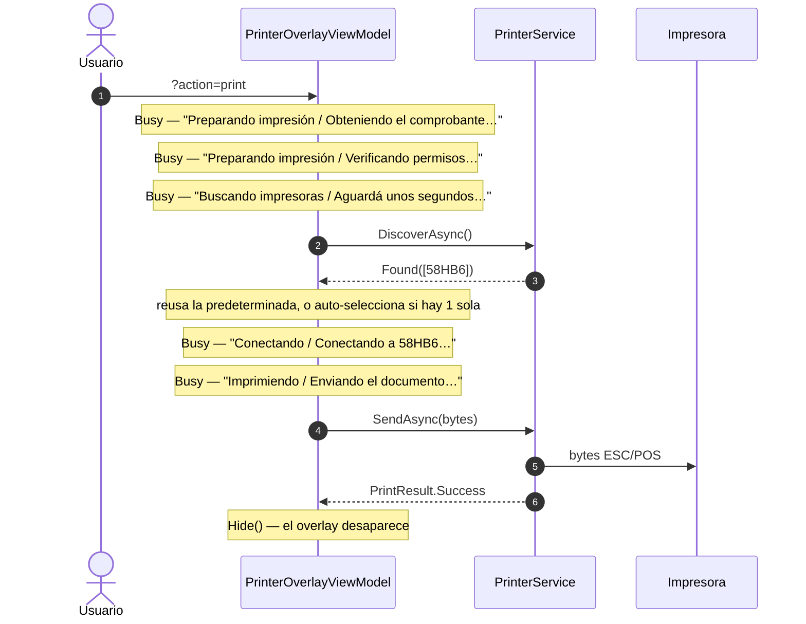

# Overlays — catálogo de pantallas por dispositivo

> **Resumen ejecutivo.** Qué ve el usuario, textualmente, en cada estado de los cuatro overlays de la app híbrida: GPS, Red, Telefonía e Impresión. Para cada dominio: el caso principal, los casos alternativos y el wireframe con **los mensajes literales del código**. El fundamento del patrón —por qué es así y cómo se construye uno— está en [07-overlays-dispositivos](07-overlays-dispositivos.md).
>
> **Uso previsto**: consulta puntual («¿qué dice la app cuando pasa X?») y contraste entre dominios. No se lee de corrido.

## Tabla de contenidos

1. [Cómo leer este catálogo](#1-cómo-leer-este-catálogo)
2. [Impresión térmica](#2-impresión-térmica)
3. [GPS](#3-gps)
4. [Telefonía](#4-telefonía)
5. [Red](#5-red)
6. [Contraste transversal](#6-contraste-transversal)
7. [Observaciones](#7-observaciones)

---

## 1. Cómo leer este catálogo

Los wireframes reproducen la estructura real de `StatusOverlayView`: ícono (glyph a 80 px), título, mensaje y botonera vertical, sobre un fondo `#CC000000` que cubre la pantalla.

```
┌──────────────────────────────┐
│           ⬛ glyph            │   ← IconGlyph (ligadura Material Icons)
│           Título              │   ← Title
│   Mensaje al usuario.         │   ← Message
│                               │
│      [ Botón primario ]       │   ← OverlayAction, Primary (#512BD4, relleno)
│      [ Botón secundario ]     │   ← OverlayAction, Secondary (borde, gris)
└──────────────────────────────┘
```

Convenciones:

- **Los textos son literales del código**, copiados sin retocar. Si un mensaje suena raro, así se ve en el teléfono.
- `[Botón]` en negrita = `Primary`. El resto, `Secondary`.
- **⚠️ Inalcanzable** marca pantallas que el código sabe mostrar pero que ningún camino produce hoy.
- **⚠️ Silencioso** marca ramas que no muestran nada al usuario.

> Los defectos anotados acá **no están corregidos** salvo donde se indique. Su análisis está en [07 §8](07-overlays-dispositivos.md#8-anti-patrones-verificados).

---

## 2. Impresión térmica

**Punto de entrada**: `PrinterOverlayViewModel.ImprimirAsync(RenderResult)`, disparado por `?action=print` desde la web ([ADR-0003](../04-decisions/0003-puente-webview-comandos-url.md)) vía `PrintCommandHandler`.

Es el overlay **más completo y el único con catálogo de códigos de error**: el resto de los dominios mapea variante → pantalla; impresión mapea variante → `PrintFailure(Code, Title, UserMessage, TechnicalMessage, Exception)`. El código se muestra al usuario para que pueda dictarlo a soporte; el mensaje original nunca se muestra crudo, pero se conserva para log y reporte automático.

> Corregido el 2026-07-16 a partir del análisis UX (ver [pieza printer](../pieces/printer/README.md) y el [plan](../../../../../Librerias/PrintThermal_Motor_Maui.Documentacion/Analisis/Plan-Correcciones-UX-Impresion.md)). Es el único dominio donde los anti-patrones de [07 §8](07-overlays-dispositivos.md#8-anti-patrones-verificados) ya se saldaron.

### 2.1 Caso principal



**Cinco capas Busy encadenadas, ninguna cancelable** ([07 §4.4](07-overlays-dispositivos.md#44-la-limitación-de-showbusy)). El camino feliz no pide ninguna decisión: si hay impresora predeterminada emparejada, se reusa sin preguntar.

### 2.2 Documento — antes de tocar la impresora

`PRN-DOC-NET` · reintentable, **rehace el GET** (único reintento del flujo que vuelve a la red)

```
              ⛔ error
          Sin conexión

  No pudimos obtener el comprobante.
  Revisá tu conexión y reintentá.

  PRN-DOC-NET

        [ Reintentar ]
          Cerrar
```

`PRN-DOC-CONTRACT` · el backend respondió, pero con algo que no es un comprobante. Reintentar daría lo mismo.

```
              ⛔ error
        Comprobante inválido

  El comprobante recibido no tiene el
  formato esperado. Avisá a soporte
  con este código.

  PRN-DOC-CONTRACT

          Cerrar
```

`PRN-DOC-RENDER` · el DSL no pudo rasterizarse.

```
              ⛔ error
   No se pudo generar el documento

  No pudimos preparar el comprobante
  para imprimir. Avisá a soporte con
  este código.

  PRN-DOC-RENDER

          Cerrar
```

### 2.3 Bluetooth y permisos

`PRN-BT-OFF` · adaptador deshabilitado. **Estuvo inalcanzable durante toda la vida del PoC** ([07 §8.2](07-overlays-dispositivos.md#82-la-variante-que-nadie-construye)); hoy se chequea el adaptador antes de llamar a la librería.

```
        📶 bluetooth_disabled
       Bluetooth desactivado

  Activá el Bluetooth para buscar
  impresoras.

  PRN-BT-OFF

     [ Activar Bluetooth ]
       Reintentar
       Cerrar
```

> «Activar Bluetooth» abre el **panel de Bluetooth del SO**, distinto de los ajustes de la app. **No enciende el adaptador**: `BluetoothAdapter.Enable()` está deprecado desde Android 13 y falla en silencio. **Requiere verificación en dispositivo.**

`PRN-BT-PERM` · permiso `BLUETOOTH_CONNECT` revocado desde Ajustes con la app corriendo.

```
        📶 bluetooth_disabled
     Permiso Bluetooth revocado

  La app perdió el permiso de Bluetooth.
  Habilitalo desde los ajustes de la
  aplicación.

  PRN-BT-PERM

    [ Abrir configuración ]
      Reintentar
      Cerrar
```

Permisos nunca concedidos — tres pantallas sin código (preceden al catálogo):

| Variante | Título | Mensaje | Botonera |
|---|---|---|---|
| `DeniedCanRetry` | Permiso Bluetooth necesario | «Para imprimir necesitamos acceso al Bluetooth. Podés intentar concederlo.» | **Pedir permiso** · Cerrar |
| `Denied` | Acceso Bluetooth denegado | «Habilitá el permiso de Bluetooth desde los ajustes de la aplicación.» | **Abrir configuración** · Cerrar |
| `Restricted` | Acceso restringido | «El Bluetooth está restringido por una política del dispositivo.» | Cerrar |

### 2.4 Dispositivo

`PRN-DEV-NONE` · sin impresoras emparejadas. El descubrimiento **sólo lista `BondedDevices`**: una impresora encendida y en rango pero sin emparejar es invisible para la app — por eso el mensaje habla de emparejar, no sólo de encender.

```
          🚫 print_disabled
    No se encontraron impresoras

  Verificá que la impresora esté
  encendida y emparejada con este
  dispositivo.

  PRN-DEV-NONE

       [ Reintentar ]
        Emparejar impresora
        Cerrar
```

**Selector** · varias emparejadas y ninguna predeterminada presente. No es un error: es una pregunta.

```
              🖨 print
        Elegí una impresora

  Se detectaron varias impresoras
  disponibles.

     [ 58HB6 (3F:A2) ]
     [ 58HB6 (7B:14) ]
       Cerrar
```

> La etiqueta usa el **alias del usuario** si existe; si no, el nombre BT, y **sólo ante homónimas** agrega el sufijo de los últimos 2 octetos de la MAC. Los nombres BT de las térmicas genéricas son el modelo, no una identidad: dos `58HB6` producían dos botones idénticos. El sufijo es de 2 octetos —no la MAC entera— para no exponer el identificador de hardware completo.

`PRN-DEV-ABSENT` · **la pantalla más cargada de intención del catálogo.** Falla la conexión con la predeterminada, que se reusa sin preguntar.

```
          🚫 print_disabled
     La impresora no responde

  No pudimos conectar con «Mostrador».
  Puede que esté apagada o fuera de
  alcance, o que la impresora que tenés
  delante no sea la que está emparejada
  con este teléfono.

  PRN-DEV-ABSENT

       [ Reintentar ]
        Elegir otra impresora
        Olvidar y emparejar otra
        Cerrar
```

> **Por qué el mensaje nombra dos causas.** El stack **no puede distinguirlas**: «está apagada» y «no es la que se emparejó» son el mismo fallo de socket RFCOMM, porque la MAC guardada simplemente no responde. No hay señal que las separe antes de conectar, y no se inventa una. Se nombran las dos y decide el usuario, que es quien ve el hardware.
>
> «Elegir otra impresora» aparece **sólo si hay más de una emparejada**. «Olvidar y emparejar otra» hace `ClearDefault()` + abre los ajustes de Bluetooth: es la salida del caso en que el usuario cambió de impresora y, sin ella, la predeterminada ausente se reintenta en cada impresión ([07 §8.4](07-overlays-dispositivos.md#84-el-botón-que-promete-lo-que-no-hace)).

`PRN-CONN-FAIL` · falla la conexión con una impresora que el usuario **eligió explícitamente**. Sin la ambigüedad anterior: si la eligió, sabe cuál es.

```
          🚫 print_disabled
        No se pudo conectar

  No fue posible conectar con «58HB6».
  Verificá que esté encendida y cerca.

  PRN-CONN-FAIL

       [ Reintentar ]
        Elegir otra
        Cerrar
```

### 2.5 Impresión — la botonera nombra el gesto físico

`PRN-HW-PAPER` · fast-fail por `DLE EOT n=4`, antes de enviar.

```
              ⛔ error
             Sin papel

  La impresora se quedó sin papel.
  Cargá un rollo nuevo y reintentá.

  PRN-HW-PAPER

  [ Ya cargué papel — Reintentar ]
        Cerrar
```

`PRN-HW-COVER` · `DLE EOT n=2`.

```
              ⛔ error
            Tapa abierta

  La tapa de la impresora está abierta.
  Cerrala y reintentá.

  PRN-HW-COVER

  [ Ya la cerré — Reintentar ]
        Cerrar
```

> **El fraseo no es cosmético.** «Ya cargué papel» convierte el botón en la **confirmación de una acción física**, no en una repetición ciega. Un «Reintentar» a secas ante falta de papel fallaría idéntico sin decirle al usuario que cargue el rollo. Antes de la corrección el usuario leía, textualmente: `Print failed after 1 attempt(s): paper out`.

Resto de fallos de envío:

| Código | Título | Mensaje | Botonera |
|---|---|---|---|
| `PRN-HW-OTHER` | Problema en la impresora | «La impresora reportó un problema físico. Revisala y reintentá.» | **Reintentar** · Cerrar |
| `PRN-LINK-LOST` | Se perdió la conexión | «Se perdió la conexión con la impresora. Verificá que esté encendida y cerca.» | **Reintentar** · Elegir otra¹ · Cerrar |
| `PRN-TIMEOUT` | La impresora no responde | «La impresora no respondió a tiempo. Reintentá.» | **Reintentar** · Elegir otra¹ · Cerrar |
| `PRN-UNKNOWN` | Falló la impresión | «No se pudo completar la impresión. Reintentá.» | **Reintentar** · Cerrar |

¹ Sólo si hay más de una emparejada.

> **Atasco de papel e impresión desvanecida no tienen pantalla, y es deliberado.** `DLE EOT` reporta liveness, papel y tapa; no reporta atasco ni calidad. Darles un código sugeriría una detección inexistente. **La verificación final es visual** — el hardware no puede decirlo y la app no debe fingir que sí.

---

## 3. GPS

**Punto de entrada**: `GpsOverlayViewModel.SolicitarGeolocalizacion()`, disparado por `coordenadas=coordenadas` vía `GpsCommandHandler`, que al terminar reescribe la URL con `Latitud=…&Longitud=…`.

### 3.1 Caso principal

`Hide()` (ctor) → **Busy** → `Hide()`. Una sola capa de espera:

```
        🛰 satelite.gif
    Buscando posición GPS

  Aguarde unos segundos, y será
  redirigido automáticamente
```

El subtítulo promete la redirección que hace el handler: es el único overlay cuyo texto de espera anuncia lo que pasa **después** de ocultarse.

### 3.2 Permisos — las tres pantallas que sí se ven

| | Reintentable | Definitivo | Restringido |
|---|---|---|---|
| **Glyph** | `location_off` | `location_off` | `location_off` |
| **Título** | Permiso de ubicación necesario | Acceso a la ubicación denegado | Acceso restringido |
| **Mensaje** | «Para obtener coordenadas GPS necesitamos acceso a la ubicación. Podés intentar conceder el permiso.» | «Para obtener coordenadas GPS necesitamos acceso a la ubicación. Habilitalo desde los ajustes de la aplicación.» | «El acceso a la ubicación está restringido por una política del dispositivo. Consultá con el administrador.» |
| **Botonera** | **Pedir permiso** · Cerrar | Abrir configuración · Cerrar ⚠️ | Cerrar |

```
           📍 location_off
   Permiso de ubicación necesario

  Para obtener coordenadas GPS
  necesitamos acceso a la ubicación.
  Podés intentar conceder el permiso.

       [ Pedir permiso ]
         Cerrar
```

> ⚠️ **La pantalla de permiso definitivo no tiene botón primario** ([07 §8.6](07-overlays-dispositivos.md#86-la-pantalla-sin-botón-primario)): la variable se llama `primary` pero se construye `Secondary`. «Abrir configuración» —la única acción útil— se ve igual que «Cerrar».
>
> ⚠️ **«Permiso de ubicación necesario» es inalcanzable fuera de Android**: `DeniedCanRetry` depende de `ShouldShowRationale`, que sólo se evalúa bajo `#if ANDROID`. En iOS siempre cae en «denegado».

### 3.3 ⚠️ Las cinco pantallas que no existen

**Estas cinco situaciones no muestran nada.** Escriben el texto en `Coordenadas` —que **no está bindeada** al overlay— y llaman `Hide()`. El usuario ve el GIF desaparecer y nada más.

| Variante | Se dispara con | Texto escrito (que nadie ve) |
|---|---|---|
| `GpsDisabled` | `FeatureNotEnabledException` | «El GPS está desactivado. Activalo desde ajustes.» |
| `NotSupported` | `FeatureNotSupportedException` | «Este dispositivo no soporta GPS.» |
| `NoSignal` | `location is null` tras dos intentos | «No se pudo obtener ubicación (GPS sin señal).» |
| `Cancelled` | `OperationCanceledException` | «Operación cancelada por el usuario.» |
| `Failure` | catch-all | `$"Error: {f.Message}"` |

**El caso más visible**: apagás el GPS, tocás «Obtener ubicación», el overlay aparece, gira, desaparece, y **la app no dice que el GPS está apagado**. El mensaje correcto existe y está escrito. No llega a ninguna pantalla.

Es el mismo defecto que en impresión dejaba al usuario tocando «Imprimir» sin respuesta ([07 §8.3](07-overlays-dispositivos.md#83-el-estado-que-no-muestra-nada)). **En impresión está corregido; en GPS no.**

> ⚠️ Además, `Coordenadas` **nunca contiene coordenadas**: su única asignación con datos reales vive en un `case Success:` inalcanzable ([07 §8.1](07-overlays-dispositivos.md#81-el-guard-que-mata-la-rama-success)).

---

## 4. Telefonía

**Punto de entrada**: `CallOverlayViewModel.LlamarAsync(numero, CallMode.Direct)`, disparado por `phone=phone` vía `CallCommandHandler`.

El dominio contrasta dos mecánicas ([pieza phone](../pieces/phone/README.md)): `CallMode.Dialer` abre el marcador y **no requiere permiso** (confirma el usuario); `CallMode.Direct` marca sin confirmación y **exige `CALL_PHONE`**. La app híbrida usa `Direct`, así que todas las pantallas de permiso de abajo son consecuencia de esa elección.

### 4.1 Caso principal

**Busy** → `Hide()`:

```
          ⏱ timer.gif
      Iniciando llamada

  Aguarde un instante, conectando
  la llamada…
```

### 4.2 Permisos

| | Reintentable | Definitivo | Restringido |
|---|---|---|---|
| **Glyph** | `phone_locked` | `phone_locked` | `phone_disabled` |
| **Título** | Permiso de llamadas necesario | Acceso a llamadas denegado | Acceso restringido |
| **Mensaje** | «Para llamar directamente necesitamos permiso para realizar llamadas. Podés intentar concederlo.» | «Para llamar directamente necesitamos permiso para realizar llamadas. Habilitalo desde los ajustes de la aplicación.» | «Las llamadas están restringidas por una política del dispositivo. Consultá con el administrador.» |
| **Botonera** | **Pedir permiso** · Cerrar | Abrir configuración · Cerrar ⚠️ | Cerrar |

> ⚠️ Mismo defecto que GPS: **la pantalla de permiso definitivo no tiene botón primario**.

### 4.3 Fallos

```
              ⛔ error
   No se pudo realizar la llamada

  {mensaje de la excepción}          ← ⚠️ dinámico, sin traducir

       [ Reintentar ]
         Cerrar
```

> ⚠️ **`Failure` muestra `f.Message` crudo**, que puede ser el texto de una excepción de Android. Es exactamente el defecto que impresión corrigió con el catálogo de códigos: mensaje entendible al usuario, original preservado para el log. Los tres orígenes posibles son «No hay una actividad activa para iniciar la llamada.» y dos catch-all de `ex.Message`.

| Variante | Glyph | Título | Mensaje | Botonera |
|---|---|---|---|---|
| `InvalidNumber` | `error` | Número inválido | «El número de teléfono está vacío o no es válido.» | Cerrar |
| `NotSupported` ⚠️ | `dialpad` | Llamadas no disponibles | «Este dispositivo no puede realizar llamadas telefónicas.» | Cerrar |
| `Cancelled` ⚠️ | — | — | *(silencioso)* | — |

> ⚠️ **`NotSupported` es inalcanzable en Android + `Direct`**: sólo se construye dentro de `LlamarConDialer`. Sí es alcanzable en iOS/Windows, donde todo cae al marcador.
>
> ⚠️ **`Cancelled` es inalcanzable siempre**: se construye si `ct.IsCancellationRequested`, pero el VM nunca pasa un token —usa `default`, que jamás se cancela— y su firma pública ni lo expone. Su rama tampoco muestra nada: escribe en `Estado` y oculta.

---

## 5. Red

**El único overlay reactivo.** Los otros tres se disparan bajo demanda; éste se suscribe a `ConnectivityChanged` y **puede aparecer solo**, sin que nadie lo invoque. También es el único que **oculta el WebView** en vez de sólo taparlo, para que no se traslución la página de error del navegador ([07 §5](07-overlays-dispositivos.md#5-integración-en-la-página-anfitriona)).

### 5.1 Los dos caminos felices

| Camino | Secuencia |
|---|---|
| **Navegación OK** | `NotifyNavigationSucceeded` → `_needsReload = false` → `Hide()`. El overlay nunca aparece. |
| **Fallo → sonda OK → recarga** | `NotifyNavigationFailedAsync` → `_needsReload = true` → **Busy** «Reconectando… / Comprobando el acceso al sitio…» → sonda `Online` → **Busy** «Reconectando… / Cargando el sitio…» → `Reload()` → éxito → `Hide()` |

```
        🔄 reconexion.gif
         Reconectando…

  Comprobando el acceso al sitio…
```

**El flag `_needsReload` es el discriminador de diseño del dominio**, y no tiene equivalente en los otros tres:

| `_needsReload` | Situación | Al volver la red |
|---|---|---|
| `false` | Corte con la página **ya renderizada** | Sólo `Hide()`: destapar, sin recargar |
| `true` | La **navegación falló** | `RecargarAsync()`: hay que refrescar el WebView |

Esa distinción no aplica a impresora, GPS ni teléfono, que no cambian de estado por su cuenta. Es lo que permite la **auto-recuperación**: vuelve la red y el sitio se recarga solo.

### 5.2 Sin conexión — la única con dos disparadores

```
            📵 wifi_off
     Sin conexión a internet

  Comprobá tu conexión Wi-Fi o tus
  datos móviles para continuar.

       [ Reintentar ]
        Abrir configuración
```

Se dispara por el **evento** de conectividad (`online == false`, «máxima prioridad: pisa cualquier estado») o por la **sonda** (`NetworkAccess.None`, o cuerpo sin el marcador esperado → portal cautivo / operadora sin crédito).

> ⚠️ Es el único overlay del catálogo **sin botón «Cerrar»**: sin red no hay nada que ver detrás, así que no ofrece salida. Coherente con que además desmonte el WebView.

### 5.3 Fallos de la sonda

| Glyph | Título | Mensaje | Se dispara con |
|---|---|---|---|
| `schedule` | Tiempo de espera agotado | «El servidor tardó demasiado en responder. Probá nuevamente en unos instantes.» | Timeout interno de 10 s |
| `dns` | No se pudo resolver el servidor | «No fue posible encontrar «{Host}». Verificá tu conexión e intentá de nuevo.» ⚠️ | `SocketError.HostNotFound`/`TryAgain`/`NoData` |
| `error` | El sitio no está disponible | «El servidor respondió con un error (código {StatusCode}).» | HTTP ≥ 400 |
| `wifi_off` | Error de conexión | «Ocurrió un problema al conectar con el sitio. Revisá tu conexión e intentá de nuevo.» | `HttpRequestException` genérica |

Las cuatro llevan un único botón: **Reintentar**.

> ⚠️ **El mensaje de DNS miente.** `CheckUrlAsync(url, …)` **ignora el parámetro `url`** y sondea siempre `msftconnecttest.com`. El usuario lee, literalmente: «No fue posible encontrar **www.msftconnecttest.com**» — un dominio que nunca quiso visitar. Por la misma razón, «El servidor» de las otras tres pantallas se refiere a la sonda de Microsoft, no al sitio que falló.

---

## 6. Contraste transversal

| Dimensión | Impresión | GPS | Telefonía | Red |
|---|---|---|---|---|
| **Disparo** | Bajo demanda | Bajo demanda | Bajo demanda | **Reactivo** + bajo demanda |
| **Capas Busy encadenadas** | Hasta 5 | 1 | 1 | 2 |
| **Variantes del resultado** | 5 + 2 + 14 códigos | 8 | 7 | 6 |
| **Pantallas de error reales** | 14 | 3 | 5 | 5 |
| **Variantes silenciosas** | 0 | **5** ⚠️ | 1 ⚠️ | 0 |
| **Variantes inalcanzables** | 0 (1 red de seguridad) | 2 ⚠️ | 2 ⚠️ | 0 |
| **Mensaje crudo al usuario** | No | — | **Sí** (`Failure`) ⚠️ | No |
| **Botón «Cerrar»** | Siempre | Siempre | Siempre | **Nunca** |
| **Códigos de soporte** | **Sí** | No | No | No |
| **Persiste configuración** | Sí (`Preferences`) | No | No | No |

**Lecturas del cuadro:**

**Red es el más sano** en alcanzabilidad: 6 variantes, 6 construcciones, 6 `case`. Cobertura simétrica y completa. Sus defectos son de otro tipo (el `url` ignorado, la carrera de la sonda).

**GPS es el más deteriorado**: de 8 variantes, 5 no muestran nada y 2 son inalcanzables. Sólo 3 pantallas llegan al usuario. El overlay parece rico y comunica poco.

**Impresión es el único saldado**, y es la razón: fue el único auditado contra un dispositivo real. La compilación no revela nada de esto — un `case` inalcanzable compila perfecto.

**El catálogo de códigos existe sólo en impresión.** Si se quisiera extender, GPS y Telefonía son los candidatos naturales: ambos tienen el problema que el catálogo resuelve (mensaje crudo o ausente, sin forma de que el usuario le diga a soporte qué pasó).

---

## 7. Observaciones

Defectos verificados en el código, **no corregidos**, ordenados por impacto en el usuario. Su análisis está en [07 §8](07-overlays-dispositivos.md#8-anti-patrones-verificados).

| # | Dominio | Tipo | Observación |
|---|---|---|---|
| **P-1** | GPS | Hecho | **Cinco variantes no muestran nada** (`GpsDisabled`, `NotSupported`, `NoSignal`, `Cancelled`, `Failure`): escriben en `Coordenadas`, que no está bindeada al overlay, y llaman `Hide()`. Apagar el GPS no produce ningún mensaje. Impacto alto: es el defecto que impresión ya corrigió. |
| **P-2** | Red | Hecho | `CheckUrlAsync` ignora su parámetro `url` y sondea siempre `msftconnecttest.com`; el mensaje de DNS le muestra ese host al usuario. |
| **P-3** | Telefonía | Hecho | `Failure` muestra `f.Message` **crudo** al usuario, sin traducir ni clasificar. |
| **P-4** | GPS · Telefonía | Hecho | La pantalla de permiso denegado definitivo **no tiene botón primario**: la acción útil no se distingue de «Cerrar». |
| **P-5** | GPS · Telefonía | Hecho | El `case Success:` de `MostrarResultado` es **inalcanzable** por un guard previo; con él muere la única asignación real de `Coordenadas`/`Estado`. |
| **P-6** | Telefonía | Hecho | `CallResult.Cancelled` es inalcanzable: el VM nunca pasa un `CancellationToken` y su firma pública no lo expone. |
| **P-7** | GPS | Hecho | `SolicitarGeolocalizacion` colapsa las 7 variantes no-`Success` en `Failure("")` con mensaje vacío: son indistinguibles desde fuera del VM. Hoy sin bug observable — el único llamador sólo chequea `Success`. |
| **P-8** | Red | Interpretación | `MostrarOffline()` se declara «máxima prioridad: pisa cualquier estado», pero una sonda en vuelo puede sobrescribirlo al resolver: el VM no pasa el `CancellationToken` que el servicio acepta. |
| **P-9** | Impresión | Hecho | «Activar Bluetooth» abre el panel del SO pero **no enciende el adaptador**. **Requiere verificación manual en dispositivo.** |

> **Sobre la corrección de P-1 y P-3**: son el mismo trabajo que ya se hizo en impresión y podrían replicarlo casi mecánicamente. La decisión de encararlo **no está tomada**.

---

## Referencias

- Fundamento del patrón: [07-overlays-dispositivos](07-overlays-dispositivos.md)
- ADRs: [0002 — servicio tipado + overlay MVVM](../04-decisions/0002-servicio-tipado-overlay-mvvm.md) · [0003 — puente WebView](../04-decisions/0003-puente-webview-comandos-url.md)
- Piezas: [gps](../pieces/gps/README.md) · [red](../pieces/red/README.md) · [phone](../pieces/phone/README.md) · [printer](../pieces/printer/README.md) · [integrada](../pieces/integrada/README.md)
- Códigos de error de impresión (catálogo completo): [ia-db índice 03 §10.3](../../../ia-db/indexes/03_Impresion-Termica.md)
- Fuentes primarias — `Ejemplos_Devices/Integrada/Ejemplo_Maui_Hibrida/LibApp/Devices/`:
  - `MotorDSL/ViewModels/PrinterOverlayViewModel.cs` · `MotorDSL/Models/PrinterErrorCatalog.cs` · `MotorDSL/Services/PrinterService.cs`
  - `GPS/ViewModels/GpsOverlayViewModel.cs` · `GPS/Services/GpsService.cs` · `GPS/Models/GpsResult.cs`
  - `Phone/ViewModels/CallOverlayViewModel.cs` · `Phone/Services/CallService.cs` · `Phone/Models/CallResult.cs`
  - `Networks/ViewModels/NetworkOverlayViewModel.cs` · `Networks/Services/NetworkService.cs` · `Networks/Models/NetworkResult.cs`
