# Runbook — build y ejecución

> **Resumen ejecutivo.** La solución `Ejemplos_Maui_Devices` tiene **dos rutas de ejecución que no se cruzan**: (1) **local**, con scripts `.bat` en `Ejemplos_Devices/scripts/` que compilan y despliegan a un **dispositivo Android físico** por USB (`dotnet build -f net10.0-android -t:Run`), y (2) **CI en GitHub Actions**, donde 18 workflows reutilizables (`workflow_call`) con patrón `cd-ios-<categoria>.<Ejemplo>.yml` compilan cada ejemplo para el **simulador iOS** en un runner `macos-15`, lo firman **ad-hoc** y suben como evidencia un `.app.zip` más un GIF de la app corriendo en el simulador (retención 1 día). No hay CI de Android ni ejecución local de iOS. La única clave de build (Google Maps, ejemplo GPS) nunca se versiona: vive en `Services/ApiKeys.cs` (gitignoreado) y se genera desde una plantilla — a mano en local, con `secrets.GOOGLE_MAPS_API_KEY` en CI.

---

## Prerrequisitos

### Entorno de desarrollo local (Windows)

Las versiones del entorno local están documentadas por el propio repo en `.github/workflows/Readme.md` (salidas reales de `dotnet --version` y `dotnet workload list` en la máquina de desarrollo, usadas como referencia para configurar los yml):

| Componente | Versión verificada | Fuente |
|---|---|---|
| SDK .NET | **10.0.102** | `.github/workflows/Readme.md#L51–L54` |
| Versión de workloads | **10.0.102** (manifiestos `10.0.100`) | `.github/workflows/Readme.md#L20–L31` |
| Workload `android` | manifiesto `36.1.12/10.0.100` | ídem |
| Workload `ios` | manifiesto `26.2.10191/10.0.100` | ídem |
| Workloads instalados | `android`, `ios`, `maccatalyst`, `maui-android`, `maui-windows`, `wasm-tools` | ídem |
| Visual Studio (origen de instalación de workloads) | VS 18.2.11415.280 / VS 17.14.36811.4 | ídem |
| Android SDK `platform-tools` (`adb.exe`) | en `%ProgramFiles(x86)%\Android\android-sdk\platform-tools` | `Ejemplos_Devices/scripts/Ejemplo_Maui_GPS_launch.bat#L11` |

Además:

- **Dispositivo Android físico** conectado por USB con **depuración USB habilitada** (los scripts abortan si `adb devices` no lista ninguno).
- **VS Code**: el repo trae `vs.bat` en la raíz, que simplemente ejecuta `code .` para abrir la solución (`vs.bat#L1`).
- Según `Ejemplos_Devices/Docs/otros/GetEnviromentVersion.md` (referenciado desde el índice 10), el SDK de Android requiere además **7-Zip** instalado; ese doc lista también los NuGets base y los chequeos `dotnet sdk check` / `dotnet workload list`.

Para verificar tu entorno rápido, el repo incluye un script de diagnóstico:

```bat
dotnet --version

dotnet workload list --verbosity detailed
```

> Fuente: `Ejemplos_Devices/scripts/GetEnviromentVersion.bat#L1–L3` @24d611d

### Entorno CI (solo referencia)

El runner de CI **no** usa las mismas versiones que el entorno local (discrepancia deliberada, ver [Observaciones](#observaciones)):

| Componente | Versión en CI | Fuente |
|---|---|---|
| Runner | `macos-15` (Apple Silicon) | `cd-ios-qr.CS.LectorQR.yml#L55` |
| Xcode | `26.0` (instalado desde `Xcode_26_Universal.xip`) | `cd-ios-qr.CS.LectorQR.yml#L25–L28` |
| SDK .NET | `10.0.300` (alternativa `10.0.102` comentada) | `cd-ios-qr.CS.LectorQR.yml#L30–L31` |
| Workloads | `ios maui maui-ios --version 10.0.100` | `cd-ios-qr.CS.LectorQR.yml#L214–L216` |
| Target | `net10.0-ios` | `cd-ios-qr.CS.LectorQR.yml#L32` |
| Runtime simulador | `--ios-simulator-runtime=26.0`, dispositivo `iPhone 17 Pro Max` | `cd-ios-qr.CS.LectorQR.yml#L47–L50` |

---

## Ejecución local (Android físico)

### Objetivo

Compilar un ejemplo y desplegarlo/lanzarlo en un teléfono Android conectado por USB, sin abrir Visual Studio.

### Prerrequisitos

1. SDK .NET 10.0.102 + workloads instalados (ver [Prerrequisitos](#prerrequisitos)).
2. `adb.exe` disponible — los scripts lo buscan en `%ProgramFiles(x86)%\Android\android-sdk\platform-tools` y lo agregan al `PATH` de la sesión; si no está ahí, tiene que estar en el `PATH` del sistema.
3. Dispositivo Android físico conectado, con depuración USB habilitada y autorizada.
4. **Solo para el ejemplo GPS**: crear a mano `Ejemplos_Devices/GPS/Ejemplo_Maui_GPS/Services/ApiKeys.cs` copiando la plantilla `ApiKeys.cs.template` de la misma carpeta y reemplazando el placeholder por tu propia clave de Google Maps Geocoding (instrucciones en el encabezado de la plantilla, `ApiKeys.cs.template#L1–L7`). El archivo está en `.gitignore`, así que **no viene con el clone** y no debe subirse nunca.

### Pasos

1. Abrí una consola en `Ejemplos_Devices/scripts/`.
2. Ejecutá el `.bat` del ejemplo que quieras correr:
   - `Ejemplo_Maui_GPS_launch.bat` → compila y despliega `GPS\Ejemplo_Maui_GPS\Ejemplo_Maui_GPS.csproj`.
   - `Ejemplo_Photo_MediaPicker_launch.bat` → ídem para `Camera\Ejemplo_Photo_MediaPicker\Ejemplo_Photo_MediaPicker.csproj`.
3. El script hace, en orden: resuelve la ruta del `.csproj` **relativa a su propia ubicación** (`%~dp0`), agrega `platform-tools` al `PATH`, verifica que haya un dispositivo con `adb devices`, y recién ahí compila y lanza:

```bat
set "SCRIPT_DIR=%~dp0"
set "PROJECT=!SCRIPT_DIR!..\GPS\Ejemplo_Maui_GPS\Ejemplo_Maui_GPS.csproj"
set "FRAMEWORK=net10.0-android"
...
dotnet build "!PROJECT!" -f !FRAMEWORK! -t:Run
```

> Fuente: `Ejemplos_Devices/scripts/Ejemplo_Maui_GPS_launch.bat#L4–L7,L37` @24d611d

### Resultado esperado

- La app queda **instalada y abierta** en el teléfono (el target `-t:Run` de MSBuild despliega y lanza en un solo paso).
- La consola termina con `[OK] Aplicacion desplegada y lanzada en el dispositivo.` (`Ejemplo_Maui_GPS_launch.bat#L45–L46`).

### Validaciones

- Antes de ejecutar: `adb devices` debe listar el equipo con estado `device` (no `unauthorized` ni `offline`).
- `GetEnviromentVersion.bat` para confirmar SDK y workloads.
- Si tocaste el ejemplo GPS: confirmá que exista `Services/ApiKeys.cs` (y que **no** aparezca en `git status`, porque está gitignoreado).

### Errores comunes

| Síntoma | Causa | Acción |
|---|---|---|
| `[AVISO] No se encontro adb.exe en ...` | `platform-tools` no está en la ruta esperada | Instalar Android SDK platform-tools o agregar `adb` al `PATH` del sistema (`*_launch.bat#L14–L19`) |
| `[ERROR] No se detecto ningun dispositivo Android conectado.` (exit 1) | Sin dispositivo, o depuración USB deshabilitada/no autorizada | Conectar el equipo, habilitar depuración USB, aceptar el prompt de autorización (`*_launch.bat#L29–L35`) |
| `[ERROR] La compilacion o el despliegue fallaron.` | Falla de build/deploy; propaga el `ERRORLEVEL` de `dotnet build` | Revisar la salida anterior; causas típicas: workloads desactualizados, `ApiKeys.cs` faltante en GPS (`*_launch.bat#L39–L43`) |
| El banner dice `Ejemplo_Maui_GPS` pero corriste el de MediaPicker | Bug cosmético de copy/paste en el `echo` del banner | Ignorar: el `.csproj` que compila es el correcto (`Ejemplo_Photo_MediaPicker_launch.bat#L6,L23`) |

> Contraste clave: **local = Android físico; CI = simulador iOS**. No hay script local para iOS ni pipeline de Android.

---

## Pipelines CI de iOS

### Patrón general

Los 18 workflows de `.github/workflows/` siguen **un único patrón**: `cd-ios-<categoria>.<Ejemplo>.yml`, un job `publish-ios` sobre `runs-on: macos-15`, y la **misma secuencia de steps**; lo único que cambia entre archivos es el bloque `env:` con los datos del proyecto (`PACKAGE_NAME`, `PROJECTS_ROOT`, `PROJECT_NAME`, `PROJECT_FILE`, RID) y dos steps condicionales (ApiKeys y Rosetta). No corresponde documentarlos uno por uno: es el mismo pipeline parametrizado 18 veces.

**Trigger**: todos declaran únicamente `workflow_call:`; el bloque `push:` (branch `main` + `paths:` por carpeta del ejemplo) está **comentado**. Es decir, ningún workflow se dispara solo con un push — hay que invocarlos desde un workflow llamador (no existe un `cd-main.yml` orquestador en el árbol) o descomentar temporalmente el `push:`.

```yaml
on:

  # push:
  #   branches:
  #     - main
  #   paths:
  #     - 'Ejemplos_Devices/QR/CS.LectorQR/**'
  ...
  workflow_call:
```

> Fuente: `.github/workflows/cd-ios-qr.CS.LectorQR.yml#L3–L15` @24d611d

### Matriz por categoría

| Categoría | Nº | `PROJECTS_ROOT` | RID simulador | Particularidad |
|---|---|---|---|---|
| `camera` | 4 | `Camera` | `iossimulator-arm64` | Step `PRE-BUILD ApiKeys` presente pero **comentado** |
| `gps` | 2 | `GPS`, `Integrada` | `iossimulator-arm64` | `Ejemplo_GPS` genera `ApiKeys.cs` desde secret; incluye `Ejemplo_Maui_Hibrida` |
| `phone` | 2 | `Phone` | `iossimulator-arm64` | Dialer y DirectCall |
| `printer` | 1 | `Printer` | `iossimulator-arm64` | MotorDSL (impresión térmica) |
| `qr` | 9 | `QR` | `arm64`, salvo los 2 `BSM.*` → **`iossimulator-x64`** | Llevan sello `PIPELINE_VERSION`; BSM activa Rosetta |
| **Total** | **18** | | | |

> Fuente RID x64: `.github/workflows/cd-ios-qr.BSM.LectorQR.yml#L44–L45` @24d611d

**Caso especial BSM (x64/Rosetta)**: `BarcodeScanner.Mobile.Maui` depende de Google ML Kit, que no publica slice de simulador arm64. Los dos workflows `BSM.*` compilan con RID `iossimulator-x64`, descargan el runtime del simulador con `-architectureVariant universal` (`cd-ios-qr.BSM.LectorQR.yml#L151`) e instalan Rosetta 2 con `softwareupdate --install-rosetta --agree-to-license` en un step condicionado por `if: env.RUNTIME_IDENTIFIER_SIMULATOR == 'iossimulator-x64'` (`cd-ios-qr.BSM.LectorQR.yml#L424–L427`; el step existe en todos los QR pero solo se activa en BSM). El x64 obliga además a un `PackageReference` condicional (`AdamE.Google.iOS.GoogleUtilities 8.1.0.3`) documentado en la bitácora (`.github/workflows/Pipelinea-Version.md#L2–L9`). La justificación técnica completa está en `Ejemplos_Devices/Docs/otros/propuesta-rosetta.md`.

### Flujo del pipeline

```mermaid
flowchart TD
    A[Verificar arquitectura del runner macos-15] --> B[checkout actions/checkout@v4]
    B --> C[XCODE: pipx install gdown]
    C --> D[XCODE: descargar Xcode_26_Universal.xip desde Google Drive]
    D --> E[XCODE: xip --expand + instalar en /Applications/Xcode_26.0.app + xcode-select + license accept]
    E --> F[XCODE: xcodebuild -downloadPlatform iOS<br/>x64: -architectureVariant universal]
    F --> G[XCODE: simctl boot iPhone 17 Pro Max]
    G --> H[.NETCORE: borrar ~/.dotnet + dotnet-install.sh --version 10.0.300]
    H --> I[WORKLOADS: dotnet workload install ios maui maui-ios --version 10.0.100]
    I --> J[PATH: calcular SOLUTION_PATH / PROJECT_PATH / PLIST_PATH]
    J --> K{¿Requiere ApiKeys?}
    K -->|solo gps.Ejemplo_GPS| K1[PRE-BUILD: sed sobre ApiKeys.cs.template<br/>+ secrets.GOOGLE_MAPS_API_KEY]
    K -->|resto| L
    K1 --> L[VERSIONADO: PlistBuddy CFBundleVersion / ShortVersion + fecha AAAAMMDDhhmm]
    L --> M[MANIFEST: plutil -lint Info.plist]
    M --> N[BUILD: dotnet clean + restore + build -c Release -f net10.0-ios<br/>EnableCodeSigning=false]
    N --> O[FIRMA ad-hoc: codesign --sign - sobre dll/dylib/aotdata,<br/>binario + entitlements, bundle]
    O --> P[PUBLISH: zip del .app → upload-artifact@v4, retención 1 día]
    P --> Q{¿RID x64?}
    Q -->|BSM| Q1[ROSETTA: softwareupdate --install-rosetta]
    Q -->|resto| R
    Q1 --> R[brew install ffmpeg]
    R --> S[SIMULAR: Utilities/simular.sh → video → GIF<br/>continue-on-error, timeout 30 min]
    S --> T[Subir GIF de evidencia + limpieza keychain/perfiles]
```



### Pasos clave verificados

| Fase | Qué hace | Fuente |
|---|---|---|
| Xcode | Descarga el `.xip` desde Google Drive con `gdown` (id en `XCODE_GOOGLE_FILE_INSTALLER_ID`), lo expande e instala en `/Applications/Xcode_26.0.app`, `xcode-select --switch`, acepta licencia | `cd-ios-qr.CS.LectorQR.yml#L91–L131` |
| Simulador | `sudo xcodebuild -downloadPlatform iOS` (x64: `-architectureVariant universal`) y `xcrun simctl boot "iPhone 17 Pro Max"` | `cd-ios-qr.CS.LectorQR.yml#L147–L164` |
| .NET | Borra `~/.dotnet` y reinstala con `dotnet-install.sh --version 10.0.300` | `cd-ios-qr.CS.LectorQR.yml#L171–L198` |
| Workloads | `dotnet workload install ios maui maui-ios --version 10.0.100` | `cd-ios-qr.CS.LectorQR.yml#L214–L216` |
| Versionado | `PlistBuddy` lee `CFBundleVersion` y `CFBundleShortVersionString` del `Info.plist`; `date +"%Y%m%d%H%M"` | `cd-ios-qr.CS.LectorQR.yml#L272–L289` |
| Manifest | `plutil -lint` valida el `Info.plist` (aborta si es inválido) | `cd-ios-qr.CS.LectorQR.yml#L293–L297` |
| Build | Ver snippet abajo | `cd-ios-qr.CS.LectorQR.yml#L329–L339` |
| Firma ad-hoc | `codesign --force --sign "-" --timestamp=none` sobre cada `*.dll/*.dylib/*.aotdata*`, luego el binario con `Entitlements.Development.plist`, luego el bundle | `cd-ios-qr.CS.LectorQR.yml#L357–L388` |
| Artefacto app | `zip -ry` → nombre `<fecha>_<shortVersion>_<bundleVersion>_<package>.app.zip` → `actions/upload-artifact@v4` con `retention-days: 1` | `cd-ios-qr.CS.LectorQR.yml#L399–L418` |
| Evidencia | `brew install ffmpeg` + `Utilities/simular.sh` (bootea el simulador, instala la app, la lanza y graba video que convierte a GIF); `continue-on-error: true`, `timeout-minutes: 30`; sube `evidencia_app.gif`, `frames/`, `debug_logs/` como artefacto `grabacion-simulador` | `cd-ios-qr.CS.LectorQR.yml#L431–L463`, `Utilities/simular.sh` |
| Limpieza | Borra keychain temporal y perfil de aprovisionamiento (`if: always()`) | `cd-ios-qr.CS.LectorQR.yml#L465–L471` |

El build para el simulador desactiva la firma real y delega todo en la firma ad-hoc posterior:

```bash
dotnet build "${{ env.PROJECTS_ROOT }}/${{ env.PROJECT_NAME }}/${{ env.PROJECT_FILE }}" \
    -c ${{ env.BUILD_CONFIG_SIMULATOR }} \
    -f:${{ env.DOTNET_TARGET_VERSION }}-ios \
    -p:RuntimeIdentifier=${{ env.RUNTIME_IDENTIFIER_SIMULATOR }} \
    -p:LinkMode=SdkOnly \
    -p:CLI_Build=true \
    -p:CodesignEntitlements=Platforms/iOS/Entitlements.Development.plist \
    -p:EnableCodeSigning=false \
    -p:CodesignProvision="" \
    -p:CodesignKey="-" \
    -v normal
```

> Fuente: `.github/workflows/cd-ios-qr.CS.LectorQR.yml#L329–L339` @24d611d

### Resultado esperado y validaciones

- **Artefactos** (retención **1 día**, son evidencia de smoke test, no entregables de distribución):
  1. `<AAAAMMDDhhmm>_<short>_<bundle>_<package>.app.zip` — el bundle del simulador firmado ad-hoc.
  2. `grabacion-simulador` — GIF + frames + logs de la corrida en el simulador.
- **Validación de firma**: el step de simulación imprime `codesign -vvv --display` y se espera ver `Signature=adhoc` (`cd-ios-qr.CS.LectorQR.yml#L445–L446`).
- Este pipeline **no genera IPA firmado para distribución**: `EnableCodeSigning=false` + firma ad-hoc = solo apto para simulador.

### Errores conocidos

| Síntoma | Causa | Referencia |
|---|---|---|
| El workflow no arranca nunca con un push | El `push:` está comentado; solo responde a `workflow_call` desde un llamador | `cd-ios-qr.CS.LectorQR.yml#L3–L15` |
| Step de simulación se corta a los 30 min pero el job queda verde | `timeout-minutes: 30` + `continue-on-error: true`; hubo una corrida real que hizo timeout en `simctl privacy`/lanzamiento | `.github/workflows/Analisis/log_2.md` (vía índice 09 §5.2) |
| Falla la descarga de Xcode | El `.xip` se baja de un Google Drive por id con `gdown` (cuota/permiso del archivo, dependencia externa frágil) | `cd-ios-qr.CS.LectorQR.yml#L98–L104` |
| App x64 no lanza en el simulador | Falta Rosetta 2 o el runtime universal (solo BSM) | `cd-ios-qr.BSM.LectorQR.yml#L151,L424–L427` |
| `ERROR: Info.plist inválido` | `plutil -lint` detectó un plist malformado; el job aborta antes del build | `cd-ios-qr.CS.LectorQR.yml#L293–L297` |

---

## Gestión de secretos de build

El único secreto de build de la solución es la **clave de Google Maps Geocoding** del ejemplo GPS. El mecanismo (plantilla + generación en build) garantiza que la clave **nunca entre al repositorio**:

1. **Exclusión**: el `.gitignore` raíz excluye el archivo real con la regla `**/Services/ApiKeys.cs` (comentario: "API keys locales (no subir al repo)"). También excluye `*.env` y `*.pfx`/`*.publishsettings`.

   > Fuente: `.gitignore#L420–L421` (y `#L12`, `#L255–L256`) @24d611d

2. **Plantilla versionada**: lo único que se versiona es `Ejemplos_Devices/GPS/Ejemplo_Maui_GPS/Services/ApiKeys.cs.template`, una clase `ApiKeys` con el placeholder `REEMPLAZAR_CON_TU_API_KEY` y las instrucciones de uso en el encabezado (`ApiKeys.cs.template#L1–L14`).

3. **Local**: el desarrollador copia la plantilla como `ApiKeys.cs` en la misma carpeta y pone su propia clave. Como el archivo está gitignoreado, no puede subirse por accidente con un `git add .`.

4. **CI**: el workflow del GPS genera el archivo en el step `PRE-BUILD`, inyectando el secret de GitHub Actions con `sed` justo antes de `dotnet restore`:

```bash
APIKEYS_PATH=${{ env.PROJECT_PATH }}/Services/ApiKeys.cs
cat "$APIKEYS_PATH.template" \
  | sed 's/REEMPLAZAR_CON_TU_API_KEY/${{ secrets.GOOGLE_MAPS_API_KEY }}/' \
  > "$APIKEYS_PATH"
```

> Fuente: `.github/workflows/cd-ios-gps.Ejemplo_GPS.yml#L279–L285` @24d611d

En los 4 workflows de `camera` este mismo step existe pero está **comentado** (esos ejemplos no requieren clave); el resto de las categorías directamente no lo incluye. Verificación realizada: en el árbol versionado **no existe ningún `ApiKeys.cs` con valores** — solo la plantilla (`git ls-files` devuelve únicamente el `.template`).

> Regla operativa: nunca poner la clave en el yml, en el CHANGELOG ni en logs. El valor vive solo en el secret `GOOGLE_MAPS_API_KEY` del repositorio de GitHub y en el `ApiKeys.cs` local de cada desarrollador.

---

## Versionado y CHANGELOG

El repo maneja **tres planos de versionado**, cada uno con su convención:

1. **CHANGELOG del repo** — `CHANGELOG.md` (raíz) sigue [Keep a Changelog](https://keepachangelog.com/es-ES/1.1.0/) en es-ES. Cada entrada usa encabezado `## [AAAA-MM-DD] — <título>` con subsecciones `### Agregado` / `### Cambiado`, viñetas con rutas y símbolos en `código`, e incluye también cambios de CI. Entrada más reciente al momento de este runbook: `## [2026-07-13] — Impresión térmica MotorDSL + reorganización a LibApp/`.

   > Fuente: `CHANGELOG.md#L1–L6` @24d611d

2. **Versión de la app (iOS)** — no se inventa en CI: el pipeline **lee** `CFBundleVersion` y `CFBundleShortVersionString` del `Info.plist` con `PlistBuddy` y les suma un sello de fecha `AAAAMMDDhhmm`; con eso arma el nombre del artefacto `<fecha>_<short>_<bundle>_<package>.app.zip` (`cd-ios-qr.CS.LectorQR.yml#L272–L289,L403`).

3. **Versión del pipeline** — los 9 workflows QR y `cd-ios-gps.Ejemplo_Maui_Hibrida.yml` llevan un `env: PIPELINE_VERSION` con sello `AAAAMMDDhhmm_ejemplos` (valores vigentes: `202606300809` en la mayoría de los QR, `202606300822` en `BSM.LectorQR_Dialog`, `202606301040` en `BSN.LectorQR_Dialog` e `Hibrida`); los workflows de camera/gps/phone/printer **lo omiten**. La bitácora de cambios del yml es `.github/workflows/Pipelinea-Version.md` (p. ej. `202606262101_ejemplos` = soporte Rosetta/x64 + parametrización del script de simulación; `202606261239_ejemplos` = primera versión estandarizada).

   > Fuente: `.github/workflows/Pipelinea-Version.md#L1–L15` @24d611d

---

## Observaciones

- **Asimetría local/CI intencional**: local prueba Android físico (donde están los dispositivos reales: cámara, GPS, Bluetooth), CI hace smoke test de iOS en simulador. Ninguna de las dos rutas cubre a la otra; un build verde en CI no dice nada del comportamiento en Android, y viceversa.
- **Discrepancia de versiones .NET deliberada**: CI instala SDK `10.0.300` con manifest de workload `10.0.100`; el entorno local corre `10.0.102`. El target `net10.0-*` es el mismo en ambos. Si un build reproduce distinto en local vs CI, revisar primero esta diferencia.
- **Los workflows no se disparan solos**: al ser todos `workflow_call` con el `push:` comentado y sin orquestador en el árbol, correr un pipeline exige un workflow llamador (o descomentar temporalmente el `push:` del yml del ejemplo). Es la primera pregunta a hacerse si "el CI no corre".
- **Dependencia frágil en CI**: el instalador de Xcode (`Xcode_26_Universal.xip`) se descarga de un Google Drive por id de archivo con `gdown`. Si el archivo se mueve, cambia de permisos o Google limita la descarga, todos los pipelines fallan en el mismo step temprano.
- **La simulación no rompe el build**: el step de GIF tiene `continue-on-error: true`, así que un job verde **no garantiza** que la app haya corrido en el simulador — hay que mirar el artefacto `grabacion-simulador` (hubo timeouts reales de 30 min documentados en `Analisis/log_2.md`).
- **Bugs cosméticos detectados** (no funcionales): el banner de `Ejemplo_Photo_MediaPicker_launch.bat#L23` dice "Ejemplo_Maui_GPS" (copy/paste); el mensaje de error de `Utilities/simular.sh#L19` menciona "iPhone 16 Pro" aunque el simulador configurado es `iPhone 17 Pro Max`; el step de Xcode tiene el typo "nstalando".
- **Limpieza divergente**: el step final `Clean up keychain...` en `cd-ios-gps.Ejemplo_GPS.yml#L435–L438` es solo un `echo`, mientras que en los QR borra efectivamente el keychain temporal (`cd-ios-qr.CS.LectorQR.yml#L465–L471`). Sin impacto porque la firma es ad-hoc, pero es una asimetría a tener en cuenta si algún día se firma con certificado real.

---

## Referencias

- Índice CI/CD y build (ia-db): [`09_CI-CD-y-Build.md`](../../../ia-db/indexes/09_CI-CD-y-Build.md)
- Índice documentación transversal (ia-db): [`10_Documentacion-Transversal.md`](../../../ia-db/indexes/10_Documentacion-Transversal.md)
- Mapa del sistema: [`system-map.md`](../00-overview/system-map.md)
- Fuentes primarias en el repo de código (`@24d611d`): `.github/workflows/*.yml`, `.github/workflows/Readme.md`, `.github/workflows/Pipelinea-Version.md`, `Ejemplos_Devices/scripts/*.bat`, `vs.bat`, `Utilities/simular.sh`, `CHANGELOG.md`, `.gitignore`, `Ejemplos_Devices/GPS/Ejemplo_Maui_GPS/Services/ApiKeys.cs.template`
- Justificación Rosetta/x64: `Ejemplos_Devices/Docs/otros/propuesta-rosetta.md` · Prerrequisitos de entorno: `Ejemplos_Devices/Docs/otros/GetEnviromentVersion.md`
