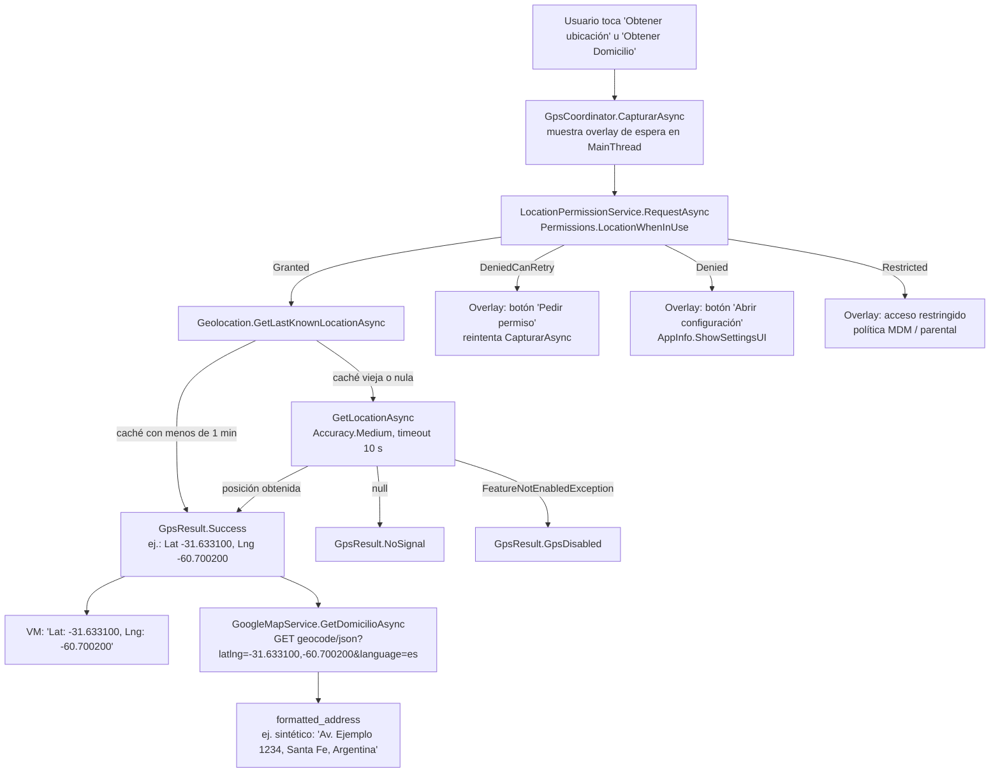

# GPS — geolocalización

> **Resumen ejecutivo**: `Ejemplo_Maui_GPS` es una app .NET MAUI (MVVM manual, sin toolkit) que captura la posición del dispositivo con `Geolocation` de MAUI Essentials, resuelve los permisos de ubicación en runtime con semántica unificada Android/iOS, muestra el estado (espera / permiso denegado / restringido) en un overlay reutilizable, y convierte coordenadas en un domicilio legible mediante la API REST de Google Geocoding. El resultado de cada captura es un `GpsResult` tipado (record sellado) sobre el que el ViewModel hace `switch`, sin `try/catch` ni chequeos manuales de permisos.

## Qué ilustra el proyecto

- **Geolocalización con API integrada**: `Geolocation.GetLastKnownLocationAsync()` como vía rápida (caché) y `GetLocationAsync(GeolocationRequest)` como fix nuevo solo si la última posición tiene más de 1 minuto (`Services/GpsService.cs:43-48`). No requiere NuGet adicional: es parte de MAUI Essentials (`Ejemplo_Maui_GPS.csproj:82-83`).
- **Capa de permisos encapsulada**: `LocationPermissionService` traduce `Permissions.LocationWhenInUse` a un enum propio `LocationPermissionResult` (`Granted` / `DeniedCanRetry` / `Denied` / `Restricted`) que unifica los matices de Android (rationale, "no volver a preguntar") e iOS (denegado, restringido por MDM) — `Services/LocationPermissionService.cs`, `Services/LocationPermissionResult.cs:6-11`.
- **Resultado tipado en vez de excepciones**: `GpsResult` (record abstracto con 8 casos sellados: `Success`, `PermissionDenied(CanRetry)`, `PermissionRestricted`, `GpsDisabled`, `NotSupported`, `NoSignal`, `Cancelled`, `Failure`) — `Services/GpsResult.cs:7-14`.
- **Coordinador singleton dueño del overlay**: `GpsCoordinator` es el punto único de entrada (`CapturarAsync`), posee el `GpsOverlayViewModel` y el `CancellationTokenSource`; cualquier caller (VM, code-behind, deep link) obtiene overlay automático — `Services/GpsCoordinator.cs:10-26`.
- **Overlay reutilizable como `ContentView`**: `Controls/GpsStatusOverlayView.xaml` con panel de espera (gif `satelite.gif`) y panel de permisos con botones "Pedir permiso" / "Abrir configuración" / "Cerrar" (`:32-35`); la página lo enlaza con `BindingContext="{Binding Overlay}"` (`Pages/MainPage.xaml:32`).
- **Geocodificación inversa vía REST**: `GoogleMapService.GetDomicilioAsync(lat, lng)` llama a `maps.googleapis.com/maps/api/geocode/json` con `HttpClient` y devuelve el `formatted_address` (`Services/GoogleMapService.cs:16-41`), con la API key fuera del repo (patrón `ApiKeys.cs` ignorado por git + `ApiKeys.cs.template` versionado).
- **Acciones complementarias**: abrir la posición en Google Maps con `Browser.Default.OpenAsync` (`ViewModels/MainPageViewModel.cs:68-69`) e ir a los ajustes de la app con `AppInfo.ShowSettingsUI()` (`Services/LocationPermissionService.cs:43`).

## Estructura y proceso clave

Capas (registradas en DI en `MauiProgram.cs:32-42`; servicios singleton, VM y página transient):

```
LocationPermissionService → LocationPermissionResult (enum)
        │
GpsService                → permiso + lectura → GpsResult (record sellado)
        │
GpsCoordinator (singleton)→ dueño del overlay + CancellationTokenSource
        │
MainPageViewModel         → texto/comandos; escucha Overlay.IsVisible
        │
MainPage.xaml + GpsStatusOverlayView (ContentView reutilizable)
```

Proceso completo — permisos → posición → geocodificación inversa — narrado con **coordenadas sintéticas de ejemplo** (`-31.633100, -60.700200`):



Narración: el usuario toca **Obtener Domicilio**; el coordinador muestra el overlay de espera y pide el permiso. Concedido, `GpsService` intenta primero la última posición conocida; si es fresca (menos de 1 minuto) la devuelve sin encender el GPS, si no pide un fix nuevo con precisión `Medium` y timeout de 10 s (`Services/GpsService.cs:43-48`). Con `Success(-31.633100, -60.700200)` (valores sintéticos), el VM llama a `GetDomicilioAsync`, que consulta a Google y muestra el domicilio formateado en pantalla (`ViewModels/MainPageViewModel.cs:101-114`). En cualquier rama de denegación, el coordinador enciende el panel de permisos del overlay (`Services/GpsCoordinator.cs:56-70`) y el VM solo traduce el resultado a texto (`ViewModels/MainPageViewModel.cs:83-97`).

## Cómo ejecutar

Guía general de build/despliegue de la solución: [build-and-run](../../07-operations/build-and-run.md).

Específico de esta pieza:

1. **Crear `Services/ApiKeys.cs`** copiando `Services/ApiKeys.cs.template` y reemplazando `REEMPLAZAR_CON_TU_API_KEY` por una key de Google Geocoding ([cómo obtenerla](https://developers.google.com/maps/documentation/geocoding/get-api-key)). Sin este archivo **el proyecto no compila**, porque `GoogleMapService` referencia `ApiKeys.GoogleMaps` como constante (`Services/GoogleMapService.cs:11`). El archivo real está ignorado por git; no subirlo.
2. **Targets**: `net10.0-android` siempre; `net10.0-ios` solo compilando en macOS. No hay target Windows (`Ejemplo_Maui_GPS.csproj:4-5,23`). Mínimos: Android API 25, iOS 15.0 (`:25-26`).
3. **Dispositivo/emulador**: en emulador Android usar la ubicación simulada de Extended Controls; el `uses-feature` con `required="false"` permite instalar incluso sin hardware GPS (`Platforms/Android/AndroidManifest.xml:32`).
4. Botones de la página: *Obtener ubicación* (coordenadas), *Cancelar* (cancela el token del coordinador), *Mostrar en mapa* (abre Google Maps en el navegador), *Prueba* (captura desde code-behind vía coordinador) y *Obtener Domicilio* (geocodificación inversa) — `Pages/MainPage.xaml:15-26`.

## Permisos y su justificación

| Plataforma | Permiso / clave | Estado | Justificación | Fuente |
|---|---|---|---|---|
| Android | `ACCESS_FINE_LOCATION` | Declarado | Coordenadas precisas por GPS; requerido por `Permissions.LocationWhenInUse` | `Platforms/Android/AndroidManifest.xml:14` |
| Android | `ACCESS_COARSE_LOCATION` | Declarado | Acompañante obligatorio de FINE desde API 31 (el usuario puede conceder solo aproximada) | `Platforms/Android/AndroidManifest.xml:20` |
| Android | `ACCESS_BACKGROUND_LOCATION` | **Comentado** | Solo para 2.º plano; en Android 10+ se pide separado del de 1.er plano. El ejemplo captura solo en foreground | `Platforms/Android/AndroidManifest.xml:26` |
| Android | `uses-feature location.gps required="false"` | Declarado | Permite instalar en dispositivos sin GPS (tablets wifi-only) | `Platforms/Android/AndroidManifest.xml:32` |
| iOS | `NSLocationWhenInUseUsageDescription` | Declarado | **Obligatorio** para ubicación en 1.er plano: sin la clave la app crashea al pedir ubicación | `Platforms/iOS/Info.plist:64-65` |
| iOS | `NSLocationAlwaysAndWhenInUseUsageDescription` | Declarado | Solo se necesita para 2.º plano (Always); está declarado aunque el ejemplo no lo usa | `Platforms/iOS/Info.plist:66-67` |

**Flujo de solicitud en runtime** (`Services/LocationPermissionService.cs:13-41`):

1. `Permissions.CheckStatusAsync<LocationWhenInUse>()` — si ya está `Granted`, no se muestra diálogo.
2. `Permissions.RequestAsync<LocationWhenInUse>()` — abre el diálogo del SO (en iOS solo la primera vez; en Android con "no volver a preguntar" retorna `Denied` sin diálogo).
3. Si sigue denegado, `Permissions.ShouldShowRationale<LocationWhenInUse>()` — **solo bajo `#if ANDROID`** (`:35-37`): `true` → `DeniedCanRetry` (el overlay ofrece "Pedir permiso"); `false` → `Denied` (el overlay ofrece "Abrir configuración" vía `AppInfo.ShowSettingsUI()`, `:43`). `PermissionStatus.Restricted` (iOS, MDM/control parental) mapea a `Restricted`.

## Snippets canónicos

### 1. Flujo de permisos en runtime con semántica unificada

> Fuente: `Ejemplos_Devices/GPS/Ejemplo_Maui_GPS/Services/LocationPermissionService.cs#L13–L41` @24d611d · Demuestra: solicitud de `LocationWhenInUse` con distinción Android (`ShouldShowRationale`) / iOS, normalizada en un enum propio.

Precondiciones: permisos declarados en manifest/plist; llamada desde contexto con Activity/escena activa. Resultado: `LocationPermissionResult` con 4 casos accionables por la UI.

```csharp
public async Task<LocationPermissionResult> RequestAsync()
{
    var status = await Permissions.CheckStatusAsync<Permissions.LocationWhenInUse>();

    if (status == PermissionStatus.Granted)
        return LocationPermissionResult.Granted;

    // Solicita el permiso al SO. En iOS solo abre el diálogo la primera vez;
    // en Android con "no volver a preguntar" retorna Denied sin diálogo.
    status = await Permissions.RequestAsync<Permissions.LocationWhenInUse>();

    if (status == PermissionStatus.Granted)
        return LocationPermissionResult.Granted;

    if (status == PermissionStatus.Restricted)
        return LocationPermissionResult.Restricted;

    // ShouldShowRationale solo existe en Android:
    //   true  → denegado sin "no volver a preguntar": se puede reintentar
    //   false → denegado con "no volver a preguntar" (o primera vez): hay que ir a ajustes
    // En iOS no aplica → siempre Denied (forzar ajustes).
    bool puedeReintentar = false;
#if ANDROID
    puedeReintentar = Permissions.ShouldShowRationale<Permissions.LocationWhenInUse>();
#endif
    return puedeReintentar
        ? LocationPermissionResult.DeniedCanRetry
        : LocationPermissionResult.Denied;
}
```

### 2. Lectura de posición: caché primero, fix nuevo después, excepciones → resultado tipado

> Fuente: `Ejemplos_Devices/GPS/Ejemplo_Maui_GPS/Services/GpsService.cs#L43–L67` @24d611d · Demuestra: `GetLastKnownLocationAsync` como fast-path (si la caché tiene <1 min), `GetLocationAsync` con `Medium`/10 s como fallback, y el mapeo de cada excepción de Essentials a un caso de `GpsResult`.

Precondiciones: permiso ya resuelto como `Granted` (región anterior del método, `#L17–L31`). Resultado: `GpsResult.Success | NoSignal | Cancelled | GpsDisabled | NotSupported | Failure`.

```csharp
    var location = await Geolocation.GetLastKnownLocationAsync();
    if (!(location != null && (DateTimeOffset.Now - location.Timestamp) < TimeSpan.FromMinutes(1)))
    {
        var req = new GeolocationRequest(GeolocationAccuracy.Medium, TimeSpan.FromSeconds(10));
        location = await Geolocation.GetLocationAsync(req, ct);
    }

    return location is null  ? new GpsResult.NoSignal() : new GpsResult.Success(location);
}
catch (OperationCanceledException)
{
    return new GpsResult.Cancelled();
}
catch (FeatureNotEnabledException)
{
    return new GpsResult.GpsDisabled();
}
catch (FeatureNotSupportedException)
{
    return new GpsResult.NotSupported();
}
catch (Exception ex)
{
    return new GpsResult.Failure(ex.Message);
}
```

### 3. Coordinador: overlay automático + cancelación centralizada

> Fuente: `Ejemplos_Devices/GPS/Ejemplo_Maui_GPS/Services/GpsCoordinator.cs#L28–L51` @24d611d · Demuestra: punto único de captura que enciende el overlay en `MainThread`, encadena el `CancellationToken` del caller y garantiza ocultar el overlay ante excepción.

Precondiciones: `GpsCoordinator` registrado singleton en DI (`MauiProgram.cs:34`); el overlay enlazado en la página. Resultado: `GpsResult` para el caller; el overlay refleja el estado sin que el caller lo maneje.

```csharp
public async Task<GpsResult> CapturarAsync(CancellationToken ct = default)
{
    _cts?.Cancel();
    _cts?.Dispose();
    _cts = ct == default ? new CancellationTokenSource() : CancellationTokenSource.CreateLinkedTokenSource(ct);

    await MainThread.InvokeOnMainThreadAsync(Overlay.ShowBusy);
    try
    {
        var result = await _gps.ObtenerUbicacionAsync(_cts.Token);
        await MainThread.InvokeOnMainThreadAsync(() => Aplicar(result));
        return result;
    }
    catch
    {
        await MainThread.InvokeOnMainThreadAsync(Overlay.Hide);
        throw;
    }
    finally
    {
        _cts?.Dispose();
        _cts = null;
    }
}
```

### 4. Geocodificación inversa contra Google Geocoding

> Fuente: `Ejemplos_Devices/GPS/Ejemplo_Maui_GPS/Services/GoogleMapService.cs#L16–L41` @24d611d · Demuestra: REST con `HttpClient.GetFromJsonAsync`, `CultureInfo.InvariantCulture` para formatear lat/lng (evita coma decimal en es-AR) y manejo de `status`/`error_message` de la API.

Precondiciones: `Services/ApiKeys.cs` creado desde el template con key válida; conectividad. Resultado: `formatted_address` en español, o mensaje de error legible (nunca lanza).

```csharp
public async Task<string> GetDomicilioAsync(double latitude, double longitude)
{
    try
    {
        var lat = latitude.ToString(CultureInfo.InvariantCulture);
        var lng = longitude.ToString(CultureInfo.InvariantCulture);
        var url = $"{GeocodeUrl}?latlng={lat},{lng}&key={ApiKey}&language=es";

        var response = await _httpClient.GetFromJsonAsync<GeocodeResponse>(url);

        if (response is null)
            return "Sin respuesta del servicio";

        if (!string.Equals(response.Status, "OK", StringComparison.OrdinalIgnoreCase))
            return $"Error: {response.Status} - {response.ErrorMessage}";

        if (response.Results is { Length: > 0 })
            return response.Results[0].FormattedAddress ?? "Domicilio no disponible";

        return "Domicilio no encontrado";
    }
    catch (Exception ex)
    {
        return $"Error al obtener domicilio: {ex.Message}";
    }
}
```

## Puntos de extensión

- **Seguimiento continuo**: el ejemplo captura una única posición por demanda. Para tracking, extender `GpsService` con `Geolocation.Default.StartListeningForegroundAsync(ListeningRequest)` + evento `LocationChanged`. El terreno ya está preparado: `ACCESS_BACKGROUND_LOCATION` está comentado en el manifest listo para habilitar (recordar que en Android 10+ se pide separado, `Platforms/Android/AndroidManifest.xml:22-26`) y `NSLocationAlwaysAndWhenInUseUsageDescription` ya está en el plist (`Platforms/iOS/Info.plist:66-67`). `Ejemplo_Docs_GPS/servicio.md` documenta alternativas para que un servicio de fondo dispare el overlay.
- **Precisión**: la ruta activa usa `GeolocationAccuracy.Medium` (`Services/GpsService.cs:46`); en `#L36–L41` hay comentada una variante directa con `GeolocationAccuracy.Best` (sin fast-path de caché) para cuando importe más la exactitud que la latencia/batería. También puede parametrizarse la ventana de frescura de la caché (hoy fija en 1 minuto, `:44`).
- **Timeout**: existe `DefaultTimeout = 15 s` declarado (`Services/GpsService.cs:8`) pero la ruta activa usa 10 s hardcodeados (`:46`); unificar en una opción configurable (por ejemplo, inyectada en el constructor o por `GeolocationRequest` recibido como parámetro) es una mejora directa. La cancelación por usuario ya está resuelta vía `GpsCoordinator.Cancelar()` (`Services/GpsCoordinator.cs:53`).

## Observaciones

- **Bug latente confirmado**: el setter de `Domicilio` escribe sobre el backing field equivocado — `set => SetProperty(ref _coordenadas, value)` en vez de `ref _domicilio` (`ViewModels/MainPageViewModel.cs:22-26`). Además, `ObtenerDominicilioAsync` asigna el domicilio a `Coordenadas` (`:108`), por lo que el `Label` enlazado a `Domicilio` (`Pages/MainPage.xaml:25`) nunca muestra nada: la dirección aparece en el label de coordenadas.
- Typo en el nombre del comando: `ObtenerDominicilioCommand` / `ObtenerDominicilioAsync` ("Dominicilio") — funciona porque XAML y VM comparten el typo (`ViewModels/MainPageViewModel.cs:99`, `Pages/MainPage.xaml:26`).
- `TestService` está registrado en DI (`MauiProgram.cs:35`) pero ningún componente lo consume: solo delega en `GpsService` y es el caso de referencia de `Ejemplo_Docs_GPS/servicio.md` (el botón "Prueba" usa el coordinador directamente desde code-behind, `Pages/MainPage.xaml.cs:21-25`).
- El comentario del `Info.plist` "Permisos necesarios para la captura de medios" (`:56`) es un resto de copy-paste de otro dominio; las claves que siguen son de ubicación.
- La key de Google viaja como query string (`&key=...`) hacia la API; el patrón de gestión (clase estática ignorada por git + `.template` versionado, elegido entre 5 opciones) está desarrollado en `Ejemplo_Docs_GPS/secret.md`.
- Sin `NSLocationWhenInUseUsageDescription` la app **crashea** en iOS al pedir ubicación; es el gotcha número uno del dominio (`Platforms/iOS/Info.plist:60-65`).

## Preguntas guía

1. ¿Por qué `GpsService` devuelve un `GpsResult` tipado en lugar de lanzar excepciones, y qué gana el ViewModel con el `switch` exhaustivo?
2. ¿Qué diferencia práctica hay entre `DeniedCanRetry` y `Denied`, y por qué esa distinción solo existe en Android (`ShouldShowRationale` bajo `#if ANDROID`)?
3. ¿Por qué `GetLastKnownLocationAsync` primero y `GetLocationAsync` después? ¿Qué se sacrifica y qué se ahorra con la ventana de frescura de 1 minuto?
4. ¿Qué problemas resuelve que `GpsCoordinator` sea singleton y dueño del overlay, frente a que cada página maneje su propio estado de espera y permisos?
5. ¿Por qué `GetDomicilioAsync` formatea lat/lng con `CultureInfo.InvariantCulture`? ¿Qué pasaría con la URL en un dispositivo configurado en es-AR sin eso?
6. ¿Qué habría que cambiar (permisos, claves, API) para pasar de captura puntual en foreground a tracking en segundo plano?

## Referencias

- Índice del dominio: [ia-db/indexes/04_GPS.md](../../../../ia-db/indexes/04_GPS.md)
- Fuente de la pieza: `Ejemplos_Devices/GPS/Ejemplo_Maui_GPS/` (material documental citable del dominio: `Ejemplos_Devices/GPS/Ejemplo_Docs_GPS/` — `Readme.md`, `secret.md`, `servicio.md`)
- Mapa del sistema: [system-map](../../00-overview/system-map.md)
- Docs oficiales: [Geolocation en .NET MAUI](https://learn.microsoft.com/dotnet/maui/platform-integration/device/geolocation) · [Google Geocoding API key](https://developers.google.com/maps/documentation/geocoding/get-api-key)
