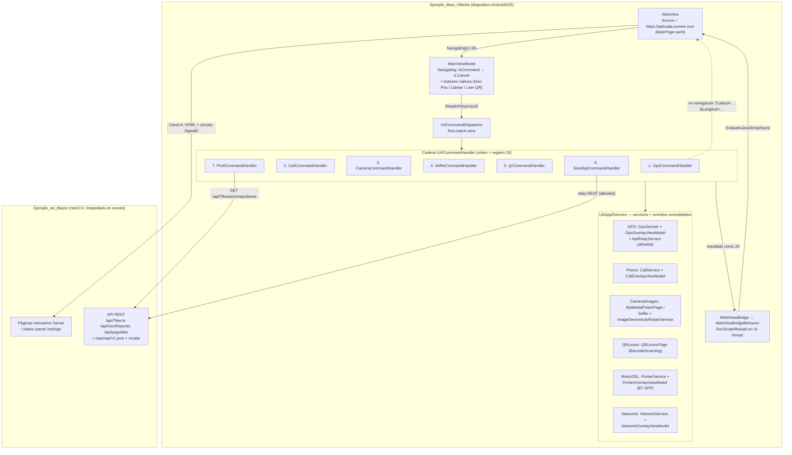
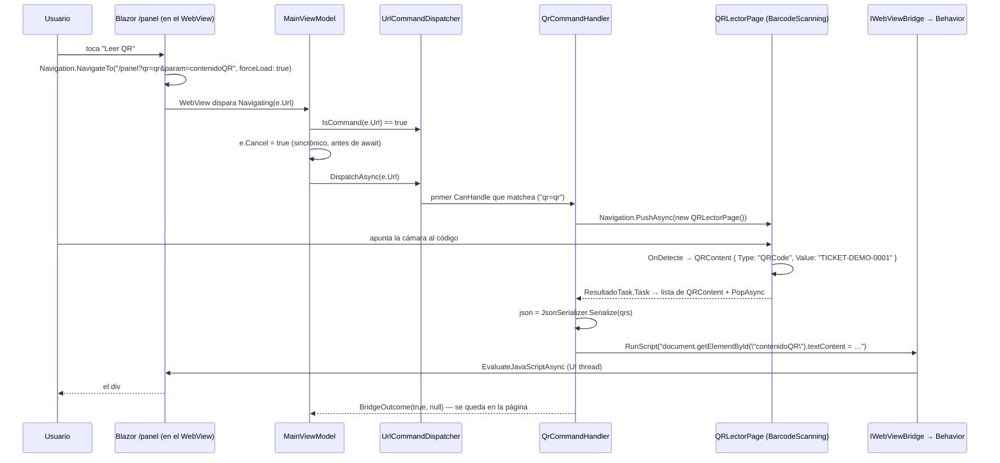

# Integrada — app híbrida

> **Resumen ejecutivo**: el dominio **Integrada** es el ejemplo insignia de la solución: una app .NET MAUI (`Ejemplo_Maui_Hibrida`) que hospeda un `WebView` estándar apuntando a una web remota Blazor (`Ejemplo_ws_Blazor`, publicada en `https://aplicada.somee.com`) y le expone **todos** los dispositivos nativos (GPS, llamada, cámara, selfie, lector QR, relay REST e impresión térmica Bluetooth) mediante un **puente de comandos por URL**: la web navega a una URL "marcada" (`?qr=qr&param=…`, `?action=print`, …), la app intercepta el evento `Navigating`, cancela la navegación y despacha a una cadena de `IUrlCommandHandler` (*first-match-wins*); el resultado vuelve al DOM por inyección de JavaScript, por re-navegación con query params, o queda como efecto nativo puro con overlay. Cada dispositivo reutiliza el patrón de su ejemplo aislado (servicio tipado + overlay que hereda de `StatusOverlayViewModel`), consolidado bajo `LibApp/Devices/`. El backend, además de las páginas interactivas, sirve el comprobante imprimible (`PrintDocument` JSON para MotorDSL) y recibe la geolocalización relayada.

## Piezas y roles

| Pieza | Rol | SDK / target | Paquetes clave | Fuente |
|---|---|---|---|---|
| `Ejemplo_Maui_Hibrida` | Contenedor MAUI: hospeda un `WebView` estándar (no `BlazorWebView`) sobre la web remota, intercepta la navegación y consolida los dispositivos en `LibApp/` | `Microsoft.NET.Sdk` · `net10.0-android` (+ `net10.0-ios` sólo compilando en macOS; sin target Windows) · MAUI 10.0.80 | CommunityToolkit.Maui 14.2.0 + Camera 6.1.0, CommunityToolkit.Mvvm 8.4.2, BarcodeScanning.Native.Maui 3.0.4, MetadataExtractor 2.9.0, SkiaSharp 3.119.2, **MotorDsl.\* 1.0.13** (7 paquetes) | `Ejemplos_Devices/Integrada/Ejemplo_Maui_Hibrida/Ejemplo_Maui_Hibrida.csproj#L4–L5,L94,L102–L125` |
| `Ejemplo_ws_Blazor` | Backend de ejemplo: Blazor Interactive Server (circuito SignalR) + controllers API REST + OpenAPI/Scalar; sirve el comprobante imprimible y recibe la geolocalización | `Microsoft.NET.Sdk.Web` · `net10.0` | Microsoft.AspNetCore.OpenApi 10.0.8, Scalar.AspNetCore 2.14.14 | `Ejemplos_Devices/Integrada/Ejemplo_ws_Blazor/Ejemplo_ws_Blazor.csproj#L1–L13` |

Sobre el mismo `WebView` conviven **dos canales independientes** (análisis completo en `Ejemplos_Devices/Docs/web-hibrida/maui-hibrido.md`):

- **Canal A — interactividad**: la web Blazor funciona como en cualquier navegador (circuito SignalR de Interactive Server). No es responsabilidad de la app.
- **Canal B — dispositivos**: URLs marcadas interceptadas en `Navigating`. Es el corazón de esta pieza y está especificado máquina-legible en [bridge-contract.md](bridge-contract.md).

## Arquitectura



El patrón, en cuatro piezas:

1. **Intercepción**: `MainPage.xaml` cablea el `WebView` con dos `EventToCommandBehavior` (`Navigating`/`Navigated`) hacia `MainViewModel` y una `WebViewBridgeBehavior` (`Pages/MainPage.xaml#L27–L38`). En `Navigating`, `IsCommand(url)` decide **sincrónicamente** si cancelar (`e.Cancel = true` debe fijarse antes del primer `await`) y `DispatchAsync` ejecuta el comando (`ViewModels/MainViewModel.cs#L77–L89`).
2. **Despacho abierto/cerrado**: `UrlCommandDispatcher` recorre los handlers registrados y delega en el **primero** cuyo `CanHandle(url)` matchea; sin `switch` por comando (`LibApp/UrlCommands/UrlCommandDispatcher.cs#L17–L26`). El orden de registro en DI es el orden de evaluación (`MauiProgram.cs#L106–L116`).
3. **Resultado tipado**: cada handler devuelve un `BridgeOutcome(bool CancelNavigation, string? NavigateTo)` (`LibApp/UrlCommands/BridgeOutcome.cs#L5`). Tres formas de responder a la web: inyectar JS y quedarse (cámara, selfie, QR, sendApi), re-navegar con query params (sólo GPS), o efecto nativo puro con overlay (llamada, impresión).
4. **WebView desacoplado**: los handlers nunca tocan el control; piden `RunScript(js)`/`Reload()` al singleton `WebViewBridge` (sólo dispara eventos, `LibApp/CustomWebView/Behaviors/WebViewBridge.cs#L5–L12`) y la `WebViewBridgeBehavior` los traduce a `EvaluateJavaScriptAsync`/`Reload` siempre en UI thread (`WebViewBridgeBehavior.cs#L61–L64`).

Los overlays de GPS/Red/Llamada se dibujan **encima** del `WebView` (el orden de declaración es la prioridad visual) y el `WebView` sólo es visible si el overlay de Red está oculto, para no mostrar la página de error del navegador (`Pages/MainPage.xaml#L22–L48`). Además hay botones nativos de pie de página que disparan el mismo protocolo sin pasar por la web (`Volver`, `Geo Pos`, `Llamar`, `Leer QR` — `MainPage.xaml#L50–L55`, `MainViewModel.cs#L43–L70`).

## Proceso clave de punta a punta

Caso narrado: **leer un QR desde la web**. El usuario abre `/panel` en la web y toca el botón "Leer QR". Datos sintéticos: el QR escaneado contiene `TICKET-DEMO-0001`.



Narración: la página Blazor no sabe nada de MAUI; sólo navega a una URL con el marcador `qr=qr&param=contenidoQR` (`Ejemplo_ws_Blazor/Components/Pages/Panel.razor#L261–L265`). La app cancela esa navegación (la URL nunca llega al servidor), abre el lector nativo (`QrCommandHandler.cs#L38–L40`), espera el `TaskCompletionSource` de la página (`QRLectorPage.xaml.cs#L11,L128–L134`) y devuelve la lista completa serializada con `System.Text.Json` — a prueba de comillas — al `textContent` del elemento indicado por `param` (`QrCommandHandler.cs#L45–L47`). La web decide si toma `[0].Value` o itera. El mismo esqueleto (marcador → handler → página/servicio nativo → `RunScript`) aplica a foto, selfie y sendApi; GPS responde re-navegando con `Latitud`/`Longitud` y print/llamada terminan en overlay nativo. El flujo completo de impresión (caso testigo con backend) está diagramado en el índice ia-db §6 y el catálogo completo de comandos en [bridge-contract.md](bridge-contract.md).

## Reutilización de los dominios aislados

Cada dispositivo se consolidó como subcarpeta de `LibApp/Devices/<X>/` (con sus `Models/Services/ViewModels/Pages`), conservando el patrón del ejemplo aislado: **servicio de alto nivel que devuelve resultados tipados (records sellados) + overlay VM que hereda de la base común** `Common/ViewModels/StatusOverlayViewModel.cs` (estados `None/Busy/Error` + `OverlayAction`).

| Dominio | En la híbrida (`LibApp/Devices/…`) | Ejemplo aislado de origen (`Ejemplos_Devices/…`) | Doc de pieza |
|---|---|---|---|
| GPS | `GPS/` — `GpsService`, `GpsOverlayViewModel`, modelos `GpsResult`/`LocationPermissionResult` (+ `ApiRelayService`, relay REST con allowlist) | `GPS/Ejemplo_Maui_GPS` | [../gps/README.md](../gps/README.md) |
| Cámara | `Camera/Pages/` — `MyMediaPickerPage`, `MyMediaSelfiePickerPage` (captura con callback) | `Camera/Ejemplo_Photo_MiMediaPicker_Callback*` | `../camera/README.md` *(pieza aún sin documentar)* |
| Imágenes | `Images/` — `IImageService`, `ImageDeviceAutoRotateService` (normalización EXIF con MetadataExtractor + SkiaSharp), `SelfieMaskDrawable` | `Camera/…_Normalizacion` | `../camera/README.md` *(pieza aún sin documentar)* |
| Teléfono | `Phone/` — `CallService`, `CallOverlayViewModel`, `CallMode` (`Direct`/`Dialer`) | `Phone/Ejemplo_Maui_DirectCall` · `Ejemplo_Maui_Dialer` | `../phone/README.md` *(pieza aún sin documentar)* |
| QR | `QRLector/` — `QRLectorPage` + `QRContent` (BarcodeScanning.Native.Maui) | `QR/BSN.LectorQR*` | `../qr/README.md` *(pieza aún sin documentar)* |
| Red | `Networks/` — `NetworkService`, `NetworkOverlayViewModel`, `NetworkResult` | `Red/Ejemplo_Maui_Connectivity` | [../red/README.md](../red/README.md) |
| Impresión térmica | `MotorDSL/` — `PrinterService`, `BluetoothPermissions`, `PrinterOverlayViewModel`, DTOs `PrintDocument/PrintNode/PrintStyle/N` | `Printer/Ejemplo_MotorDSL` · `Ejemplo_MotorDSL_Dialog` · `Ejemplo_ThermalPrinter` | `../printer/README.md` *(carpeta creada, README pendiente)* |

> La trazabilidad dominio→aislado proviene del índice ia-db 08 §5; en la híbrida se verificó que los servicios (`GpsService`, `PrinterService`, `CallOverlayViewModel`, `QRLectorPage`, etc.) replican el patrón (p. ej. `PrinterService` se autodocumenta como "espejo de CallService/GpsService", `LibApp/Devices/MotorDSL/Services/PrinterService.cs#L6–L9`).

## Cómo ejecutar

Guía general de build/despliegue de la solución: [build-and-run](../../07-operations/build-and-run.md).

Específico de esta pieza (son **dos** proyectos que deben estar vivos a la vez):

1. **Backend** (`Ejemplo_ws_Blazor`): `dotnet run` levanta `http://localhost:5284` (perfil `http`) o `https://localhost:8080;http://localhost:5284` (perfil `https`) — `Properties/launchSettings.json#L4–L21`. Con el backend arriba quedan disponibles `/panel` (dispara todos los comandos), `/scalar` (UI de la API) y `/api/Tikects/comprobante`.
2. **App híbrida** (`Ejemplo_Maui_Hibrida`): compilar/desplegar a Android (target único por defecto; iOS sólo en macOS; sin Windows — `csproj#L4–L5,L23`). La app arranca apuntando a la web publicada `https://aplicada.somee.com`, hardcodeada en `Pages/MainPage.xaml.cs#L17`.
3. **Para apuntar la app a un backend local**: el WebView del dispositivo no ve el `localhost` de la PC; usar un dev tunnel (hay uno de ejemplo comentado en `MainPage.xaml.cs#L15`) o IP de LAN — el manifest ya declara `usesCleartextTraffic="true"` + `networkSecurityConfig` (`Platforms/Android/AndroidManifest.xml#L8–L9`). Además hay que ajustar los hosts fijos: endpoint del comprobante (`PrintCommandHandler.cs#L16`) y allowlist del relay (`ApiRelayService.cs#L14–L17`, hoy sólo `geolocate.somee.com`).
4. **Hardware**: cámara para foto/selfie/QR, GPS, SIM para llamada directa y una impresora térmica Bluetooth SPP (58 mm) para `action=print` — la impresión es **sólo Android** (`PrinterService.cs#L20–L26`).

## Permisos y su justificación

Consolidación de los permisos de **todos** los dominios aislados en un único manifest — verificado contra `Platforms/Android/AndroidManifest.xml` real. La consolidación fue por agregado de bloques (se nota en duplicados literales y tres bloques `<queries>` separados; ver Observaciones).

| Plataforma | Permiso / clave | Dominio que lo exige | Justificación | Fuente |
|---|---|---|---|---|
| Android | `ACCESS_FINE_LOCATION` | GPS (comando `coordenadas`) y escaneo BT | Coordenadas precisas; también requerido por el discover Bluetooth clásico | `AndroidManifest.xml#L16` (duplicado `#L88`) |
| Android | `ACCESS_COARSE_LOCATION` | GPS | Acompañante obligatorio de FINE desde API 31 | `#L22` (duplicado `#L89`) |
| Android | `ACCESS_BACKGROUND_LOCATION` | — | **Comentado**: el ejemplo sólo captura en foreground | `#L28` |
| Android | `uses-feature location.gps required="false"` | GPS | Instalable en dispositivos sin GPS | `#L34` |
| Android | `ACCESS_NETWORK_STATE` | Red (`NetworkService`/overlay de conectividad) | Estado de conectividad del SO | `#L40` (duplicado `#L76`) |
| Android | `INTERNET` | WebView + relay REST + GET del comprobante | Todo el Canal A y B remoto | `#L77` |
| Android | `CALL_PHONE` | Teléfono (comando `phone`) | Llamada **directa** (`Intent.ActionCall`) sin marcador; sólo `CallMode.Direct` | `#L47` |
| Android | `READ_PHONE_STATE` | Teléfono | Estado de telefonía | `#L49` |
| Android | `<queries>` intent `DIAL`/`tel` | Teléfono | Visibilidad de paquetes (Android 11+) para el modo `Dialer` | `#L55–L60` |
| Android | `CAMERA` | Cámara/Selfie/QR | Captura y escaneo | `#L66` |
| Android | `RECORD_AUDIO` | Cámara (CommunityToolkit.Maui.Camera) | Requerido por el toolkit de cámara | `#L67` |
| Android | `<queries>` intent `IMAGE_CAPTURE` | Cámara | Visibilidad del intent de captura | `#L69–L73` |
| Android | `BLUETOOTH` + `BLUETOOTH_ADMIN` | Impresión térmica | API legacy < Android 12 | `#L80–L81` |
| Android | `BLUETOOTH_SCAN` (`neverForLocation`) + `BLUETOOTH_CONNECT` | Impresión térmica | Discover + conexión SPP en Android 12+ (los pide `BluetoothPermissions` en runtime) | `#L83–L85` |
| Android | `<queries>` intent `REQUEST_ENABLE` (BT) | Impresión térmica | Poder pedir encender el Bluetooth | `#L91–L95` |
| Android | `usesCleartextTraffic="true"` + `networkSecurityConfig` | Infra WebView | Permite backends http de prueba (dev tunnels/LAN) | `#L8–L9` |
| Android | `uses-sdk min 25 / target 36` | — | Base de plataforma | `#L98` |
| iOS | `NSCameraUsageDescription` | Cámara/Selfie/QR | Obligatoria: sin la clave la app crashea al abrir cámara | `Platforms/iOS/Info.plist#L59–L60` |
| iOS | `NSLocationWhenInUseUsageDescription` | GPS | Obligatoria para `Permissions.LocationWhenInUse` | `#L63–L64` |
| iOS | `LSApplicationQueriesSchemes` = `tel` | Teléfono | Habilita `PhoneDialer` (esquema `tel:`) | `#L67–L70` |

Contraste con los dominios aislados: la híbrida reúne en un solo manifest lo que cada ejemplo aislado declara por separado (ubicación como en `Ejemplo_Maui_GPS`, `CALL_PHONE`+queries como en los ejemplos de Phone, cámara/audio como en los de Camera/QR, y el bloque Bluetooth completo como en los de Printer). En iOS **no** hay claves de Bluetooth: coherente con que la impresión BT Classic SPP es Android-only (`PrinterService.cs#L20–L26`).

## Snippets canónicos

### 1. Interceptor de navegación: cancelar sincrónico, despachar async

> Fuente: `Ejemplos_Devices/Integrada/Ejemplo_Maui_Hibrida/ViewModels/MainViewModel.cs#L77–L89` @24d611d · Demuestra: el punto único donde el Canal B se dispara — `IsCommand` (sincrónico) fija `e.Cancel` **antes** de cualquier `await`; `DispatchAsync` ejecuta; si el outcome trae `NavigateTo` (rama GPS) se re-navega reasignando `Url`.

Precondiciones: `EventToCommandBehavior` de `Navigating` cableado en `MainPage.xaml#L31–L33`; dispatcher y handlers registrados en DI. Resultado: URLs de comando nunca llegan al servidor; URLs normales navegan igual.

```csharp
[RelayCommand]
private async Task Navigating(WebNavigatingEventArgs e)
{
    if (_dispatcher.IsCommand(e.Url))
        e.Cancel = true;   // sincrónico: cancelar ANTES de cualquier await

    var outcome = await _dispatcher.DispatchAsync(e.Url);

    if (outcome.NavigateTo is not null)
        Url = outcome.NavigateTo;

    IsRefreshing = false;
}
```

### 2. Despacho first-match-wins sobre el contrato

> Fuente: `Ejemplos_Devices/Integrada/Ejemplo_Maui_Hibrida/LibApp/UrlCommands/UrlCommandDispatcher.cs#L14–L26` @24d611d · Demuestra: el loop abierto/cerrado — sin `switch` por comando; el primer `CanHandle` que matchea gana; si ninguno matchea, la navegación sigue normal devolviendo la misma URL.

Precondiciones: handlers inyectados como `IEnumerable<IUrlCommandHandler>` (el orden lo da el registro en DI). Resultado: `BridgeOutcome` del handler ganador, o `(false, url)` para navegación normal.

```csharp
// Permite cancelar la navegación de forma sincrónica, antes de cualquier await.
public bool IsCommand(string url) => _handlers.Any(h => h.CanHandle(url));

public async Task<BridgeOutcome> DispatchAsync(string url)
{
    foreach (var handler in _handlers)
    {
        if (handler.CanHandle(url)) return await handler.HandleAsync(url);
    }

    // Ningún comando matchea: navegación normal.
    return new BridgeOutcome(false, url);
}
```

### 3. Registro en DI: el orden ES la prioridad

> Fuente: `Ejemplos_Devices/Integrada/Ejemplo_Maui_Hibrida/MauiProgram.cs#L106–L116` @24d611d · Demuestra: agregar un comando = 1 clase + 1 línea acá; la posición en la lista define el orden de evaluación (relevante si dos marcadores conviven en la misma URL, p. ej. `phone` + `sendApi`).

Precondiciones: ninguna especial. Resultado: los 7 handlers y el dispatcher disponibles como singletons.

```csharp
#region handlers
// Comandos de URL: el orden de registro = orden de evaluación.
builder.Services.AddSingleton<IUrlCommandHandler, GpsCommandHandler>();
builder.Services.AddSingleton<IUrlCommandHandler, CallCommandHandler>();
builder.Services.AddSingleton<IUrlCommandHandler, CameraCommandHandler>();
builder.Services.AddSingleton<IUrlCommandHandler, SelfieCommandHandler>();
builder.Services.AddSingleton<IUrlCommandHandler, QrCommandHandler>();
builder.Services.AddSingleton<IUrlCommandHandler, SendApiCommandHandler>();
builder.Services.AddSingleton<IUrlCommandHandler, PrintCommandHandler>();        
builder.Services.AddSingleton<UrlCommandDispatcher>();
#endregion
```

### 4. Handler representativo: QR — página nativa + TaskCompletionSource + inyección JSON

> Fuente: `Ejemplos_Devices/Integrada/Ejemplo_Maui_Hibrida/LibApp/UrlCommands/Handlers/QrCommandHandler.cs#L20–L49` @24d611d · Demuestra: el esqueleto típico de un comando con UI nativa — `CanHandle` por `Contains`, `param` como id del elemento DOM destino, espera del resultado con `TaskCompletionSource`, y respuesta serializada con `System.Text.Json` (id y payload) para no romper el JS.

Precondiciones: URL con `qr=qr&param={idElemento}` (p. ej. la que emite `Panel.razor#L263`); permiso de cámara concedido. Resultado: `#idElemento.textContent` recibe la lista completa de códigos leídos, serializada.

```csharp
public bool CanHandle(string url) =>
    url.Contains("qr=qr", StringComparison.OrdinalIgnoreCase);

public async Task<BridgeOutcome> HandleAsync(string url)
{
    var targetId = GetQueryValue(url, "param");
    if (string.IsNullOrEmpty(targetId))
        return new BridgeOutcome(true, null);

    // Navegar al lector y esperar la lista con TaskCompletionSource.
    // …
    var destinoPage = new QRLectorPage();
    await Application.Current.Windows[0].Page.Navigation.PushAsync(destinoPage);
    List<QRContent> qrs = await destinoPage.ResultadoTask.Task;
    var qr = qrs.FirstOrDefault();

    // Inyectar la LISTA COMPLETA serializada (a prueba de comillas vía JsonSerializer):
    // la página Blazor decide si toma [0].Value o itera.
    var json = JsonSerializer.Serialize(qrs);
    string scriptjs = $"document.getElementById({JsonSerializer.Serialize(targetId)}).textContent = {JsonSerializer.Serialize(json)};";
    _bridge.RunScript(scriptjs);

    return new BridgeOutcome(true, null);     // se queda en la página
}
```

### 5. El camino de vuelta al DOM: bridge desacoplado en UI thread

> Fuente: `Ejemplos_Devices/Integrada/Ejemplo_Maui_Hibrida/LibApp/CustomWebView/Behaviors/WebViewBridgeBehavior.cs#L61–L64` @24d611d · Demuestra: el único lugar que toca el control — la behavior traduce los eventos del `IWebViewBridge` a acciones imperativas, siempre en `MainThread`, fire-and-forget.

Precondiciones: `WebViewBridgeBehavior Bridge="{Binding WebBridge}"` en el XAML y `BindingContext` propagado a mano a la behavior (gotcha documentado en `WebViewBridgeBehavior.cs#L22–L27`: la behavior no está en el árbol visual y sin propagación el binding queda null **sin error visible**). Resultado: cualquier handler puede responder al DOM sin conocer el `WebView`.

```csharp
// SIEMPRE en UI thread, fire-and-forget.
private void OnReloadRequested(object? sender, EventArgs e)  => MainThread.BeginInvokeOnMainThread(() => _webView?.Reload());

private void OnScriptRequested(object? sender, string js) => MainThread.BeginInvokeOnMainThread(() => _ = _webView?.EvaluateJavaScriptAsync(js));
```

## Puntos de extensión

Cómo agregar un comando nuevo de punta a punta (ejemplo sintético: `vibrar=vibrar&ms=500`):

1. **Definir el marcador**: un par `clave=clave` inconfundible en el query string (la convención vigente duplica la clave como valor: `qr=qr`, `photo=photo`). Parámetros adicionales van como pares normales (`param`, `ms`, …).
2. **Crear el handler** en `LibApp/UrlCommands/Handlers/VibrateCommandHandler.cs` implementando `IUrlCommandHandler` (`LibApp/UrlCommands/IUrlCommandHandler.cs#L5–L9`): `CanHandle` con `url.Contains("vibrar=vibrar", StringComparison.OrdinalIgnoreCase)` y `HandleAsync` parseando con el helper `GetQueryValue` (hoy copiado en cada handler; ver Observaciones).
3. **Elegir la forma de respuesta** (`BridgeOutcome`):
   - inyectar JS y quedarse: pedir `IWebViewBridge` por constructor y `_bridge.RunScript(...)` + `return new BridgeOutcome(true, null);` — serializar id y payload con `JsonSerializer` como hace `QrCommandHandler.cs#L45–L46`;
   - re-navegar con datos: `return new BridgeOutcome(true, urlReescrita);` (patrón GPS, `GpsCommandHandler.cs#L22–L28`);
   - efecto nativo puro: overlay propio y `return new BridgeOutcome(true, null);` (patrón llamada/impresión).
4. **Si necesita un dispositivo nuevo**: crear `LibApp/Devices/<X>/` con `Services` (resultados tipados como records sellados) y un `<X>OverlayViewModel : StatusOverlayViewModel` para permisos/errores; registrar ambos en `MauiProgram.AddServices`.
5. **Registrar el handler**: una línea `builder.Services.AddSingleton<IUrlCommandHandler, VibrateCommandHandler>();` en `MauiProgram.cs` — **la posición define la prioridad**; ubicarlo antes de cualquier handler cuyo marcador pueda solaparse en la misma URL.
6. **Declarar permisos**: Android en `Platforms/Android/AndroidManifest.xml`, iOS en `Platforms/iOS/Info.plist` (clave de uso obligatoria o crash).
7. **Consumirlo desde la web**: `Navigation.NavigateTo($"/panel?vibrar=vibrar&ms=500", forceLoad: true)` (el `forceLoad: true` es clave: fuerza una navegación real del browser, interceptable por el WebView — así lo hacen todos los botones de `Panel.razor`). Si devuelve datos, proveer el elemento DOM destino con id estable.
8. **Probar sin la web** (opcional): un botón nativo que llame `_dispatcher.DispatchAsync("vibrar=vibrar&ms=500")` directo, como `TakeQR` (`MainViewModel.cs#L50–L54`).
9. **Documentarlo**: agregar la fila al catálogo de [bridge-contract.md](bridge-contract.md).

## Observaciones

- **MotorDsl 1.0.13 vs 1.0.12 — verificado**: la híbrida referencia los 7 paquetes `MotorDsl.*` en **1.0.13** (`Ejemplo_Maui_Hibrida.csproj#L119–L125`), igual que el aislado `Printer/Ejemplo_MotorDSL_Dialog` (`csproj#L90–L96`), mientras que el aislado `Printer/Ejemplo_MotorDSL` sigue en **1.0.12** (`csproj#L85–L91`). El índice ia-db 08 (§8) sólo consigna 1.0.13 para la híbrida; la divergencia real está entre los dos ejemplos aislados de Printer.
- **Perfiles MotorDSL registrados vs. usados**: `MauiProgram.cs#L54–L60` registra perfiles `thermal_58mm`/`a4-pdf`/`pdf`, pero `PrintCommandHandler` construye inline su propio `DeviceProfile("58HB6", 32, "escpos-bitmap")` con capacidades bitmap (`PrintCommandHandler.cs#L39–L42`); los perfiles del DI no participan del flujo de impresión del puente.
- **Manifest consolidado por agregado**: hay permisos duplicados literalmente (`ACCESS_FINE_LOCATION` L16 y L88, `ACCESS_COARSE_LOCATION` L22 y L89, `ACCESS_NETWORK_STATE` L40 y L76) y tres bloques `<queries>` separados — huella de haber copiado los bloques de cada ejemplo aislado. Inocuo para el build, pero conviene deduplicar.
- **Comentarios de código desactualizados** (detalle en [bridge-contract.md](bridge-contract.md) §Divergencias): el doc-comment de `SendApiCommandHandler` menciona `tipoRequest=` pero el parámetro real es `httpMethod`; el de `QrCommandHandler` dice que la lista vacía "no inyecta", pero el chequeo está comentado y hoy inyecta `[]` también al cancelar.
- **Hosts somee duales**: la web y el comprobante viven en `aplicada.somee.com` (`MainPage.xaml.cs#L17`, `PrintCommandHandler.cs#L16`), pero la allowlist del relay y el destino del sendApi de `Panel.razor` usan `geolocate.somee.com` (`ApiRelayService.cs#L14–L17`, `Panel.razor#L252`). No hay configuración en el repo que mapee qué despliegue corresponde a cada host (no verificado; presumiblemente dos publicaciones del mismo backend).
- **Valores hardcodeados de prueba**: número de llamada `3434807427` (`CallCommandHandler.cs#L11`), endpoint del comprobante y allowlist. Candidatos obvios a configuración.
- **`GetQueryValue` duplicado**: el helper de parseo de query está copiado idéntico en cada handler (decisión consciente de no usar `HttpUtility`, según índice 08 §4.2); un refactor natural es extraerlo a una clase compartida.
- **Bug conocido de iOS (Canal A)**: el circuito SignalR de Interactive Server no se sostiene en WKWebView sobre el hosting gratuito — la web se ve pero los `@onclick` mueren. Diagnóstico completo en `Ejemplos_Devices/Docs/web-hibrida/maui-hibrido.md` (§7). No reproducido en este relevamiento (no verificado aquí).
- **Enlaces a piezas hermanas**: al día de esta revisión sólo existen los README de `gps`, `red` y `maps` en este repo de docs; los de `camera`, `phone`, `qr` y `printer` figuran en la tabla de reutilización como pendientes.
- **Navegaciones normales re-asignan `Url`**: para URLs sin comando el dispatcher devuelve `(false, url)` y `MainViewModel` reasigna `Url = outcome.NavigateTo` (`MainViewModel.cs#L83–L86`), manteniendo la propiedad sincronizada con la ubicación real del WebView.
- **Carpeta muerta excluida**: `LibApp/Devices/MotorDSL/NewFolder/**` está excluida de la compilación (`csproj#L83–L90`).

## Preguntas guía

1. ¿Por qué un `WebView` estándar y no `BlazorWebView`/`HybridWebView`? ¿Qué gana el patrón de URL marcada en portabilidad (funciona con cualquier web, no sólo Blazor) y qué pierde (sin canal de mensajes bidireccional nativo)?
2. ¿Qué pasa si dos marcadores conviven en la misma URL (p. ej. `phone=phone&sendApi=…`)? ¿Quién gana y por qué? (pista: `Panel.razor#L185–L194` lo documenta).
3. ¿Por qué `e.Cancel` debe fijarse antes del primer `await` y cómo lo garantiza la separación `IsCommand`/`DispatchAsync`?
4. ¿Cuáles son las tres formas de devolver un resultado a la web y cuándo conviene cada una?
5. ¿Qué garantiza que el JS inyectado no rompa el DOM ni habilite inyección? ¿Dónde es estricta la serialización y dónde quedan bordes (ver Divergencias del contrato)?
6. ¿Cómo llevarías a configuración los valores hardcodeados (número de teléfono, endpoint de comprobante, allowlist de hosts)?
7. ¿Qué habría que tocar para que el comando `print` acepte el id del documento por URL (`action=print&id=…`) en lugar del endpoint fijo?
8. ¿Por qué el overlay de Red oculta el WebView en vez de dejar que el navegador muestre su página de error?

## Referencias

- Índice ia-db (fuente primaria del relevamiento): [08_App-Hibrida-Integrada.md](../../../../ia-db/indexes/08_App-Hibrida-Integrada.md)
- Contrato máquina-legible del puente + endpoints: [bridge-contract.md](bridge-contract.md)
- Mapa del sistema: [system-map](../../00-overview/system-map.md)
- Fuentes (repo `Ejemplos_Maui_Devices` @24d611d):
  - `Ejemplos_Devices/Integrada/Ejemplo_Maui_Hibrida/` (app: `MauiProgram.cs`, `ViewModels/MainViewModel.cs`, `LibApp/UrlCommands/`, `LibApp/Devices/`, `LibApp/CustomWebView/`, `Platforms/Android/AndroidManifest.xml`, `Platforms/iOS/Info.plist`)
  - `Ejemplos_Devices/Integrada/Ejemplo_ws_Blazor/` (backend: `Program.cs`, `Controllers/`, `Components/Pages/`, `DTOs/Print/`)
- Docs de dominio citables: `Ejemplos_Devices/Docs/web-hibrida/` (`maui-hibrido.md`, `lectura-qr.md`, `captura-foto.md`, `llamada.md`, `envio-api.md`)
- Índice hermano de impresión térmica: `ia-db/indexes/03_Impresion-Termica.md`
