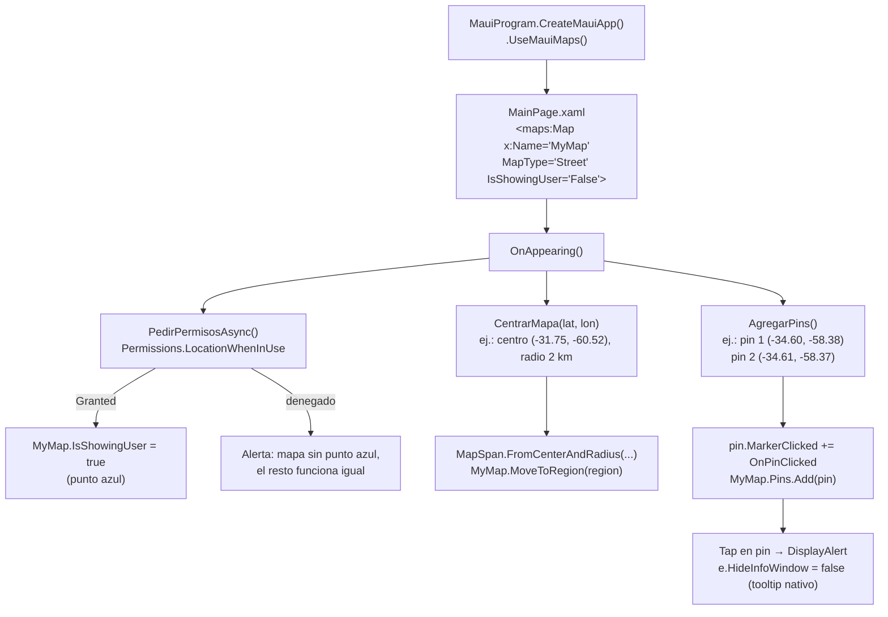

# Maps — mapa nativo

> **Resumen ejecutivo**: `Ejemplo_Maui_Mapas` es una app didáctica .NET MAUI (perfil `mobile-app`, sin MVVM: toda la lógica vive en el code-behind de la página) que muestra el control de mapa nativo `Microsoft.Maui.Controls.Maps` (NuGet 10.0.40): inicialización con `.UseMauiMaps()`, pines con `Pin`/`PinType.Place` y evento `MarkerClicked`, centrado por región con `MapSpan.FromCenterAndRadius` + `MoveToRegion`, cambio de `MapType` (Street/Satélite) y punto azul del usuario (`IsShowingUser`) condicionado al permiso de ubicación en tiempo de ejecución. En Android el control renderiza con Google Maps SDK y **requiere una API key propia**; en iOS usa MapKit (sin key); el target Windows compila pero no tiene soporte de mapa configurado.

## Qué ilustra el proyecto

- **Habilitar el control Map en el builder**: paquete `Microsoft.Maui.Controls.Maps` 10.0.40 (`Ejemplo_Maui_Mapas.csproj:79`) + `.UseMauiMaps()` en `MauiProgram.cs:12`. Sin esa llamada el handler del mapa no se registra.
- **Declarar el mapa en XAML** con el namespace `xmlns:maps="http://schemas.microsoft.com/dotnet/2021/maui/maps"` y el control `<maps:Map x:Name="MyMap">` con `MapType`, `IsShowingUser`, `IsScrollEnabled`, `IsZoomEnabled` (`Pages/MainPage.xaml:4,17-20`).
- **Pedir permiso de ubicación en runtime** (`Permissions.LocationWhenInUse` en `OnAppearing`) y, solo si fue concedido, activar `MyMap.IsShowingUser = true` (punto azul). El mapa funciona igual sin permiso (`Pages/MainPage.xaml.cs:24-35`).
- **Centrar el mapa por región**: `MapSpan.FromCenterAndRadius(Location, Distance.FromKilometers(r))` + `MoveToRegion` (`Pages/MainPage.xaml.cs:45-50`).
- **Agregar pines** (`Pin` con `Label`, `Address`, `Location`, `Type = PinType.Place`) y suscribir `MarkerClicked` para reaccionar al tap manteniendo el tooltip nativo (`e.HideInfoWindow = false`) (`Pages/MainPage.xaml.cs:52-85`).
- **Cambiar el tipo de mapa** desde botones: `MapType.Street` / `MapType.Satellite` (`Pages/MainPage.xaml.cs:87-89`) y saltar a una coordenada fija con "Mi lugar" (`Pages/MainPage.xaml.cs:91-97`).
- **Targets**: `net10.0-android` siempre; `net10.0-ios` solo compilando en macOS; `net10.0-windows10.0.19041.0` solo en Windows (`Ejemplo_Maui_Mapas.csproj:4-6`).

## Estructura y proceso clave

Archivos que importan para el dominio (raíz: `Ejemplos_Devices/Maps/Ejemplo_Maui_Mapas/`):

| Archivo | Rol |
|---|---|
| `MauiProgram.cs` | Registro de handlers de mapas con `.UseMauiMaps()` |
| `Pages/MainPage.xaml` | UI: botones de control + control `<maps:Map>` |
| `Pages/MainPage.xaml.cs` | Toda la lógica: permisos, centrado, pines, eventos |
| `Platforms/Android/AndroidManifest.xml` | API key de Google Maps, versión de Play Services y permisos |
| `Platforms/iOS/Info.plist` | `NSLocationWhenInUseUsageDescription` (MapKit, sin key) |
| `Ejemplo_Maui_Mapas.csproj` | Targets y paquete `Microsoft.Maui.Controls.Maps` |

Flujo de arranque de la página (las coordenadas son ilustrativas, redondeadas de las reales del código):



Además, los botones de la fila superior disparan en cualquier momento: `MapType.Street` / `MapType.Satellite` y un `MoveToRegion` a la coordenada fija de "Mi lugar".

## Cómo ejecutar

Procedimiento general de build/deploy de la solución: ver [build-and-run](../../07-operations/build-and-run.md).

**Requisito específico de este ejemplo (Android): API key de Google Maps.** El control Map en Android renderiza con Google Maps SDK y no muestra tiles sin una key válida:

1. **Obtenerla**: en Google Cloud Console, crear/elegir un proyecto, habilitar **Maps SDK for Android** y generar una credencial de tipo *API key*. Restringirla por aplicación Android (package name `com.ejemplos.devices.mapas` + huella SHA-1 del certificado de firma) para que no sea utilizable fuera de la app.
2. **Dónde va**: en `Platforms/Android/AndroidManifest.xml`, dentro de `<application>`, como `<meta-data android:name="com.google.android.geo.API_KEY" android:value="TU_API_KEY" />` (el manifest de este proyecto ya trae el `meta-data`; reemplazá el valor por tu propia key — no uses la que está versionada, ver [Observaciones](#observaciones)).
3. **Mecanismo recomendado del repo**: no versionar la key literal; usar la plantilla de ApiKeys con placeholder e inyección del valor real vía secrets de CI, según la guía de secretos del repo (`Ejemplos_Devices/GPS/Ejemplo_Docs_GPS/secret.md`).

Por plataforma:

- **Android** (target principal, `net10.0-android`, minSdk 25): requiere la API key anterior; emulador con Google Play Services o dispositivo físico.
- **iOS** (`net10.0-ios`, solo build en macOS): usa MapKit, **no requiere API key**; sí requiere la entrada `NSLocationWhenInUseUsageDescription` ya presente en `Info.plist`.
- **Windows** (`net10.0-windows10.0.19041.0`): el target existe pero el ejemplo no configura soporte de mapa (sin `MapServiceToken`); el foco es móvil.

## Permisos y su justificación

| Plataforma | Permiso / configuración | Obligatorio | Justificación | Fuente |
|---|---|---|---|---|
| Android | `meta-data com.google.android.geo.API_KEY` | Sí | Google Maps SDK no renderiza tiles sin key | `Platforms/Android/AndroidManifest.xml:10-11` |
| Android | `meta-data com.google.android.gms.version` | Sí | Declara la versión de Google Play Services que consume el SDK | `Platforms/Android/AndroidManifest.xml:13-14` |
| Android | `INTERNET`, `ACCESS_NETWORK_STATE` | Sí | Descarga de tiles del mapa | `Platforms/Android/AndroidManifest.xml:17-18` |
| Android | `ACCESS_FINE_LOCATION`, `ACCESS_COARSE_LOCATION` | Opcional | Solo para `IsShowingUser` (punto azul); sin ellos el mapa igual funciona | `Platforms/Android/AndroidManifest.xml:23-24` |
| iOS | `NSLocationWhenInUseUsageDescription` | Opcional* | Texto que ve el usuario al pedir ubicación ("Necesitamos tu ubicación para mostrarte en el mapa.") | `Platforms/iOS/Info.plist:32-33` |

\* Opcional para el mapa en sí, pero obligatorio si se pide ubicación: sin esa clave iOS rechaza el prompt de permiso.

En runtime, el code-behind chequea y pide `Permissions.LocationWhenInUse` en `OnAppearing`; si el estado final es `Granted` activa `MyMap.IsShowingUser = true`, y si no, muestra un `DisplayAlert` y sigue sin punto azul (`Pages/MainPage.xaml.cs:24-35`). Esto ilustra el patrón correcto: la funcionalidad sensible a permisos se degrada, no bloquea la página.

## Snippets canónicos

**1. Habilitar mapas en el builder**

```csharp
        var builder = MauiApp.CreateBuilder();
        builder
            .UseMauiApp<App>()
            .UseMauiMaps() 
            .ConfigureFonts(fonts =>
            {
                fonts.AddFont("OpenSans-Regular.ttf", "OpenSansRegular");
                fonts.AddFont("OpenSans-Semibold.ttf", "OpenSansSemibold");
            });
```

> Fuente: `Ejemplos_Devices/Maps/Ejemplo_Maui_Mapas/MauiProgram.cs#L9–L17` @24d611d · Demuestra: registro de los handlers del control Map con `.UseMauiMaps()`; sin esta llamada el `<maps:Map>` del XAML no tiene implementación nativa.

**2. El control Map en XAML**

```xml
    <maps:Map x:Name="MyMap" Grid.Row="1" MapType="Street" 
              IsShowingUser="False"
              IsScrollEnabled="True" 
              IsZoomEnabled="True" />
```

> Fuente: `Ejemplos_Devices/Maps/Ejemplo_Maui_Mapas/Pages/MainPage.xaml#L17–L20` @24d611d · Demuestra: declaración del mapa con tipo inicial `Street`, gestos habilitados y punto azul apagado por defecto (se enciende recién cuando el permiso se concede en runtime).

**3. Centrar el mapa por centro y radio**

```csharp
    private void CentrarMapa(double lat, double lon, double radioKm = 2)
    {
        var ubicacion = new Location(lat, lon);
        var region = MapSpan.FromCenterAndRadius( ubicacion,  Distance.FromKilometers(radioKm));
        MyMap.MoveToRegion(region);
    }
```

> Fuente: `Ejemplos_Devices/Maps/Ejemplo_Maui_Mapas/Pages/MainPage.xaml.cs#L45–L50` @24d611d · Demuestra: la forma idiomática de definir la región visible — `MapSpan.FromCenterAndRadius` con `Distance` en km — y aplicarla con `MoveToRegion`.

**4. Pines con evento MarkerClicked**

```csharp
    private void AgregarPins()
    {
        var pins = new[]
        {
            new Pin
            {
                Label = "Obelisco",
                Address = "Calle 25",
                Location = new Location(-34.6037, -58.3816),
                Type = PinType.Place
            },
            new Pin
            {
                Label = "Casa Rosada",
                Address = "Calle 33",
                Location = new Location(-34.6083, -58.3712),
                Type = PinType.Place
            }
        };

        foreach (var pin in pins)
        {
            pin.MarkerClicked += OnPinClicked;
            MyMap.Pins.Add(pin);
        }
    }
```

> Fuente: `Ejemplos_Devices/Maps/Ejemplo_Maui_Mapas/Pages/MainPage.xaml.cs#L52–L77` @24d611d · Demuestra: creación de `Pin` con `Label`/`Address`/`Location`/`PinType.Place`, suscripción a `MarkerClicked` por pin y alta en la colección `MyMap.Pins`.

## Puntos de extensión

- **`MapType`**: el ejemplo alterna `Street`/`Satellite` (`Pages/MainPage.xaml.cs:87-89`); el enum también ofrece `Hybrid`. Es el punto natural para un `Picker` en lugar de botones.
- **Pines custom**: hoy los pines se crean a mano en code-behind. Extensiones típicas: poblar `Map.ItemsSource` + `ItemTemplate` desde una colección bindeable (camino hacia MVVM), o personalizar el ícono del marcador vía handlers por plataforma.
- **Eventos**: además de `Pin.MarkerClicked` (usado en `Pages/MainPage.xaml.cs:79-85`) están `Pin.InfoWindowClicked` (tap en el tooltip) y `Map.MapClicked` (tap en el mapa, útil para agregar pines donde toca el usuario). El flag `e.HideInfoWindow` permite decidir si el tooltip nativo se muestra u oculta tras el tap.
- **Elementos de mapa**: la colección `Map.MapElements` admite `Polyline`, `Polygon` y `Circle` para dibujar rutas y zonas — no está usado en este ejemplo.
- **Región inicial dinámica**: `CentrarMapa(lat, lon, radioKm)` ya está parametrizado; combinarlo con `Geolocation` (dominio GPS del repo) para centrar en la posición real del usuario es la extensión más didáctica.

## Observaciones

- **[SEGURIDAD — hallazgo confirmado] API key de Google Maps hardcodeada y versionada** en `Ejemplos_Devices/Maps/Ejemplo_Maui_Mapas/Platforms/Android/AndroidManifest.xml` (líneas 10–11, `meta-data com.google.android.geo.API_KEY` con el valor literal en `android:value`). Riesgo: cualquiera con acceso al repositorio puede extraer y usar la key (consumo de cuota, facturación, abuso de servicio), y el historial de git la conserva aunque se borre. Acción recomendada: **rotar la key en Google Cloud Console, restringirla** (package name + SHA-1) y migrar al mecanismo que el propio repo documenta para secretos: plantilla de ApiKeys con placeholder + inyección del valor real mediante secrets de CI (guía `Ejemplos_Devices/GPS/Ejemplo_Docs_GPS/secret.md`). El valor de la key no se reproduce en este documento de forma deliberada.
- **Drift índice↔código (Readmes invertidos)**: el índice `05_Mapas.md` afirma que la nota útil (link a docs MS + nombre del NuGet) está en `Ejemplo_Docs_Maps/Readme.md` y que `Ejemplo_Maui_Mapas/Readme.md` está vacío. En el código es exactamente al revés: `Ejemplo_Docs_Maps/Readme.md` está vacío y la nota vive en `Ejemplo_Maui_Mapas/Readme.md` (líneas 2–5). El contenido existe; solo cambió de lugar respecto de lo indexado.
- **La región inicial no contiene los pines**: `OnAppearing` centra en (-31.749788, -60.520532) —zona Paraná/Oro Verde, Entre Ríos— con radio 2 km, pero los pines están en CABA (Obelisco y Casa Rosada, a ~450 km). Al abrir la app los pines no se ven hasta alejar el zoom o desplazarse; es un detalle didáctico a tener en cuenta al probar. Los `Address` de los pines ("Calle 25", "Calle 33") son texto de relleno, no direcciones reales.
- **Sin MVVM ni DI de dominio**: toda la lógica está en `Pages/MainPage.xaml.cs`; no hay servicios ni ViewModels. Es deliberado por simplicidad didáctica.
- **Dependencias de plataforma asimétricas**: Android depende de Google Maps SDK + Play Services (no funciona en emuladores sin Google Play); iOS usa MapKit sin key; Windows no tiene soporte de mapa configurado en este ejemplo.
- `OnAppearing` es `async void` (override); los errores dentro del flujo de permisos no burbujean a un caller — patrón aceptable en handlers de ciclo de vida, pero a tener presente si se extiende la lógica.

## Preguntas guía

1. ¿Qué dos cosas hay que agregar al proyecto para que `<maps:Map>` funcione, más allá del XAML? (NuGet `Microsoft.Maui.Controls.Maps` + `.UseMauiMaps()` en el builder.)
2. ¿Por qué Android necesita una API key y iOS no? ¿Dónde se declara en cada plataforma?
3. ¿Qué pasa si el usuario niega el permiso de ubicación? ¿Deja de funcionar el mapa? Trazalo en `PedirPermisosAsync`.
4. ¿Qué diferencia hay entre construir un `MapSpan` con grados (`new MapSpan(centro, 0.1, 0.1)`, ver bloque comentado en `MainPage.xaml.cs:37-43`) y con `FromCenterAndRadius`?
5. ¿Para qué sirve `e.HideInfoWindow` en `OnPinClicked` y qué se ve en pantalla con `false` vs `true`?
6. ¿Cómo versionarías la API key sin exponerla en el repo? Compará el estado actual del manifest con la guía de secretos del repo.

## Referencias

- Índice del dominio: [`05_Mapas.md`](../../../../ia-db/indexes/05_Mapas.md)
- Código fuente (pieza): `Ejemplos_Devices/Maps/Ejemplo_Maui_Mapas/` (repo `Ejemplos_Maui_Devices`)
- Nota citable del dominio (link a docs MS del control Map + NuGet): `Ejemplos_Devices/Maps/Ejemplo_Maui_Mapas/Readme.md`
- Mapa del sistema: [`system-map.md`](../../00-overview/system-map.md)
- Docs Microsoft del control Map: https://learn.microsoft.com/es-es/dotnet/maui/user-interface/controls/map?view=net-maui-10.0
