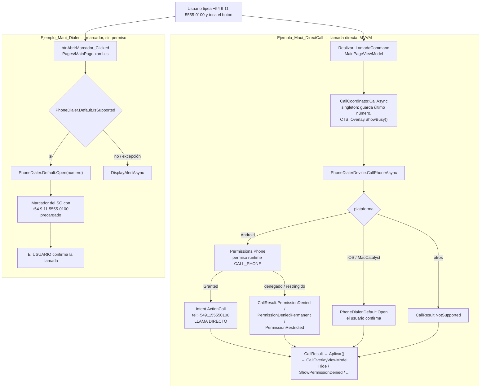

# Phone — telefonía

> **Resumen ejecutivo**: el dominio Phone contrasta las dos formas de llamar por teléfono desde .NET MAUI. `Ejemplo_Maui_Dialer` abre el **marcador del sistema** con el número precargado usando `PhoneDialer.Default.Open()` — el usuario confirma la llamada y por eso **no requiere ningún permiso**. `Ejemplo_Maui_DirectCall` inicia la **llamada directa** en Android con `Intent.ActionCall`, lo que exige el permiso runtime `CALL_PHONE` (sensible para Google Play) y una arquitectura MVVM completa: coordinador singleton, resultado tipado (`CallResult`) y overlay reutilizable para permisos/errores. En iOS no existe API de llamada directa, así que DirectCall cae al marcador. La lección central del dominio: **delegar la confirmación al usuario elimina el permiso; automatizarla lo exige**.

## Proyectos y técnica que ilustran

| Aspecto | `Ejemplo_Maui_Dialer` | `Ejemplo_Maui_DirectCall` |
|---|---|---|
| Técnica | `PhoneDialer.Default.Open()` / `.IsSupported` (MAUI Essentials) | Android: `Intent.ActionCall` nativo (`#if ANDROID`); iOS/MacCatalyst: cae a `PhoneDialer.Default.Open()`; otros: `NotSupported` |
| ¿Quién inicia la llamada? | El **usuario** (la app solo precarga el número en el marcador) | La **app** (en Android marca sin confirmación del usuario) |
| Permiso runtime | **Ninguno** — esa es la lección | `CALL_PHONE` vía `Permissions.Phone` (`PhoneDialerDevice.cs#L67–L87`) |
| Manifest Android | `INTERNET`, `ACCESS_NETWORK_STATE` + `<queries>` `ACTION_DIAL`/`tel` | Ídem + `CALL_PHONE`, `READ_PHONE_STATE`; `<queries>` `ACTION_VIEW`/`tel` |
| Arquitectura | Code-behind, `BindingContext = this`, sin DI propia | MVVM: `CallCoordinator` singleton + `PhoneDialerDevice` + `CallResult` (record sellado) + overlay; DI en `MauiProgram.AddServices()` |
| UX de error | `DisplayAlertAsync` (alertas simples) | Overlay reutilizable con botones "Pedir permiso" / "Reintentar" / "Abrir configuración" / "Cerrar" |
| Riesgos | Mínimos: sin permisos sensibles, el SO media todo | `CALL_PHONE` es permiso sensible (revisión de política en Google Play); llamada sin confirmación puede sorprender al usuario |
| minSdk Android | 25 (`Ejemplo_Maui_Dialer.csproj#L28`) | 21 (`Ejemplo_Maui_DirectCall.csproj#L26`) |
| Targets | `net10.0-android` (+ `net10.0-ios` solo en macOS); sin Windows | Ídem |

## Estructura y proceso clave

Archivos clave por proyecto (bajo `Ejemplos_Devices/Phone/`):

- **Ejemplo_Maui_Dialer/**: `Pages/MainPage.xaml(.cs)` (toda la lógica), `Platforms/Android/AndroidManifest.xml` (`<queries>` `ACTION_DIAL`).
- **Ejemplo_Maui_DirectCall/**: `Services/PhoneDialerDevice.cs` (plataforma), `Services/CallCoordinator.cs` (orquestación + overlay + cancelación), `Services/CallResult.cs` (resultado tipado), `ViewModels/CallOverlayViewModel.cs` + `Controls/CallPermissionOverlayView.xaml` (overlay), `ViewModels/MainPageViewModel.cs`, `MauiProgram.cs` (DI).

Flujo comparado (número sintético `+54 9 11 5555-0100`):



En DirectCall, todo cruce hacia la UI se marshala con `MainThread.InvokeOnMainThreadAsync` (`CallCoordinator.cs#L48,L53`), y el botón "Reintentar"/"Pedir permiso" del overlay reutiliza el **último número** guardado por el coordinador (`CallCoordinator.cs#L40, L77–L86`), por lo que el reintento funciona aunque el caller original ya no exista.

## Cómo ejecutar

Guía general de build/run del repositorio: [build-and-run](../../07-operations/build-and-run.md).

Atajos (desde la raíz de `Ejemplos_Maui_Devices`):

```powershell
# Marcador del sistema (requiere dispositivo/emulador API 25+)
dotnet build .\Ejemplos_Devices\Phone\Ejemplo_Maui_Dialer\Ejemplo_Maui_Dialer.csproj -f net10.0-android -t:Run

# Llamada directa (API 21+)
dotnet build .\Ejemplos_Devices\Phone\Ejemplo_Maui_DirectCall\Ejemplo_Maui_DirectCall.csproj -f net10.0-android -t:Run
```

Notas:
- El target `net10.0-ios` solo se agrega compilando en macOS (`csproj#L5` en ambos); no hay target Windows (`WindowsPackageType=None`).
- En emulador Android el marcador existe (ACTION_DIAL funciona), pero para observar la llamada directa real de DirectCall conviene un **dispositivo físico con SIM**; en tablets/simuladores sin telefonía el resultado esperado es `NotSupported`.
- Al probar, usá siempre números sintéticos (p. ej. `+54 9 11 5555-0100`): DirectCall **marca de verdad** apenas se concede el permiso.

## Permisos y su justificación

| Proyecto | Plataforma | Elemento | Justificación | Fuente |
|---|---|---|---|---|
| Dialer | Android | **Sin `CALL_PHONE`** | `ACTION_DIAL` no marca: abre el marcador y el usuario confirma → Android no exige permiso. Es la lección del dominio. | `Ejemplo_Maui_Dialer/Platforms/Android/AndroidManifest.xml#L10–L19` |
| Dialer | Android | `<queries>` intent `ACTION_DIAL` + `scheme=tel` | Visibilidad de paquetes (API 30+): sin esto, `PhoneDialer.IsSupported` no puede detectar la app de teléfono. No es un permiso. | `AndroidManifest.xml#L14–L19` |
| Dialer | Android | `INTERNET`, `ACCESS_NETWORK_STATE` | Plantilla MAUI estándar; no se usan para telefonía. | `AndroidManifest.xml#L10–L11` |
| Dialer | iOS | `LSApplicationQueriesSchemes` = `whatsapp`, `tg` (sin `tel`) | Resto de plantilla de otro dominio; no interviene en `PhoneDialer`. | `Ejemplo_Maui_Dialer/Platforms/iOS/Info.plist#L63–L67` |
| DirectCall | Android | `CALL_PHONE` (runtime, **sensible**) | Obligatorio para `Intent.ActionCall`: la app marca sin confirmación del usuario. Se pide en runtime vía `Permissions.Phone` con manejo de rationale/denegación permanente. Implica revisión de política en Google Play. | `Ejemplo_Maui_DirectCall/Platforms/Android/AndroidManifest.xml#L14` + `Services/PhoneDialerDevice.cs#L67–L87` |
| DirectCall | Android | `READ_PHONE_STATE` | Forma parte del grupo que `Permissions.Phone` de MAUI solicita cuando está declarado en el manifest. | `AndroidManifest.xml#L15` |
| DirectCall | Android | `<queries>` intent `ACTION_VIEW` + `scheme=tel` | Visibilidad de paquetes para resolver el intent `tel:`. | `AndroidManifest.xml#L17–L22` |
| DirectCall | iOS | **Sin permiso runtime** | iOS no expone llamada directa; se abre el marcador y el usuario confirma. El `Info.plist` **no** declara `LSApplicationQueriesSchemes` con `tel` (ver Observaciones). | `Ejemplo_Maui_DirectCall/Platforms/iOS/Info.plist` |

Contraste didáctico: **mismo objetivo (llamar), permisos opuestos**. El Dialer evita `CALL_PHONE` a propósito porque el SO media la acción; DirectCall lo necesita porque elimina esa mediación.

## Snippets canónicos

### 1. Dialer — abrir el marcador sin permisos

```csharp
async private void btnAbrirMarcador_Clicked(object sender, EventArgs e)
{
    if (string.IsNullOrWhiteSpace(Telefono))
    {
        await DisplayAlertAsync("Atención", "Ingresá un número de teléfono", "OK");
        return;
    }

    try
    {
        if (PhoneDialer.Default.IsSupported)
        {
            PhoneDialer.Default.Open(Telefono);
        }
        else
        {
            await DisplayAlertAsync("Error", "Este dispositivo no puede hacer llamadas", "OK");
        }
    }
    catch (FeatureNotSupportedException)
    {
        await DisplayAlertAsync("Error", "Este dispositivo no puede hacer llamadas.", "OK");
    }
    catch (Exception ex)
    {
        await DisplayAlertAsync("Error", $"No se pudo abrir el marcador: {ex.Message}", "OK");
    }
}
```

> Fuente: `Ejemplos_Devices/Phone/Ejemplo_Maui_Dialer/Pages/MainPage.xaml.cs#L26–L53` @24d611d · Demuestra: patrón completo de `PhoneDialer` — validar entrada, chequear `IsSupported`, abrir el marcador y degradar con alertas; sin ningún permiso runtime.

### 2. DirectCall — semántica del permiso `CALL_PHONE`

```csharp
private static async Task<CallResult?> PedirPermisoAndroidAsync(CancellationToken ct)
{
    var status = await Permissions.CheckStatusAsync<Permissions.Phone>();

    if (status == PermissionStatus.Granted) return null;
    if (status == PermissionStatus.Restricted) return new CallResult.PermissionRestricted();

    if (ct.IsCancellationRequested) return new CallResult.Cancelled();

    status = await Permissions.RequestAsync<Permissions.Phone>();

    if (status == PermissionStatus.Granted) return null;
    if (status == PermissionStatus.Restricted) return new CallResult.PermissionRestricted();

    // ShouldShowRationale==true => el SO sigue dispuesto a mostrar el diálogo.
    // ShouldShowRationale==false (post-deny) => "no volver a preguntar" → ajustes.
    var puedeReintentar = Permissions.ShouldShowRationale<Permissions.Phone>();
    return puedeReintentar
        ? new CallResult.PermissionDenied()
        : new CallResult.PermissionDeniedPermanent();
}
```

> Fuente: `Ejemplos_Devices/Phone/Ejemplo_Maui_DirectCall/Services/PhoneDialerDevice.cs#L67–L87` @24d611d · Demuestra: mapeo fino del estado del permiso a un resultado tipado — `null` = concedido, `Restricted` = política MDM/parental, y `ShouldShowRationale` para distinguir "reintentable" de "no volver a preguntar" (ir a ajustes).

### 3. DirectCall — llamada directa con `Intent.ActionCall`

```csharp
private static CallResult RealizarLlamadaAndroid(string numero)
{
    var activity = Platform.CurrentActivity;
    if (activity is null)
        return new CallResult.Failure("No hay actividad activa para iniciar la llamada.");

    using var intent = new Intent(Intent.ActionCall);
    intent.SetData(AndroidUri.Parse($"tel:{numero}"));
    intent.SetFlags(ActivityFlags.NewTask);
    activity.StartActivity(intent);
    return new CallResult.Success(numero);
}
```

> Fuente: `Ejemplos_Devices/Phone/Ejemplo_Maui_DirectCall/Services/PhoneDialerDevice.cs#L89–L100` @24d611d · Demuestra: la contracara del Dialer — `Intent.ActionCall` con URI `tel:` marca directo (sin confirmación del usuario), por eso exige `CALL_PHONE`; `numero` llega del `Entry` (usar siempre valores sintéticos como `+54 9 11 5555-0100` al probar).

### 4. DirectCall — manifest: permisos + visibilidad de paquetes

```xml
<uses-permission android:name="android.permission.ACCESS_NETWORK_STATE" />
<uses-permission android:name="android.permission.INTERNET" />

<!-- Para llamada directa (Intent.ActionCall) → SÍ necesita permiso -->
<uses-permission android:name="android.permission.CALL_PHONE" />
<uses-permission android:name="android.permission.READ_PHONE_STATE" />

<queries>
	<intent>
		<action android:name="android.intent.action.VIEW" />
		<data android:scheme="tel" />
	</intent>
</queries>
```

> Fuente: `Ejemplos_Devices/Phone/Ejemplo_Maui_DirectCall/Platforms/Android/AndroidManifest.xml#L10–L22` @24d611d · Demuestra: la declaración manifest que habilita la llamada directa (`CALL_PHONE` + `READ_PHONE_STATE`) y el bloque `<queries>` para resolver `tel:`; el manifest del Dialer, en cambio, no declara ninguno de los dos permisos y usa `ACTION_DIAL` en su `<queries>`.

## Puntos de extensión

- **Nuevos casos de resultado**: `CallResult` es un record abstracto con casos sellados (`Services/CallResult.cs#L6–L28`); agregar un caso (p. ej. línea ocupada, doble SIM) obliga a extender el `switch` de `CallCoordinator.Aplicar()` (`CallCoordinator.cs#L94–L120`) y un método `Show*` en el overlay.
- **Nuevos callers**: `CallCoordinator` está diseñado como punto único de entrada — "cualquier caller (página, comando, servicio, deep link)" (`CallCoordinator.cs#L5–L13`); al ser singleton con overlay propio, otro ViewModel puede inyectarlo y llamar `CallAsync()` sin duplicar UI de permisos.
- **Otras plataformas**: la rama `#else` de `CallPhoneAsync` (`PhoneDialerDevice.cs#L57–L61`) devuelve `NotSupported`; es el lugar para una estrategia alternativa (VoIP, Windows `tel:` URI).
- **Reutilizar el patrón overlay**: `CallOverlayViewModel` es el espejo del `GpsOverlayViewModel` del dominio GPS (índice 04); el par ContentView + VM con callbacks del coordinador es portable a cualquier permiso runtime.
- **Testabilidad**: `PhoneDialerDevice` se registra transient y sin interfaz (`MauiProgram.cs#L34`); extraer `IPhoneDialerDevice` permitiría testear `CallCoordinator` sin dispositivo.
- **iOS `tel` scheme**: si se agrega `CanOpenAsync`/detección previa en iOS, declarar `tel` en `LSApplicationQueriesSchemes` del `Info.plist` de DirectCall (hoy ausente).

## Observaciones

- **Drift comentario ↔ Info.plist (DirectCall)**: los comentarios de `PhoneDialerDevice.cs#L15–L16` y `#L41–L42` afirman que `tel` está en `LSApplicationQueriesSchemes` "ya declarado en este proyecto", pero el `Platforms/iOS/Info.plist` de DirectCall **no contiene esa clave**. El índice 06 ya lo señala; queda confirmado contra el código. (En iOS moderno `PhoneDialer.Open` con `tel:` no suele requerirla, pero el comentario está desactualizado.)
- **Restos de plantilla en Dialer**: su `Info.plist` declara `NSCameraUsageDescription` y `LSApplicationQueriesSchemes` con `whatsapp`/`tg` (`#L59–L67`), heredados de otro ejemplo; no se usan en telefonía.
- **Detalle menor índice ↔ código**: el flujo del índice 06 menciona `DisplayAlert`; el código usa `DisplayAlertAsync` (`MainPage.xaml.cs#L30,L42,L47,L51`). Sin impacto conceptual.
- **minSdk asimétrico sin justificación documentada**: Dialer exige API 25 y DirectCall API 21; no hay comentario en los csproj que explique la diferencia.
- **Números de teléfono**: no se encontraron números reales en los fuentes; el ejemplo de UI (`1155551234`, `Pages/MainPage.xaml#L13` en ambos proyectos) usa el prefijo ficticio 5555. Todos los números de este documento son sintéticos.
- **DI asimétrica intencional**: el `MauiProgram` del Dialer no registra nada (code-behind puro, `MauiProgram.cs#L6–L25`); el de DirectCall registra `PhoneDialerDevice` (transient), `CallCoordinator` (singleton, para compartir estado del overlay) y VM/Page (transient) (`MauiProgram.cs#L31–L46`). El contraste es parte de la didáctica del dominio.
- **Versionado de paquetes**: Dialer fija `Microsoft.Maui.Controls 10.0.60` explícito; DirectCall usa `$(MauiVersion)` — inconsistencia menor de estilo entre proyectos hermanos.

## Preguntas guía

1. ¿Por qué `Ejemplo_Maui_Dialer` no declara ni pide ningún permiso y `Ejemplo_Maui_DirectCall` necesita `CALL_PHONE`? ¿Qué rol juega la confirmación del usuario en esa diferencia?
2. En DirectCall sobre iOS, ¿qué significa exactamente `CallResult.Success` y en qué se diferencia del mismo resultado en Android?
3. El bloque `<queries>` de los manifests no es un permiso: ¿qué problema de Android 11+ resuelve y qué pasaría con `PhoneDialer.IsSupported` si faltara?
4. ¿Cómo distingue `PedirPermisoAndroidAsync` entre "denegado reintentable" y "denegado permanente", y a qué botones del overlay se traduce cada caso?
5. ¿Por qué `CallCoordinator` es singleton mientras `PhoneDialerDevice` y el ViewModel son transient? ¿Qué se rompería si el coordinador fuera transient?
6. ¿Qué implicancias de publicación en Google Play tiene declarar `CALL_PHONE` y cómo la evita deliberadamente el enfoque del Dialer?

## Referencias

- Patrón de overlays de dispositivo: [fundamento](../../01-architecture/07-overlays-dispositivos.md) · [catálogo de pantallas §4](../../01-architecture/08-pantallas-por-dispositivo.md#4-telefonía) — mensajes literales y las variantes inalcanzables detectadas

- Índice de dominio: [06_Telefonia.md](../../../../ia-db/indexes/06_Telefonia.md)
- Mapa del sistema: [system-map](../../00-overview/system-map.md)
- Fuentes (repo `Ejemplos_Maui_Devices` @24d611d):
  - `Ejemplos_Devices/Phone/Ejemplo_Maui_Dialer/Pages/MainPage.xaml.cs` · `Pages/MainPage.xaml` · `Platforms/Android/AndroidManifest.xml` · `Platforms/iOS/Info.plist` · `Ejemplo_Maui_Dialer.csproj`
  - `Ejemplos_Devices/Phone/Ejemplo_Maui_DirectCall/Services/PhoneDialerDevice.cs` · `Services/CallCoordinator.cs` · `Services/CallResult.cs` · `ViewModels/MainPageViewModel.cs` · `ViewModels/CallOverlayViewModel.cs` · `Controls/CallPermissionOverlayView.xaml` · `Pages/MainPage.xaml` · `MauiProgram.cs` · `Platforms/Android/AndroidManifest.xml` · `Platforms/iOS/Info.plist` · `Ejemplo_Maui_DirectCall.csproj`
