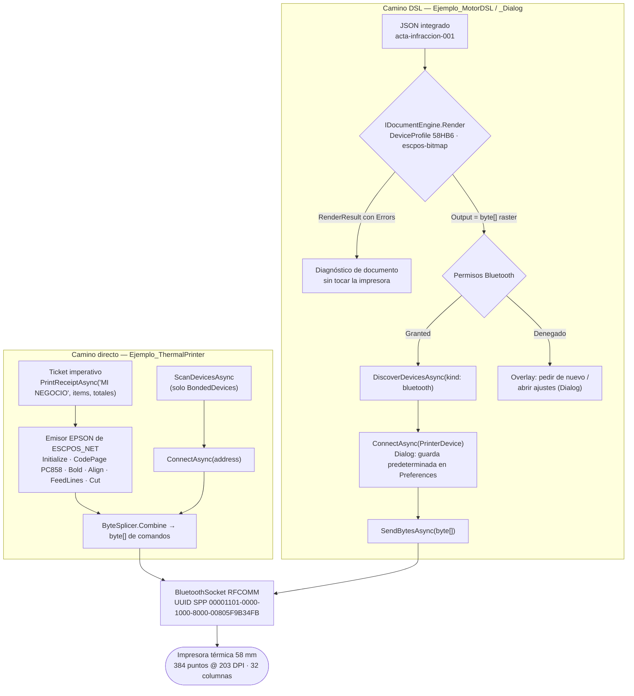

# Printer — impresión térmica Bluetooth

> **Resumen ejecutivo**: el dominio Printer reúne tres apps MAUI (`net10.0-android`) que imprimen sobre la misma impresora térmica 58 mm Bluetooth (modelo documentado 58HB6, protocolo ESC/POS, transporte Bluetooth Classic SPP) con dos filosofías contrapuestas. `Ejemplo_ThermalPrinter` emite comandos **ESC/POS directos** con `ESCPOS_NET 2.2.1` sobre un `BluetoothSocket` RFCOMM propio; `Ejemplo_MotorDSL` y `Ejemplo_MotorDSL_Dialog` delegan en el **motor DSL** (`MotorDsl.*`, 7 paquetes NuGet) que renderiza un **documento JSON declarativo a un raster ESC/POS (`byte[]`)** y recién después resuelve permisos, descubrimiento, conexión y envío. La variante Dialog agrega una capa MVVM con overlay de estado y resultados tipados. **Versiones de `MotorDsl.*` (verificadas en el árbol actual `@fd6a1ed`):** `Ejemplo_MotorDSL` está en **1.0.12** y `Ejemplo_MotorDSL_Dialog` en **1.0.13** — la misma que consume la app híbrida integrada. La divergencia se explica por el avance del origen durante la documentación (ver Observaciones y el [GAP-REPORT](../../../GAP-REPORT.md)).

## Proyectos y técnica que ilustran

| Proyecto | Técnica | Patrón UI | Paquetes de impresión | `ApplicationId` |
|---|---|---|---|---|
| `Ejemplo_ThermalPrinter` | **ESC/POS directo**: comandos imperativos construidos a mano con el emisor `EPSON` y enviados por socket SPP propio | Code-behind (`ContentPage`) | `ESCPOS_NET 2.2.1` (+ `BarcodeScanner.Mobile.Maui 9.0.1`) | `com.ejemplos.devices.ThermalPrinter` |
| `Ejemplo_MotorDSL` | **Motor DSL "puro"**: JSON integrado → `IDocumentEngine.Render` → raster ESC/POS; usa los controles `StatusBadge`/`DevicePicker` de `MotorDsl.Maui` | Code-behind + controles del paquete | `MotorDsl.*` **1.0.12** (×7) | `com.ejemplos.devices.MotorDSL` |
| `Ejemplo_MotorDSL_Dialog` | **Motor DSL + overlay**: mismo render, pero el flujo Bluetooth lo orquesta un ViewModel de overlay con resultados tipados y reintentos | **MVVM** (`CommunityToolkit.Mvvm 8.4.2`, `CommunityToolkit.Maui[.Core] 14.2.0`) | `MotorDsl.*` **1.0.13** (×7) | `com.ejemplos.devices.MotorDSL.Dialog` |

Los tres apuntan a `net10.0-android` (`net10.0-ios` solo compila en macOS), con `SupportedOSPlatformVersion` Android 25.0 y empaquetado `apk`. Los paquetes `MotorDsl.*` se referencian como `PackageReference` — no `ProjectReference` — justamente "para validar los paquetes publicados" (comentario en ambos `.csproj`).

La carpeta hermana `Ejemplo_Docs_Printer/` es **material documental del origen** (manuales de usuario/técnico ESC/POS/integración, prompts de generación y fotos de pruebas reales); se cita como fuente pero no es una pieza ejecutable.

Los siete paquetes del motor y su rol observado en el código:

| Paquete | Rol |
|---|---|
| `MotorDsl.Core` | Contratos y modelos: `IDocumentEngine`, `RenderResult`, `DeviceProfile` |
| `MotorDsl.Parser` | Parseo del JSON de documento al árbol de nodos |
| `MotorDsl.Rendering` | Renderers de salida (PDF, **ESC/POS bitmap**, SkiaSharp) |
| `MotorDsl.Extensions` | Azúcar DI: `AddMotorDslEngine()`, `AddProfiles(...)` |
| `MotorDsl.Printing.Abstractions` | `MotorDsl.Printing.IThermalPrinterService`, `PrinterDevice`, `SendBytesAsync` |
| `MotorDsl.Bluetooth` | Transporte BT Classic SPP (Android): `AddBluetoothPrinterTransport()` |
| `MotorDsl.Maui` | Integración MAUI: `AddMotorDslMaui()` + controles `StatusBadge`, `DevicePicker` |

## ESC/POS directo vs. motor DSL

| Dimensión | **Directo** (`Ejemplo_ThermalPrinter`) | **Motor DSL** (`Ejemplo_MotorDSL` / `_Dialog`) |
|---|---|---|
| Dependencia | `ESCPOS_NET 2.2.1` (emisor `EPSON`) | `MotorDsl.*` (7 paquetes): 1.0.12 en `Ejemplo_MotorDSL`, 1.0.13 en `_Dialog` |
| Transporte BT | Propio: `BluetoothSocket` RFCOMM con UUID SPP | `MotorDsl.Bluetooth` → `AddBluetoothPrinterTransport()` |
| Modelo del documento | Llamadas imperativas (`PrintTextAsync`, `PrintReceiptAsync`…) | **JSON declarativo** (`format: "integrated"`) → `IDocumentEngine.Render` |
| Salida | Comandos de texto/estilo combinados con `ByteSplicer.Combine` | **`byte[]` raster ESC/POS bitmap** (renderer `escpos-bitmap`) |
| Interfaz de servicio | `Ejemplo_ThermalPrinter.Services.IThermalPrinterService` (propia) | `MotorDsl.Printing.IThermalPrinterService` (del paquete) |
| Descubrimiento | `BluetoothAdapter.BondedDevices` (**solo emparejados**) | `DiscoverDevicesAsync(kind: "bluetooth")` |
| Imágenes / QR / barcode | QR y barcode **simplificados** (imprimen solo el dato como texto); imagen → `NotImplementedException` | Nodos `image` nativos del DSL: `bitmap` (base64) y `qrcode` (URL) |
| Codificación de texto | `CodePage(PC858_EURO)` (acentos, `€`, `ñ`) | Irrelevante para el consumidor: el texto viaja rasterizado |
| Acoplamiento a UI | Alto (toda la lógica en `MainPage.xaml.cs`) | Bajo: render independiente + servicio/overlay reutilizable |
| Diagnóstico de fallas | Un fallo de impresión mezcla documento + hardware | **Render primero**: un fallo de documento se detecta sin tocar la impresora |

Las dos interfaces llamadas `IThermalPrinterService` **no son intercambiables**: la propia del ejemplo directo expone `ScanDevicesAsync()/ConnectAsync(string address)/Print*Async(...)` sobre `BluetoothDevice { Name, Address, IsPaired }`; la del paquete expone `DiscoverDevicesAsync(kind)/ConnectAsync(PrinterDevice)/SendBytesAsync(byte[])`. La app directa **construye** los comandos; la app DSL **envía** bytes que ya produjo el motor.

**Cuándo elegir cada uno**:

- **ESC/POS directo**: para entender el protocolo a bajo nivel (inicialización, code pages, estilos, corte), para tickets simples de solo texto a 32 columnas, o cuando no se quiere depender de los paquetes del motor. Tené en cuenta las limitaciones reales del ejemplo: barcode/QR degradados a texto e imagen sin implementar.
- **Motor DSL**: cuando el comprobante tiene estructura (contenedores, alineaciones, negritas), necesita **bitmaps o QR reales**, o cuando el documento debe poder definirse/versionarse como dato (JSON) en lugar de código. También cuando se quiere separar el diagnóstico de render del de hardware y reutilizar el flujo BT (overlay del ejemplo Dialog).

## Estructura y proceso clave

```
Ejemplos_Devices/Printer/
├── Ejemplo_ThermalPrinter/          → ESC/POS directo (ESCPOS_NET, SPP propio)
│   ├── Services/                       IThermalPrinterService + ThermalPrinterService
│   └── Pages/MainPage.xaml.cs          escaneo, conexión y botones de impresión
├── Ejemplo_MotorDSL/                → motor DSL puro (code-behind + StatusBadge/DevicePicker)
│   ├── Pages/MainPage.xaml.cs          render → verificación → envío
│   └── Samples/MultaIntegratedDsl.cs   JSON integrado del acta de infracción
├── Ejemplo_MotorDSL_Dialog/         → motor DSL + overlay MVVM
│   ├── Services/                       PrinterService, BluetoothPermissions
│   ├── ViewModels/                     MainViewModel, PrinterOverlayViewModel, StatusOverlayViewModel
│   ├── Models/                         DiscoverResult, PrintResult, BluetoothPermissionResult,
│   │                                   PrintFailure + PrinterErrorCatalog (códigos PRN-*)
│   └── Samples/MultaIntegratedDsl.cs   misma acta (namespace Ejemplo_MotorDSL.Templates)
└── Ejemplo_Docs_Printer/            → documentación del origen (manuales, prompts, pruebas)
```

El comprobante de ejemplo compartido por ambas apps DSL es un **acta de infracción de tránsito sintética** (`acta-infraccion-001`): logo municipal en bitmap, encabezado centrado en negrita, datos del infractor y del vehículo, dos infracciones en contenedores anidados, total a pagar, QR con la URL de pago y firma del inspector en bitmap. Está en formato `"integrated"`: los valores ya vienen resueltos (sin `{{placeholders}}`, sin `loop` ni `conditional`), por lo que el motor lo procesa directo con `Render`, sin etapa `Evaluate`.

```json
{
  "id": "acta-infraccion-001",
  "version": "1.0",
  "format": "integrated",
  "root": {
    "type": "container",
    "layout": "vertical",
    "children": [
      {
        "type": "image",
        "source": "data:image/bmp;base64,{{LogoBase64}}",
        "imageType": "bitmap",
        "width": 200,
        "style": { "align": "center" }
      },
      {
        "type": "text",
        "value": "MUNICIPALIDAD DE EJEMPLO",
        "style": { "align": "center", "bold": true }
      },
      { "type": "text", "value": "ACTA DE INFRACCIÓN N°: 2026-00123",
        "style": { "bold": true } },
      { "type": "container", "layout": "vertical", "children": [
          { "type": "text", "value": "Art. Art. 77 inc. 2 - Exceso de velocidad en zona urbana - límite 40 km/h circulando a 68 km/h según radar fijo" },
          { "type": "text", "value": "Puntos: 3  Monto: $15000" }
      ]},
      { "type": "text", "value": "TOTAL A PAGAR: $23000",
        "style": { "align": "center", "bold": true } },
      {
        "type": "image",
        "source": "https://multas.ejemplo.gob.ar/pago/2026-00123",
        "imageType": "qrcode"
      },
      {
        "type": "image",
        "source": "data:image/bmp;base64,{{FirmaBase64}}",
        "imageType": "bitmap",
        "width": 150,
        "style": { "align": "center" }
      }
    ]
  }
}
```

> Fuente: `Ejemplos_Devices/Printer/Ejemplo_MotorDSL/Samples/MultaIntegratedDsl.cs#L25–L130` @24d611d · Demuestra: los cuatro tipos de nodo del DSL observados (`container` vertical, `text` con `style.align/bold`, `image` `bitmap` con `data:` base64, `image` `qrcode` con URL). Extracto con elisiones; en el fuente `{{LogoBase64}}`/`{{FirmaBase64}}` son interpolaciones C# (`$$"""`) que inyectan los BMP en base64 declarados en las constantes de la misma clase.

Del JSON (o del texto imperativo) al papel:



Narrado con el acta: al tocar "Imprimir ejemplo", el motor recibe el JSON y el perfil `58HB6` (32 columnas, renderer `escpos-bitmap`, capacidades `supports_bitmap`, `bitmap_max_width_px=320`, `bitmap_binarization_threshold=128`) y devuelve un `RenderResult`. Si `IsSuccessful` y `Output is byte[]`, esos bytes **ya son el acta completa rasterizada** — logo, textos, QR de pago y firma binarizados a 1 bit. Recién entonces se resuelven permisos, se descubren impresoras, se conecta y se llama `SendBytesAsync(bytes)`. En `Ejemplo_MotorDSL_Dialog` cada paso del tramo Bluetooth lo maneja `PrinterOverlayViewModel` sobre una máquina de tres estados (`None/Busy/Error`) con botonera dinámica y reintentos que reutilizan `_lastRender`, `_lastDevice` y `_bytes` **sin re-renderizar**:

| Situación | Capa del overlay | Acciones |
|---|---|---|
| Obteniendo comprobante / permisos / buscando / conectando / enviando | Busy (`timer.gif`) | — |
| Render falló · permiso `Restricted` · plataforma no soportada | Error | Cerrar |
| Permiso `DeniedCanRetry` / `Denied` | Error | Pedir permiso / Abrir configuración · Cerrar |
| Sin impresoras | Error | Reintentar · Emparejar impresora · Cerrar |
| Bluetooth apagado / permiso revocado | Error | Activar Bluetooth / Abrir configuración · Reintentar · Cerrar |
| Varias impresoras (sin predeterminada en la lista) | Error (selector) | Un botón por dispositivo · Cerrar |
| La **predeterminada** no conecta (`PRN-DEV-ABSENT`) | Error | Reintentar · Elegir otra impresora¹ · **Olvidar y emparejar otra** · Cerrar |
| Una impresora **elegida** no conecta (`PRN-CONN-FAIL`) | Error | Reintentar · Elegir otra · Cerrar |
| Envío falló | Error | Según el código: «Ya cargué papel — Reintentar», «Ya la cerré — Reintentar», Reintentar (± Elegir otra) · Cerrar |
| Envío OK | Overlay oculto (`Hide()`) | — |

¹ Sólo si hay más de una emparejada.

> **Actualizado el 2026-07-16.** El flujo se corrigió a partir del [análisis UX](../../../../../../Librerias/PrintThermal_Motor_Maui.Documentacion/Analisis/Analisis-UX-UI.md): los errores ahora llevan un **código de soporte** (`PRN-*`) con mensaje en español, conservando el original para log; los estados «Bluetooth apagado» y «permiso revocado» —que eran inalcanzables— hoy se producen; y las impresoras homónimas se desambiguan por alias o sufijo de MAC. **La librería `MotorDsl.*` no cambió** (sigue en 1.0.13). Catálogo completo de pantallas y mensajes: [08-pantallas-por-dispositivo §2](../../01-architecture/08-pantallas-por-dispositivo.md#2-impresión-térmica); fundamento del patrón: [07-overlays-dispositivos](../../01-architecture/07-overlays-dispositivos.md).

## Cómo ejecutar

Compilación y despliegue general: ver [build-and-run](../../07-operations/build-and-run.md). Lo específico de este dominio:

1. **Hardware**: impresora térmica **58 mm Bluetooth** (modelo documentado 58HB6, ESC/POS, SPP) encendida y con papel. Solo imprime **Android**: el transporte es Bluetooth Classic SPP y `PrinterService.IsSupported` es `false` fuera de Android.
2. **Emparejamiento previo (obligatorio en el ejemplo directo)**: `Ejemplo_ThermalPrinter` descubre únicamente con `BluetoothAdapter.BondedDevices`; la impresora debe emparejarse antes desde Ajustes → Bluetooth de Android, o el escaneo devuelve lista vacía con el aviso correspondiente.
3. **Bluetooth activo**: en las apps DSL, si el adaptador está apagado el descubrimiento se normaliza a `DiscoverResult.BluetoothOff` y (en Dialog) el overlay ofrece "Reintentar / Abrir configuración".
4. **Permisos runtime**: al abrir la página principal cada app pide los permisos según versión de Android (ver sección siguiente). En `Ejemplo_MotorDSL`, si negás los permisos el mensaje pide aceptarlos y "presionar Reescanear".
5. **Flujo de prueba**: en el directo — Escanear → seleccionar → Conectar → botones de prueba (texto, ticket, QR/barcode degradados a texto). En los DSL — botón de imprimir: primero se genera el render (el resultado se informa aunque no haya impresora conectada) y después se envía.

## Permisos y su justificación

Los tres `AndroidManifest.xml` declaran el mismo bloque Bluetooth + ubicación; verificado archivo por archivo:

| Permiso | ThermalPrinter | MotorDSL | MotorDSL_Dialog | Justificación |
|---|---|---|---|---|
| `BLUETOOTH` | ✔ | ✔ | ✔ | API legacy (< 31): usar el adaptador y el socket SPP |
| `BLUETOOTH_ADMIN` | ✔ | ✔ | ✔ | API legacy (< 31): operaciones de administración/descubrimiento |
| `BLUETOOTH_SCAN` | ✔ (sin flag) | ✔ **`neverForLocation`** | ✔ **`neverForLocation`** | Android 12+ (API 31+): descubrir impresoras; el flag declara que el escaneo no se usa para derivar ubicación |
| `BLUETOOTH_CONNECT` | ✔ | ✔ | ✔ | Android 12+ (API 31+): conectar el socket RFCOMM y consultar emparejados |
| `ACCESS_FINE_LOCATION` | ✔ | ✔ | ✔ | Android < 12 exige ubicación para escanear Bluetooth (comentario explícito en los manifests) |
| `ACCESS_COARSE_LOCATION` | ✔ | ✔ | ✔ | Complemento del anterior para versiones legacy |
| `ACCESS_NETWORK_STATE` / `INTERNET` | ✔ | ✔ | ✔ | Heredados de la plantilla MAUI; el flujo de impresión no hace llamadas de red (el QR se rasteriza localmente) |
| `<queries>` intent `REQUEST_ENABLE` | ✔ | ✔ | ✔ | Visibilidad de paquetes (Android 11+) para poder invocar la activación de Bluetooth |

Diferencias entre manifests: solo `Ejemplo_ThermalPrinter` declara `<uses-sdk android:minSdkVersion="25" android:targetSdkVersion="36" />` en el manifest y **omite** `usesPermissionFlags="neverForLocation"` en `BLUETOOTH_SCAN`.

En **runtime**, cada app pide los permisos con una estrategia distinta (las tres convergen en la misma matriz: API 31+ → `BLUETOOTH_SCAN` + `BLUETOOTH_CONNECT`; API < 31 → `ACCESS_FINE_LOCATION`):

| App | Mecanismo | Riesgo/nota |
|---|---|---|
| `Ejemplo_ThermalPrinter` | `Permissions.LocationWhenInUse` (MAUI Essentials) y, en API 31+, `ActivityCompat.RequestPermissions` | Pide SCAN/CONNECT sin esperar el resultado: `RequestBluetoothPermissions` retorna `true` aunque la concesión llegue después |
| `Ejemplo_MotorDSL` | `ActivityCompat.RequestPermissions` + `Task.Delay(3000)` y re-chequeo | Polling por tiempo fijo, frágil ante timing; si falla pide "Reescanear" |
| `Ejemplo_MotorDSL_Dialog` | **`BluetoothPermissions : Permissions.BasePlatformPermission`** awaitable (`CheckStatusAsync`/`RequestAsync`/`ShouldShowRationale`) | Patrón recomendado: MAUI no trae `Permissions.Bluetooth`, por eso se define uno propio y se normaliza a `BluetoothPermissionResult` (`Granted`/`DeniedCanRetry`/`Denied`/`Restricted`) |

## Snippets canónicos

### 1. Conexión SPP directa (RFCOMM + UUID estándar)

Precondiciones: Android, Bluetooth activo, impresora emparejada, `deviceAddress` obtenida de `ScanDevicesAsync()`. Resultado esperado: socket conectado, impresora inicializada (`Initialize()`), `IsConnected == true`.

```csharp
// UUID estándar para SPP (Serial Port Profile)
UUID uuid = UUID.FromString("00001101-0000-1000-8000-00805F9B34FB");

_socket = device.CreateRfcommSocketToServiceRecord(uuid);

await Task.Run(() => _socket.Connect());

_outputStream = _socket.OutputStream;

// Inicializar impresora
await WriteBytes(_printer.Initialize());

IsConnected = true;
```

> Fuente: `Ejemplos_Devices/Printer/Ejemplo_ThermalPrinter/Services/ThermalPrinterService.cs#L92–L104` @24d611d · Demuestra: el transporte que comparten conceptualmente los tres ejemplos — Bluetooth Classic SPP con el UUID `00001101-…` — implementado a mano en el ejemplo directo (en los DSL lo encapsula `MotorDsl.Bluetooth`).

### 2. Ticket ESC/POS imperativo (emisor `EPSON` + `ByteSplicer`)

Precondiciones: `IsConnected == true`. Resultado esperado: ticket completo impreso (encabezado, ítems a 32 columnas, totales) con avance y corte.

```csharp
var commands = new List<byte[]>();

// Encabezado
commands.Add(_printer.Initialize());
commands.Add(_printer.CenterAlign());
commands.Add(_printer.SetStyles(PrintStyle.Bold));
commands.Add(_printer.Print(storeName));
// …

// Feed y corte
commands.Add(_printer.FeedLines(3));
commands.Add(_printer.FullCutAfterFeed(5));

await WriteBytes(ByteSplicer.Combine(commands.ToArray()));
```

> Fuente: `Ejemplos_Devices/Printer/Ejemplo_ThermalPrinter/Services/ThermalPrinterService.cs#L206–L275` @24d611d · Demuestra: la filosofía "directa" — el documento es una secuencia de comandos construida en C#; cada cambio de layout implica tocar código. El batch se combina con `ByteSplicer.Combine` y se escribe de una vez al `OutputStream`.

### 3. Cableado DI del motor DSL (idéntico en ambas apps DSL)

Precondiciones: paquetes `MotorDsl.*` restaurados (1.0.12 en `Ejemplo_MotorDSL`, 1.0.13 en `_Dialog`). Resultado esperado: `IDocumentEngine` y `MotorDsl.Printing.IThermalPrinterService` resolubles por DI; perfil `thermal_58mm` registrado; transporte BT Classic SPP disponible en Android.

```csharp
// Motor DSL: core pipeline + templates + profiles + renderers MAUI (PDF, ESC/POS bitmap, SkiaSharp).
// El template registrado es un JSON integrado: ya tiene todos los valores resueltos.
builder.Services.AddMotorDslEngine()
    // …
    .AddProfiles(p =>
    {
        p.Add(new DeviceProfile("thermal_58mm", 32, "escpos-bitmap"));
    })
    .AddMotorDslMaui();

// Transport Bluetooth (Android Classic SPP)
builder.Services.AddBluetoothPrinterTransport();
```

> Fuente: `Ejemplos_Devices/Printer/Ejemplo_MotorDSL/MauiProgram.cs#L27–L41` @24d611d (equivalente en `Ejemplo_MotorDSL_Dialog/MauiProgram.cs#L41–L49`) · Demuestra: los tres registros que activan el enfoque DSL — motor, perfil de dispositivo y transporte. La elisión omite un `AddTemplates(...)` comentado que muestra cómo se registrarían plantillas con nombre.

### 4. Render SIEMPRE primero, hardware después

Precondiciones: `IDocumentEngine` y printer inyectados; JSON integrado disponible. Resultado esperado: si el render falla se informa el error **sin tocar la impresora**; si hay bytes y conexión, se envían.

```csharp
// ── 1. Render SIEMPRE primero (diagnóstico independiente de impresora) ──
ShowMessage("Generando ESC/POS...");
var profile = new DeviceProfile("58HB6", 32, "escpos-bitmap");
profile.SetCapability("supports_bitmap", true);
profile.SetCapability("bitmap_max_width_px", 320);
profile.SetCapability("bitmap_binarization_threshold", 128);
var result = _engine.Render(doc, profile);

if (!result.IsSuccessful || result.Output is not byte[] bytes)
{
    var firstErr = result.Errors.FirstOrDefault() ?? "sin errores";
    // …
    return;
}
// …
// ── 2. Verificar impresora antes de enviar ──
if (!_printer.IsConnected)
{
    ShowMessage($"Render OK ({bytes.Length} bytes) pero no hay impresora conectada.");
    return;
}

await Task.Delay(500);
await _printer.SendBytesAsync(bytes);
```

> Fuente: `Ejemplos_Devices/Printer/Ejemplo_MotorDSL/Pages/MainPage.xaml.cs#L127–L157` @24d611d · Demuestra: el patrón central del enfoque DSL — el perfil se construye **en línea** con las capacidades bitmap (id `58HB6`, ≠ del `thermal_58mm` registrado en DI) y el `RenderResult` se inspecciona (`IsSuccessful`, `Output`, `Errors`, `Warnings`) antes de cualquier acceso al hardware. El mismo patrón aparece en `Ejemplo_MotorDSL_Dialog/ViewModels/MainViewModel.cs#L29–L42`, que delega el tramo BT en el overlay.

### 5. Permiso Bluetooth awaitable (MAUI no trae `Permissions.Bluetooth`)

Precondiciones: Android. Resultado esperado: `Permissions.CheckStatusAsync<BluetoothPermissions>()`/`RequestAsync` funcionan como cualquier permiso de MAUI Essentials, pidiendo lo correcto según la versión.

```csharp
public class BluetoothPermissions : Permissions.BasePlatformPermission
{
#if ANDROID
    public override (string androidPermission, bool isRuntime)[] RequiredPermissions =>
        OperatingSystem.IsAndroidVersionAtLeast(31)
            ? new[]
              {
                  (Android.Manifest.Permission.BluetoothScan, true),
                  (Android.Manifest.Permission.BluetoothConnect, true),
              }
            : new[] { (Android.Manifest.Permission.AccessFineLocation, true) };
#endif
}
```

> Fuente: `Ejemplos_Devices/Printer/Ejemplo_MotorDSL_Dialog/Services/BluetoothPermissions.cs#L9–L21` @24d611d · Demuestra: la estrategia de permisos más robusta de las tres — un `BasePlatformPermission` propio que `PrinterService.EnsurePermissionsAsync` (`Services/PrinterService.cs#L33–L50`) normaliza a `BluetoothPermissionResult` (`Granted`/`DeniedCanRetry`/`Denied`/`Restricted`) usando `ShouldShowRationale`.

## Puntos de extensión

- **Nuevos elementos en el comprobante**: con el formato `integrated`, agregar nodos (`text`, `container`, `image` bitmap/qrcode) es editar el JSON de `Samples/MultaIntegratedDsl.cs` — no se toca el pipeline. Para documentos con datos variables, el motor soporta el formato `template` (placeholders `{{...}}`, `loop`, `conditional` + etapa `Evaluate` previa al `Render`); el gancho de registro está visible (comentado) en `Ejemplo_MotorDSL/MauiProgram.cs#L30–L33` (`AddTemplates`). Tipos de nodo nuevos requieren soporte en la versión del motor.
- **Otros anchos de papel**: crear otro `DeviceProfile(id, columnas, renderer)` y ajustar las capacidades del render bitmap (`bitmap_max_width_px`, `bitmap_binarization_threshold`), hoy fijadas en código para 58 mm (384 puntos, 32 columnas, máx. 320 px de bitmap). En el ejemplo directo, el ancho está cableado en `PAPER_WIDTH_58MM = 384` y en los literales de 32 columnas de `PrintReceiptAsync`.
- **Impresora predeterminada**: `PrinterService` (Dialog) persiste `default_printer_id`/`default_printer_name` en `Preferences` al conectar y la reutiliza solo si reaparece en el descubrimiento (`GetDefaultIfPresent`), salteando el selector. Punto natural para agregar "olvidar impresora" o selección manual persistente.
- **Otros transportes**: el consumidor DSL solo depende de `MotorDsl.Printing.IThermalPrinterService`; sustituir `AddBluetoothPrinterTransport()` por otra implementación (USB, red) no toca render ni ViewModels.
- **Completar el ejemplo directo**: `PrintImageAsync` tiene el `TODO` de conversión a raster ESC/POS (`ThermalPrinterService.cs#L332–L335`) y barcode/QR imprimen solo el dato; el camino ya resuelto para esas necesidades es el motor DSL.
- **Overlay reutilizable**: `StatusOverlayViewModel` es la base genérica (tres estados + botonera `OverlayAction`); `PrinterOverlayViewModel` es su especialización para impresión — el mismo molde sirve para otros flujos de hardware.

## Observaciones

- **Versiones MotorDsl — deriva por avance del origen**: el relevamiento inicial (commit `@24d611d`, el que indexó la ia-db) encontró los 14 `PackageReference` en **1.0.12**. Durante la documentación el origen avanzó al commit `fd6a1ed` (`fix(hibrida)…`), que **bumpeó `Ejemplo_MotorDSL_Dialog` a 1.0.13** (`Ejemplo_MotorDSL_Dialog.csproj#L90–L96`, verificado en el árbol actual). Estado real hoy: `Ejemplo_MotorDSL` = **1.0.12**, `Ejemplo_MotorDSL_Dialog` = **1.0.13**, app híbrida = **1.0.13**. La ia-db (índice 03) refleja aún el estado `@24d611d` (1.0.12 para ambos); la corrección está registrada en el [GAP-REPORT](../../../GAP-REPORT.md). Los snippets `.cs` de este documento no se ven afectados: `fd6a1ed` solo tocó el `.csproj` dentro del dominio Printer.
- **Comentarios engañosos en el sample**: en `MultaIntegratedDsl.cs` los comentarios dicen "PNG 1x1 blanco" / "PNG pequeño" (`#L12` y `#L16` en ambas copias), pero los datos son **BMP** (cabecera base64 `Qk0` = "BM", `data:image/bmp` en el JSON). El índice ia-db describe correctamente BMP 4-bit; el error es del comentario del código.
- **Divergencia de namespace del sample**: la misma clase vive en `namespace Ejemplo_MotorDSL.Samples` (app MotorDSL, `Samples/MultaIntegratedDsl.cs#L2`) y en `namespace Ejemplo_MotorDSL.Templates` (app Dialog, `Samples/MultaIntegratedDsl.cs#L2`, importado vía `using Ejemplo_MotorDSL.Templates` en `MainViewModel.cs#L7`). Cuidado al copiar código entre las dos apps.
- **Perfil registrado ≠ perfil usado**: `AddProfiles` registra `thermal_58mm`, pero el `Render` recibe un perfil `58HB6` construido en línea; el registrado puede quedar sin uso en el camino de impresión.
- **Permisos con carrera en los ejemplos no-Dialog**: el directo retorna `true` tras disparar `RequestPermissions` sin esperar el resultado (`MainPage.xaml.cs#L56–L76`), y MotorDSL espera un `Task.Delay(3000)` fijo (`MainPage.xaml.cs#L74–L78`); solo Dialog espera el resultado de forma correcta (awaitable).
- **Manifests casi idénticos, con dos diferencias**: solo ThermalPrinter declara `uses-sdk` (minSdk 25 / targetSdk 36) dentro del manifest y omite `neverForLocation` en `BLUETOOTH_SCAN`.
- **Contradicciones código↔índice**: no se detectaron contradicciones materiales; todas las afirmaciones del índice 03 contrastadas contra fuente (versiones, líneas citadas, firmas, permisos) se verificaron correctas.

## Preguntas guía

1. **¿Cuándo me conviene ESC/POS directo y cuándo el motor DSL?** Directo: aprender el protocolo o tickets de solo texto sin dependencias extra. DSL: comprobantes con estructura, bitmaps/QR reales, documentos definibles como JSON y flujo BT reutilizable (ver comparativa).
2. **¿Por qué el render se hace antes de tocar la impresora?** Para separar fallos de documento de fallos de hardware/BT: un `RenderResult` con `Errors` se diagnostica sin permisos ni conexión, y los reintentos posteriores reutilizan los bytes sin re-renderizar.
3. **¿Por qué hay dos interfaces llamadas `IThermalPrinterService`?** Una es propia del ejemplo directo (imperativa, `Connect(address)`/`Print*`); la otra es de `MotorDsl.Printing` (`DiscoverDevicesAsync`/`ConnectAsync(PrinterDevice)`/`SendBytesAsync`). No son intercambiables ni comparten tipos.
4. **¿Qué permisos necesito según la versión de Android?** API 31+: `BLUETOOTH_SCAN` + `BLUETOOTH_CONNECT` en runtime; API < 31: `ACCESS_FINE_LOCATION` (el escaneo BT lo exige). En el manifest, además, `BLUETOOTH`/`BLUETOOTH_ADMIN` legacy.
5. **¿Qué pasa si hay varias impresoras encendidas?** En Dialog: si la predeterminada guardada en `Preferences` aparece en el descubrimiento se usa directo; si hay una sola se conecta; si hay varias, el overlay muestra un selector con un botón por dispositivo.
6. **¿Cómo agrego un renglón o una imagen al acta?** Sumás un nodo `text` o `image` al array `children` del JSON integrado; el motor lo rasteriza sin cambios de código en el pipeline.
7. **¿Puedo imprimir desde iOS o Windows con estos ejemplos?** No: el transporte es Bluetooth Classic SPP de Android; `PrinterService.IsSupported` es `false` fuera de Android.

## Referencias

- Patrón de overlays de dispositivo: [fundamento](../../01-architecture/07-overlays-dispositivos.md) · [catálogo de pantallas §2](../../01-architecture/08-pantallas-por-dispositivo.md#2-impresión-térmica) — catálogo completo de códigos `PRN-*` y sus pantallas
- Índice ia-db del dominio: [`03_Impresion-Termica.md`](../../../../ia-db/indexes/03_Impresion-Termica.md)
- Mapa del sistema: [`system-map.md`](../../00-overview/system-map.md)
- Operación (build/run): [`build-and-run.md`](../../07-operations/build-and-run.md)
- Fuentes primarias (repo `Ejemplos_Maui_Devices`):
  - `Ejemplos_Devices/Printer/Ejemplo_ThermalPrinter/` — `Services/IThermalPrinterService.cs`, `Services/ThermalPrinterService.cs`, `Pages/MainPage.xaml.cs`, `MauiProgram.cs`, `Platforms/Android/AndroidManifest.xml`, `Ejemplo_ThermalPrinter.csproj`
  - `Ejemplos_Devices/Printer/Ejemplo_MotorDSL/` — `MauiProgram.cs`, `Pages/MainPage.xaml.cs`, `Samples/MultaIntegratedDsl.cs`, `Platforms/Android/AndroidManifest.xml`, `Ejemplo_MotorDSL.csproj`
  - `Ejemplos_Devices/Printer/Ejemplo_MotorDSL_Dialog/` — `MauiProgram.cs`, `Services/PrinterService.cs`, `Services/BluetoothPermissions.cs`, `ViewModels/MainViewModel.cs`, `ViewModels/PrinterOverlayViewModel.cs`, `ViewModels/StatusOverlayViewModel.cs`, `Models/DiscoverResult.cs`, `Models/PrintResult.cs`, `Models/BluetoothPermissionResult.cs`, `Samples/MultaIntegratedDsl.cs`, `Platforms/Android/AndroidManifest.xml`, `Ejemplo_MotorDSL_Dialog.csproj`
  - Material documental del origen (no-pieza): `Ejemplos_Devices/Printer/Ejemplo_Docs_Printer/` (manuales de usuario/técnico ESC/POS/integración ESCPOS_NET, prompts de generación, pruebas fotográficas)
