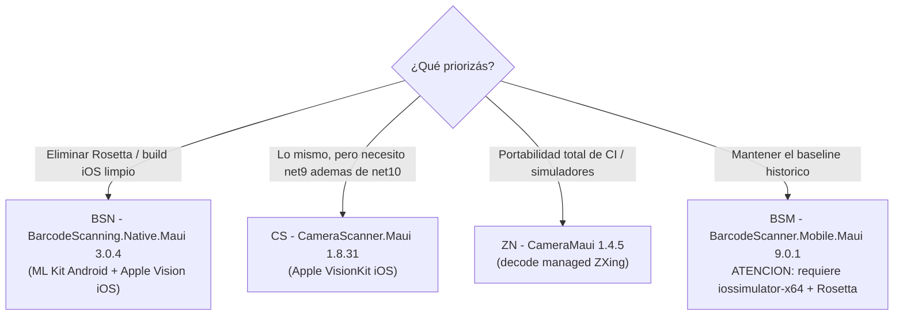

# QR — lectura de códigos

> **Resumen ejecutivo**: el dominio QR es un **banco de pruebas comparativo** de cuatro librerías NuGet de escaneo de códigos QR/barras en .NET MAUI — `BarcodeScanner.Mobile.Maui` (BSM), `BarcodeScanning.Native.Maui` (BSN), `CameraScanner.Maui` (CS) y `CameraMaui` (ZN) — cada una implementada en dos variantes de UX: **página embebida** (`*.LectorQR`) y **diálogo con retorno de resultado por `Task`** (`*.LectorQR_Dialog`). Son 8 proyectos MAUI mínimos (`net10.0-android`, más `net10.0-ios` solo compilando en macOS) que aíslan la lógica de escaneo en una o dos páginas. El eje de la comparación es el **motor de decodificación en iOS**: BSM usa Google ML Kit también en iOS, que no publica slice de simulador `arm64` y fuerza el workaround `iossimulator-x64` + Rosetta (en retirada por Apple); BSN lo reemplaza por **Apple Vision** y es la **recomendación principal** del análisis del repo (`Ejemplos_Devices/Docs/qr-nuget/04-recomendacion.md`).

## Proyectos y técnica que ilustran

| Proyecto | Librería (versión) | Variante UI | Cuándo elegirla |
|---|---|---|---|
| `BSM.LectorQR` | `BarcodeScanner.Mobile.Maui` 9.0.1 | Página (la `MainPage` **es** el escáner) | Referencia del *baseline* histórico del equipo; ML Kit en ambas plataformas. Evitarla para iOS nuevo (dependencia de Rosetta en simulador). |
| `BSM.LectorQR_Dialog` | ídem | Diálogo (página apilada que devuelve `Task<List<QRContent>>`) | Ver el patrón diálogo sobre el baseline BSM; incluye el workaround `GoogleUtilities` para simulador iOS x64. |
| `BSN.LectorQR` | `BarcodeScanning.Native.Maui` 3.0.4 | Página | **Candidata recomendada**: ML Kit en Android + Apple Vision en iOS, sin Rosetta. Formatos declarativos en XAML. |
| `BSN.LectorQR_Dialog` | ídem | Diálogo | La combinación recomendada para integrar en una app propia: librería BSN + patrón diálogo. |
| `CS.LectorQR` | `CameraScanner.Maui` 1.8.31 | Página | Plan B equivalente a BSN (Apple VisionKit en iOS); soporta net9 y net10. |
| `CS.LectorQR_Dialog` | ídem | Diálogo | Ídem, con retorno por `Task`. Ojo: `BarcodeResults` es un **array** (`.Length`), no `List`. |
| `ZN.LectorQR` | `CameraMaui` 1.4.5 (fork janusw de `Camera.MAUI`) | Página | Decodificación **managed ZXing**: máxima portabilidad de CI/simuladores a costa de robustez de decodificación. Arranque de cámara **manual**. |
| `ZN.LectorQR_Dialog` | ídem | Diálogo | Ídem; útil si además del escaneo se necesita cámara genérica. |

Fuentes de paquete/versión: `Ejemplos_Devices/QR/BSM.LectorQR/BSM.LectorQR.csproj#L43`, `BSN.LectorQR/BSN.LectorQR.csproj#L43`, `CS.LectorQR/CS.LectorQR.csproj#L43`, `ZN.LectorQR/ZN.LectorQR.csproj#L43` (los diálogos repiten paquete y versión: p. ej. `BSM.LectorQR_Dialog.csproj#L83`, `BSN.LectorQR_Dialog.csproj#L79`).

> **Nota de nomenclatura**: el prefijo ZN y su `ApplicationId` (`com.ejemplos.devices.qr.zxing_net_maui.simple`, `ZN.LectorQR.csproj#L17`) sugieren *ZXing.Net.Maui*, pero el paquete referenciado es **`CameraMaui` 1.4.5**: el nombre alude al motor de decodificación (ZXing managed), no al paquete.

## Comparativa de librerías

| Aspecto | BSM | BSN | CS | ZN |
|---|---|---|---|---|
| Paquete NuGet | `BarcodeScanner.Mobile.Maui` | `BarcodeScanning.Native.Maui` | `CameraScanner.Maui` | `CameraMaui` (fork janusw de `Camera.MAUI`) |
| Versión | 9.0.1 | 3.0.4 | 1.8.31 | 1.4.5 |
| Init en `MauiProgram` | `.ConfigureMauiHandlers(h => h.AddBarcodeScannerHandler())` (`BSM.LectorQR/MauiProgram.cs#L18–L21`) | `.UseBarcodeScanning()` (`BSN.LectorQR/MauiProgram.cs#L19`) | `.UseCameraScanner()` (`CS.LectorQR/MauiProgram.cs#L19`) | `.UseMauiCameraView()` (`ZN.LectorQR/MauiProgram.cs#L13`) |
| Motor Android | ML Kit (CameraX) | ML Kit (CameraX) | ML Kit (CameraX) | Camera2 + ZXing managed |
| Motor iOS | **ML Kit** | **Apple Vision** | **Apple VisionKit** | AVFoundation + ZXing managed |
| Decodificación | nativa (Google) | nativa (Google/Apple) | nativa (Google/Apple) | **managed** (ZXing) |
| Simulador iOS arm64 | Parcial: ML Kit no publica slice sim arm64 | **Sí** (nativo) | Parcial | Sí (managed) |
| Requiere `iossimulator-x64` + Rosetta | **Sí** (workaround obligatorio) | **No** | No (evita ML Kit en iOS) | No aplica |
| Mac Catalyst | No | **Sí** | No | Parcial/no verificado |
| Android x86 (emulador 32-bit) | No (ML Kit lo abandonó) | No | No | Parcial |
| API de permiso de cámara | propia: `Methods.AskForRequiredPermission()` | propia: `Methods.AskForRequiredPermissionAsync()` | MAUI Essentials: `Permissions.RequestAsync<Permissions.Camera>()` | MAUI Essentials: ídem |
| Evento de detección | `OnDetected` | `OnDetectionFinished` | `OnDetectionFinished` | `BarcodeDetected` (+ `CamerasLoaded`) |
| Ranking del análisis `qr-nuget` | baseline a reemplazar | **1.º recomendada** | 2.º (plan B) | caso especial (cámara genérica) |

Fuentes: motores y matriz de simuladores según `Ejemplos_Devices/Docs/qr-nuget/README.md#L11–L18` y `#L36–L42`, `03-matriz-rid.md` (vía índice ia-db §3–3.1); APIs verificadas en `QR/<Fam>.LectorQR/Pages/MainPage.xaml.cs` (BSM `#L16–L20`, BSN `#L15–L19`, CS `#L15–L19`, ZN `#L24`).



**Recomendación fundada**: `BarcodeScanning.Native.Maui` (BSN) es la elección por defecto. Es la única open-source del lote que combina ML Kit en Android con **Apple Vision en iOS**, con lo cual elimina el workaround `iossimulator-x64` + Rosetta (que Apple está retirando), habilita el simulador iOS arm64 y Mac Catalyst, es MIT, activa y su 3.0.4 encaja con net10 (`Docs/qr-nuget/04-recomendacion.md#L23–L27`). CS es el plan B equivalente si se necesita net9 (`#L29–L31`); la vía managed (ZXing) gana solo cuando la prioridad es que el build corra en cualquier simulador/emulador de CI, a costa de decodificación menos robusta en baja luz o ángulos (`#L33–L37`). En el repo, la evidencia estructural de esta decisión es que **BSN es el único diálogo sin el paquete `AdamE.Google.iOS.GoogleUtilities`** (ver Snippet 5 y Observaciones).

## Estructura y proceso clave

Los 8 proyectos comparten el mismo esqueleto MAUI (`App` → `Shell` → `MainPage`); la diferencia didáctica está en **dónde vive el escáner y cómo entrega el resultado**:

- **Variante página** (`*.LectorQR`): `Pages/MainPage.xaml` contiene directamente el `CameraView`. Al detectar, muestra un `DisplayAlert` con `Tipo: Valor`, pausa el escaneo mientras el alert está visible y lo **reanuda** al cerrar (BSM con `Camera.IsScanning`, BSN/CS con `Camera.CameraEnabled`, ZN con `Camera.BarCodeDetectionEnabled`; p. ej. `BSN.LectorQR/Pages/MainPage.xaml.cs#L52–L57`). No devuelve datos a nadie: es el patrón "kiosco".
- **Variante diálogo** (`*.LectorQR_Dialog`): `MainPage` tiene un botón "Leer QR" que apila `Pages/QRLectorPage` con `Navigation.PushAsync` y **espera el resultado** con `await destinoPage.ResultadoTask.Task`, donde `ResultadoTask` es un `TaskCompletionSource<List<QRContent>>`. La página de escaneo mapea la detección al POJO `QRContent { Type, Value }` (`BSM.LectorQR_Dialog/Models/QRContent.cs#L3–L7`, sin dependencia de la librería, lo que localiza una eventual migración), completa el `Task` **una sola vez** (guarda `Interlocked.Exchange`) y se cierra con `PopAsync`. El botón "Volver" completa con lista vacía (cancelación). No usa `Popup` de CommunityToolkit: es una `ContentPage` completa que **simula** un modal y devuelve datos por `Task`.

Extras exclusivos del diálogo: layout portrait/landscape recalculado en runtime (`UpdateLayoutOrientation`, `BSM.LectorQR_Dialog/Pages/QRLectorPage.xaml.cs#L156–L213`, suscripto a `DeviceDisplay.MainDisplayInfoChanged`), iconografía Material (`FontImageSource` con glifo dinámico `flash_on`/`flash_off`, `QRLectorPage.xaml#L18–L20`) y fuente `MaterialIconsOutlined-Regular.otf` registrada en `MauiProgram` (`BSN.LectorQR_Dialog/MauiProgram.cs#L18`).

Flujo de punta a punta — caso concreto: escanear el QR de prueba `Ejemplo_Docs_QR/QR_frase.png` (mostrado en otra pantalla) con `BSM.LectorQR_Dialog`:

```mermaid
sequenceDiagram
    participant U as Usuario
    participant M as MainPage (lanzador)
    participant Q as QRLectorPage
    participant L as CameraView (BarcodeScanner.Mobile)

    U->>M: Tap "Leer QR"
    M->>Q: Navigation.PushAsync(new QRLectorPage())
    Note over M: await destinoPage.ResultadoTask.Task<br/>(MainPage.xaml.cs L19-L21)
    Q->>Q: OnAppearing: AskForRequiredPermission()<br/>+ layout segun orientacion (L114-L134)
    U->>L: Apunta la camara a QR_frase.png
    L-->>Q: OnDetected(e.BarcodeResults) (L47)
    Q->>Q: map a List&lt;QRContent&gt; (Unknown -> "Text") (L53-L60)
    Q->>Q: Camera.IsScanning = false; CompletarResultado(QRs)<br/>(Interlocked, una sola vez, L62-L70 + L136-L142)
    Q->>M: Navigation.PopAsync()
    M->>U: LbQR.Text = qr.Value (L28)<br/>o alert "Cancelado" si vino vacio (L32)
```

## Cómo ejecutar

Build y despliegue general de la solución: ver [`build-and-run`](../../07-operations/build-and-run.md). Específico de este dominio:

- **En Windows solo compila Android**: `net10.0-ios` se agrega al `TargetFrameworks` únicamente en macOS (`BSM.LectorQR.csproj#L4–L5`). Sin target Windows (`WindowsPackageType=None`, `#L22`).
- **Probar el escaneo requiere dispositivo físico**: el simulador iOS no tiene cámara y los emuladores Android x86 no corren ML Kit (BSM/BSN/CS); el simulador solo sirve para verificar compilación (índice ia-db §3.1).
- **Simulador iOS con BSM/CS/ZN diálogo**: compilar con `-p:RuntimeIdentifier=iossimulator-x64` activa el paquete `AdamE.Google.iOS.GoogleUtilities` (workaround Rosetta, `BSM.LectorQR_Dialog.csproj#L78–L80`). BSN no lo necesita. Errores de link tipo `ld: building for 'iOS-simulator', but linking object built for 'iOS'` en `MLKitCommon` y su mitigación (`MtouchExtraArgs`, `NoWarn=MT5209;MT5212;MT5213`) están documentados en `Ejemplo_Docs_QR/cicd.md#L250–L254`.
- **CI recomendado**: si el pipeline solo verifica compilación o genera IPA de testing, no usar simulador; compilar contra hardware real: `-p:RuntimeIdentifier=ios-arm64 -p:BuildIpa=true -p:EnableCodeSigning=false` (`Ejemplo_Docs_QR/Readme.md#L90–L103`).
- **QRs de prueba**: `Ejemplo_Docs_QR/QR_frase.png` y `QR_pirincho.png`.

## Permisos y su justificación

Set declarado en los `Platforms/Android/AndroidManifest.xml` de los 8 proyectos (verificado en `BSM.LectorQR/Platforms/Android/AndroidManifest.xml#L17–L32` y `ZN.LectorQR_Dialog/Platforms/Android/AndroidManifest.xml#L9–L23`):

| Permiso Android | Justificación en este dominio | ¿Imprescindible para el escáner? |
|---|---|---|
| `CAMERA` | Preview en vivo y captura de frames para decodificar. Se solicita en runtime (API propia en BSM/BSN, MAUI Essentials en CS/ZN). | **Sí** |
| `FLASHLIGHT` | Botón de linterna (`TorchOn` / `TorchEnabled`). | Solo para la función flash |
| `VIBRATE` | Vibración al detectar (`VibrationOnDetected` del `CameraView`, p. ej. `BSN.LectorQR/Pages/MainPage.xaml#L29`). | No (feedback opcional) |
| `READ/WRITE_EXTERNAL_STORAGE` | Sin uso en el flujo de escaneo en vivo; herencia de plantilla junto con el `FileProvider` (interpretación, ver Observaciones). | No |
| `INTERNET`, `ACCESS_NETWORK_STATE` | Plantilla MAUI; ML Kit puede requerir red para actualizar modelos vía Play Services (interpretación). | No para decodificar |
| `<queries>` `IMAGE_CAPTURE` | Consulta de apps de cámara externas; el escáner embebido no la usa. | No |

`minSdkVersion=25`, `targetSdkVersion=36` (`AndroidManifest.xml#L32`).

| Clave iOS (`Info.plist`) | Valor | Justificación |
|---|---|---|
| `NSCameraUsageDescription` | "La app necesita acceso a la cámara para tomar fotos." (`BSM.LectorQR/Platforms/iOS/Info.plist#L55–L56`) | **Única clave imprescindible**: sin ella iOS rechaza el acceso a la cámara. Ojo: el texto declara "tomar fotos", no menciona el escaneo (ver Observaciones). |
| `MinimumOSVersion` | 15.0 (`#L34–L35`) | Piso común a las 4 librerías en net10. |
| `UIRequiredDeviceCapabilities` | `arm64` (`#L11–L14`) | Solo dispositivos de 64 bits. |

> **Gotcha de permiso no bloqueante**: en las páginas y en el `OnAppearing()` de los diálogos el permiso se **solicita pero no bloquea** el arranque de la cámara (`BSM.LectorQR_Dialog/Pages/QRLectorPage.xaml.cs#L114–L134`); si el usuario deniega, la vista puede quedar en negro sin feedback (patrón heredado, `Docs/qr-nuget/01-analisis-uso-actual.md`, vía índice ia-db §5.1).

## Snippets canónicos

**1. Lanzar el diálogo y esperar el resultado por `Task` (el corazón del patrón diálogo).**

> Fuente: `Ejemplos_Devices/QR/BSM.LectorQR_Dialog/Pages/MainPage.xaml.cs#L14–L33` @24d611d · Demuestra: apilar la página de escaneo y suspender el flujo hasta que ella resuelva su `TaskCompletionSource`. Precondición: `QRLectorPage` expone `ResultadoTask`. Resultado esperado: `LbQR.Text` con el valor del QR, o alert "Cancelado" si volvió lista vacía.

```csharp
BtnLeerQR.IsEnabled = false;
try
{
    var destinoPage = new QRLectorPage();

    await Navigation.PushAsync(destinoPage);

    List<QRContent> qrs = await destinoPage.ResultadoTask.Task;

    var qr = qrs.FirstOrDefault();

    if (qr != null)
    {
        LbQR.Text = qr.Value;
    }
    else
    {
        await DisplayAlertAsync("Cancelado", "No se recibió ningún dato", "OK");
    }
}
// …
```

**2. Completar el resultado una sola vez (idempotencia entre detección y "Volver").**

> Fuente: `Ejemplos_Devices/QR/BSM.LectorQR_Dialog/Pages/QRLectorPage.xaml.cs#L11–L142` (con elisiones) @24d611d · Demuestra: `TaskCompletionSource` + guarda `Interlocked.Exchange` para que el `Task` se resuelva exactamente una vez aunque compitan la detección (`#L62–L70`) y la cancelación (`#L88–L93`). Precondición: página creada por el lanzador. Resultado esperado: el `await` del lanzador se libera con la lista (vacía si se canceló); llamadas posteriores no tienen efecto.

```csharp
private int _completed = 0;
public TaskCompletionSource<List<QRContent>> ResultadoTask { get; set; } = new();

// …

private void CompletarResultado(List<QRContent> result)
{
    if (Interlocked.Exchange(ref _completed, 1) == 0)
    {
        ResultadoTask.TrySetResult(result);
    }
}
```

**3. Detección con BSN (la librería recomendada): mapeo, pausa y reanudación.**

> Fuente: `Ejemplos_Devices/QR/BSN.LectorQR/Pages/MainPage.xaml.cs#L43–L58` @24d611d · Demuestra: el evento `OnDetectionFinished` de `BarcodeScanning.Native.Maui`, la normalización `Unknown → "Text"` y el ciclo pausar/mostrar/reanudar con `CameraEnabled`. Precondición: `CameraView` en XAML con `BarcodeSymbologies="QRCode,Code39"` (`MainPage.xaml#L25–L30`) y permiso de cámara concedido. Resultado esperado: alert "QR detectado" con una línea `Tipo: valor` por código, y el escáner sigue activo al cerrarlo.

```csharp
private void OnCameraViewOnDetecte(object sender, BarcodeScanning.OnDetectionFinishedEventArg e)
{
    var textos = e.BarcodeResults
        .Select(b => $"{(b.BarcodeType == BarcodeTypes.Unknown ? "Text" : b.BarcodeType.ToString())}: {b.DisplayValue}")
        .ToList();

    if (textos.Count == 0)
        return;

    this.Dispatcher.Dispatch(async () =>
    {
        Camera.CameraEnabled = false;   // pausa el escaneo mientras se muestra el resultado
        await DisplayAlertAsync("QR detectado", string.Join("\n", textos), "OK");
        Camera.CameraEnabled = true;    // reanuda para escanear de nuevo
    });
}
```

**4. ZN es la más manual: selección de cámara y arranque explícito.**

> Fuente: `Ejemplos_Devices/QR/ZN.LectorQR/Pages/MainPage.xaml.cs#L22–L37` @24d611d · Demuestra: con `CameraMaui` la cámara **no** arranca sola; hay que esperar `CamerasLoaded`, elegir la trasera y llamar `StartCameraAsync()`. Las otras tres familias arrancan implícitamente al renderizar el control. Precondición: `CamerasLoaded="OnCamerasLoaded"` en el XAML (`MainPage.xaml#L30`). Resultado esperado: preview activo con la cámara trasera; sin permiso, alert y no arranca.

```csharp
private async void OnCamerasLoaded(object sender, EventArgs e)
{
    if (await Permissions.RequestAsync<Permissions.Camera>() != PermissionStatus.Granted)
    {
        await DisplayAlertAsync("Alert", "Dale permiso si queres QR!", "OK");
        return;
    }

    if (Camera.NumCamerasDetected > 0)
    {
        // Cámara trasera por defecto.
        Camera.Camera = Camera.Cameras.FirstOrDefault(c => c.Position == CameraPosition.Back)
                        ?? Camera.Cameras.First();
        await Camera.StartCameraAsync();
    }
}
```

**5. El gotcha iOS/simulador hecho csproj: GoogleUtilities condicional a `iossimulator-x64`.**

> Fuente: `Ejemplos_Devices/QR/BSM.LectorQR_Dialog/BSM.LectorQR_Dialog.csproj#L78–L80` @24d611d · Demuestra: el workaround Rosetta para compilar la cadena ML Kit en el simulador iOS x86_64. Presente en los diálogos BSM, CS y ZN (`CS.LectorQR_Dialog.csproj#L79`, `ZN.LectorQR_Dialog.csproj#L79`); **ausente adrede en BSN**, porque Apple Vision no lo necesita. Precondición: build con `-p:RuntimeIdentifier=iossimulator-x64` en un Mac con Rosetta. Resultado esperado: el paquete solo se referencia en ese RID; en device (`ios-arm64`) no participa.

```xml
<ItemGroup Condition="'$(RuntimeIdentifier)' == 'iossimulator-x64'">
    <PackageReference Include="AdamE.Google.iOS.GoogleUtilities" Version="8.1.0.3" />
</ItemGroup>
```

## Puntos de extensión

- **Filtrar formatos de código**: cada familia lo resuelve distinto. BSM por código con `Methods.SetSupportBarcodeFormat(BarcodeFormats.QRCode | BarcodeFormats.Code39)` (`BSM.LectorQR_Dialog/Pages/QRLectorPage.xaml.cs#L36`); BSN declarativo en XAML `BarcodeSymbologies="QRCode,Code39"` (`BSN.LectorQR/Pages/MainPage.xaml#L30`); CS declarativo `BarcodeFormats="QR,Code39"`; ZN por código con `Camera.BarCodeOptions = new BarcodeDecodeOptions { PossibleFormats = …, TryHarder = true }` (`ZN.LectorQR/Pages/MainPage.xaml.cs#L14–L19`). Agregar un formato (p. ej. Code128) es tocar una sola línea por proyecto.
- **Cambiar el overlay/UI del escáner**: el diálogo ya trae la receta — `Grid` `DynamicLayout` con filas/columnas recalculadas por orientación (`QRLectorPage.xaml.cs#L156–L213`) y botones con `FontImageSource` Material (`QRLectorPage.xaml#L18–L20`). Para un marco de encuadre o texto guía, agregar elementos al mismo `Grid` y registrarlos en `UpdateLayoutOrientation`.
- **Integrar en una app propia**: copiar `Pages/QRLectorPage.xaml(.cs)` + `Models/QRContent.cs` de la familia elegida, registrar la librería en `MauiProgram` (una línea, §Comparativa) y declarar `CAMERA` (Android) y `NSCameraUsageDescription` (iOS). Como `QRContent` no depende de la librería, el consumidor (`await ResultadoTask.Task`) no cambia si después se migra de motor — ese es el plan de `Docs/qr-nuget/05-plan-migracion.md`.
- **Ajustar la cadencia de escaneo**: BSM expone `ScanInterval="50"` en el `CameraView` (`QRLectorPage.xaml#L23`); ZN expone `ControlBarcodeResultDuplicate="True"` para suprimir duplicados (`ZN.LectorQR/Pages/MainPage.xaml#L28`).
- **Cambiar la política de cancelación**: hoy "Volver" devuelve lista vacía; si se prefiere distinguir "cancelado" de "sin códigos", cambiar el tipo del `TaskCompletionSource` a un resultado con estado (tocar `#L11–L12` y `CompletarResultado`).

## Observaciones

**Hechos verificados en código:**

- `BSM.LectorQR` declara `CAMERA` **dos veces** en el manifest (`AndroidManifest.xml#L20` y `#L23`) y el `FileProvider` tiene la authority con `.simple` duplicado: `com.ejemplos.devices.qr.barcodescanner_mobile_maui.simple.simple.fileprovider` (`#L11`). Inocuo pero sucio; conviene limpiar al clonar la plantilla.
- El `NSCameraUsageDescription` real dice "La app necesita acceso a la cámara **para tomar fotos**" (`Info.plist#L55–L56`): el propósito declarado no menciona el escaneo de códigos. Para App Store conviene un texto fiel al uso real. (El índice ia-db §5.3 cita el texto truncado "acceso a la cámara..."; el matiz "tomar fotos" solo se ve en el fuente.)
- BSN es la única familia que **fija** `Microsoft.Maui.Controls` en `10.0.80` en vez de `$(MauiVersion)` (`BSN.LectorQR.csproj#L47`, con el genérico dejado en comentario `#L51–L53`), coherente con que 3.0.4 es net10-only.
- `GoogleUtilities` aparece también en los diálogos **CS y ZN** (`CS.LectorQR_Dialog.csproj#L79`, `ZN.LectorQR_Dialog.csproj#L79`) aunque en iOS no usan ML Kit — interpretación: herencia de la plantilla BSM, se puede quitar en esas dos familias. BSN lo omite deliberadamente.
- En CS `e.BarcodeResults` es un **array** y se recorre con `.Length` (`CS.LectorQR_Dialog/Pages/QRLectorPage.xaml.cs#L49–L58`); en BSM/BSN es `List`. Al portar código entre familias este detalle rompe la compilación.
- El diálogo ZN no normaliza `Unknown → "Text"`: usa `r.BarcodeFormat.ToString()` directo como `Type` (`ZN.LectorQR_Dialog/Pages/QRLectorPage.xaml.cs#L73–L77`); las otras tres sí normalizan.
- `UpdateLayoutOrientation` traga excepciones con un `catch (Exception ex) { }` vacío (`BSM.LectorQR_Dialog/Pages/QRLectorPage.xaml.cs#L212`) — aceptable en un ejemplo, no copiar a producción.
- El manifest del diálogo ZN es el más minimalista (sin atributo `package` ni `FileProvider`, solo permisos; `ZN.LectorQR_Dialog/Platforms/Android/AndroidManifest.xml`): demuestra el set mínimo real que necesita el escáner.

**Interpretaciones:**

- Los permisos de storage y el `<queries>` de `IMAGE_CAPTURE` no tienen consumidor en el código de escaneo; se leen como arrastre de plantilla.
- El permiso no bloqueante (se pide pero no corta el flujo si se deniega) es una decisión heredada del baseline, no una elección de diseño de estos ejemplos.

**Discrepancias índice ia-db ↔ código:** ninguna sustantiva. Todo lo verificado (paquetes/versiones en `csproj#L43`, inits de `MauiProgram`, eventos, permisos, manifests, GoogleUtilities, líneas citadas) coincide con `ia-db/indexes/02_QR.md`. Único matiz: el texto completo del `NSCameraUsageDescription` (punto 2 de Hechos). Nota operativa: los documentos `../../07-operations/build-and-run.md` y otros enlazados se generan en paralelo y pueden no existir todavía al momento de esta revisión.

## Preguntas guía

1. ¿Qué librería elijo para una app nueva con iOS en el roadmap? — BSN, salvo que necesites net9 (CS) o que tu CI dependa de correr en cualquier simulador (vía managed/ZXing). Ver §Comparativa.
2. ¿Cómo devuelve datos el diálogo sin eventos ni mensajería? — `TaskCompletionSource<List<QRContent>>` expuesto como propiedad; el lanzador hace `await` del `Task` después del `PushAsync`. Ver Snippets 1 y 2.
3. ¿Por qué BSM obliga a Rosetta en el simulador iOS y BSN no? — BSM usa ML Kit también en iOS y ML Kit no publica slice de simulador arm64; BSN decodifica con Apple Vision, nativo del sistema. Ver §Comparativa y Snippet 5.
4. ¿Qué permisos necesita de verdad el escáner? — `CAMERA` (Android, runtime) y `NSCameraUsageDescription` (iOS); el resto del set es funcionalidad accesoria o plantilla. Ver §Permisos.
5. ¿Qué tengo que tocar para escanear también Code128? — Una línea por proyecto: el filtro de formatos de la familia elegida. Ver §Puntos de extensión.
6. ¿Por qué la detección se despacha con `Dispatcher.Dispatch`? — El evento llega desde el hilo de cámara; la UI (alert, `PopAsync`, propiedades del control) debe tocarse en el hilo principal. Ver Snippet 3.

## Referencias

- Índice ia-db del dominio: [`02_QR.md`](../../../../ia-db/indexes/02_QR.md)
- Fuentes (repo `Ejemplos_Maui_Devices`): `Ejemplos_Devices/QR/{BSM,BSN,CS,ZN}.LectorQR/` y `{BSM,BSN,CS,ZN}.LectorQR_Dialog/` (csproj, `MauiProgram.cs`, `Pages/MainPage.xaml(.cs)`, `Pages/QRLectorPage.xaml(.cs)`, `Models/QRContent.cs`, `Platforms/Android/AndroidManifest.xml`, `Platforms/iOS/Info.plist`)
- Análisis comparativo de NuGets: `Ejemplos_Devices/Docs/qr-nuget/README.md` y `01`–`05` (recomendación en `04-recomendacion.md`)
- CI/CD y errores de build iOS: `Ejemplos_Devices/QR/Ejemplo_Docs_QR/cicd.md`, `Readme.md`
- Mapa del sistema: [`system-map.md`](../../00-overview/system-map.md)
- Build y ejecución: [`build-and-run.md`](../../07-operations/build-and-run.md)
