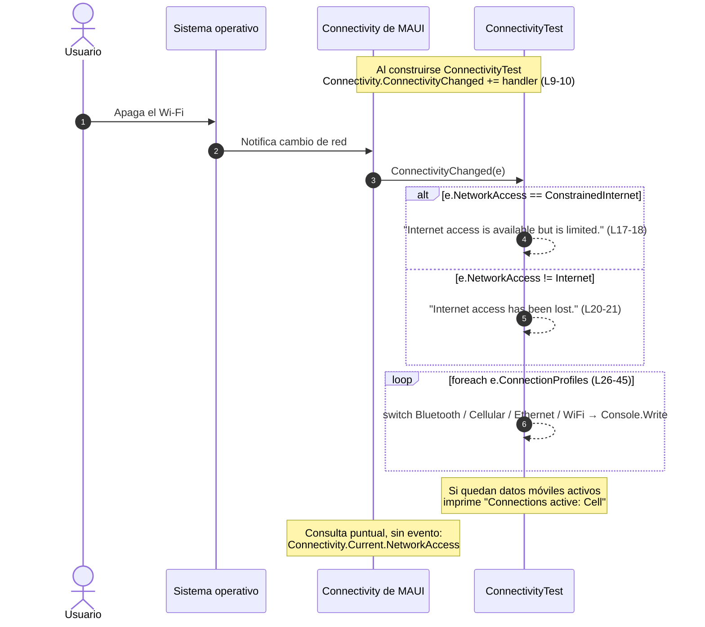

# Red — conectividad

> **Resumen ejecutivo**: `Ejemplo_Maui_Connectivity` es una app MAUI mínima (perfil `mobile-app`, target `net10.0-android`, `net10.0-ios` solo en macOS) que ilustra la API `Connectivity` de .NET MAUI Essentials: consultar el estado de red con `Connectivity.Current.NetworkAccess` y reaccionar a cambios suscribiéndose al evento `Connectivity.ConnectivityChanged`. Toda la lógica vive en el utilitario `Utilities/ConnectivityTest.cs`; la UI (`Pages/MainPage.xaml`) está vacía y el utilitario **no está cableado** a la app, por lo que es un ejemplo de referencia de API, no una app funcional. En Android requiere `ACCESS_NETWORK_STATE` (declarado en el manifest); en iOS no hace falta permiso.

## Qué ilustra el proyecto

- **Consulta puntual del estado de red**: `Connectivity.Current.NetworkAccess` devuelve un enum `NetworkAccess` (`Internet`, `ConstrainedInternet`, `Local`, `None`, `Unknown`). El patrón de consulta está documentado en la nota citable `Ejemplo_Docs_Red/Readme.md` (líneas 7–19).
- **Suscripción a cambios**: la clase `ConnectivityTest` se suscribe a `Connectivity.ConnectivityChanged` en el constructor y se desuscribe en el finalizador (`Utilities/ConnectivityTest.cs:9–13`).
- **Interpretación del evento**: el handler recibe `ConnectivityChangedEventArgs` y evalúa dos cosas: el nuevo `e.NetworkAccess` (¿hay Internet pleno, limitado o nada?) y los perfiles activos `e.ConnectionProfiles` (`Bluetooth`, `Cellular`, `Ethernet`, `WiFi`), que recorre con un `foreach` + `switch` (`Utilities/ConnectivityTest.cs:15–48`).
- **Distinción clave**: `ConstrainedInternet` señala un portal cautivo (hay red pero exige autenticarse antes de dar salida a Internet); no es lo mismo que `Local` ni que `None`.
- **Qué NO ilustra**: reachability real de un host. `Connectivity` reporta *capacidad* de red del dispositivo; para confirmar que un servicio concreto responde hay que hacer la petición igual.

Detalle de nomenclatura: la carpeta se llama `Ejemplo_Maui_Connectivity`, pero el `RootNamespace` es `Ejemplo_Maui_Conexion` (`Ejemplo_Maui_Connectivity.csproj:8`); el código C# usa el namespace `Ejemplo_Maui_Conexion.*`.

## Estructura y proceso clave

Archivos relevantes de la pieza:

```
Ejemplos_Devices/Red/
├── Ejemplo_Maui_Connectivity/
│   ├── Utilities/ConnectivityTest.cs      ← toda la lógica de conectividad
│   ├── Pages/MainPage.xaml                ← ScrollView vacío (sin UI)
│   ├── MauiProgram.cs                     ← bootstrap estándar (no registra ConnectivityTest)
│   ├── Platforms/Android/AndroidManifest.xml  ← permisos
│   └── Ejemplo_Maui_Connectivity.csproj
└── Ejemplo_Docs_Red/Readme.md             ← nota documental citable (tabla NetworkAccess + snippet)
```

Caso concreto narrado: **el usuario apaga el Wi-Fi** del teléfono mientras la app corre (asumiendo que `ConnectivityTest` fue instanciado — ver Observaciones). El sistema operativo detecta el cambio, MAUI lo traduce y dispara `ConnectivityChanged`; el handler clasifica el nuevo estado y lista los perfiles que quedan activos.



Dos matices del caso:

1. Si al apagar el Wi-Fi quedan **datos móviles**, `e.NetworkAccess` puede seguir siendo `Internet` (no entra en ningún `if`) y el `foreach` imprime `Cell`. Solo si no queda ningún camino a Internet se imprime `"Internet access has been lost."`.
2. La desuscripción está en el finalizador `~ConnectivityTest` (L12–13), un mecanismo no determinista — ver Observaciones.

## Cómo ejecutar

Ver la guía general de build y despliegue: [build-and-run](../../07-operations/build-and-run.md).

Particularidades de esta pieza:

- **Targets**: `net10.0-android` siempre; `net10.0-ios` solo se agrega compilando desde macOS (`Ejemplo_Maui_Connectivity.csproj:4–5`). El `.csproj` declara versiones de Windows pero **no** incluye el TFM `net10.0-windows`, así que no hay build de escritorio.
- **Salida**: los mensajes van a `Console.WriteLine`; en Android se observan por `adb logcat` (o la ventana de salida del IDE).
- **Para ver algo en runtime** hay que instanciar `ConnectivityTest` (por ejemplo `new ConnectivityTest()` en `MainPage`), porque el proyecto no lo hace en ningún lado. Después, alternar Wi-Fi/datos o modo avión en el dispositivo/emulador.

## Permisos y su justificación

Verificados contra los manifests del proyecto:

| Plataforma | Permiso | Justificación | Fuente verificada |
|---|---|---|---|
| Android | `android.permission.ACCESS_NETWORK_STATE` | Requerido por la API `Connectivity` para leer el estado de red vía `ConnectivityManager` (sin él, la consulta/eventos fallan) | `Platforms/Android/AndroidManifest.xml:10` |
| Android | `android.permission.INTERNET` | Habilita el acceso efectivo a Internet de la app (necesario si, tras detectar red, se hacen peticiones) | `Platforms/Android/AndroidManifest.xml:11` |
| iOS | — (ninguno) | La API de conectividad de iOS no exige claves de privacidad; `Platforms/iOS/Info.plist` no contiene claves de red | `Platforms/iOS/Info.plist` |

Ambos permisos Android son de tipo *normal* (se conceden en la instalación, sin prompt en runtime).

## Snippets canónicos

**1. Consulta puntual del estado de red**

```csharp
NetworkAccess accessType = Connectivity.Current.NetworkAccess;

if (accessType == NetworkAccess.Internet)
{
    // Connection to internet is available
}
```

> Fuente: `Ejemplos_Devices/Red/Ejemplo_Docs_Red/Readme.md#L7–L12` @24d611d · Demuestra: consulta sincrónica del estado actual con `Connectivity.Current.NetworkAccess` y comparación contra `NetworkAccess.Internet` (patrón de guard antes de una operación de red).

**2. Suscripción y desuscripción al evento**

```csharp
public class ConnectivityTest
{
    public ConnectivityTest() =>
        Connectivity.ConnectivityChanged += Connectivity_ConnectivityChanged;

    ~ConnectivityTest() =>
        Connectivity.ConnectivityChanged -= Connectivity_ConnectivityChanged;
```

> Fuente: `Ejemplos_Devices/Red/Ejemplo_Maui_Connectivity/Utilities/ConnectivityTest.cs#L7–L13` @24d611d · Demuestra: ciclo de vida de la suscripción a `Connectivity.ConnectivityChanged` (`+=` en el constructor, `-=` en el finalizador — patrón mostrado tal cual en docs de Microsoft, con la salvedad de fiabilidad anotada en Observaciones).

**3. Handler: clasificar el estado y listar perfiles activos**

```csharp
    void Connectivity_ConnectivityChanged(object sender, ConnectivityChangedEventArgs e)
    {
        if (e.NetworkAccess == NetworkAccess.ConstrainedInternet)
            Console.WriteLine("Internet access is available but is limited.");

        else if (e.NetworkAccess != NetworkAccess.Internet)
            Console.WriteLine("Internet access has been lost.");

        // Log each active connection
        Console.Write("Connections active: ");

        foreach (var item in e.ConnectionProfiles)
        {
            switch (item)
            {
                case ConnectionProfile.Bluetooth:
                    Console.Write("Bluetooth");
                    break;
                case ConnectionProfile.Cellular:
                    Console.Write("Cell");
                    break;
                case ConnectionProfile.Ethernet:
                    Console.Write("Ethernet");
                    break;
                case ConnectionProfile.WiFi:
                    Console.Write("WiFi");
                    break;
                default:
                    break;
            }
        }

        Console.WriteLine();
    }
```

> Fuente: `Ejemplos_Devices/Red/Ejemplo_Maui_Connectivity/Utilities/ConnectivityTest.cs#L15–L48` @24d611d · Demuestra: lectura de `ConnectivityChangedEventArgs` — clasificación por `e.NetworkAccess` (`ConstrainedInternet` vs pérdida de Internet) y enumeración de `e.ConnectionProfiles` con `switch` sobre `ConnectionProfile`.

## Puntos de extensión

Para llevar este patrón a una app real que deba **reaccionar a la pérdida de red**:

- **Cablear el utilitario al ciclo de vida**: registrar un servicio de conectividad como singleton en `MauiProgram.CreateMauiApp()` (DI) o suscribirse en `OnAppearing`/desuscribirse en `OnDisappearing` de la página, en lugar de depender de que alguien haga `new ConnectivityTest()`.
- **Desuscripción determinista**: implementar `IDisposable` y desuscribir explícitamente en `Dispose()`; el finalizador actual no garantiza cuándo (ni si) se ejecuta.
- **Notificar a la UI en el hilo correcto**: reemplazar `Console.WriteLine` por un banner/estado observable (`WeakReferenceMessenger`, propiedad de un ViewModel) y despachar con `MainThread.BeginInvokeOnMainThread` — el evento puede llegar en un hilo de fondo.
- **Modo offline**: al detectar `NetworkAccess != Internet`, deshabilitar acciones que requieren red, encolar operaciones pendientes y reintentarlas cuando el evento vuelva a reportar `Internet`.
- **Portal cautivo**: tratar `ConstrainedInternet` como caso propio (avisar al usuario que debe autenticarse en el portal) en vez de agruparlo con "sin red".
- **Guard antes de cada petición**: combinar la consulta puntual (`Connectivity.Current.NetworkAccess`) con la petición real — la API reporta capacidad, no alcanzabilidad del servidor; el manejo de errores HTTP sigue siendo necesario.

## Observaciones

- **`ConnectivityTest` no se instancia en ningún lado**: ni en DI (`MauiProgram.cs:9–23` solo configura fuentes y logging) ni en `MainPage` (code-behind con solo `InitializeComponent()`); en runtime el handler nunca llega a suscribirse. Es una pieza de referencia de API, no una app cableada.
- **UI vacía**: `Pages/MainPage.xaml` contiene un `ScrollView` sin hijos (líneas 6–8).
- **Finalizador como mecanismo de desuscripción es poco fiable**: mientras `Connectivity` retenga la referencia al handler, el objeto no se recolecta y `~ConnectivityTest` puede no ejecutarse de forma determinista.
- **Nulabilidad**: la firma `void Connectivity_ConnectivityChanged(object sender, ...)` usa `object` no anulable con `<Nullable>enable</Nullable>` (`.csproj:12`), lo que puede emitir warnings.
- **Condiciones Windows inertes**: el `.csproj` define `SupportedOSPlatformVersion`/`TargetPlatformMinVersion` para `windows` (líneas 25–26) pero no agrega el TFM `net10.0-windows`; existen archivos en `Platforms/Windows/` que no se compilan.
- **Divergencia carpeta/namespace**: `Ejemplo_Maui_Connectivity` (carpeta) vs `Ejemplo_Maui_Conexion` (RootNamespace, `.csproj:8`) — a tener en cuenta al buscar tipos por nombre.
- El mismo snippet de `ConnectivityTest` está duplicado como material documental en `Ejemplo_Docs_Red/Readme.md:21–65` (con la tabla de valores de `NetworkAccess` en 15–19).

## Preguntas guía

1. ¿Qué diferencia hay entre `NetworkAccess.ConstrainedInternet` y `NetworkAccess.Local`, y cómo debería tratarlos distinto una app con login remoto?
2. Si el usuario apaga el Wi-Fi pero tiene datos móviles activos, ¿qué imprime el handler y por qué no entra en el `else if` de "acceso perdido"?
3. ¿Por qué la desuscripción en `~ConnectivityTest` puede no ejecutarse nunca? ¿Cómo lo reescribirías con `IDisposable` o con `OnAppearing`/`OnDisappearing`?
4. ¿Qué permiso exige Android para leer el estado de red y qué pasaría si se quita `ACCESS_NETWORK_STATE` del manifest?
5. `Connectivity.Current.NetworkAccess == Internet`, ¿garantiza que tu backend responde? ¿Qué chequeo adicional hace falta?
6. ¿En qué hilo puede dispararse `ConnectivityChanged` y qué precaución exige eso si el handler toca la UI?

## Referencias

- Índice del dominio (ia-db): [07_Red-Conectividad](../../../../ia-db/indexes/07_Red-Conectividad.md)
- Fuente de la pieza: `Ejemplos_Maui_Devices/Ejemplos_Devices/Red/Ejemplo_Maui_Connectivity/` (utilitario en `Utilities/ConnectivityTest.cs`)
- Material documental citable: `Ejemplos_Maui_Devices/Ejemplos_Devices/Red/Ejemplo_Docs_Red/Readme.md` (tabla `NetworkAccess` + link a docs de Microsoft Learn sobre networking en MAUI)
- Mapa del sistema: [system-map](../../00-overview/system-map.md)
