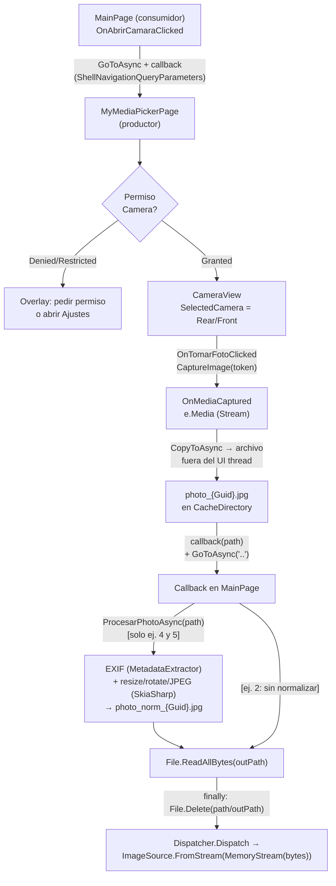
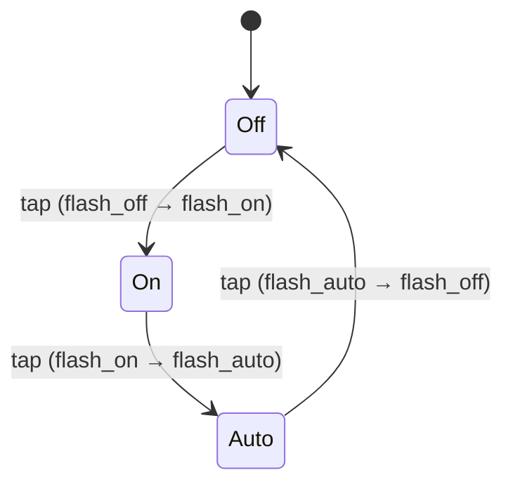

# Índice 01 — Cámara

> **Propósito**: mapear y contrastar los 5 ejemplos de captura de foto del repositorio (MediaPicker nativo vs. picker propio con `CameraView`, patrón callback vs. Task, con/sin normalización EXIF, cámara trasera vs. selfie).
> **Fuente primaria**: `Ejemplos_Devices/Camera/`.
> **Entrada ia-db**: [README](../README.md) · [Índice maestro](00_MASTER-INDEX.md)

---

## 1. Mapa del dominio

```
Ejemplos_Devices/Camera/
├── Ejemplo_Photo_MediaPicker/                      # (1) Diálogo NATIVO del SO
│   ├── Services/ICamaraService.cs · CameraService.cs   → MediaPicker.Default
│   ├── Pages/MainPage.xaml.cs
│   └── MEDIAPICKER_FIX.md                           # bug Stream/Glide + soluciones
├── Ejemplo_Photo_MiMediaPicker_Callback/           # (2) Picker propio + CALLBACK
│   └── Pages/MyMediaPickerPage.xaml(.cs)            → CameraView (CommunityToolkit)
├── Ejemplo_Photo_MiMediaPicker_Task/               # (3) Picker propio + TASK
│   └── Pages/MyMediaPickerPage.xaml(.cs)            → TaskCompletionSource
├── Ejemplo_Photo_MiMediaPicker_Callback_Normalizacion/  # (4) Callback + EXIF/Skia
│   ├── Services/IImageService.cs
│   └── Services/ImageDeviceAutoRotateService.cs     → MetadataExtractor + SkiaSharp
├── Ejemplo_Photo_MiMediaSelfie_Callback_Normalizacion/  # (5) Selfie + máscara + EXIF
│   ├── Pages/MyMediaSelfiePickerPage.xaml(.cs)      → cámara Front
│   └── Utilities/SelfieMaskDrawable.cs · ImageDeviceAutoRotate.cs
└── Ejemplo_Docs_Photo/                             # Documentación transversal
    ├── Readme.md                                    # nativo vs. toolkit + manifiestos
    └── Transferencia_Foto_Entre_Pantallas.md        # guía de 12 secciones
```

Dos técnicas de captura y dos técnicas de transferencia se combinan a lo largo de los ejemplos, sumando incrementalmente permisos → normalización → selfie.

---

## 2. Tabla comparativa de los 5 ejemplos

| # | Ejemplo | Qué demuestra | Enfoque | Archivos clave |
|---|---------|---------------|---------|----------------|
| 1 | `Ejemplo_Photo_MediaPicker` | Captura/galería con el **diálogo nativo** del SO, encapsulado en un servicio; bug de `Stream` con Glide | `MediaPicker.Default` + servicio `Task<Stream?>` | `Services/CameraService.cs`, `Services/ICamaraService.cs`, `Pages/MainPage.xaml.cs`, `MEDIAPICKER_FIX.md` |
| 2 | `Ejemplo_Photo_MiMediaPicker_Callback` | **Picker propio** con `CameraView`, flujo completo de permisos, transferencia por **callback** (path a archivo temporal) | `CameraView` + `Action<string?>` vía `ShellNavigationQueryParameters` | `Pages/MyMediaPickerPage.xaml.cs`, `Pages/MainPage.xaml.cs`, `AppShell.xaml.cs` |
| 3 | `Ejemplo_Photo_MiMediaPicker_Task` | Misma captura, transferencia por **Task** (`TaskCompletionSource`); `CameraView` declarado en XAML | `await page.ResultadoTask.Task` + `Navigation.PushAsync` | `Pages/MyMediaPickerPage.xaml.cs`, `Pages/MyMediaPickerPage.xaml`, `Pages/MainPage.xaml.cs` |
| 4 | `Ejemplo_Photo_MiMediaPicker_Callback_Normalizacion` | Callback + **normalización** (rotación EXIF, resize, recompresión JPEG) como servicio inyectado | `CameraView` + `IImageService` (MetadataExtractor + SkiaSharp) | `Services/ImageDeviceAutoRotateService.cs`, `Services/IImageService.cs`, `Pages/MainPage.xaml.cs` |
| 5 | `Ejemplo_Photo_MiMediaSelfie_Callback_Normalizacion` | **Selfie**: cámara frontal + **máscara ovalada** dibujada + normalización | `CameraView` (Front) + `IDrawable` sobre `GraphicsView` | `Pages/MyMediaSelfiePickerPage.xaml(.cs)`, `Utilities/SelfieMaskDrawable.cs`, `Utilities/ImageDeviceAutoRotate.cs` |

**Guía rápida de selección**:

- Necesitás solo tomar/elegir una foto sin UI propia → **ej. 1** (`MediaPicker` nativo).
- Querés controlar el visor (flash, permisos, orientación) y una arquitectura MVVM/Shell → **ej. 2** (callback + archivo, el patrón recomendado).
- Preferís un flujo lineal `await` sin registrar rutas Shell → **ej. 3** (Task), asumiendo su fragilidad de `Stream`.
- La foto debe subirse/mostrarse rotada y liviana → **ej. 4** (normalización EXIF + JPEG).
- Es una foto de perfil/rostro con guía visual → **ej. 5** (selfie frontal + máscara).

---

## 3. Dos enfoques de captura: nativo vs. picker propio

| Aspecto | MediaPicker nativo (1) | MyMediaPicker con `CameraView` (2–5) |
|---------|------------------------|--------------------------------------|
| API base | `MediaPicker.Default.CapturePhotoAsync()` / `PickPhotosAsync()` | `CommunityToolkit.Maui.Views.CameraView` + `CaptureImage(token)` |
| Paquete | Ninguno extra (parte de MAUI Essentials) | `CommunityToolkit.Maui.Camera` 6.0.0 + `.Core` 14.0.0 |
| UI de captura | Diálogo/Activity del SO (no controlable) | Página propia: overlay de permisos, flash, orientación dinámica |
| Registro toolkit | — | `.UseMauiCommunityToolkitCore().UseMauiCommunityToolkitCamera()` en `MauiProgram.cs` |
| Motivación | Simplicidad | Evita problemas del diálogo nativo en algunas versiones de Android (`Ejemplo_Docs_Photo/Readme.md` líneas 6-9) |
| Selección de cámara | La decide el SO | Explícita: `GetAvailableCameras()` → `CameraPosition.Rear` (2–4) / `Front` (5) |

En (1) la lógica se encapsula en `CameraService : ICamaraService` (`TomarFotoAsync`, `ElegirDeGaleriaAsync`), que **copia el `Stream` del `FileResult` a un `MemoryStream` antes de retornar** para evitar que el archivo temporal se limpie al cerrar el camera intent (`Services/CameraService.cs` líneas 14-20). Se registra `AddSingleton<ICamaraService, CamaraService>()` en `MauiProgram.cs`.

> Detalle: `MainPage` de (1) inyecta el **tipo concreto** `CamaraService`, no la interfaz (`Pages/MainPage.xaml.cs` línea 11).

---

## 4. Dos patrones de transferencia entre pantallas: Callback vs. Task

| Aspecto | Callback (2, 4, 5) | Task (3) |
|---------|--------------------|----------|
| Mecanismo | `Action<string?>` pasado por `ShellNavigationQueryParameters` + `[QueryProperty("OnPhotoCallback")]` | `TaskCompletionSource<Image>` expuesto por la página; `await page.ResultadoTask.Task` |
| Navegación | `Shell.Current.GoToAsync(nameof(MyMediaPickerPage), pageParams)` + ruta en `AppShell` | `Navigation.PushAsync(new MyMediaPickerPage())` (sin ruta Shell) |
| Dato transferido | **`string` path** a archivo temporal en `CacheDirectory` | **`Image`** con `ImageSource.FromStream(() => e.Media)` |
| Cancelación / back | Callback invocado con `null` (`OnVolverClicked`) | `ResultadoTask.TrySetCanceled()` en `OnDisappearing` |
| Materialización a archivo | Sí — `OnMediaCaptured` vuelca `e.Media` a `photo_{Guid}.jpg` fuera del UI thread | **No** — pasa el `Stream` `e.Media` crudo a `FromStream` |
| Robustez del payload | Alta (archivo sobrevive navegación) | Baja: reusa el `Stream` del toolkit → anti-patrón "Stream directo" (ver §11) |

Contraste del núcleo (productor):

```csharp
// (2/4/5) Callback: materializa a archivo y entrega el PATH
tempPath = Path.Combine(FileSystem.CacheDirectory, $"photo_{Guid.NewGuid():N}.jpg");
using var fs = File.Create(tempPath);
await e.Media.CopyToAsync(fs);                 // fuera del UI thread
OnPhotoCallback?.Invoke(tempPath);             // luego salta a UI y GoToAsync("..")

// (3) Task: entrega un Image sobre el Stream del toolkit (NO materializa)
var image = new Image { Source = ImageSource.FromStream(() => e.Media) };
ResultadoTask.TrySetResult(image);
```

Consumidor del patrón callback (`MainPage.xaml.cs`) — leer bytes, **borrar el temporal en `finally`**, mostrar desde memoria en el UI thread:

```csharp
byte[] bytes = File.ReadAllBytes(path);        // (4/5) tras ProcesarPhotoAsync(path)
// finally: File.Delete(path); File.Delete(outPath);
Dispatcher.Dispatch(() =>
    ImgPhoto.Source = ImageSource.FromStream(() => new MemoryStream(bytes)));
```

> El patrón callback + archivo es el **recomendado** por la cátedra en `Ejemplo_Docs_Photo/Transferencia_Foto_Entre_Pantallas.md` §11 (líneas 718-739).

---

## 5. Flujo captura → normalización → transferencia (Mermaid)



---

## 6. Normalización de imagen (EXIF + SkiaSharp) — ejemplos 4 y 5

Servicio: `ImageDeviceAutoRotateService : IImageService` (ej. 4) / `ImageDeviceAutoRotate : IImageDevice` (ej. 5). Misma lógica; la única diferencia es el nombre. Parámetros por defecto:

| Propiedad | Valor | Efecto |
|-----------|-------|--------|
| `MaxWidthHeight` | 1000 | Lado máximo antes de escalar por ratio |
| `CustomPhotoSize` | 50 (%) | Escala base sobre las dimensiones ya rotadas |
| `CompressionQuality` | 75 | Calidad JPEG de salida |

Pipeline de `ProcesarPhotoAsync(Stream)` (`Services/ImageDeviceAutoRotateService.cs`):

```
1. MetadataExtractor: ImageMetadataReader.ReadMetadata → ExifIfd0Directory
                      → TagOrientation (1..8)
2. SkiaSharp: SKBitmap.Decode(stream)
3. AplicarOrientation(bitmap, orientation)   → rota/voltea vía SKCanvas
4. Resize (MaxWidthHeight / CustomPhotoSize) → SKBitmap.Resize (Linear, Nearest mip)
5. SKImage.Encode(Jpeg, CompressionQuality)  → byte[]
```

Dos sobrecargas complementarias (patrón `Stream→byte[]` + `path→path`, descrito en `Transferencia_Foto_Entre_Pantallas.md` §6):

| Firma | Uso | Implementación |
|-------|-----|----------------|
| `Task<byte[]?> ProcesarPhotoAsync(Stream)` | Fuente en memoria; un solo paso | Contiene toda la lógica EXIF+Skia |
| `Task<string?> ProcesarPhotoAsync(string inputPath, string? outputPath=null)` | Pipeline por archivos | **Reusa** la de `Stream`; escribe `photo_norm_{Guid}.jpg` en `CacheDirectory` |

Mapa de orientación EXIF → transformación (método `AplicarOrientation`, líneas 91-136):

| EXIF | Significado | Acción |
|------|-------------|--------|
| 1 | Normal | sin cambios |
| 2 | Espejo H | `Rotate(0, -1, 1)` |
| 3 | 180° | `Rotate(180)` |
| 4 | Espejo V | `Rotate(0, 1, -1)` |
| 5 | Espejo V + 90° CW | `Rotate(90, 1, -1)` |
| 6 | 90° CW | `Rotate(90)` |
| 7 | 90° CCW + espejo V | `Rotate(-90, -1, 1)` |
| 8 | 90° CCW | `Rotate(-90)` |

La rotación se hace con `SKCanvas.Translate/RotateDegrees/DrawBitmap` recalculando el bounding box (adaptado de github.com/djdd87/SynoAI, citado en el código).

**Registro / instanciación** (diferencia entre 4 y 5):

- Ej. 4: `AddSingleton<IImageService, ImageDeviceAutoRotateService>()` en `MauiProgram.cs`; `MainPage` lo recibe por **DI**.
- Ej. 5: `new ImageDeviceAutoRotate() { MaxWidthHeight=1000, CompressionQuality=75, CustomPhotoSize=50 }` **directamente** en `MainPage.xaml.cs` (líneas 26-31), sin DI.

---

## 7. Selfie: cámara frontal + máscara — ejemplo 5

| Elemento | Detalle | Fuente |
|----------|---------|--------|
| Cámara | `CameraPosition.Front` (fallback al primero disponible) | `Pages/MyMediaSelfiePickerPage.xaml.cs` `SeleccionarCamaraAsync` (línea 231) |
| Selección al cargar | Se dispara desde `CameraView.Loaded` (`OnCameraViewLoaded`), no solo `OnNavigatedTo` | ídem líneas 170, 219-222 |
| Máscara | `SelfieMaskDrawable : IDrawable` sobre `GraphicsView` con `InputTransparent="True"` | `Utilities/SelfieMaskDrawable.cs`, `Pages/MyMediaSelfiePickerPage.xaml` línea 26 |
| Técnica de dibujo | Óvalo recortado: `PathF` = rectángulo + elipse, relleno `WindingMode.EvenOdd` (agujero) | `SelfieMaskDrawable.Draw` líneas 37-41 |
| Proporción óvalo | `WidthFraction=0.75`, `HeightToWidthRatio=1.35` (limitado a 0.9·alto) | `SelfieMaskDrawable.cs` líneas 13-14, 28-32 |
| Tema | Overlay blanco en Light / negro en Dark; se re-dibuja en `RequestedThemeChanged` → `MaskOverlay.Invalidate()` | `.xaml.cs` líneas 49-52; `SelfieMaskDrawable.cs` líneas 22-24 |
| Flash | Oculto para selfie (`BtnFlashButton.IsVisible = false`) | `.xaml.cs` línea 176 |

> La máscara reemplaza un `mascara.png` previo (excluido del build en el `.csproj`, línea 82); ahora se dibuja por código.

---

## 8. Permisos por plataforma

| Plataforma | MediaPicker nativo (1) | CameraView (2–5) | Fuente |
|------------|------------------------|-------------------|--------|
| Android | `CAMERA`, `RECORD_AUDIO`, `WRITE_EXTERNAL_STORAGE` (maxSdk 32), feature `camera` **required=true** | `CAMERA`, feature `camera` **required=false** | `Platforms/Android/AndroidManifest.xml` de cada proyecto |
| Android SDK | minSdk 25 · targetSdk 36 (todos) | ídem | `AndroidManifest.xml` |
| iOS | `NSCameraUsageDescription`, `NSMicrophoneUsageDescription` | ídem | `Platforms/iOS/Info.plist` |

Flujo de permisos en runtime (picker propio, `EvaluarYMostrarEstadoPermisoAsync`):

```
CheckStatusAsync<Camera> → Granted ─────────────→ mostrar visor
                         → Restricted ──────────→ overlay "acceso restringido"
                         → (otro) RequestAsync<Camera>
                              → Granted ────────→ mostrar visor
                              → Denied  ────────→ ShouldShowRationale<Camera> (Android)
                                                  ? "reintentar"  : "abrir Ajustes" (AppInfo.ShowSettingsUI)
```

Guardas adicionales: simulador iOS (`DeviceType.Virtual`) muestra overlay "no disponible" (ej. 2 y 5); `MediaPicker.Default.IsCaptureSupported` valida existencia de cámara.

---

## 9. Decisiones y gotchas notables

| Tema | Detalle | Fuente |
|------|---------|--------|
| **Bug Stream/Glide (MEDIAPICKER_FIX)** | `using Stream ... FromStream(() => sourceStream)` lanza `ObjectDisposedException: Cannot access a closed file` (Glide lee **lazy** tras cerrarse el `using`); crashea en Debug, intermitente en Release | `Ejemplo_Photo_MediaPicker/MEDIAPICKER_FIX.md` |
| — Solución A | `ImageSource.FromFile(photo.FullPath)`: Glide administra su propio `FileStream` | `MEDIAPICKER_FIX.md` §Opción A |
| — Solución B | Copiar a `MemoryStream`/`byte[]` antes de cerrar (lo que hace `CameraService`) | `MEDIAPICKER_FIX.md` §Opción B; `Services/CameraService.cs` |
| **Anti-patrón en ej. Task** | El ej. 3 pasa `e.Media` (Stream del toolkit) a `ImageSource.FromStream` y cruza páginas con él → exactamente el "Stream directo" desaconsejado; frágil ante rotación/reciclado | `Ejemplo_Photo_MiMediaPicker_Task/Pages/MyMediaPickerPage.xaml.cs` línea 235; anti-patrón en `Transferencia...md` §3.1 y §9 |
| **Anomalía de namespace (ej. 5)** | `MyMediaSelfiePickerPage` y su `x:Class` usan `namespace Ejemplo_Photo_MiMediaPicker_Callback_Normalizacion.Pages` (copiado del ej. 4), mientras utilities/App usan `..._MiMediaSelfie_...`; `AppShell` y `MainPage` referencian el namespace copiado | `Pages/MyMediaSelfiePickerPage.xaml.cs` línea 5; `.xaml` línea 5; `AppShell.xaml.cs`; `Pages/MainPage.xaml.cs` líneas 1-2 |
| **Namespace del servicio (ej. 4)** | `IImageService.cs` está físicamente en `Services/` pero declara `namespace ...Utilities` | `Services/IImageService.cs` línea 1 |
| **Selfie sin espejado** | Con cámara frontal, `ImageDeviceAutoRotate` **no** aplica flip horizontal (solo orientación EXIF); la imagen guardada puede diferir del preview espejado | `Utilities/ImageDeviceAutoRotate.cs` `AplicarOrientation` |
| **Limpieza de temporales** | Los archivos `photo_*.jpg` / `photo_norm_*.jpg` se borran en `finally` del consumidor; no se confía en el SO | `MainPage.xaml.cs` (ej. 2/4/5) |
| **UI thread** | Todo set de `ImgPhoto.Source` se encola con `Dispatcher.Dispatch` / `MainThread` desde el thread de la cámara/IO | `MainPage.xaml.cs`; guía completa en `Transferencia...md` §7 |
| **Doble `base.OnDisappearing()`** | El ej. 3 llama a `base.OnDisappearing()` dos veces (inicio y fin del método) | `Ejemplo_Photo_MiMediaPicker_Task/Pages/MyMediaPickerPage.xaml.cs` líneas 334, 363 |
| **Ciclo de vida CameraView** | En back se desuscriben eventos y se libera: `Handler.DisconnectHandler()` (ej. 3) o `CameraContainer.Content = null` (ej. 2/5); se restaura `RequestedOrientation = Unspecified` en Android | `OnDisappearing` de cada picker |

---

## 10. Paquetes y APIs específicos del dominio

| Paquete / API | Versión | Usado en | Rol |
|---------------|---------|----------|-----|
| `MediaPicker.Default` (MAUI Essentials) | — (integrado en MAUI) | 1 | Captura/selección con diálogo nativo |
| `CommunityToolkit.Maui.Camera` (`CameraView`) | 6.0.0 | 2, 3, 4, 5 | Visor de cámara embebido, `CaptureImage`, `GetAvailableCameras`, flash |
| `CommunityToolkit.Maui.Core` | 14.0.0 | 2, 3, 4, 5 | Base del toolkit (`.UseMauiCommunityToolkitCore()`) |
| `MetadataExtractor` | 2.9.0 | 4, 5 | Lectura de orientación EXIF (`ExifIfd0Directory.TagOrientation`) |
| `SkiaSharp` | 3.119.1 | 4, 5 | Decode/rotate/resize/encode JPEG (`SKBitmap`, `SKCanvas`, `SKImage`) |
| `Microsoft.Maui.Graphics` (`IDrawable`) | (MAUI) | 5 | Máscara ovalada de selfie sobre `GraphicsView` |
| `Microsoft.Maui.Controls` | `$(MauiVersion)` (1) · 10.0.30 (2,3) · 10.0.31 (4,5) | todos | Framework MAUI |
| `Microsoft.Extensions.Logging.Debug` | 10.0.2 | todos | Logging en Debug |

> APIs de MAUI recurrentes en el dominio: `FileSystem.CacheDirectory`, `Permissions.Camera` (`CheckStatusAsync`/`RequestAsync`/`ShouldShowRationale`), `AppInfo.ShowSettingsUI()`, `Dispatcher.Dispatch` / `MainThread.*`, `ShellNavigationQueryParameters` + `[QueryProperty]`.

---

## 11. Anatomía compartida del picker propio (ejemplos 2–5)

Las cuatro páginas `MyMediaPickerPage` / `MyMediaSelfiePickerPage` comparten la misma estructura; solo cambian el patrón de transferencia y detalles de cámara.

| Responsabilidad | Implementación | Variantes por ejemplo |
|-----------------|----------------|-----------------------|
| Creación de `CameraView` | En **código** dentro de `CameraContainer` (`MostrarVisorCamara`) | 2, 4, 5 en código · **3 en XAML** (`<toolkit:CameraView x:Name="Camera">`) |
| Permisos | `EvaluarYMostrarEstadoPermisoAsync` (Check → Request → Rationale) | Igual; ej. 2/5 añaden guarda de simulador iOS |
| Overlay | `MostrarVisorCamara` / `MostrarOverlayPermiso` (título, mensaje, botones) | Igual |
| Selección de cámara | `SeleccionarCamaraAsync` → `GetAvailableCameras()` | **Rear** (2–4) · **Front** (5) |
| Captura | `OnTomarFotoClicked` → `CaptureImage(token)`, guard `_isCapturingImage`, `CancellationTokenSource` | Igual |
| Resultado | `OnMediaCaptured` / `OnMediaCaptureFailed` | 2/4/5 materializan a archivo · 3 usa `TaskCompletionSource` |
| Flash | `OnActiveFlashClicked` → `StatusFlashToIcons` (glyph `FontImageSource` bindeado a `FlashIcon`) | Oculto en selfie (5) |
| Orientación | `OnMainDisplayInfoChanged` → `UpdateLayoutOrientation` (Grid dinámico portrait/landscape) | Igual |
| Liberación | `OnDisappearing`: desuscribe eventos, cancela token, libera `CameraView`, restaura `RequestedOrientation` | 3 usa `Handler.DisconnectHandler()` |

Máquina de estados del flash (`CameraFlashMode`, común a 2–5):



---

## 12. Técnicas de transferencia entre pantallas — catálogo del doc

Referencia condensada de `Ejemplo_Docs_Photo/Transferencia_Foto_Entre_Pantallas.md` §10 (los ejemplos implementan las filas resaltadas):

| Técnica | Estabilidad | Sobrevive navegación | Ideal para | En estos ejemplos |
|---------|-------------|----------------------|------------|-------------------|
| `Stream` directo | Baja | No | Nada que cruce páginas | ⚠ usado por ej. 3 (anti-patrón) |
| `byte[]` en memoria | Alta | Sí | Foto chica/comprimida; base64 | Consumo final (todos) |
| **`string` path + `CacheDirectory`** | Alta | Sí | Caso general; previews/edición | ✔ ej. 2, 4, 5 |
| Singleton Repository | Alta | Sí | MVVM con "foto pendiente" | — (recomendado a futuro, doc §11) |
| `WeakReferenceMessenger` | Alta | Sí | Desacoplar productor/consumidor | — (alternativa, doc §3.5) |
| Content URI / `FileProvider` | Alta | Sí | Compartir con otras apps | — (Android nativo, doc §3.6) |

El doc también fija criterios transversales: **multipart (no base64)** para subir al servidor (§8), corrección/limpieza de EXIF antes de transferir (§5), y salto explícito al UI thread con `Dispatcher`/`MainThread` antes de tocar controles (§7).

---

## 13. Fuentes citadas (project-relative)

- `Ejemplos_Devices/Camera/Ejemplo_Photo_MediaPicker/Services/CameraService.cs` · `ICamaraService.cs` · `Pages/MainPage.xaml.cs` · `MauiProgram.cs` · `MEDIAPICKER_FIX.md` · `Platforms/Android/AndroidManifest.xml` · `Platforms/iOS/Info.plist`
- `Ejemplos_Devices/Camera/Ejemplo_Photo_MiMediaPicker_Callback/Pages/MyMediaPickerPage.xaml(.cs)` · `Pages/MainPage.xaml.cs` · `AppShell.xaml.cs` · `MauiProgram.cs` · `*.csproj`
- `Ejemplos_Devices/Camera/Ejemplo_Photo_MiMediaPicker_Task/Pages/MyMediaPickerPage.xaml(.cs)` · `Pages/MainPage.xaml.cs` · `*.csproj`
- `Ejemplos_Devices/Camera/Ejemplo_Photo_MiMediaPicker_Callback_Normalizacion/Services/ImageDeviceAutoRotateService.cs` · `Services/IImageService.cs` · `Pages/MainPage.xaml.cs` · `MauiProgram.cs` · `README.md` · `*.csproj`
- `Ejemplos_Devices/Camera/Ejemplo_Photo_MiMediaSelfie_Callback_Normalizacion/Pages/MyMediaSelfiePickerPage.xaml(.cs)` · `Pages/MainPage.xaml.cs` · `Utilities/SelfieMaskDrawable.cs` · `Utilities/ImageDeviceAutoRotate.cs` · `Utilities/IImageDevice.cs` · `AppShell.xaml.cs` · `*.csproj`
- `Ejemplos_Devices/Camera/Ejemplo_Docs_Photo/Readme.md` · `Transferencia_Foto_Entre_Pantallas.md`
