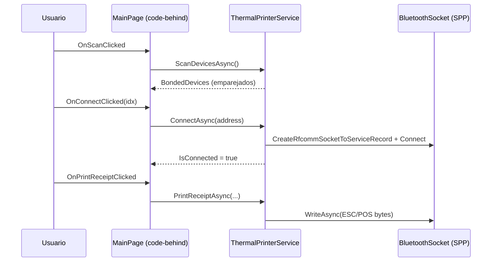

# Índice 03 — Impresión térmica

> **Propósito**: mapear el dominio de impresión térmica Bluetooth (ESC/POS 58mm) del repositorio de ejemplos, contrastando la impresión directa con ESCPOS_NET y el motor de documentos DSL `MotorDsl.*`.
> **Fuente primaria**: `Ejemplos_Devices/Printer/`.
> **Entrada ia-db**: [README](../README.md) · [Índice maestro](00_MASTER-INDEX.md)

---

## 1. Panorama del dominio

El dominio Printer contiene **tres apps MAUI ejecutables** y **una carpeta de documentación rica**. Las apps demuestran dos filosofías de impresión sobre la misma impresora térmica 58mm Bluetooth: emisión **directa** de comandos ESC/POS byte a byte, y un **motor DSL** que renderiza documentos JSON a un raster ESC/POS.

```
Ejemplos_Devices/Printer/
├── Ejemplo_ThermalPrinter/        → Impresión DIRECTA (ESCPOS_NET 2.2.1, SPP propio)
│   └── Services/                     IThermalPrinterService + ThermalPrinterService
├── Ejemplo_MotorDSL/              → Motor DSL "puro" (code-behind + controles MotorDsl.Maui)
│   ├── Pages/  Samples/
├── Ejemplo_MotorDSL_Dialog/       → Motor DSL + overlay/diálogo (MVVM, resultados tipados)
│   ├── Controls/ Models/ Services/ ViewModels/ Samples/
└── Ejemplo_Docs_Printer/          → Documentación (Manuales, Borradores, Prompts, Pruebas)
    ├── Manuales/            (Usuario · Técnico ESC/POS · Integración ESCPOS_NET)
    ├── Borradores/  Prompts_generacion_documentacion/
    ├── Prompts_Generacion_Apk_ejemplo/   (ficheros_claude.ia = 1er prototipo)
    └── Pruebas_realizadas/  (GIF/JPG de impresión real — referenciados, no abrir)
```

> La **app híbrida integrada** del repositorio también consume `MotorDsl.*` para imprimir; esa integración se documenta en el **[Índice 08](08_App-Hibrida-Integrada.md)** y **no se duplica aquí**.

---

## 2. Inventario de ejemplos

| Ejemplo | Enfoque | Patrón UI | Archivos clave |
|---|---|---|---|
| **Ejemplo_ThermalPrinter** | **Directo** — ESC/POS emitido a mano | Code-behind (`ContentPage`) | `Services/IThermalPrinterService.cs`, `Services/ThermalPrinterService.cs`, `Pages/MainPage.xaml.cs`, `MauiProgram.cs` |
| **Ejemplo_MotorDSL** | **DSL** — render JSON→ESC/POS | Code-behind + controles del paquete | `Pages/MainPage.xaml.cs`, `Samples/MultaIntegratedDsl.cs`, `MauiProgram.cs` |
| **Ejemplo_MotorDSL_Dialog** | **DSL** + overlay de estado | **MVVM** (CommunityToolkit.Mvvm) | `Services/PrinterService.cs`, `Services/BluetoothPermissions.cs`, `ViewModels/PrinterOverlayViewModel.cs`, `ViewModels/StatusOverlayViewModel.cs`, `Models/*.cs`, `Controls/StatusOverlayView.xaml.cs`, `Samples/MultaIntegratedDsl.cs`, `MauiProgram.cs` |
| **Ejemplo_Docs_Printer** | Documentación | — (Markdown + medios) | `Readme.md`, `Manuales/`, `Borradores/Readme.md`, `Prompts_*/` |

Los tres proyectos apuntan a `net10.0-android` (y `net10.0-ios` sólo en macOS), `SupportedOSPlatformVersion` Android **25.0**, `ApplicationId` bajo `com.ejemplos.devices.*`.
Fuente: `Ejemplo_ThermalPrinter/Ejemplo_ThermalPrinter.csproj`, `Ejemplo_MotorDSL/Ejemplo_MotorDSL.csproj`, `Ejemplo_MotorDSL_Dialog/Ejemplo_MotorDSL_Dialog.csproj`.

### 2.1 Matriz de `.csproj`

| Proyecto | `ApplicationTitle` / `ApplicationId` | Paquetes de impresión | Paquetes UI extra |
|---|---|---|---|
| `Ejemplo_ThermalPrinter` | "Thermal Printer" / `...ThermalPrinter` | `ESCPOS_NET 2.2.1` | `BarcodeScanner.Mobile.Maui 9.0.1` |
| `Ejemplo_MotorDSL` | "MotorDsl NuGet" / `...MotorDSL` | `MotorDsl.* 1.0.12` (×7) | — (controles vienen en `MotorDsl.Maui`) |
| `Ejemplo_MotorDSL_Dialog` | "MotorDsl NuGet Dialog" / `...MotorDSL.Dialog` | `MotorDsl.* 1.0.12` (×7) | `CommunityToolkit.Maui[.Core] 14.2.0`, `CommunityToolkit.Mvvm 8.4.2` |

Común a los tres: `Microsoft.Maui.Controls`, `Microsoft.Extensions.Logging.Debug 10.0.3`, formato de paquete Android `apk`, `EmbedAssembliesIntoApk`. Fuente: los tres `.csproj`.

---

## 3. Hardware objetivo — impresora térmica 58mm Bluetooth

| Atributo | Valor | Fuente |
|---|---|---|
| Modelo documentado | **58HB6-THERMAL-PRINTER** (publicación ML: "58HB4") | `Manuales/Readme.md`, `Prompts_generacion_documentacion/03_Prompt_copilot_manual_borrador.md` |
| Ancho de papel | **58 mm = 384 puntos** @ 203 DPI | `Borradores/Readme.md`, `ThermalPrinterService.cs` (`PAPER_WIDTH_58MM = 384`) |
| Caracteres por línea | **32** (normal) / 16 (doble ancho) | `Borradores/Readme.md`; `DeviceProfile(..., 32, ...)` en código DSL |
| Conectividad | **Bluetooth Classic 5.0 (SPP)** + USB Type-C | `Manuales/Readme.md` |
| Protocolo | **ESC/POS** (Epson, ~95% compat.) | `Manuales/Readme.md` |
| Codificación | **PC858 (Latin-9 Euro)** | `ThermalPrinterService.cs` (`CodePage.PC858_EURO`) |

> **Nomenclatura en código**: los perfiles DSL se construyen con el id `"58HB6"` en línea (`new DeviceProfile("58HB6", 32, "escpos-bitmap")`) mientras que el perfil **registrado** en DI es `"thermal_58mm"`. El id `"58H6"` referido informalmente equivale a este modelo. Fuente: `Ejemplo_MotorDSL/Pages/MainPage.xaml.cs:129`, `Ejemplo_MotorDSL_Dialog/ViewModels/MainViewModel.cs:33`, ambos `MauiProgram.cs`.

---

## 4. Dos enfoques contrastados: directo vs DSL

| Dimensión | **Impresión directa** (`Ejemplo_ThermalPrinter`) | **Motor DSL** (`Ejemplo_MotorDSL` / `_Dialog`) |
|---|---|---|
| Dependencia de impresión | `ESCPOS_NET 2.2.1` (emisor `EPSON`) | `MotorDsl.*` 1.0.12 (7 paquetes) |
| Transporte BT | Propio: `BluetoothSocket` RFCOMM (Android nativo) | `MotorDsl.Bluetooth` → `AddBluetoothPrinterTransport()` |
| Modelo del documento | Llamadas imperativas (`PrintTextAsync`, `PrintReceiptAsync`…) | **Documento JSON declarativo** → `IDocumentEngine.Render` |
| Salida | Comandos ESC/POS de texto/estilo combinados con `ByteSplicer` | **`byte[]` raster ESC/POS bitmap** (renderer `escpos-bitmap`) |
| Interfaz de servicio | `Ejemplo_ThermalPrinter.Services.IThermalPrinterService` (propia) | `MotorDsl.Printing.IThermalPrinterService` (del paquete) |
| Imágenes / QR / barcode | QR y barcode **simplificados** (sólo imprimen el dato); imagen `NotImplementedException` | Imagen bitmap y `qrcode` **nativos** en el DSL (nodo `image`) |
| Acoplamiento a UI | Alto (lógica en `MainPage.xaml.cs`) | Bajo: render independiente + servicio/overlay reutilizable |

**Idea central del enfoque DSL**: *renderizar SIEMPRE primero* (diagnóstico independiente de la impresora) y sólo entonces resolver permisos/descubrimiento/conexión/envío. Fuente: `Ejemplo_MotorDSL/Pages/MainPage.xaml.cs:119-158`, `Ejemplo_MotorDSL_Dialog/ViewModels/MainViewModel.cs:29-42`.

### 4.1 Contraste de firmas — las dos interfaces `IThermalPrinterService`

| Capacidad | Propia (`Ejemplo_ThermalPrinter.Services`) | Del paquete (`MotorDsl.Printing`) |
|---|---|---|
| Estado | `bool IsConnected` | `bool IsConnected` |
| Descubrir | `Task<List<BluetoothDevice>> ScanDevicesAsync()` | `Task<...> DiscoverDevicesAsync(kind: "bluetooth")` |
| Conectar | `Task<bool> ConnectAsync(string deviceAddress)` | `Task<bool> ConnectAsync(PrinterDevice device)` |
| Imprimir | `PrintTextAsync/PrintReceiptAsync/PrintBarcodeAsync/...` (imperativo) | `Task SendBytesAsync(byte[] bytes)` (bytes ya renderizados) |
| Modelo de device | `BluetoothDevice { Name, Address, IsPaired }` | `PrinterDevice { Id, Name }` |

La app directa **construye** los comandos; la app DSL **envía** bytes producidos por el motor. Fuente: `Ejemplo_ThermalPrinter/Services/IThermalPrinterService.cs`, `Ejemplo_MotorDSL_Dialog/Services/PrinterService.cs:53-100`.

---

## 5. Impresión directa — `Ejemplo_ThermalPrinter`

### 5.1 Servicio

- **`IThermalPrinterService`** (`Services/IThermalPrinterService.cs`): API imperativa — `ScanDevicesAsync()`, `ConnectAsync(deviceAddress)`, `PrintTextAsync(text,fontSize,bold,centered)`, `PrintReceiptAsync(...)`, `PrintBarcodeAsync`, `PrintQRCodeAsync`, `PrintImageAsync`, `FeedLinesAsync`, `CutPaperAsync`. Tipos auxiliares `BluetoothDevice` y `enum BarcodeType`.
- **`ThermalPrinterService`** (`Services/ThermalPrinterService.cs`): implementación `#if ANDROID`.
  - Descubrimiento vía `BluetoothAdapter.DefaultAdapter.BondedDevices` (**sólo dispositivos ya emparejados**).
  - Conexión: `CreateRfcommSocketToServiceRecord(UUID 00001101-0000-1000-8000-00805F9B34FB)` (SPP estándar) → `socket.Connect()`.
  - Emisión: emisor `EPSON` de ESCPOS_NET, `CodePage(PC858_EURO)`, estilos `PrintStyle.Bold/FontB`, alineación, `ByteSplicer.Combine(...)` y `outputStream.WriteAsync`.
  - `PrintReceiptAsync` compone ticket completo (encabezado, ítems tabulados a 32 cols, subtotal/impuesto/total, `FeedLines(3)` + `FullCutAfterFeed(5)`).

### 5.2 Limitaciones conocidas del ejemplo directo

- `PrintBarcodeAsync` / `PrintQRCodeAsync`: comentario en código indica que ESCPOS_NET 2.2.1 "puede no soportar" barcode/QR; la impl. **sólo imprime el dato como texto**.
- `PrintImageAsync`: lanza `NotImplementedException` (conversión raster pendiente, `TODO`).
Fuente: `Services/ThermalPrinterService.cs:281-344`.

### 5.3 Comandos ESC/POS emitidos (vía emisor `EPSON` de ESCPOS_NET)

| Operación | Métodos del emisor | Uso en el ejemplo |
|---|---|---|
| Inicializar | `Initialize()` | Al conectar y al iniciar un ticket |
| Codificación | `CodePage(CodePage.PC858_EURO)` | Acentos, `€`, `ñ`, `ç` |
| Alineación | `LeftAlign()` / `CenterAlign()` / `RightAlign()` | Texto, encabezado, totales |
| Estilo | `SetStyles(PrintStyle.Bold / FontB / None)` | Negrita y fuente B (tamaño) |
| Texto | `Print(text)` / `PrintLine("")` | Líneas de contenido |
| Papel | `FeedLines(n)` / `FullCutAfterFeed(5)` | Avance y corte tras ticket |
| Combinación | `ByteSplicer.Combine(cmds)` → `OutputStream.WriteAsync` | Batch de bytes por operación |

Fuente: `Services/ThermalPrinterService.cs:148-366`.

### 5.4 Flujo directo (code-behind)


Fuente: `Ejemplo_ThermalPrinter/Pages/MainPage.xaml.cs:86-233`.

### 5.5 Registro DI

`MauiProgram.cs`: `AddSingleton<IThermalPrinterService, ThermalPrinterService>()` + `AddTransient<MainPage>()`. Sin paquetes MotorDsl.

---

## 6. Motor DSL — los 7 paquetes `MotorDsl.*`

Referenciados como `PackageReference` (no `ProjectReference`, "para validar los paquetes publicados"). **Versión (actualizado al commit `fd6a1ed`):** `Ejemplo_MotorDSL` en **1.0.12** (`Ejemplo_MotorDSL.csproj:85-91`); `Ejemplo_MotorDSL_Dialog` en **1.0.13** (`Ejemplo_MotorDSL_Dialog.csproj:90-96`). El commit `fd6a1ed` bumpeó el Dialog de 1.0.12 a 1.0.13 tras la indexación inicial (`@24d611d`, donde ambos estaban en 1.0.12).

| # | Paquete | Rol | Evidencia de uso |
|---|---|---|---|
| 1 | **MotorDsl.Core** | Contratos y modelos del motor: `IDocumentEngine`, `RenderResult`, `DeviceProfile`, capacidades | `using MotorDsl.Core.Contracts / .Models`; `_engine.Render(doc, profile)` |
| 2 | **MotorDsl.Parser** | Parseo del JSON de documento (formato `template`/`integrated`) al árbol de nodos | Dependencia del pipeline `AddMotorDslEngine()` |
| 3 | **MotorDsl.Rendering** | Renderers de salida: PDF, **ESC/POS bitmap**, SkiaSharp | Comentario "renderers MAUI (PDF, ESC/POS bitmap, SkiaSharp)" en `MauiProgram.cs` |
| 4 | **MotorDsl.Extensions** | Azúcar de configuración DI: `AddMotorDslEngine()`, `AddProfiles(...)` | `using MotorDsl.Extensions`; `builder.Services.AddMotorDslEngine()` |
| 5 | **MotorDsl.Printing.Abstractions** | Abstracciones de impresión: `MotorDsl.Printing.IThermalPrinterService`, `PrinterDevice`, `SendBytesAsync` | `using MotorDsl.Printing`; `_printer.SendBytesAsync(bytes)` |
| 6 | **MotorDsl.Bluetooth** | Transporte BT Classic SPP (Android): `AddBluetoothPrinterTransport()` | `using MotorDsl.Bluetooth`; `builder.Services.AddBluetoothPrinterTransport()` |
| 7 | **MotorDsl.Maui** | Integración MAUI: `AddMotorDslMaui()` + controles UI (`StatusBadge`, `DevicePicker`) | `using MotorDsl.Maui`; `StatusBadge.Service`, `DevicePicker.ScanAsync()` en `Ejemplo_MotorDSL/Pages/MainPage.xaml.cs` |

### 6.1 Cableado DI del motor (idéntico en ambos ejemplos DSL)

```csharp
builder.Services.AddMotorDslEngine()
    .AddProfiles(p => p.Add(new DeviceProfile("thermal_58mm", 32, "escpos-bitmap")))
    .AddMotorDslMaui();
builder.Services.AddBluetoothPrinterTransport();   // Android Classic SPP
```
Fuente: `Ejemplo_MotorDSL/MauiProgram.cs:29-41`, `Ejemplo_MotorDSL_Dialog/MauiProgram.cs:41-49`.

### 6.2 Perfil de dispositivo y capacidades del render

El perfil que se pasa a `Render` se construye en línea con capacidades del renderer bitmap:

```csharp
var profile = new DeviceProfile("58HB6", 32, "escpos-bitmap");
profile.SetCapability("supports_bitmap", true);
profile.SetCapability("bitmap_max_width_px", 320);
profile.SetCapability("bitmap_binarization_threshold", 128);
var result = _engine.Render(doc, profile);   // result.Output is byte[]
```
Fuente: `Ejemplo_MotorDSL/Pages/MainPage.xaml.cs:129-133`, `Ejemplo_MotorDSL_Dialog/ViewModels/MainViewModel.cs:33-38`.

### 6.3 Contrato `RenderResult` (`MotorDsl.Core.Models`)

El consumidor sólo depende de estos miembros observados en el código:

| Miembro | Uso |
|---|---|
| `IsSuccessful` | Guard antes de tocar la impresora |
| `Output` (`is byte[] bytes`) | Bytes ESC/POS a enviar con `SendBytesAsync` |
| `Errors` | `Errors.FirstOrDefault()` → mensaje mostrado en overlay/label |
| `Warnings` | Volcado a consola en `Ejemplo_MotorDSL` (`[MULTA-WARN]`) |

Fuente: `Ejemplo_MotorDSL/Pages/MainPage.xaml.cs:135-147`, `Ejemplo_MotorDSL_Dialog/ViewModels/PrinterOverlayViewModel.cs:31-41`.

### 6.4 Controles UI de `MotorDsl.Maui` (usados en `Ejemplo_MotorDSL`)

| Control | Miembros usados | Rol |
|---|---|---|
| `StatusBadge` | `.Service = _printer` | Indicador de estado de conexión |
| `DevicePicker` | `.Service`, `.ScanAsync()`, evento `DeviceSelected`, evento `ScanError` | Descubrir/seleccionar impresora en la vista |

Fuente: `Ejemplo_MotorDSL/Pages/MainPage.xaml.cs:36-51`.

---

## 7. Formato de documento DSL — sample `MultaIntegratedDsl`

El sample compartido por ambos ejemplos DSL es un **acta de infracción de tránsito** en formato **`"integrated"`**.

| Concepto | `integrated` (usado aquí) | `template` (formato general del motor) |
|---|---|---|
| Placeholders `{{...}}` | No — ya resueltos | Sí |
| `loop` / `conditional` | No — ya expandidos | Sí |
| Etapa `Evaluate` | **Omitida** | Requerida antes de `Render` |
| Llamada | `IDocumentEngine.Render(integratedJson, profile)` | `Evaluate(...)` → `Render(...)` |

### 7.1 Tipos de nodo del documento (observados en el sample)

| `type` | Propiedades relevantes | Ejemplo en el acta |
|---|---|---|
| `container` | `layout: "vertical"`, `children[]` | Raíz y bloques por infracción |
| `text` | `value`, `style.align`, `style.bold` | Encabezados, datos, totales, separadores |
| `image` (bitmap) | `source: "data:image/bmp;base64,..."`, `imageType: "bitmap"`, `width`, `style.align` | Logo municipal, firma del inspector |
| `image` (qrcode) | `source: "https://..."`, `imageType: "qrcode"` | QR de pago de la multa |

- **Estructura del JSON**: raíz `container` (`layout: vertical`) con hijos `text` (con `style.align/bold`), `image` (`imageType: "bitmap"` con `data:image/bmp;base64,...` para logo y firma; `imageType: "qrcode"` con URL para el pago) y contenedores anidados por infracción.
- Las imágenes bitmap embebidas son **BMP 4-bit en base64** (placeholder de logo municipal y firma de inspector).
- **Divergencia de namespace entre copias**: en `Ejemplo_MotorDSL` la clase está en `namespace Ejemplo_MotorDSL.Samples`; en `Ejemplo_MotorDSL_Dialog` la misma clase está en `namespace Ejemplo_MotorDSL.Templates` (el `MainViewModel` la importa vía `using Ejemplo_MotorDSL.Templates`). Fuente: `Ejemplo_MotorDSL/Samples/MultaIntegratedDsl.cs:2`, `Ejemplo_MotorDSL_Dialog/Samples/MultaIntegratedDsl.cs:2`, `Ejemplo_MotorDSL_Dialog/ViewModels/MainViewModel.cs:7`.

---

## 8. Flujo Bluetooth → render → impresión

```mermaid
flowchart TD
    A[Documento JSON DSL<br/>MultaIntegratedDsl] --> B{IDocumentEngine.Render<br/>doc + DeviceProfile 58HB6}
    B -->|RenderResult NO ok| BE[Mostrar error de render<br/>diagnóstico independiente de impresora]
    B -->|RenderResult ok = byte[] ESC/POS| C{EnsurePermissionsAsync<br/>Bluetooth}
    C -->|Denegado / Restringido| CE[UI de permiso:<br/>pedir de nuevo / abrir ajustes]
    C -->|Granted| D[DiscoverAsync<br/>kind: bluetooth]
    D -->|Empty| DE[Encendé la impresora y reintentá]
    D -->|BluetoothOff| DO[Activá Bluetooth / abrir ajustes]
    D -->|NotSupported| DN[Sólo Android BT Classic SPP]
    D -->|Found devices| E{Impresora predeterminada<br/>en la lista?}
    E -->|Sí| G[ConnectAsync device]
    E -->|1 sola| G
    E -->|Varias| F[Selector de impresora] --> G
    G -->|falla| GE[Reintentar / elegir otra]
    G -->|ok → SaveDefault en Preferences| H[SendBytesAsync byte[]]
    H -->|Success| I[Impreso ✔ / ocultar overlay]
    H -->|Failure| HE[Reintentar impresión]
```

El **render precede siempre** al acceso a la impresora: garantiza que un fallo de generación del documento se distinga de un fallo de hardware/BT. Fuente: `PrinterOverlayViewModel.cs:31-127`, `PrinterService.cs:33-100`.

---

## 9. Permisos Bluetooth

### 9.1 Matriz por versión de Android

| Android | Permisos runtime requeridos | Fuente |
|---|---|---|
| **12+ (API 31+)** | `BLUETOOTH_SCAN` + `BLUETOOTH_CONNECT` | `BluetoothPermissions.cs:12-18`, `Ejemplo_MotorDSL/Pages/MainPage.xaml.cs:64-67` |
| **< 12** | `ACCESS_FINE_LOCATION` (el escaneo BT lo exige) | `BluetoothPermissions.cs:19`, `Ejemplo_ThermalPrinter/Pages/MainPage.xaml.cs:40-53` |

### 9.2 Tres estrategias de solicitud (una por ejemplo)

| Ejemplo | Mecanismo | Notas |
|---|---|---|
| `Ejemplo_ThermalPrinter` | `Permissions.LocationWhenInUse` + `ActivityCompat.RequestPermissions` | Pide ubicación primero, luego SCAN/CONNECT en API 31+ |
| `Ejemplo_MotorDSL` | `ActivityCompat.RequestPermissions` + `Task.Delay(3000)` y re-chequeo | Si no se concede: "Aceptá los permisos y presioná Reescanear" |
| `Ejemplo_MotorDSL_Dialog` | **`BluetoothPermissions : Permissions.BasePlatformPermission`** awaitable | Patrón MAUI Essentials: `CheckStatusAsync`/`RequestAsync`/`ShouldShowRationale` → normaliza a `enum BluetoothPermissionResult` |

> MAUI **no** trae `Permissions.Bluetooth`; por eso `Ejemplo_MotorDSL_Dialog` define un permiso awaitable propio. Fuente: `Ejemplo_MotorDSL_Dialog/Services/BluetoothPermissions.cs:3-8`.

`BluetoothPermissionResult` = `Granted` · `DeniedCanRetry` (rationale) · `Denied` ("no volver a preguntar" → sólo ajustes) · `Restricted` (política MDM/parental). Fuente: `Models/BluetoothPermissionResult.cs`.

---

## 10. Variante con diálogo/overlay — `Ejemplo_MotorDSL_Dialog`

Añade una capa MVVM reutilizable sobre el motor DSL. Referencia además `CommunityToolkit.Maui[.Core] 14.2.0` y `CommunityToolkit.Mvvm 8.4.2`.

### 10.1 Capas

| Capa | Tipo | Responsabilidad |
|---|---|---|
| Orquestador de dominio | `Services/PrinterService.cs` | Compone permisos + descubrimiento + conexión + envío sobre `MotorDsl.Printing.IThermalPrinterService`; devuelve resultados tipados; **guarda impresora predeterminada** en `Preferences` |
| Permiso awaitable | `Services/BluetoothPermissions.cs` | Ver §9.2 |
| ViewModel de impresión | `ViewModels/PrinterOverlayViewModel.cs` | Máquina del flujo BT: recibe `RenderResult`, maneja permiso→descubrir→seleccionar→conectar→imprimir, con reintentos (`_bytes`, `_lastDevice`, `_lastRender`) |
| ViewModel base de overlay | `ViewModels/StatusOverlayViewModel.cs` | Máquina de 3 estados `None/Busy/Error` + botonera dinámica (`OverlayAction`) |
| ViewModel principal | `ViewModels/MainViewModel.cs` | Botón "Imprimir ejemplo": renderiza el acta y delega en el overlay |
| Vista overlay | `Controls/StatusOverlayView.xaml(.cs)`, `Pages/OverlayBlueToothThermalPrintPage.xaml` | Presentación de las capas Busy/Error |

### 10.2 Resultados tipados (evitan `try/catch` en el ViewModel)

| Tipo (`Models/`) | Casos |
|---|---|
| `DiscoverResult` | `Found(devices)` · `Empty` · `BluetoothOff(msg)` · `NotSupported` |
| `PrintResult` | `Success` · `Failure(msg)` |
| `BluetoothPermissionResult` (enum) | `Granted` · `DeniedCanRetry` · `Denied` · `Restricted` |

El `PrinterOverlayViewModel` hace `switch` sobre estos records y mapea cada caso a una capa de UI con acciones (Reintentar / Elegir otra / Abrir configuración / Cerrar). Fuente: `PrinterOverlayViewModel.cs:59-153`.

### 10.3 Impresora predeterminada

`PrinterService.ConnectAsync` **auto-guarda** el device conectado (`Preferences "default_printer_id"/"default_printer_name"`); `GetDefaultIfPresent` la reutiliza sólo si aparece en el descubrimiento actual, saltando el selector. Fuente: `PrinterService.cs:73-106`.

### 10.4 Mapeo estado del flujo → capa de overlay

| Situación | Capa mostrada | Acciones (botonera) |
|---|---|---|
| Verificando permisos / buscando / conectando / enviando | **Busy** (`timer.gif`) | — |
| Render falló | Error | Cerrar |
| Permiso `DeniedCanRetry` | Error | Pedir permiso · Cerrar |
| Permiso `Denied` | Error | Abrir configuración · Cerrar |
| Permiso `Restricted` | Error | Cerrar |
| `DiscoverResult.Empty` | Error | Reintentar · Cerrar |
| `DiscoverResult.BluetoothOff` | Error | Reintentar · Abrir configuración · Cerrar |
| Varias impresoras | Error (selector) | 1 botón por device · Cerrar |
| Conexión falló | Error | Reintentar · Elegir otra · Cerrar |
| Envío falló | Error | Reintentar · Cerrar |
| Envío OK | Overlay oculto (`Hide()`) | — |

Los reintentos reutilizan el último estado (`_lastRender`, `_lastDevice`, `_bytes`) sin re-renderizar. Fuente: `PrinterOverlayViewModel.cs:31-177`.

---

## 11. Documentación rica — `Ejemplo_Docs_Printer`

| Recurso | Contenido | Ruta |
|---|---|---|
| Manual de Usuario | Operación física, LED, botón multifunción, emparejamiento, troubleshooting | `Manuales/01_MANUAL_USUARIO.md` |
| Manual Técnico ESC/POS | Tabla de comandos hex, code pages (PC858), barcode/QR, buffers | `Manuales/02_MANUAL_TECNICO_ESC_POS.md` |
| Guía integración ESCPOS_NET | Setup .NET MAUI, DI, permisos, ejemplos C# listos | `Manuales/03_GUIA_INTEGRACION_ESCPOS_NET.md` |
| Borrador de manual | Manual general no estructurado | `Manuales/04_Borrador_Manual.md` |
| Resumen de prompts (manuales) | Metodología ChatGPT→Copilot para generar los manuales | `Prompts_generacion_documentacion/*.md` |
| Prompts del 1er APK | Prototipo previo (`ficheros_claude.ia`: `Thermalprintermaui.csproj` net8.0, `Ithermalprinterservice.cs`, etc.) | `Prompts_Generacion_Apk_ejemplo/` |
| Pruebas reales | Impresión en Android 13 (medios binarios) | `Pruebas_realizadas/ejemplo_print_thermal.gif`, `ejemplo_impresion.jpg` |

> El **prototipo** en `Prompts_Generacion_Apk_ejemplo/ficheros_claude.ia/` es una versión anterior sobre **`net8.0-android`** con `ESCPOS_NET`; es el germen de `Ejemplo_ThermalPrinter`, no una app mantenida. Los medios de `Pruebas_realizadas/` se **referencian por ruta**, no se abren como binario.

### 11.1 Prototipo `ficheros_claude.ia/` (net8.0)

| Archivo | Rol |
|---|---|
| `Thermalprintermaui.csproj` | Proyecto MAUI `net8.0-android` inicial |
| `Ithermalprinterservice.cs` / `Thermalprinterservice.cs` | Antecesores del servicio actual |
| `Advancedprintingexamples.cs` | Ejemplos avanzados de tickets/impresión |
| `MainPage.XAML.cs` / `MauiProgram.cs` | Página y wiring del prototipo |
| `Instalacion.md` / `Thermalprintermaui_readme.md` | Notas de setup del prototipo |

### 11.2 Metodología de generación de la documentación

Cadena **ChatGPT → Copilot** documentada en `Prompts_generacion_documentacion/Readme.md`: (1) `01_Prompt_chatgpt.md` decide qué manuales generar; (2) `02_Prompt_copilot.md` produce los 3 manuales estructurados; (3) `03_Prompt_copilot_manual_borrador.md` genera el borrador no estructurado a partir de la foto del producto (58HB4/58HB6).

---

## 12. Decisiones y gotchas

- **Versión de los paquetes MotorDsl.* (actualizado a `fd6a1ed`):** `Ejemplo_MotorDSL` = **1.0.12**, `Ejemplo_MotorDSL_Dialog` = **1.0.13**. En la indexación inicial (`@24d611d`) ambos estaban en 1.0.12; el commit `fd6a1ed` (`fix(hibrida)…`) bumpeó el Dialog a 1.0.13, alineándolo con la app híbrida. Fuente: `Ejemplo_MotorDSL.csproj:85-91` (1.0.12), `Ejemplo_MotorDSL_Dialog.csproj:90-96` (1.0.13).
- **Dos interfaces `IThermalPrinterService` distintas y no intercambiables**: la propia de `Ejemplo_ThermalPrinter` (`Scan/Connect(address)/PrintText…`) vs. la de `MotorDsl.Printing` (`DiscoverDevicesAsync(kind)/ConnectAsync(PrinterDevice)/SendBytesAsync(byte[])`). No compartir código entre ambos mundos.
- **Sólo Android imprime**: el transporte es BT Classic **SPP**; `PrinterService.IsSupported` es `false` fuera de Android e iOS retorna `Granted` sin flujo real. Fuente: `PrinterService.cs:21-27`.
- **Render primero, hardware después**: patrón deliberado para separar fallos de documento de fallos de impresora/BT (diagnóstico y reintentos sin re-renderizar; `PedirPermiso` reusa `_lastRender`).
- **Permisos BT sin `Permissions.Bluetooth` nativo**: la variante Dialog implementa un `BasePlatformPermission` awaitable; los otros ejemplos usan `ActivityCompat.RequestPermissions` (con `Task.Delay` de polling en `Ejemplo_MotorDSL`, frágil ante timing).
- **Descubrimiento = sólo emparejados** en el ejemplo directo (`BondedDevices`): la impresora debe emparejarse antes desde Ajustes de Android.
- **Capacidades del render bitmap** fijadas en código (`bitmap_max_width_px=320`, `binarization_threshold=128`, ancho 58mm=384pt): ajustar si cambia el modelo/ancho.
- **Perfil registrado (`thermal_58mm`) ≠ perfil usado en `Render` (`58HB6`)**: el `Render` recibe un perfil construido en línea; el perfil de `AddProfiles` puede quedar sin usarse en el camino de impresión.
- **Divergencia de namespace del sample** entre las dos apps DSL (`.Samples` vs `.Templates`) — cuidado al copiar código entre ellas.
- **Barcode/QR/imagen no funcionales en el ejemplo directo** (ver §5.2): usar el motor DSL si se necesitan bitmaps/QR reales.

---

## 13. Referencias cruzadas

- **Índice 08 — App híbrida**: integración de `MotorDsl.*` dentro de la app híbrida (no duplicada aquí).
- **Fuentes primarias** (project-relative):
  - Directo: `Ejemplos_Devices/Printer/Ejemplo_ThermalPrinter/Services/`
  - DSL puro: `Ejemplos_Devices/Printer/Ejemplo_MotorDSL/`
  - DSL + overlay: `Ejemplos_Devices/Printer/Ejemplo_MotorDSL_Dialog/`
  - Docs: `Ejemplos_Devices/Printer/Ejemplo_Docs_Printer/`
- Librerías externas: `ESCPOS_NET 2.2.1` (ejemplo directo), `MotorDsl.* 1.0.12` (7 paquetes), `CommunityToolkit.Maui 14.2.0` + `CommunityToolkit.Mvvm 8.4.2` (variante Dialog).

---

## 14. Glosario

| Término | Significado |
|---|---|
| **ESC/POS** | Protocolo de comandos de impresión de Epson para puntos de venta |
| **SPP** | Serial Port Profile de Bluetooth Classic (UUID `00001101-...`), transporte usado en todos los ejemplos |
| **58mm / 384pt** | Ancho de papel térmico y su equivalente en puntos a 203 DPI (32 col.) |
| **DSL integrado** | Documento JSON con valores ya resueltos: sin placeholders/loops/conditionals, sin etapa `Evaluate` |
| **escpos-bitmap** | Renderer de `MotorDsl.Rendering` que produce raster ESC/POS (`byte[]`) |
| **DeviceProfile** | Descriptor de la impresora (id, columnas, renderer, capacidades) que recibe `Render` |
| **Overlay** | Capa de UI de estado (`Busy`/`Error`) del ejemplo Dialog, con botonera dinámica |
| **RenderResult** | Resultado del motor: `IsSuccessful`, `Output` (`byte[]`), `Errors`, `Warnings` |
