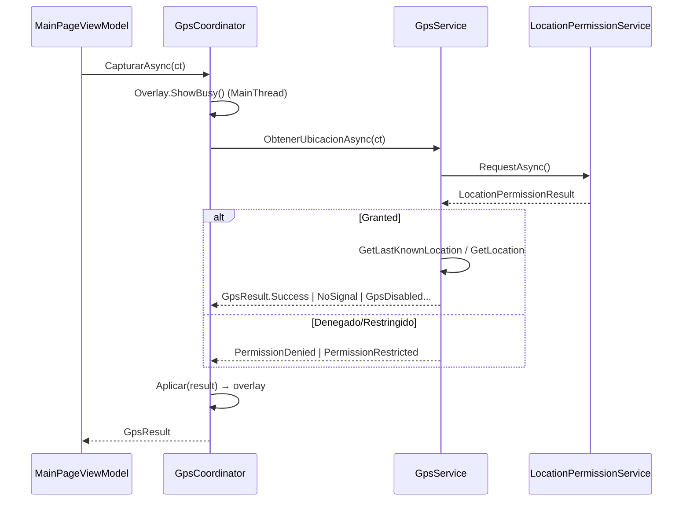

# Índice 04 — GPS

> **Propósito**: Geolocalización en .NET MAUI con capa de permisos, resultado tipado, overlay reutilizable y geocodificación inversa vía Google.
> **Fuente primaria**: `Ejemplos_Devices/GPS/`.
> **Entrada ia-db**: [README](../README.md) · [Índice maestro](00_MASTER-INDEX.md)

## Proyectos del dominio

| Proyecto | Rol | Ruta |
|---|---|---|
| `Ejemplo_Maui_GPS` | App MAUI (MVVM manual) con captura de ubicación | `Ejemplos_Devices/GPS/Ejemplo_Maui_GPS/` |
| `Ejemplo_Docs_GPS` | Notas: link a docs MS, gestión de API keys, alternativas de diseño | `Ejemplos_Devices/GPS/Ejemplo_Docs_GPS/` |

## API MAUI y paquetes

| Elemento | Valor | Fuente |
|---|---|---|
| API de ubicación | `Geolocation.GetLastKnownLocationAsync()` / `GetLocationAsync(GeolocationRequest)` (Essentials, sin NuGet extra) | `Services/GpsService.cs:43-47` |
| Permisos | `Permissions.LocationWhenInUse` (`CheckStatusAsync` / `RequestAsync` / `ShouldShowRationale`) | `Services/LocationPermissionService.cs:9,22,36` |
| Ir a ajustes | `AppInfo.ShowSettingsUI()` | `Services/LocationPermissionService.cs:43` |
| Abrir mapa externo | `Browser.Default.OpenAsync("https://maps.google.com/?q=lat,lng")` | `ViewModels/MainPageViewModel.cs:68-69` |
| Geocodificación inversa | REST `maps.googleapis.com/maps/api/geocode/json` vía `HttpClient` | `Services/GoogleMapService.cs:12,22-24` |
| Paquetes NuGet | `Microsoft.Maui.Controls`, `Microsoft.Extensions.Logging.Debug 10.0.2` (sin paquete de geolocalización: es API integrada) | `Ejemplo_Maui_GPS.csproj:82-83` |
| Targets | `net10.0-android` (+ `net10.0-ios` solo en macOS). Sin Windows. minSdk Android 25 / iOS 15 | `Ejemplo_Maui_GPS.csproj:4-5,25-26` |

## Permisos de plataforma

| Plataforma | Permiso / clave | Nota | Fuente |
|---|---|---|---|
| Android | `ACCESS_FINE_LOCATION` | Ubicación precisa (GPS) | `Platforms/Android/AndroidManifest.xml:14` |
| Android | `ACCESS_COARSE_LOCATION` | Acompañante obligatorio de FINE desde API 31 | `Platforms/Android/AndroidManifest.xml:20` |
| Android | `ACCESS_BACKGROUND_LOCATION` | **Comentado**; solo si se necesita 2.º plano (se pide separado en Android 10+) | `Platforms/Android/AndroidManifest.xml:26` |
| Android | `uses-feature location.gps required="false"` | Permite instalar en dispositivos sin GPS | `Platforms/Android/AndroidManifest.xml:32` |
| iOS | `NSLocationWhenInUseUsageDescription` | **Obligatorio**: sin la clave la app crashea al pedir ubicación | `Platforms/iOS/Info.plist:64` |
| iOS | `NSLocationAlwaysAndWhenInUseUsageDescription` | Declarado; solo requerido para 2.º plano (Always) | `Platforms/iOS/Info.plist:66` |

## Arquitectura (capas)

```
LocationPermissionService  → resuelve permiso → LocationPermissionResult (enum)
        │
GpsService                 → permiso + lectura → GpsResult (record sellado)
        │
GpsCoordinator (singleton) → dueño del overlay + CancellationTokenSource
        │
MainPageViewModel          → orquesta texto/comandos; escucha Overlay.IsVisible
        │
MainPage.xaml + GpsStatusOverlayView (ContentView reutilizable)
```
Registro DI en `MauiProgram.cs:32-42` (servicios singleton; VM y Page transient).

## Modelos de resultado tipado

| Tipo | Casos | Fuente |
|---|---|---|
| `GpsResult` (record) | `Success(Location)`, `PermissionDenied(CanRetry)`, `PermissionRestricted`, `GpsDisabled`, `NotSupported`, `NoSignal`, `Cancelled`, `Failure(Message)` | `Services/GpsResult.cs:7-14` |
| `LocationPermissionResult` (enum) | `Granted`, `DeniedCanRetry`, `Denied`, `Restricted` | `Services/LocationPermissionResult.cs:6-11` |

El VM hace `switch` sobre `GpsResult` para producir texto (`ActualizarTexto`, `MainPageViewModel.cs:83-97`); el `GpsCoordinator` hace `switch` para mostrar/ocultar el overlay (`Aplicar`, `GpsCoordinator.cs:56-70`).

## Flujo de captura



## Overlay reutilizable

- `Controls/GpsStatusOverlayView.xaml`: `ContentView` con `IsVisible="{Binding IsVisible}"`; panel de espera (`IsBusy`, gif `satelite.gif`) y panel de permisos denegados/restringidos (`IsDenied`) con botones "Pedir permiso" / "Abrir configuración" / "Cerrar" (`:32-35`).
- `ViewModels/GpsOverlayViewModel.cs`: expone `IsBusy`/`IsDenied`/`IsVisible`, `CanRetry`/`MustOpenSettings` y comandos; recibe callbacks `onRetry`/`onOpenSettings` desde el coordinador (`:10-15`), no de la página.
- La página enlaza `BindingContext="{Binding Overlay}"` sobre el control (`Pages/MainPage.xaml:32`).
- Iconografía por fuente `MaterialIconsOutlined` (registrada en `MauiProgram.cs:19`).

## Semántica de permisos multiplataforma

| Situación | Android | iOS | Resultado |
|---|---|---|---|
| Concedido | Granted | Granted | `Granted` |
| Denegado, re-preguntable | `ShouldShowRationale == true` | (no aplica) | `DeniedCanRetry` → botón "Pedir permiso" |
| "No volver a preguntar" / denegado iOS | rationale `false` | denegado | `Denied` → botón "Abrir configuración" |
| Política de dispositivo | — | Restricted (MDM/parental) | `Restricted` |

`ShouldShowRationale` está bajo `#if ANDROID` (`LocationPermissionService.cs:35-37`).

## Gestión de API key (Google Geocoding)

- `GoogleMapService` lee la key de `ApiKeys.GoogleMaps` (clase `ApiKeys.cs` **ignorada por git**; existe un `.template` versionado) — `Services/GoogleMapService.cs:9-11`.
- Guía completa del patrón (5 opciones; se adopta la clase estática + template) en `Ejemplo_Docs_GPS/secret.md`.
- Referencia oficial MS Geolocation: `Ejemplo_Docs_GPS/Readme.md`. Alternativas de diseño para que un servicio dispare el overlay: `Ejemplo_Docs_GPS/servicio.md`.

## Gotchas

- **iOS crashea sin `NSLocationWhenInUseUsageDescription`** — la clave es obligatoria antes de pedir ubicación (`Info.plist:60-65`).
- `GpsService` usa primero `GetLastKnownLocationAsync` y solo pide fix nuevo si la última posición tiene >1 minuto (`GpsService.cs:43-48`); hay una versión con `GeolocationAccuracy.Best` comentada.
- **Bug latente**: el setter de `Domicilio` escribe sobre `_coordenadas` (`SetProperty(ref _coordenadas, value)`) en vez de `_domicilio` — `MainPageViewModel.cs:24-26`.
- `TestService` (registrado en DI) solo delega en `GpsService` y no está enganchado a la UI; es el caso de referencia de `Ejemplo_Docs_GPS/servicio.md` (`Services/TestService.cs`).
- `ACCESS_BACKGROUND_LOCATION` y `NSLocationAlwaysAndWhenInUse` están previstos pero el ejemplo solo captura en primer plano.
