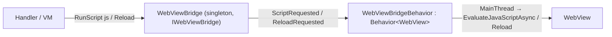

# Índice 08 — App híbrida integrada (WebView + Blazor)

> **Propósito**: documentar el ejemplo insignia — una app .NET MAUI que hospeda un `WebView` remoto y expone al sitio Blazor todos los dispositivos nativos mediante un puente de comandos por URL, con el flujo de impresión térmica end-to-end como caso testigo.
> **Fuente primaria**: `Ejemplos_Devices/Integrada/`.
> **Entrada ia-db**: [README](../README.md) · [Índice maestro](00_MASTER-INDEX.md)

---

## 1. Panorama arquitectónico

La solución son **dos proyectos .NET 10** que dialogan por HTTP/WebView:

| Proyecto | Rol | SDK | Fuente |
|---|---|---|---|
| `Ejemplo_Maui_Hibrida` | Contenedor MAUI: hospeda un `WebView` estándar (no `BlazorWebView`) apuntando a una web remota y consolida todos los dispositivos en `LibApp/` | `Microsoft.NET.Sdk` (MAUI 10.0.80) | `Ejemplo_Maui_Hibrida.csproj` |
| `Ejemplo_ws_Blazor` | Backend de ejemplo: Blazor Interactive Server + API REST que sirve el comprobante imprimible y recibe geolocalización | `Microsoft.NET.Sdk.Web` (net10.0) | `Ejemplo_ws_Blazor.csproj` |

El `WebView` carga `https://aplicada.somee.com` (`Pages/MainPage.xaml.cs:17`). Sobre él conviven **dos canales independientes** (detalle completo en `Ejemplos_Devices/Docs/web-hibrida/maui-hibrido.md`):

```
┌── CONTENEDOR MAUI (Ejemplo_Maui_Hibrida) ─────────────────────────────────┐
│  WebView  Source = "https://aplicada.somee.com"                           │
│                                                                           │
│  Canal A · INTERACTIVIDAD  → Blazor Interactive Server (circuito SignalR) │
│  Canal B · DISPOSITIVOS    → URL "marcada" (?action=print, ?qr=qr…)       │
│            interceptada en Navigating → UrlCommandDispatcher → handler     │
│            nativo → resultado devuelto al DOM (JS) o por re-navegación     │
└───────────────────────────────────────────────────────────────────────────┘
```

- **Canal A** (interactividad de la web) no es responsabilidad de este índice; su análisis y el bug de iOS están en `Docs/web-hibrida/maui-hibrido.md` §3, §6–§7.
- **Canal B** (acceso a dispositivos vía puente de URL) es el corazón de esta app y el foco de este índice (§4–§6).

### 1.1 Arranque y wiring (`MauiProgram.cs`)

| Bloque | Qué registra | Líneas |
|---|---|---|
| Toolkit | `UseMauiCommunityToolkit` + `...Core` + `...Camera` | `MauiProgram.cs:43-45` |
| QR | `UseBarcodeScanning()` (BarcodeScanning.Native.Maui 3.0.4) | `MauiProgram.cs:57` |
| Impresión | `AddMotorDslEngine()` + `AddProfiles(...)` + `AddMotorDslMaui()` + `AddBluetoothPrinterTransport()` | `MauiProgram.cs:61-70` |
| Servicios device | `IGpsService→GpsService`, `INetworkService→NetworkService`, `ICallService→CallService`, `IPrinterService→PrinterService`, `IUiDispatcher→MainThreadDispatcher`, `ApiRelayService` (singletons) — **registrados por interfaz** para que los overlays dependan de la abstracción y los tests inyecten fakes | `MauiProgram.cs:83,93-98` |
| Bridge/páginas | `IWebViewBridge→WebViewBridge`, `IImageService→ImageDeviceAutoRotateService`, páginas de cámara | `MauiProgram.cs:102-105` |
| Handlers URL | 7 `IUrlCommandHandler` + `UrlCommandDispatcher` (orden de registro = orden de evaluación) | `MauiProgram.cs:116-123` |

Shell de página única: `AppShell.xaml` declara sólo `MainPage` como `ShellContent`; `AppShell.xaml.cs:12-14` registra las rutas de navegación de las páginas modales de dispositivo (`MyMediaPickerPage`, `MyMediaSelfiePickerPage`, `QRLectorPage`).

---

## 2. Árbol comentado de `LibApp/`

Todo lo reutilizable vive bajo `Ejemplo_Maui_Hibrida/LibApp/`. Reorganización deliberada: cada dispositivo aislado se consolidó como subcarpeta de `LibApp/Devices/` con su propio `Models/Services/ViewModels/Pages`.

```
LibApp/
├── CustomWebView/                     El WebView personalizado (puente imperativo desacoplado)
│   ├── Behaviors/
│   │   ├── IWebViewBridge.cs          Abstracción: Reload() / RunScript(js) + eventos
│   │   ├── WebViewBridge.cs           Singleton: sólo dispara eventos (no toca el control)
│   │   └── WebViewBridgeBehavior.cs   Behavior<WebView>: traduce eventos → EvaluateJavaScriptAsync/Reload (UI thread)
│   └── Converts/
│       └── WebNavigatingEventArgsConverter.cs   Convierte args de Navigating/Navigated para EventToCommandBehavior
│
├── UrlCommands/                       ★ Puente de comandos por URL (Canal B) — ver §4
│   ├── IUrlCommandHandler.cs          Contrato: CanHandle(url) + CancelsNavigation + DeliveryFor(url) + OnMatchedSync(url) + HandleAsync(url) (los 3 del medio son default interface members)
│   ├── CommandDelivery.cs             enum None/Injection/Substitution — cómo el comando devuelve su resultado a la web (por URL, no por handler)
│   ├── UrlPlan.cs                     record(Matches, Cancel) — resultado de CLASIFICAR una URL, calculado una sola vez y síncrono; Primary = first-match-wins
│   ├── BridgeOutcome.cs               record(CancelNavigation, NavigateTo?) — cómo termina un comando
│   ├── UrlCommandDispatcher.cs        Plan(url) síncrono (clasifica) + ExecuteAsync(plan,url) async (ejecuta); DispatchAsync()/IsCommand() conservados por compatibilidad
│   └── Handlers/                      7 handlers (uno por comando) — ver tabla §4.2
│       ├── GpsCommandHandler.cs
│       ├── CallCommandHandler.cs
│       ├── CameraCommandHandler.cs
│       ├── SelfieCommandHandler.cs
│       ├── QrCommandHandler.cs
│       ├── SendApiCommandHandler.cs
│       └── PrintCommandHandler.cs
│
└── Devices/                           Dispositivos consolidados (reutilizan los ejemplos aislados) — ver §5
    ├── Common/                        Base compartida de overlays
    │   ├── Controls/StatusOverlayView.xaml(.cs)   Capa visual busy/error sobre el WebView
    │   ├── Services/IUiDispatcher.cs  Abstracción de MainThread (BeginInvoke) + impl. MainThreadDispatcher; solo la usa el overlay de Red (§5.1)
    │   └── ViewModels/StatusOverlayViewModel.cs   Estados None/Busy/Error + OverlayAction
    ├── Camera/Pages/                  MyMediaPickerPage, MyMediaSelfiePickerPage (captura con callback)
    ├── GPS/                           IGpsService→GpsService + GpsOverlayViewModel + Models(GpsResult, GpsFailure, GpsErrorCatalog(GPS-*), LocationPermissionResult)
    │   └── ApiRelayService.cs         Relay REST genérico con allowlist de hosts (usado por SendApi); namespace `LibApp.Devices.GPS`
    ├── Images/                        IImageService + ImageDeviceAutoRotateService + SelfieMaskDrawable
    ├── Networks/                      INetworkService→NetworkService + NetworkOverlayViewModel + NetworkResult
    ├── Phone/                         ICallService→CallService + CallOverlayViewModel + Models(CallMode, CallResult…, CallFailure + CallErrorCatalog(TEL-*))
    ├── QRLector/                      QRLectorPage + QRContent
    └── MotorDSL/                      Impresión térmica Bluetooth — ver §6
        ├── DTOs/Print/               PrintDocument, PrintNode, PrintStyle, N (fábrica de nodos)
        ├── Models/                   BluetoothPermissionResult, DiscoverResult, PrintResult, PrintFailure, PrinterErrorCatalog(PRN-*), DocumentResult
        ├── Services/                 IPrinterService→PrinterService, BluetoothPermissions
        ├── ViewModels/               PrinterOverlayViewModel (orquesta permisos→discover→conectar→imprimir)
        └── Pages/                    OverlayBlueToothThermalPrintPage (contenedor vacío)
```

> Nota de build: `Ejemplo_Maui_Hibrida.csproj:84-90` excluye `LibApp/Devices/MotorDSL/NewFolder/**` de la compilación (carpeta muerta).
>
> **Namespaces normalizados a la raíz `LibApp.*`.** Todo `LibApp/` declara su namespace por carpeta bajo la raíz `LibApp` (`LibApp.UrlCommands.Handlers`, `LibApp.Devices.GPS`, …), **sin** el prefijo del ensamblado. Quedaban dos rezagados bajo `Ejemplo_Maui_Hibrida.LibApp.*` — `Devices/GPS/ApiRelayService.cs` y `UrlCommands/Handlers/PrintCommandHandler.cs` — ya migrados; hoy no queda ninguna referencia a `Ejemplo_Maui_Hibrida.LibApp` en `Ejemplos_Devices/Integrada/`. Sólo `MauiProgram.cs`, `App/AppShell` y `ViewModels/` viven en el namespace `Ejemplo_Maui_Hibrida`. Importa para el linkeo de fuentes de los tests (§9): un `using` mixto es lo que obligaba a duplicar imports en `MauiProgram.cs`.

### 2.1 El WebView personalizado (`CustomWebView/`)

Patrón de puente desacoplado en tres piezas, para que el ViewModel/handler nunca toque el control:



- `WebViewBridge` sólo emite eventos (`WebViewBridge.cs:10-11`); no conoce el control.
- `WebViewBridgeBehavior` los traduce a acciones imperativas **siempre en UI thread, fire-and-forget** (`WebViewBridgeBehavior.cs:62-64`).
- Gotcha documentado en el código: la behavior no está en el árbol visual, así que hay que **propagarle el `BindingContext`** manualmente o el `Binding` de `Bridge` queda en null sin error visible (`WebViewBridgeBehavior.cs:22-27`).
- `MainPage.xaml:27-38` cablea el `WebView`: `WebViewBridgeBehavior` + dos `EventToCommandBehavior` (`Navigating`, `Navigated`) hacia `MainViewModel`.

---

## 3. Intercepción de navegación (`MainViewModel`)

`MainViewModel` es el `BindingContext` de `MainPage` y el punto donde el Canal B se dispara:

```csharp
// ViewModels/MainViewModel.cs:90-132
private async Task Navigating(WebNavigatingEventArgs e)
{
    // ── Fase SÍNCRONA (hasta el primer await) ────────────────────────
    var plan = _dispatcher.Plan(e.Url);          // clasifica una sola vez, síncrono
    if (plan.Cancel) e.Cancel = true;            // cancelar ANTES de cualquier await
    if (plan.HasMatches == false) { IsRefreshing = false; return; }   // navegación normal

    // guard de reentrada SÓLO para planes que cancelan
    if (plan.Cancel && comandoEnCurso) { IsRefreshing = false; return; }

    // ── Fase ASÍNCRONA ───────────────────────────────────────────────
    var marcarEnCurso = plan.Cancel;
    if (marcarEnCurso) comandoEnCurso = true;
    try
    {
        var outcome = await _dispatcher.ExecuteAsync(plan, e.Url);
        if (outcome.NavigateTo is not null) Url = outcome.NavigateTo;   // rama Substitution (GPS)
    }
    finally { if (marcarEnCurso) comandoEnCurso = false; IsRefreshing = false; }
}
```

- **Plan 1 (refactor del puente):** la *clasificación* (`Plan`, síncrona) se separó de la *ejecución* (`ExecuteAsync`, async). La cancelación dejó de ser «es comando ⇒ cancelo» y pasó a ser un **OR sobre los handlers que matchean** (`h.CancelsNavigation`): los 7 handlers actuales son cancelables, así que el comportamiento observable no cambió. La cancelación **debe** fijarse antes del primer `await`; por eso vive en la fase síncrona, sobre el `plan` ya calculado (`UrlCommandDispatcher.cs:24-49`, `MainViewModel.cs:93-96`).
- El guard de reentrada (`comandoEnCurso`) ahora sólo aplica a planes que **cancelan**: un plan no-cancelable deja seguir la navegación de todos modos, así que bloquearlo no protegería nada.
- Botones nativos del pie (`MainPage.xaml:51-54`) invocan el mismo protocolo sin pasar por la web: `TakePhone` → `phone=phone`, `TakeQR` → `qr=qr&param=contenidoQR`, `TakeGPS` fuerza `coordenadas=coordenadas` (`MainViewModel.cs:43-70`).
- Overlays `GPS/Network/Call` se dibujan encima del `WebView`; el `WebView` sólo es visible si el overlay de Red está oculto, para no mostrar la página de error del navegador (`MainPage.xaml:22-48`).

---

## 4. El puente de comandos por URL (`UrlCommands/`) ★

### 4.1 Cómo se registra y despacha

- **Contrato** (`IUrlCommandHandler.cs`): `bool CanHandle(string url)` + `Task<BridgeOutcome> HandleAsync(string url)`, más tres **default interface members** que los 7 handlers actuales no necesitan implementar (conservan su comportamiento por defecto):
  - `bool CancelsNavigation` (default `true`) — ¿esta URL-comando cancela la navegación del WebView?
  - `CommandDelivery DeliveryFor(string url)` (default `None`) — cómo devuelve el resultado *esta invocación concreta* (depende de la URL, no del handler; ver §4.3).
  - `void OnMatchedSync(string url)` (default no-op) — gancho **síncrono** ejecutado durante la clasificación, en el mismo pase que decide `e.Cancel` y antes de cualquier `await`; corre para **todos** los handlers que matchean, no sólo para el que se ejecuta.
  - Agregar un comando = una clase + una línea de DI.
- **Registro** (`MauiProgram.cs:116-122`): cada handler como `AddSingleton<IUrlCommandHandler, ...>`. El **orden de registro = orden de evaluación**.
- **Clasificación** (`UrlCommandDispatcher.Plan(url)`, síncrona): evalúa `CanHandle` **una sola vez** por handler, arma la lista de matches, calcula `Cancel` como OR de `CancelsNavigation` y corre `OnMatchedSync` de todos los matches. Devuelve un `UrlPlan(Matches, Cancel)`; `Primary` = primer match (*first-match-wins*, abierto/cerrado, sin `switch`). Por qué existe el plan: con handlers que consultan/mutan estado, evaluar `CanHandle` dos veces (como antes en `IsCommand`+`DispatchAsync`) daría resultados distintos según el orden (`UrlPlan.cs`).
- **Ejecución** (`ExecuteAsync(plan, url)`, async): delega en `plan.Primary`. `DispatchAsync(url) = ExecuteAsync(Plan(url), url)` se conserva para los botones nativos; `IsCommand(url) = Plan(url).HasMatches` se conserva por compatibilidad de firma (ya no lo usa `MainViewModel`).
- **Invariante de continuación (sólo `#if DEBUG`, `Debug.Fail`):** si el plan cancela pero el `Primary` no es cancelable (URL mal formada, first-match-wins ejecuta otro handler) → navegación muerta; y un handler que declara `Substitution` y devuelve `NavigateTo == null` → idem. Falla ruidoso en el runner en vez de manifestarse como un WebView colgado (`UrlCommandDispatcher.cs`).
- **Resultado** (`BridgeOutcome.cs`): `record(bool CancelNavigation, string? NavigateTo = null)` — ver §4.3.

### 4.3 Modos de entrega (`CommandDelivery`)

Cómo un comando le devuelve su resultado a la web. Es propiedad del **comando concreto**, no del handler: el mismo handler puede operar en dos modos según la URL (por eso `DeliveryFor(url)`, no una propiedad sin argumentos). Caso testigo: `GpsCommandHandler` (§4.2, fila 1).

| Modo | Cómo devuelve | `BridgeOutcome` | Casos actuales |
|---|---|---|---|
| `None` | Sin resultado para la web: la respuesta es la UI nativa (overlay) | `(true, null)` sin `RunScript` | llamada, impresión |
| `Injection` | Inyecta en el DOM de la página viva vía `IWebViewBridge.RunScript`; **requiere** navegación cancelada (si recarga, el elemento destino desaparece) | `(true, null)` + JS | foto, selfie, QR, sendAPI, GPS **con** `param` |
| `Substitution` | Re-navega la misma URL con el query param de comando sustituido por query params de valor | `(true, nuevaUrl)` | GPS **sin** `param` |

> **Invariante `Substitution`:** un comando que declara `Substitution` **debe** devolver `NavigateTo` no nulo pase lo que pase con el dispositivo — si falla, se sustituye por el centinela `0.0/0.0`. Si no re-navega, la navegación queda muerta (se canceló y no se re-navegó). Verificado por la aserción de DEBUG del dispatcher y por tests (§9).

### 4.2 Handlers registrados (7)

Orden = evaluación (`MauiProgram.cs:116-122`):

| # | Comando (marcador en la URL) | Handler | Efecto | Salida (`BridgeOutcome`) | Fuente |
|---|---|---|---|---|---|
| 1 | `coordenadas=coordenadas` | `GpsCommandHandler` | Pide geolocalización vía overlay. **Dos modos según la URL** (`DeliveryFor`): **con** `param={id}` → `Injection` (inyecta `"Latitud: …, Longitud: …"` en `#id`, no recarga); **sin** `param` → `Substitution` (re-navega sustituyendo `coordenadas=coordenadas` por `Latitud=…&Longitud=…` + nonce) | con `param`: `(true, null)` + JS · sin `param`: `(true, nuevaUrl)` — **re-navega SIEMPRE**, aun si el dispositivo falla (centinela `0.0/0.0`) | `Handlers/GpsCommandHandler.cs:35-105` |
| 2 | `phone=phone` | `CallCommandHandler` | Llamada directa al número por defecto `3434807427`, modo `Direct` | `(true, null)` | `Handlers/CallCommandHandler.cs:11,20-26` |
| 3 | `photo=photo&param={id}` | `CameraCommandHandler` | Cámara → normaliza → base64 → inyecta en `img#id.src`/`.value` | `(true, null)` + JS | `Handlers/CameraCommandHandler.cs:23-67` |
| 4 | `selfie=selfie&param={id}` | `SelfieCommandHandler` | Idéntico a foto pero con `MyMediaSelfiePickerPage` (máscara selfie) | `(true, null)` + JS | `Handlers/SelfieCommandHandler.cs:22-64` |
| 5 | `qr=qr&param={id}` | `QrCommandHandler` | Abre lector QR; inyecta la lista serializada en `#id.textContent` | `(true, null)` + JS | `Handlers/QrCommandHandler.cs:20-49` |
| 6 | `sendApi=sendApi&httpMethod=…&url=…&param={id}&body=…` | `SendApiCommandHandler` | Relay REST vía `ApiRelayService`; inyecta `{ok,status,body}` en `#id` | `(true, null)` + JS | `Handlers/SendApiCommandHandler.cs:23-46` |
| 7 | `action=print` | `PrintCommandHandler` | GET al comprobante → render MotorDSL → overlay Bluetooth | `(true, null)` | `Handlers/PrintCommandHandler.cs:34-67` |

Detalles transversales:
- Todos parsean query con un helper local `GetQueryValue` (idéntico en cada handler; se desestima `HttpUtility`).
- Cámara/selfie/QR navegan a una página modal y esperan el resultado con `TaskCompletionSource` (`CameraCommandHandler.cs:34-42`; QR usa `destinoPage.ResultadoTask.Task`, `QrCommandHandler.cs:38-40`).
- `SendApiCommandHandler` sólo permite verbos `Post`/`Get`; cualquier otro → `Blocked`; `ApiRelayService` aplica **allowlist de hosts** (`geolocate.somee.com`) (`ApiRelayService.cs:14-17,30-31`).
- Inyección de resultados serializada con `System.Text.Json` para evitar romper el JS / XSS (QR y sendAPI; `QrCommandHandler.cs:46`).

---

## 5. Dispositivos consolidados en `LibApp/Devices/`

Cada dispositivo **reutiliza el mismo patrón que su ejemplo aislado** (Service tipado + Overlay VM que hereda de `StatusOverlayViewModel`). No se re-documenta cada uno aquí: ver el índice temático del dispositivo.

| Dispositivo (`LibApp/Devices/…`) | Reutiliza el ejemplo aislado (`Ejemplos_Devices/…`) | Índice |
|---|---|---|
| `GPS/` (`GpsService`, `GpsOverlayViewModel`) | `GPS/Ejemplo_Maui_GPS` | Índice 01–07 (GPS) |
| `Camera/Pages/` (MediaPicker + Selfie) | `Camera/Ejemplo_Photo_MiMediaPicker_Callback*` | Índice 01–07 (Cámara) |
| `Images/` (`ImageDeviceAutoRotateService`, `SelfieMaskDrawable`) | `Camera/…_Normalizacion` (MetadataExtractor + SkiaSharp) | Índice 01–07 (Imágenes) |
| `Phone/` (`CallService`, `CallOverlayViewModel`, `CallMode`) | `Phone/Ejemplo_Maui_DirectCall` · `Ejemplo_Maui_Dialer` | Índice 01–07 (Teléfono) |
| `QRLector/` (`QRLectorPage`, `QRContent`) | `QR/BSN.LectorQR*` (BarcodeScanning.Native) | Índice 01–07 (QR) |
| `Networks/` (`NetworkService`, `NetworkOverlayViewModel`) | `Red/Ejemplo_Maui_Connectivity` | Índice 01–07 (Red) |
| `MotorDSL/` (impresión térmica) | `Printer/Ejemplo_MotorDSL` · `Ejemplo_ThermalPrinter` | **[Índice 03](03_Impresion-Termica.md)** |

Base común de overlays: `Common/Controls/StatusOverlayView.xaml` + `Common/ViewModels/StatusOverlayViewModel.cs` (estados `None/Busy/Error`, `ShowBusy/ShowError/Hide`, `OverlayAction`). Todos los `*OverlayViewModel` (GPS, Network, Call, **Printer**) heredan de esa base — ver `PrinterOverlayViewModel.cs:17`.

### 5.1 Armonización de overlays y costuras de test

Los cuatro overlays (GPS, Red, Telefonía, Impresión) se llevaron al mismo patrón que el de impresión ya había estrenado: **resultado tipado → una pantalla por variante → catálogo de errores con código → costura de interfaz**. Se aplicó el plan `Ejemplos_Maui_Devices.Documentos/Analisis/Plan-Armonizacion-Overlays.md`; la librería `MotorDsl.*` no se tocó (sigue en 1.0.13).

| Aspecto | Antes | Ahora | Fuente |
|---|---|---|---|
| Costura de servicio | los VM dependían del tipo concreto (estáticos MAUI `Preferences`/`Permissions`/`AppInfo`, no ejercitables fuera del dispositivo) | interfaces `IGpsService`, `ICallService`, `INetworkService`, `IPrinterService` — registradas en DI (`MauiProgram.cs:83,93-97`) | `*/Services/I*.cs` |
| Hilo de UI | `NetworkOverlayViewModel` tocaba `MainThread`/`AppInfo` directo (único overlay reactivo) | delega en `IUiDispatcher` (`Common/Services/IUiDispatcher.cs`; impl. `MainThreadDispatcher`) | `NetworkOverlayViewModel.cs:25,34,43` |
| Errores GPS/Telefonía | GPS escribía el fallo en `Coordenadas` (sin binding) y ocultaba el overlay; Telefonía mostraba `f.Message` crudo en inglés | catálogos `GpsErrorCatalog` (`GPS-*`) y `CallErrorCatalog` (`TEL-*`), espejo del de impresión (`PRN-*`): mensaje accionable en español + código dictable, con el técnico preservado para log | `GPS/Models/GpsErrorCatalog.cs`, `Phone/Models/CallFailure.cs` |
| Botón primario | omitir `Primary` no daba error → pantallas con solo «Cerrar» quedaban sin botón destacado | toda pantalla de error tiene exactamente un `Primary`; «Cerrar» pasa a primario cuando es la única acción | invariante I-4 (§9) |
| Código muerto | `case Success` inalcanzable (un guard previo retornaba), props `Coordenadas`/`Estado` sin consumidor, `GpsService.CheckAsync()`/`Map()` sin llamadores | eliminados | `GpsService.cs` |
| Fallo de DNS | `NetworkService.CheckUrlAsync(url,…)` ignoraba `url` y reportaba el host de la sonda | reporta el host del sitio pedido (la sonda sigue a un endpoint fijo para detectar portal cautivo) | `Networks/Services/NetworkService.cs` |

Los tres records de fallo (`GpsFailure`, `CallFailure`, `PrintFailure`) comparten forma (`Code · Title · UserMessage · TechnicalMessage` [+ `Exception?` en impresión]) deliberadamente **sin** unificarse en `Common/` (decisión documentada en `GpsFailure.cs`).

---

## 6. Flujo end-to-end de impresión (`action=print`)

Caso testigo del puente: la web dispara `?action=print`, la app trae un `PrintDocument` JSON del backend Blazor, lo renderiza a ESC/POS con MotorDSL y lo imprime por Bluetooth mostrando un overlay que gestiona permisos, descubrimiento, selección y conexión.

### 6.1 Piezas

| Pieza | Rol | Fuente |
|---|---|---|
| `PrintCommandHandler` | GET al comprobante, render, delega en el overlay | `Handlers/PrintCommandHandler.cs` |
| `IDocumentEngine` (MotorDsl.Core) | `Render(jsonDoc, DeviceProfile) → RenderResult` (bytes ESC/POS) | inyectado; `PrintCommandHandler.cs:28,49` |
| `PrinterOverlayViewModel` | Orquesta permisos→discover→selección→conectar→imprimir + reintentos | `MotorDSL/ViewModels/PrinterOverlayViewModel.cs` |
| `PrinterService` | Compone `IThermalPrinterService` (permisos, discover, connect, send) | `MotorDSL/Services/PrinterService.cs` |
| `IThermalPrinterService` (MotorDsl.Maui/Bluetooth) | Transporte real BT Classic SPP (Android) | `AddBluetoothPrinterTransport()` (`MauiProgram.cs:63`) |
| Backend `TikectsController` | Sirve el `PrintDocument` hardcodeado | `Ejemplo_ws_Blazor/Controllers/TikectsController.cs` |

Detalles del handler (`PrintCommandHandler.cs`):
- Endpoint fijo: `https://aplicada.somee.com/api/Tikects/comprobante` (GET, timeout 30s).
- **Render SIEMPRE primero**, antes de tocar la impresora. El JSON crudo se pasa tal cual al engine; se deserializa a `PrintDocument` sólo para **validar el contrato**.
- `DeviceProfile("58HB6", 32, "escpos-bitmap")` con capacidades `supports_bitmap`, `bitmap_max_width_px=320`, `bitmap_binarization_threshold=128`.
- **Se delega SIEMPRE en el overlay**, también con el render en error: es el único componente que puede comunicarle algo al usuario. El guard de `ImprimirAsync` cubre ese caso.

`ObtenerDocumentoAsync` devuelve un **`DocumentResult` tipado** (`MotorDSL/Models/DocumentResult.cs`) en lugar de un string vacío ante cualquier fallo:

| Variante | Causa | Tratamiento |
|---|---|---|
| `Ok(json)` | Contrato válido | Render → `ImprimirAsync` |
| `NetworkError(technical)` | Timeout, caída de red, backend no disponible | `PRN-DOC-NET` · **Reintentable**: el botón rehace el GET (`ImprimirComprobanteAsync` se pasa a sí mismo como delegado) |
| `InvalidContract(technical)` | Respuesta no parseable o sin `Root.Type` | `PRN-DOC-CONTRACT` · No reintentable: va a soporte |

> **Por qué importa.** Antes, cualquier fallo devolvía string vacío → render con errores → `return` temprano **sin mostrar el overlay**: el usuario tocaba «imprimir», esperaba hasta 30 s y la pantalla no cambiaba. Ahora el overlay muestra una capa Busy durante el GET y una capa de error accionable después. Ver el catálogo de códigos en el [índice 03 §10.3](03_Impresion-Termica.md).

### 6.2 Diagrama de secuencia

```mermaid
sequenceDiagram
    participant Web as Sitio Blazor (WebView)
    participant VM as MainViewModel
    participant PH as PrintCommandHandler
    participant API as Backend Blazor (TikectsController)
    participant ENG as IDocumentEngine (MotorDSL)
    participant OVM as PrinterOverlayViewModel
    participant SVC as PrinterService / IThermalPrinterService
    participant BT as Impresora Bluetooth

    Web->>VM: Navigating(url ?action=print)
    VM->>VM: plan = Plan(url); e.Cancel = plan.Cancel
    VM->>PH: ExecuteAsync(plan,url) → HandleAsync(url)
    PH->>OVM: MostrarObteniendoDocumento() (capa Busy)
    PH->>API: GET /api/Tikects/comprobante
    API-->>PH: 200 JSON PrintDocument (árbol PrintNode)
    PH->>PH: DocumentResult: Ok / NetworkError / InvalidContract
    alt documento OK
        PH->>ENG: Render(json, DeviceProfile 58HB6/escpos-bitmap)
        ENG-->>PH: RenderResult (bytes ESC/POS) o Errors
        PH->>OVM: ImprimirAsync(render)
        Note over OVM: render en error → PRN-DOC-RENDER (guard de ImprimirAsync)
        OVM->>SVC: EnsurePermissionsAsync() (BLUETOOTH_SCAN/CONNECT)
        SVC-->>OVM: Granted / Denied…
        OVM->>SVC: DiscoverAsync() (kind:"bluetooth")
        SVC-->>OVM: Found / Empty / BluetoothOff / PermissionRevoked / NotSupported
        Note over OVM: reusa default (Preferences) o muestra selector
        OVM->>SVC: ConnectAsync(device) → guarda default_printer_id
        Note over OVM: si falla la default → PRN-DEV-ABSENT
        OVM->>SVC: SendAsync(bytes)
        SVC->>BT: SendBytesAsync → impresión física
        BT-->>OVM: PrintResult.Success → Hide()
        Note over OVM: si falla → PrintFailure con código (papel, tapa, enlace…)
    else NetworkError / InvalidContract
        PH->>OVM: MostrarFalloDocumento(PRN-DOC-NET | PRN-DOC-CONTRACT)
        Note over OVM: PRN-DOC-NET ofrece Reintentar → rehace el GET
    end
```

### 6.3 Overlay de impresión — máquina de estados

`PrinterOverlayViewModel` (`MotorDSL/ViewModels/PrinterOverlayViewModel.cs`) maneja cada escenario con su UI y acciones de reintento, sin `try/catch` en el VM:

| Estado | Disparador | UI / acciones | Líneas |
|---|---|---|---|
| Render inválido | `!render.IsSuccessful` | "No se pudo generar el documento" + Cerrar | `:34-40` |
| No soportado | `!_service.IsSupported` (no-Android) | "Impresión no disponible" | `:43-49` |
| Permiso | `EnsurePermissionsAsync != Granted` | Pedir permiso / Abrir configuración / restringido | `:52-53,128-152` |
| Sin impresoras | `DiscoverResult.Empty` | Reintentar / Cerrar | `:70-75` |
| Bluetooth off | `DiscoverResult.BluetoothOff` | Reintentar / Abrir configuración | `:77-83` |
| Varias impresoras | `Found` sin default y >1 | Selector dinámico por device | `:66-67,93-102` |
| Conexión falló | `ConnectAsync == false` | Reintentar / Elegir otra / Cerrar | `:108-116` |
| Éxito | `PrintResult.Success` | `Hide()` | `:120` |

`PrinterService` reusa la impresora predeterminada si está en la lista detectada (`Preferences["default_printer_id"]`, `:72-77`) y la memoriza al conectar (`:80-85`). BT Classic SPP **sólo Android** (`:21-26`); permisos vía `BluetoothPermissions` custom (`Services/BluetoothPermissions.cs`).

### 6.4 Config de impresión (`MauiProgram.cs:54-63`)

```csharp
.Services.AddMotorDslEngine()
    .AddProfiles(p => {
        p.Add(new DeviceProfile("thermal_58mm", 32, "escpos-bitmap"));
        p.Add(new DeviceProfile("a4-pdf", 80, "pdf"));
        p.Add(new DeviceProfile("pdf", 48, "pdf"));
    })
    .AddMotorDslMaui()
    .Services.AddBluetoothPrinterTransport();
```

Paquetes MotorDsl.* **1.0.13** (Core, Parser, Rendering, Extensions, Printing.Abstractions, Bluetooth, Maui) (`Ejemplo_Maui_Hibrida.csproj:118-126`). Requiere permisos `BLUETOOTH_SCAN`/`BLUETOOTH_CONNECT` + ubicación en el manifest (documentado en `LibApp/Devices/MotorDSL/README.md`).

---

## 7. Backend Blazor (`Ejemplo_ws_Blazor`)

Web mínima (Razor Components Interactive Server + controllers API + OpenAPI/Scalar). Pipeline en `Program.cs`: `AddRazorComponents().AddInteractiveServerComponents`, `AddControllers`, `AddOpenApi`, `UseForwardedHeaders` (para el proxy TLS de somee), `MapScalarApiReference` (`/scalar`).

### 7.1 Endpoints

| Endpoint | Método | Request / DTO | Response | Uso desde la app | Fuente |
|---|---|---|---|---|---|
| `/api/Tikects/comprobante` | GET | — | `PrintDocument` (JSON, árbol `PrintNode`) hardcodeado | Documento imprimible del `PrintCommandHandler` (§6) | `Controllers/TikectsController.cs:27-44` |
| `/api/GeoReporter/track` | POST | `LocationDto {Latitude, Longitude}` | `string "lat-lng"` | Destino del relay `sendApi` (host `geolocate.somee.com`) | `Controllers/GeoReporterController.cs:17-41` |
| `/api/pagofake/pago` | POST | form (sin antiforgery) | `302` a host externo | Prueba de redirect cross-host en el WebView | `Controllers/PagoFakeController.cs:11-13` |
| `/api/pagofake/pago-form` | GET | — | HTML con form auto-submit a otro host | Prueba de POST auto-enviado cross-host | `Controllers/PagoFakeController.cs:17-26` |
| `/openapi/v1.json` · `/scalar` | GET | — | OpenAPI + UI Scalar | Documentación de API | `Program.cs:39-41` |

Páginas Blazor (`Components/Pages/`): `Datos.razor` (prueba de interactividad), `Panel.razor` (botones que disparan el Canal B), `GeoLocalizacion.razor` (`/geolocalizacion` — muestra `Latitud`/`Longitud` recibidas por query), `Redirigir.razor`, `Error.razor`, `NotFound.razor`.

> **Camino web de GPS — los DOS modos de entrega conviven en `Panel.razor`.** El panel expone **dos tarjetas GPS**, una por modo de `CommandDelivery` (§4.3); es el único comando que se ejercita desde la web en sus dos formas, y sirve de demo comparativa lado a lado:
>
> | Tarjeta (`<h4>`) | Handler Blazor | URL que navega | Modo | Resultado |
> |---|---|---|---|---|
> | «Solicitar coordenadas» | `OnSolicitarCoordenadas()` | `/geolocalizacion?coordenadas=coordenadas` (**sin** `param`) | `Substitution` | La app re-navega a `/geolocalizacion?Latitud=…&Longitud=…`; `GeoLocalizacion.razor` lee los query params (`[SupplyParameterFromQuery]`), muestra `{"Latitud": …, "Longitud": …}` y ofrece «Volver» a `/panel`. Su `<div id="contenidoCoordenada">` está **comentado** (`Panel.razor:20`) porque en este modo no se inyecta nada |
> | «Solicitar GeoPosicion» | `OnSolicitarGeoposicion()` | `/panel?coordenadas=coordenadas&param=contenidoCoordenada` (**con** `param`) | `Injection` | La app cancela la navegación, toma el GPS e inyecta `"Latitud: …, Longitud: …"` en `#contenidoCoordenada` por JS, sin recargar el panel (`Panel.razor:32`) |
>
> Ambos botones están rotulados «Tomar Coordenadas» — se distinguen por el `<h4>` de la tarjeta, no por el rótulo. En `Substitution`, si el dispositivo falla la app re-navega igual con el centinela `0.0/0.0` y la página lo interpreta como «sin coordenada» (invariante §4.3). Fuentes: `Panel.razor:12-34` (tarjetas) y `:168-182` (métodos), `GeoLocalizacion.razor`.
>
> ⚠️ **Trampa de lectura:** el comentario XML sobre `OnSolicitarCoordenadas` (`Panel.razor:172-173`) dice «INYECTA el resultado en `#contenidoCoordenada` … Mismo patrón que foto/selfie/QR: `param={id}`», pero ese método es el del modo **`Substitution`** (no lleva `param` y no inyecta): el comentario quedó del camino anterior y se copió tal cual al método nuevo. Vale para `OnSolicitarGeoposicion`, no para `OnSolicitarCoordenadas`. Guiarse por la URL, no por el comentario.
>
> Nota menor: `Panel.razor` pasó de `@inject NavigationManager Navigation` a una propiedad `[Inject] NavigationManager _navigationManager`.

### 7.2 DTOs de impresión (`DTOs/Print/`) — el "DSL"

Réplica del contrato de GDA.Core.API.Client (`Models/PrintActa/*`). El árbol serializado a JSON **es** lo que MotorDsl renderiza. **Definidos por duplicado** (idénticos) en el backend y en la app para desacoplarlos:

| DTO | Rol | Backend | App (LibApp) |
|---|---|---|---|
| `PrintDocument` | Raíz `{id, version, format:"integrated", root}` | `DTOs/Print/PrintDocument.cs` | `LibApp/Devices/MotorDSL/DTOs/Print/PrintDocument.cs` |
| `PrintNode` | Nodo genérico: `text` \| `image`(bitmap/qrcode) \| `container` | `DTOs/Print/PrintNode.cs` | idem |
| `PrintStyle` | `align` (left/center/right) + `bold` | `DTOs/Print/PrintStyle.cs` | idem |
| `N` | Fábrica declarativa de nodos (`Text/Separator/Image/QrCode/Container`) | `DTOs/Print/N.cs` | idem |

`TikectsController.BuildComprobanteTicketHardcoded()` (`:51-160`) arma un comprobante de ticket municipal representativo: logo bitmap (PNG base64), secciones de texto normal/negrita/centrado, separadores, contenedores anidados (comercio, inmueble) y un `N.QrCode(...)` al detalle del ticket.

### 7.3 Assets

| Asset | Uso |
|---|---|
| `wwwroot/ejemplos/qr.ejemplo.png` | Imagen QR de ejemplo |
| `wwwroot/pago-fake.html` · `pago-fake-web.html` | Páginas estáticas de prueba de flujo de pago cross-host |
| `wwwroot/app.css`, `favicon.png` | Estáticos base |

---

## 8. Decisiones y gotchas

| Tema | Decisión / gotcha | Fuente |
|---|---|---|
| Reorganización a `LibApp/` | Cada dispositivo aislado se consolidó como subcarpeta `LibApp/Devices/<X>/` con Models/Services/ViewModels/Pages; los overlays comparten base `StatusOverlayViewModel` | árbol §2 |
| Puente abierto/cerrado | Agregar un comando = 1 clase `IUrlCommandHandler` + 1 línea DI; sin `switch`. Orden de registro = prioridad (*first-match-wins*) | `MauiProgram.cs:116-123`, `UrlCommandDispatcher.cs` |
| `e.Cancel` síncrono (Plan 1) | Debe fijarse antes del primer `await`; por eso la clasificación `Plan(url)` (sync) se separa de `ExecuteAsync(plan,url)` (async). Cancelar = OR de `CancelsNavigation` sobre los matches, no «es comando ⇒ cancelo» | `MainViewModel.cs:93-96`, `UrlCommandDispatcher.cs` |
| Entrega por comando, no por handler | `CommandDelivery` (`None`/`Injection`/`Substitution`) se decide por URL vía `DeliveryFor(url)`: GPS inyecta con `param`, sustituye sin él. `Substitution` **obliga** a re-navegar (centinela `0.0/0.0` si falla) o la navegación queda muerta | §4.3, `CommandDelivery.cs`, `GpsCommandHandler.cs` |
| Invariante de continuación | `#if DEBUG` + `Debug.Fail`: si el plan cancela pero ejecuta un handler no-cancelable, o un `Substitution` no re-navega → falla ruidoso en el runner en vez de colgar el WebView | `UrlCommandDispatcher.cs` |
| WebView desacoplado | El VM/handler nunca tocan el control; van por `IWebViewBridge`; la behavior necesita que se le propague el `BindingContext` a mano | `WebViewBridgeBehavior.cs:22-27` |
| Render antes de imprimir | `PrintCommandHandler` renderiza primero y sólo valida el contrato deserializando; pasa el JSON **crudo** al engine | `PrintCommandHandler.cs:38-49,79-90` |
| MotorDSL 1.0.13 | 7 paquetes `MotorDsl.*` alineados a 1.0.13; perfiles térmico/PDF; transporte BT sólo Android | `csproj:118-126`, `PrinterService.cs:21-26` |
| Impresión predeterminada | Se memoriza `default_printer_id` en `Preferences` y se reusa si aparece en el discover | `PrinterService.cs:72-85` |
| Inyección segura al DOM | Resultados (QR, sendAPI) serializados con `System.Text.Json` para evitar romper el JS / XSS | `QrCommandHandler.cs:46`, `SendApiCommandHandler.cs:70-77` |
| Guardrail de red | `ApiRelayService` restringe hosts a una allowlist; verbos ≠ Post/Get → `Blocked` | `ApiRelayService.cs:14-17,30-31` |
| Bug de iOS (Canal A) | El circuito SignalR no se sostiene en WKWebView sobre host gratuito; la web se ve pero los `@onclick` mueren. Diagnóstico completo fuera de este índice | `Docs/web-hibrida/maui-hibrido.md` §7 |
| Target sólo Android/iOS | El `.csproj` no compila Windows (`WindowsPackageType=None`); BT Classic SPP es Android-only | `csproj:4-5`, `PrinterService.cs:21-26` |
| Costura de interfaz por servicio | Los `*OverlayViewModel` dependen de `I*Service` (no del tipo concreto) → registrables en DI y sustituibles por fakes en test; `IUiDispatcher` abstrae `MainThread` para el único overlay reactivo (Red) | §5.1, `MauiProgram.cs:83,93-97` |
| Tests sin dispositivo | Proyecto `net10.0` plano que linkea fuentes platform-free y codifica los 5 invariantes del patrón; una variante sin pantalla rompe la suite | §9 |

---

## 9. Suite de tests (`Ejemplo_Maui_Hibrida.Tests`)

**Primer proyecto de tests de toda la solución.** ~125 tests xUnit (116 de overlays + **9 nuevos del puente** por Plan 1; uno se saltea en DEBUG, ver abajo) sobre `net10.0` plano que corren en el runner de escritorio/CI **sin emulador ni dispositivo** — viable porque los ViewModels ya no tocan la plataforma y los servicios quedan detrás de interfaces (§5.1). Fuente: `Ejemplos_Devices/Integrada/Ejemplo_Maui_Hibrida.Tests/`.

> **Tests del puente (Plan 1).** El `.csproj` pasó a linkear **todo** `LibApp/UrlCommands/*.cs` por comodín (contrato, `CommandDelivery`, `UrlPlan`, dispatcher — todo platform-free; sólo `Handlers/GpsCommandHandler.cs` se linkea explícito) (`.csproj:65-78`). Nuevos: `UrlCommandDispatcherTests` (5 métodos: sin-match no cancela, handler no-cancelable no cancela, un cancelable entre varios cancela el plan, `OnMatchedSync` corre para todos los matches, y first-match-wins — este último **skip en DEBUG** porque dispara el `Debug.Fail` del invariante de continuación, corre en Release). `GpsCommandHandlerTests` ganó 4 casos: `Substitution` sin señal re-navega igual con centinela `0.0/0.0`; `Injection` sin señal ni re-navega ni inyecta; y `DeliveryFor` distingue los dos modos.

| Aspecto | Detalle | Fuente |
|---|---|---|
| Target / paquetes | `net10.0` (no `-android`), `UseMaui=true`; `Microsoft.NET.Test.Sdk 17.11.1`, `xunit 2.9.2`, `xunit.runner.visualstudio 2.8.2`, `CommunityToolkit.Mvvm 8.4.2`, `MotorDsl.Core`/`Printing.Abstractions 1.0.13` | `Ejemplo_Maui_Hibrida.Tests.csproj` |
| Acceso al código | **linkeo de fuentes** (`<Compile Include… Link=…>`), no `ProjectReference`: la app es `net10.0-android` y un `net10.0` plano no puede referenciarla. Solo se linkean Models, las interfaces `I*Service`/`IWebViewBridge`/`IUiDispatcher` y los 4 `*OverlayViewModel` — nunca los servicios concretos (tienen `#if ANDROID` y estáticos MAUI) | `.csproj:41-67` |
| Dobles | `Fakes/Fakes.cs`: fakes a mano de las 6 interfaces (`FakeGpsService`, `FakeCallService`, `FakeNetworkService`, `FakeUiDispatcher` [ejecuta inline], `FakeWebViewBridge`, `FakePrinterService`) | `Fakes/Fakes.cs` |

**Los cinco invariantes del patrón, ejecutables** (`Invariantes.cs`, helpers invocados por cada test de overlay):

| # | Invariante | Cómo se comprueba |
|---|---|---|
| I-1 | Toda variante no-`Success` produce **exactamente una pantalla** | `Mode==Error`, `Actions.Count>0`, `Title`/`Message` no vacíos |
| I-2 | Toda variante del resultado tipado **tiene** pantalla (es alcanzable) | reflexión sobre los tipos sellados anidados vs. cubiertos por los tests |
| I-3 | Ningún **mensaje crudo** del sistema llega al usuario | `Assert.False(Message.Contains(textoTecnico))` |
| I-4 | Toda pantalla de error tiene **un único** botón primario | cuenta `Actions` con `Style==Primary` == 1 |
| I-5 | El VM **no colapsa** la variante: devuelve la que recibió | compara tipo de entrada vs. salida (en `GpsOverlayTests`) |

> Agregar una variante sin pantalla ahora **rompe la suite** (I-2) — es lo que C# no verifica y lo que dejó a `BluetoothOff` inalcanzable durante toda la vida del PoC (ver [índice 03 §10.2](03_Impresion-Termica.md)). La suite arrancó en 34 rojos (GPS 21, Telefonía 7, Impresión 3, Red 3) que reproducían los defectos documentados, y cerró en 116/116. Pendiente: verificación en dispositivo real (que la decisión del VM llegue a la pantalla y que los glyphs existan en la fuente). No hay workflow CI para esta suite (índice 09).

Archivos de test: `BaseOverlayTests` (máquina None/Busy/Error de `StatusOverlayViewModel`), `GpsOverlayTests`, `CallOverlayTests`, `NetworkOverlayTests` (único reactivo, ejercita `ConnectivityChanged`), `PrinterOverlayTests` (red de no-regresión del dominio ya validado en dispositivo), `PrinterErrorCatalogTests` (función pura `Describe`), `NavigatingReentrancyTests` (guard de reentrada del interceptor), `GpsCommandHandlerTests` (round-trip de cultura + los dos modos de entrega) y `UrlCommandDispatcherTests` (clasificación y cancelación del puente, Plan 1).

---

## 10. Referencias

- Fuente primaria: `Ejemplos_Devices/Integrada/Ejemplo_Maui_Hibrida/` y `Ejemplos_Devices/Integrada/Ejemplo_ws_Blazor/`.
- Docs de dominio (Canal A/B, por comando): `Ejemplos_Devices/Docs/web-hibrida/` (`maui-hibrido.md`, `lectura-qr.md`, `captura-foto.md`, `llamada.md`, `envio-api.md`).
- Índices hermanos por dispositivo: 01–07 (GPS, Cámara/Imágenes, Teléfono, QR, Red) · **[Índice 03 — MotorDSL / impresión térmica](03_Impresion-Termica.md)**.
- READMEs por área: `LibApp/Devices/MotorDSL/README.md`, `LibApp/Devices/Camera/README.md`, `LibApp/Devices/Images/README.md`.
