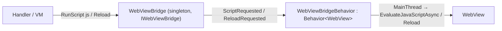
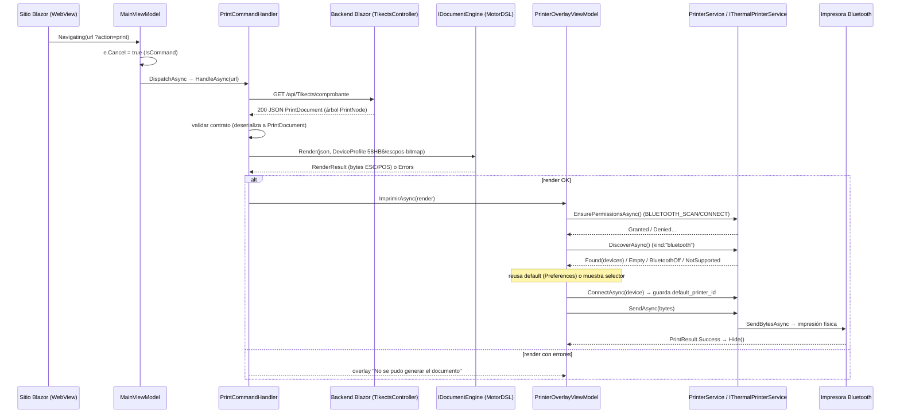

# Índice 08 — App híbrida integrada (WebView + Blazor)

> **Propósito**: documentar el ejemplo insignia — una app .NET MAUI que hospeda un `WebView` remoto y expone al sitio Blazor todos los dispositivos nativos mediante un puente de comandos por URL, con el flujo de impresión térmica end-to-end como caso testigo.
> **Fuente primaria**: `Ejemplos_Devices/Integrada/`.
> **Entrada ia-db**: [README](../README.md) · [Índice maestro](00_MASTER-INDEX.md)

---

## 1. Panorama arquitectónico

La solución son **dos proyectos .NET 10** que dialogan por HTTP/WebView:

| Proyecto | Rol | SDK | Fuente |
|---|---|---|---|
| `Ejemplo_Maui_Hibrida` | Contenedor MAUI: hospeda un `WebView` estándar (no `BlazorWebView`) apuntando a una web remota y consolida todos los dispositivos en `LibApp/` | `Microsoft.NET.Sdk` (MAUI 10.0.80) | `Ejemplo_Maui_Hibrida.csproj` |
| `Ejemplo_ws_Blazor` | Backend de ejemplo: Blazor Interactive Server + API REST que sirve el comprobante imprimible y recibe geolocalización | `Microsoft.NET.Sdk.Web` (net10.0) | `Ejemplo_ws_Blazor.csproj` |

El `WebView` carga `https://aplicada.somee.com` (`Pages/MainPage.xaml.cs:17`). Sobre él conviven **dos canales independientes** (detalle completo en `Ejemplos_Devices/Docs/web-hibrida/maui-hibrido.md`):

```
┌── CONTENEDOR MAUI (Ejemplo_Maui_Hibrida) ─────────────────────────────────┐
│  WebView  Source = "https://aplicada.somee.com"                           │
│                                                                           │
│  Canal A · INTERACTIVIDAD  → Blazor Interactive Server (circuito SignalR) │
│  Canal B · DISPOSITIVOS    → URL "marcada" (?action=print, ?qr=qr…)       │
│            interceptada en Navigating → UrlCommandDispatcher → handler     │
│            nativo → resultado devuelto al DOM (JS) o por re-navegación     │
└───────────────────────────────────────────────────────────────────────────┘
```

- **Canal A** (interactividad de la web) no es responsabilidad de este índice; su análisis y el bug de iOS están en `Docs/web-hibrida/maui-hibrido.md` §3, §6–§7.
- **Canal B** (acceso a dispositivos vía puente de URL) es el corazón de esta app y el foco de este índice (§4–§6).

### 1.1 Arranque y wiring (`MauiProgram.cs`)

| Bloque | Qué registra | Líneas |
|---|---|---|
| Toolkit | `UseMauiCommunityToolkit` + `...Core` + `...Camera` | `MauiProgram.cs:36-38` |
| QR | `UseBarcodeScanning()` (BarcodeScanning.Native.Maui 3.0.4) | `MauiProgram.cs:50` |
| Impresión | `AddMotorDslEngine()` + `AddProfiles(...)` + `AddMotorDslMaui()` + `AddBluetoothPrinterTransport()` | `MauiProgram.cs:54-63` |
| Servicios device | `GpsService`, `NetworkService`, `CallService`, `ApiRelayService`, `PrinterService` (singletons) | `MauiProgram.cs:76,86-90` |
| Bridge/páginas | `IWebViewBridge→WebViewBridge`, `IImageService→ImageDeviceAutoRotateService`, páginas de cámara | `MauiProgram.cs:94-97` |
| Handlers URL | 7 `IUrlCommandHandler` + `UrlCommandDispatcher` (orden de registro = orden de evaluación) | `MauiProgram.cs:108-115` |

Shell de página única: `AppShell.xaml` declara sólo `MainPage` como `ShellContent`; `AppShell.xaml.cs:12-14` registra las rutas de navegación de las páginas modales de dispositivo (`MyMediaPickerPage`, `MyMediaSelfiePickerPage`, `QRLectorPage`).

---

## 2. Árbol comentado de `LibApp/`

Todo lo reutilizable vive bajo `Ejemplo_Maui_Hibrida/LibApp/`. Reorganización deliberada: cada dispositivo aislado se consolidó como subcarpeta de `LibApp/Devices/` con su propio `Models/Services/ViewModels/Pages`.

```
LibApp/
├── CustomWebView/                     El WebView personalizado (puente imperativo desacoplado)
│   ├── Behaviors/
│   │   ├── IWebViewBridge.cs          Abstracción: Reload() / RunScript(js) + eventos
│   │   ├── WebViewBridge.cs           Singleton: sólo dispara eventos (no toca el control)
│   │   └── WebViewBridgeBehavior.cs   Behavior<WebView>: traduce eventos → EvaluateJavaScriptAsync/Reload (UI thread)
│   └── Converts/
│       └── WebNavigatingEventArgsConverter.cs   Convierte args de Navigating/Navigated para EventToCommandBehavior
│
├── UrlCommands/                       ★ Puente de comandos por URL (Canal B) — ver §4
│   ├── IUrlCommandHandler.cs          Contrato: CanHandle(url) + HandleAsync(url)
│   ├── BridgeOutcome.cs               record(CancelNavigation, NavigateTo?) — cómo termina un comando
│   ├── UrlCommandDispatcher.cs        Loop first-match-wins sobre los handlers; IsCommand()/DispatchAsync()
│   └── Handlers/                      7 handlers (uno por comando) — ver tabla §4.2
│       ├── GpsCommandHandler.cs
│       ├── CallCommandHandler.cs
│       ├── CameraCommandHandler.cs
│       ├── SelfieCommandHandler.cs
│       ├── QrCommandHandler.cs
│       ├── SendApiCommandHandler.cs
│       └── PrintCommandHandler.cs
│
└── Devices/                           Dispositivos consolidados (reutilizan los ejemplos aislados) — ver §5
    ├── Common/                        Base compartida de overlays
    │   ├── Controls/StatusOverlayView.xaml(.cs)   Capa visual busy/error sobre el WebView
    │   └── ViewModels/StatusOverlayViewModel.cs   Estados None/Busy/Error + OverlayAction
    ├── Camera/Pages/                  MyMediaPickerPage, MyMediaSelfiePickerPage (captura con callback)
    ├── GPS/                           GpsService + GpsOverlayViewModel + Models(GpsResult, LocationPermissionResult)
    │   └── ApiRelayService.cs         Relay REST genérico con allowlist de hosts (usado por SendApi)
    ├── Images/                        IImageService + ImageDeviceAutoRotateService + SelfieMaskDrawable
    ├── Networks/                      NetworkService + NetworkOverlayViewModel + NetworkResult
    ├── Phone/                         CallService + CallOverlayViewModel + Models(CallMode, CallResult…)
    ├── QRLector/                      QRLectorPage + QRContent
    └── MotorDSL/                      Impresión térmica Bluetooth — ver §6
        ├── DTOs/Print/               PrintDocument, PrintNode, PrintStyle, N (fábrica de nodos)
        ├── Models/                   BluetoothPermissionResult, DiscoverResult, PrintResult
        ├── Services/                 PrinterService, BluetoothPermissions
        ├── ViewModels/               PrinterOverlayViewModel (orquesta permisos→discover→conectar→imprimir)
        └── Pages/                    OverlayBlueToothThermalPrintPage (contenedor vacío)
```

> Nota de build: `Ejemplo_Maui_Hibrida.csproj:84-90` excluye `LibApp/Devices/MotorDSL/NewFolder/**` de la compilación (carpeta muerta).

### 2.1 El WebView personalizado (`CustomWebView/`)

Patrón de puente desacoplado en tres piezas, para que el ViewModel/handler nunca toque el control:



- `WebViewBridge` sólo emite eventos (`WebViewBridge.cs:10-11`); no conoce el control.
- `WebViewBridgeBehavior` los traduce a acciones imperativas **siempre en UI thread, fire-and-forget** (`WebViewBridgeBehavior.cs:62-64`).
- Gotcha documentado en el código: la behavior no está en el árbol visual, así que hay que **propagarle el `BindingContext`** manualmente o el `Binding` de `Bridge` queda en null sin error visible (`WebViewBridgeBehavior.cs:22-27`).
- `MainPage.xaml:27-38` cablea el `WebView`: `WebViewBridgeBehavior` + dos `EventToCommandBehavior` (`Navigating`, `Navigated`) hacia `MainViewModel`.

---

## 3. Intercepción de navegación (`MainViewModel`)

`MainViewModel` es el `BindingContext` de `MainPage` y el punto donde el Canal B se dispara:

```csharp
// ViewModels/MainViewModel.cs:77-89
private async Task Navigating(WebNavigatingEventArgs e)
{
    if (_dispatcher.IsCommand(e.Url))
        e.Cancel = true;                 // sincrónico: cancelar ANTES de cualquier await
    var outcome = await _dispatcher.DispatchAsync(e.Url);
    if (outcome.NavigateTo is not null)
        Url = outcome.NavigateTo;        // rama de re-navegación (GPS)
    IsRefreshing = false;
}
```

- `IsCommand` (síncrono) decide si cancelar; `DispatchAsync` (async) ejecuta. La cancelación **debe** ocurrir antes del primer `await` (`UrlCommandDispatcher.cs:15,17`).
- Botones nativos del pie (`MainPage.xaml:51-54`) invocan el mismo protocolo sin pasar por la web: `TakePhone` → `phone=phone`, `TakeQR` → `qr=qr&param=contenidoQR`, `TakeGPS` fuerza `coordenadas=coordenadas` (`MainViewModel.cs:43-70`).
- Overlays `GPS/Network/Call` se dibujan encima del `WebView`; el `WebView` sólo es visible si el overlay de Red está oculto, para no mostrar la página de error del navegador (`MainPage.xaml:22-48`).

---

## 4. El puente de comandos por URL (`UrlCommands/`) ★

### 4.1 Cómo se registra y despacha

- **Contrato** (`IUrlCommandHandler.cs`): `bool CanHandle(string url)` + `Task<BridgeOutcome> HandleAsync(string url)`. Agregar un comando = una clase + una línea de DI.
- **Registro** (`MauiProgram.cs:108-114`): cada handler como `AddSingleton<IUrlCommandHandler, ...>`. El **orden de registro = orden de evaluación**.
- **Despacho** (`UrlCommandDispatcher.cs:17-26`): recorre los handlers y delega en el **primero** cuyo `CanHandle` matchea (*first-match-wins*, abierto/cerrado, sin `switch` por comando).
- **Resultado** (`BridgeOutcome.cs`): `record(bool CancelNavigation, string? NavigateTo = null)`. Tres formas de "devolver" un resultado:
  1. **Inyectar JS y quedarse** (`NavigateTo == null` + `RunScript`): cámara, selfie, QR, sendAPI, print.
  2. **Re-navegar con query params** (`NavigateTo != null`): sólo GPS.
  3. **Sólo efecto nativo + overlay** (sin `RunScript`): llamada.

### 4.2 Handlers registrados (7)

Orden = evaluación (`MauiProgram.cs:108-114`):

| # | Comando (marcador en la URL) | Handler | Efecto | Salida (`BridgeOutcome`) | Fuente |
|---|---|---|---|---|---|
| 1 | `coordenadas=coordenadas` | `GpsCommandHandler` | Pide geolocalización vía overlay; reescribe URL con `Latitud`/`Longitud` | `(true, nuevaUrl)` — **re-navega** | `Handlers/GpsCommandHandler.cs:16-33` |
| 2 | `phone=phone` | `CallCommandHandler` | Llamada directa al número por defecto `3434807427`, modo `Direct` | `(true, null)` | `Handlers/CallCommandHandler.cs:11,20-26` |
| 3 | `photo=photo&param={id}` | `CameraCommandHandler` | Cámara → normaliza → base64 → inyecta en `img#id.src`/`.value` | `(true, null)` + JS | `Handlers/CameraCommandHandler.cs:23-67` |
| 4 | `selfie=selfie&param={id}` | `SelfieCommandHandler` | Idéntico a foto pero con `MyMediaSelfiePickerPage` (máscara selfie) | `(true, null)` + JS | `Handlers/SelfieCommandHandler.cs:22-64` |
| 5 | `qr=qr&param={id}` | `QrCommandHandler` | Abre lector QR; inyecta la lista serializada en `#id.textContent` | `(true, null)` + JS | `Handlers/QrCommandHandler.cs:20-49` |
| 6 | `sendApi=sendApi&httpMethod=…&url=…&param={id}&body=…` | `SendApiCommandHandler` | Relay REST vía `ApiRelayService`; inyecta `{ok,status,body}` en `#id` | `(true, null)` + JS | `Handlers/SendApiCommandHandler.cs:23-46` |
| 7 | `action=print` | `PrintCommandHandler` | GET al comprobante → render MotorDSL → overlay Bluetooth | `(true, null)` | `Handlers/PrintCommandHandler.cs:34-67` |

Detalles transversales:
- Todos parsean query con un helper local `GetQueryValue` (idéntico en cada handler; se desestima `HttpUtility`).
- Cámara/selfie/QR navegan a una página modal y esperan el resultado con `TaskCompletionSource` (`CameraCommandHandler.cs:34-42`; QR usa `destinoPage.ResultadoTask.Task`, `QrCommandHandler.cs:38-40`).
- `SendApiCommandHandler` sólo permite verbos `Post`/`Get`; cualquier otro → `Blocked`; `ApiRelayService` aplica **allowlist de hosts** (`geolocate.somee.com`) (`ApiRelayService.cs:14-17,30-31`).
- Inyección de resultados serializada con `System.Text.Json` para evitar romper el JS / XSS (QR y sendAPI; `QrCommandHandler.cs:46`).

---

## 5. Dispositivos consolidados en `LibApp/Devices/`

Cada dispositivo **reutiliza el mismo patrón que su ejemplo aislado** (Service tipado + Overlay VM que hereda de `StatusOverlayViewModel`). No se re-documenta cada uno aquí: ver el índice temático del dispositivo.

| Dispositivo (`LibApp/Devices/…`) | Reutiliza el ejemplo aislado (`Ejemplos_Devices/…`) | Índice |
|---|---|---|
| `GPS/` (`GpsService`, `GpsOverlayViewModel`) | `GPS/Ejemplo_Maui_GPS` | Índice 01–07 (GPS) |
| `Camera/Pages/` (MediaPicker + Selfie) | `Camera/Ejemplo_Photo_MiMediaPicker_Callback*` | Índice 01–07 (Cámara) |
| `Images/` (`ImageDeviceAutoRotateService`, `SelfieMaskDrawable`) | `Camera/…_Normalizacion` (MetadataExtractor + SkiaSharp) | Índice 01–07 (Imágenes) |
| `Phone/` (`CallService`, `CallOverlayViewModel`, `CallMode`) | `Phone/Ejemplo_Maui_DirectCall` · `Ejemplo_Maui_Dialer` | Índice 01–07 (Teléfono) |
| `QRLector/` (`QRLectorPage`, `QRContent`) | `QR/BSN.LectorQR*` (BarcodeScanning.Native) | Índice 01–07 (QR) |
| `Networks/` (`NetworkService`, `NetworkOverlayViewModel`) | `Red/Ejemplo_Maui_Connectivity` | Índice 01–07 (Red) |
| `MotorDSL/` (impresión térmica) | `Printer/Ejemplo_MotorDSL` · `Ejemplo_ThermalPrinter` | **[Índice 03](03_Impresion-Termica.md)** |

Base común de overlays: `Common/Controls/StatusOverlayView.xaml` + `Common/ViewModels/StatusOverlayViewModel.cs` (estados `None/Busy/Error`, `ShowBusy/ShowError/Hide`, `OverlayAction`). Todos los `*OverlayViewModel` (GPS, Network, Call, **Printer**) heredan de esa base — ver `PrinterOverlayViewModel.cs:17`.

---

## 6. Flujo end-to-end de impresión (`action=print`)

Caso testigo del puente: la web dispara `?action=print`, la app trae un `PrintDocument` JSON del backend Blazor, lo renderiza a ESC/POS con MotorDSL y lo imprime por Bluetooth mostrando un overlay que gestiona permisos, descubrimiento, selección y conexión.

### 6.1 Piezas

| Pieza | Rol | Fuente |
|---|---|---|
| `PrintCommandHandler` | GET al comprobante, render, delega en el overlay | `Handlers/PrintCommandHandler.cs` |
| `IDocumentEngine` (MotorDsl.Core) | `Render(jsonDoc, DeviceProfile) → RenderResult` (bytes ESC/POS) | inyectado; `PrintCommandHandler.cs:28,49` |
| `PrinterOverlayViewModel` | Orquesta permisos→discover→selección→conectar→imprimir + reintentos | `MotorDSL/ViewModels/PrinterOverlayViewModel.cs` |
| `PrinterService` | Compone `IThermalPrinterService` (permisos, discover, connect, send) | `MotorDSL/Services/PrinterService.cs` |
| `IThermalPrinterService` (MotorDsl.Maui/Bluetooth) | Transporte real BT Classic SPP (Android) | `AddBluetoothPrinterTransport()` (`MauiProgram.cs:63`) |
| Backend `TikectsController` | Sirve el `PrintDocument` hardcodeado | `Ejemplo_ws_Blazor/Controllers/TikectsController.cs` |

Detalles del handler (`PrintCommandHandler.cs`):
- Endpoint fijo: `https://aplicada.somee.com/api/Tikects/comprobante` (GET, timeout 30s) (`:16-17,80`).
- **Render SIEMPRE primero**, antes de tocar la impresora (`:38-49`). El JSON crudo se pasa tal cual al engine; se deserializa a `PrintDocument` sólo para **validar el contrato** (`:82-84`).
- `DeviceProfile("58HB6", 32, "escpos-bitmap")` con capacidades `supports_bitmap`, `bitmap_max_width_px=320`, `bitmap_binarization_threshold=128` (`:39-42`).
- Si `render.Errors > 0`, no imprime; el overlay muestra el error (`:52-56`).

### 6.2 Diagrama de secuencia



### 6.3 Overlay de impresión — máquina de estados

`PrinterOverlayViewModel` (`MotorDSL/ViewModels/PrinterOverlayViewModel.cs`) maneja cada escenario con su UI y acciones de reintento, sin `try/catch` en el VM:

| Estado | Disparador | UI / acciones | Líneas |
|---|---|---|---|
| Render inválido | `!render.IsSuccessful` | "No se pudo generar el documento" + Cerrar | `:34-40` |
| No soportado | `!_service.IsSupported` (no-Android) | "Impresión no disponible" | `:43-49` |
| Permiso | `EnsurePermissionsAsync != Granted` | Pedir permiso / Abrir configuración / restringido | `:52-53,128-152` |
| Sin impresoras | `DiscoverResult.Empty` | Reintentar / Cerrar | `:70-75` |
| Bluetooth off | `DiscoverResult.BluetoothOff` | Reintentar / Abrir configuración | `:77-83` |
| Varias impresoras | `Found` sin default y >1 | Selector dinámico por device | `:66-67,93-102` |
| Conexión falló | `ConnectAsync == false` | Reintentar / Elegir otra / Cerrar | `:108-116` |
| Éxito | `PrintResult.Success` | `Hide()` | `:120` |

`PrinterService` reusa la impresora predeterminada si está en la lista detectada (`Preferences["default_printer_id"]`, `:72-77`) y la memoriza al conectar (`:80-85`). BT Classic SPP **sólo Android** (`:21-26`); permisos vía `BluetoothPermissions` custom (`Services/BluetoothPermissions.cs`).

### 6.4 Config de impresión (`MauiProgram.cs:54-63`)

```csharp
.Services.AddMotorDslEngine()
    .AddProfiles(p => {
        p.Add(new DeviceProfile("thermal_58mm", 32, "escpos-bitmap"));
        p.Add(new DeviceProfile("a4-pdf", 80, "pdf"));
        p.Add(new DeviceProfile("pdf", 48, "pdf"));
    })
    .AddMotorDslMaui()
    .Services.AddBluetoothPrinterTransport();
```

Paquetes MotorDsl.* **1.0.13** (Core, Parser, Rendering, Extensions, Printing.Abstractions, Bluetooth, Maui) (`Ejemplo_Maui_Hibrida.csproj:118-126`). Requiere permisos `BLUETOOTH_SCAN`/`BLUETOOTH_CONNECT` + ubicación en el manifest (documentado en `LibApp/Devices/MotorDSL/README.md`).

---

## 7. Backend Blazor (`Ejemplo_ws_Blazor`)

Web mínima (Razor Components Interactive Server + controllers API + OpenAPI/Scalar). Pipeline en `Program.cs`: `AddRazorComponents().AddInteractiveServerComponents`, `AddControllers`, `AddOpenApi`, `UseForwardedHeaders` (para el proxy TLS de somee), `MapScalarApiReference` (`/scalar`).

### 7.1 Endpoints

| Endpoint | Método | Request / DTO | Response | Uso desde la app | Fuente |
|---|---|---|---|---|---|
| `/api/Tikects/comprobante` | GET | — | `PrintDocument` (JSON, árbol `PrintNode`) hardcodeado | Documento imprimible del `PrintCommandHandler` (§6) | `Controllers/TikectsController.cs:27-44` |
| `/api/GeoReporter/track` | POST | `LocationDto {Latitude, Longitude}` | `string "lat-lng"` | Destino del relay `sendApi` (host `geolocate.somee.com`) | `Controllers/GeoReporterController.cs:17-41` |
| `/api/pagofake/pago` | POST | form (sin antiforgery) | `302` a host externo | Prueba de redirect cross-host en el WebView | `Controllers/PagoFakeController.cs:11-13` |
| `/api/pagofake/pago-form` | GET | — | HTML con form auto-submit a otro host | Prueba de POST auto-enviado cross-host | `Controllers/PagoFakeController.cs:17-26` |
| `/openapi/v1.json` · `/scalar` | GET | — | OpenAPI + UI Scalar | Documentación de API | `Program.cs:39-41` |

Páginas Blazor (`Components/Pages/`): `Datos.razor` (prueba de interactividad), `Panel.razor` (botones que disparan el Canal B), `Redirigir.razor`, `Error.razor`, `NotFound.razor`.

### 7.2 DTOs de impresión (`DTOs/Print/`) — el "DSL"

Réplica del contrato de GDA.Core.API.Client (`Models/PrintActa/*`). El árbol serializado a JSON **es** lo que MotorDsl renderiza. **Definidos por duplicado** (idénticos) en el backend y en la app para desacoplarlos:

| DTO | Rol | Backend | App (LibApp) |
|---|---|---|---|
| `PrintDocument` | Raíz `{id, version, format:"integrated", root}` | `DTOs/Print/PrintDocument.cs` | `LibApp/Devices/MotorDSL/DTOs/Print/PrintDocument.cs` |
| `PrintNode` | Nodo genérico: `text` \| `image`(bitmap/qrcode) \| `container` | `DTOs/Print/PrintNode.cs` | idem |
| `PrintStyle` | `align` (left/center/right) + `bold` | `DTOs/Print/PrintStyle.cs` | idem |
| `N` | Fábrica declarativa de nodos (`Text/Separator/Image/QrCode/Container`) | `DTOs/Print/N.cs` | idem |

`TikectsController.BuildComprobanteTicketHardcoded()` (`:51-160`) arma un comprobante de ticket municipal representativo: logo bitmap (PNG base64), secciones de texto normal/negrita/centrado, separadores, contenedores anidados (comercio, inmueble) y un `N.QrCode(...)` al detalle del ticket.

### 7.3 Assets

| Asset | Uso |
|---|---|
| `wwwroot/ejemplos/qr.ejemplo.png` | Imagen QR de ejemplo |
| `wwwroot/pago-fake.html` · `pago-fake-web.html` | Páginas estáticas de prueba de flujo de pago cross-host |
| `wwwroot/app.css`, `favicon.png` | Estáticos base |

---

## 8. Decisiones y gotchas

| Tema | Decisión / gotcha | Fuente |
|---|---|---|
| Reorganización a `LibApp/` | Cada dispositivo aislado se consolidó como subcarpeta `LibApp/Devices/<X>/` con Models/Services/ViewModels/Pages; los overlays comparten base `StatusOverlayViewModel` | árbol §2 |
| Puente abierto/cerrado | Agregar un comando = 1 clase `IUrlCommandHandler` + 1 línea DI; sin `switch`. Orden de registro = prioridad (*first-match-wins*) | `MauiProgram.cs:107-114`, `UrlCommandDispatcher.cs:19-22` |
| `e.Cancel` síncrono | Debe fijarse antes del primer `await`; por eso `IsCommand` (sync) separado de `DispatchAsync` (async) | `MainViewModel.cs:80-81` |
| WebView desacoplado | El VM/handler nunca tocan el control; van por `IWebViewBridge`; la behavior necesita que se le propague el `BindingContext` a mano | `WebViewBridgeBehavior.cs:22-27` |
| Render antes de imprimir | `PrintCommandHandler` renderiza primero y sólo valida el contrato deserializando; pasa el JSON **crudo** al engine | `PrintCommandHandler.cs:38-49,79-90` |
| MotorDSL 1.0.13 | 7 paquetes `MotorDsl.*` alineados a 1.0.13; perfiles térmico/PDF; transporte BT sólo Android | `csproj:118-126`, `PrinterService.cs:21-26` |
| Impresión predeterminada | Se memoriza `default_printer_id` en `Preferences` y se reusa si aparece en el discover | `PrinterService.cs:72-85` |
| Inyección segura al DOM | Resultados (QR, sendAPI) serializados con `System.Text.Json` para evitar romper el JS / XSS | `QrCommandHandler.cs:46`, `SendApiCommandHandler.cs:70-77` |
| Guardrail de red | `ApiRelayService` restringe hosts a una allowlist; verbos ≠ Post/Get → `Blocked` | `ApiRelayService.cs:14-17,30-31` |
| Bug de iOS (Canal A) | El circuito SignalR no se sostiene en WKWebView sobre host gratuito; la web se ve pero los `@onclick` mueren. Diagnóstico completo fuera de este índice | `Docs/web-hibrida/maui-hibrido.md` §7 |
| Target sólo Android/iOS | El `.csproj` no compila Windows (`WindowsPackageType=None`); BT Classic SPP es Android-only | `csproj:4-5`, `PrinterService.cs:21-26` |

---

## 9. Referencias

- Fuente primaria: `Ejemplos_Devices/Integrada/Ejemplo_Maui_Hibrida/` y `Ejemplos_Devices/Integrada/Ejemplo_ws_Blazor/`.
- Docs de dominio (Canal A/B, por comando): `Ejemplos_Devices/Docs/web-hibrida/` (`maui-hibrido.md`, `lectura-qr.md`, `captura-foto.md`, `llamada.md`, `envio-api.md`).
- Índices hermanos por dispositivo: 01–07 (GPS, Cámara/Imágenes, Teléfono, QR, Red) · **[Índice 03 — MotorDSL / impresión térmica](03_Impresion-Termica.md)**.
- READMEs por área: `LibApp/Devices/MotorDSL/README.md`, `LibApp/Devices/Camera/README.md`, `LibApp/Devices/Images/README.md`.
